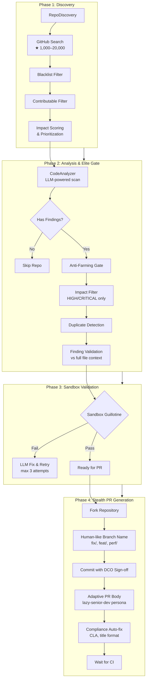

# ContribAI — Architecture & Workflow

> **Enterprise-grade, Stealth-capable Elite Contributor Agent**
> Version 3.x | Autonomous Security Researcher for Open Source

---

## 1. System Overview

ContribAI is an autonomous AI agent designed to discover security vulnerabilities and quality issues in open-source repositories, then generate and submit production-grade pull requests with zero human intervention. The agent operates continuously in a 24/7 "Super Human Mode," mimicking the behavior of a dedicated senior developer who works predictable hours, takes lunch breaks, responds to review feedback, and gracefully exits when rejected.

The agent is **stealth-first** by design: it generates PRs that are indistinguishable from human contributions, uses semantic branch naming conventions (`fix/`, `feat/`, `perf/`), maintains a "tired senior developer" persona in all written communication, and implements strict impact filtering to avoid being labeled as a low-value bot contributor.

### Core Capabilities

| Capability | Description |
|---|---|
| **Auto-Discovery** | Searches GitHub for repos in the "Shark Tank" sweet spot: 1,000–20,000 stars |
| **Impact Filtering** | Gate 1 enforces HIGH/CRITICAL-only contributions; MEDIUM/LOW are auto-dropped |
| **Shift-Left Validation** | All code changes are validated in ephemeral Docker sandboxes before push |
| **Stealth PR Generation** | Human-like branch naming, DCO signing, contextual PR bodies, no AI branding |
| **Patrol & Auto-Heal** | Monitors open PRs for review feedback, auto-fixes CI failures, responds to questions |
| **Clean Slate** | Branch auto-deletion on PR merge or hostile closure; repo blacklist for toxic maintainers |
| **Timezone-Aware** | Local-time-aware daily quotas, mandatory lunch breaks (12:00–13:01 UTC+7), sleep cycles |
| **Telegram Alerts** | Real-time push notifications for PR merges, hostile rejections, and patrol actions |

---

## 2. The "Super Human" Loop — Daily Routine

The `SuperHumanLoop` (`farm_agent/orchestrator/human.py`) orchestrates an organic, stochastic daily operational cycle that mirrors a real developer's working patterns.

### 2.1 Operational Rhythm

```
┌─────────────────────────────────────────────────────────────┐
│                    DAILY CYCLE                               │
│                                                              │
│  ┌──────────┐    ┌─────────────┐    ┌────────────────────┐  │
│  │  WAKE UP │───▶│  STOCHASTIC │───▶│  HUNT  (60% prob)  │  │
│  │  06:00   │    │  ACTION ROLL│    │  PATROL (40% prob) │  │
│  └──────────┘    └─────────────┘    └────────────────────┘  │
│                                              │               │
│                          ┌───────────────────┘               │
│                          ▼                                   │
│  ┌──────────────────────────────────────────────────────┐    │
│  │  QUOTA MET (n/n PRs)  ──▶  PATROL-ONLY MODE         │    │
│  │  No new PRs pushed; only review feedback responses   │    │
│  └──────────────────────────────────────────────────────┘    │
│                                                              │
│  ┌──────────────┐    ┌──────────────────────────────────┐   │
│  │ LUNCH BREAK  │    │  HOSTILE / API ERROR             │   │
│  │ 12:00-13:01  │    │  15-min stress break             │   │
│  │ (UTC+7)      │    │  then retry                      │   │
│  └──────────────┘    └──────────────────────────────────┘   │
└─────────────────────────────────────────────────────────────┘
```

### 2.2 Daily PR Quota

- **Randomized target**: Each new calendar day, the agent draws a random PR target between `min_daily_prs` (3) and `max_daily_prs` (10), capped at an absolute maximum of 12.
- **Counter persistence**: After a restart, the in-memory PR counter is seeded from the SQLite database (`memory.db`) to prevent over-creation (`CRIT-01` fix).
- **DB-level guard**: Before every hunt, a DB check confirms the actual count; if quota is met, the hunt is aborted even if RAM counter is stale.

### 2.3 Stochastic Action Selection

Every iteration, a dice roll (`random.random()`) determines the next action:

| Roll | Action | Probability |
|---|---|---|
| < 0.60 | **HUNT** — discover repos, generate PRs | 60% |
| ≥ 0.60 | **PATROL** — check feedback, respond | 40% |

Once the daily quota is met, the agent switches permanently to **patrol-only mode** for the rest of the day.

### 2.4 Human-Like Delays

| Scenario | Delay Range |
|---|---|
| Normal hunt rest (productive) | 30–90 minutes |
| Hunt rest (0 repos scanned) | 2–5 minutes (quick retry) |
| Normal patrol rest | 10–30 minutes |
| Patrol-only mode rest | 1–3 hours |
| After API error (stress break) | 15 minutes |
| Post-PR coding delay | 5–15 minutes |
| Pre-push "deep breath" | 15–45 seconds |

### 2.5 Lunch & Sleep Protocol

- **Lunch break**: Every day at 12:00 local time (UTC+7), the agent sleeps until 13:01. This prevents the previous bug where lunch triggered at UTC+7 19:00 (`CRIT-02` fix).
- **Night mode**: The agent runs continuously but interleaves long rest periods (up to 3 hours in patrol-only mode) to simulate sleep.

---

## 3. The Hunting Pipeline — End-to-End Lifecycle

The pipeline is implemented in `ContribPipeline` (`farm_agent/orchestrator/pipeline.py`).



---

### Phase 1: Target Discovery — The "Shark Tank" Sweet Spot

**File**: `farm_agent/github/discovery.py`

The agent searches GitHub using a curated star range designed to find high-value targets:

```yaml
discovery:
  stars_range: [1000, 20000]   # "Shark Tank" — active, not too popular
  languages: [python, javascript, typescript, rust]
  min_last_activity_days: 30
```

**Discovery scoring formula** (higher = better candidate):

| Factor | Score |
|---|---|
| Stars 100–5,000 (sweet spot) | +3.0 |
| Stars < 100 | +1.0 |
| Stars > 5,000 | +2.0 |
| Open issues (opportunities) | +min(issues/10, 3.0) |
| Has license | +1.0 |
| Has contributing guide | +2.0 |
| Forks 10–500 (active community) | +1.5 |

**Filters applied**:
1. **Blacklist check**: Repos blacklisted due to hostile maintainers are skipped.
2. **Activity filter**: No open issues = likely not welcoming contributions.
3. **Last push filter**: Repos with no commits in 30+ days are skipped.

---

### Phase 2: Analysis & The Elite Gate

**File**: `farm_agent/analysis/analyzer.py`, `farm_agent/orchestrator/pipeline.py`

#### 2.1 Static Code Analysis

The `CodeAnalyzer` uses the configured LLM (MiniMax-M2.7 by default) to scan repository files for:
- Security vulnerabilities
- Code quality issues
- Missing documentation
- UI/UX defects
- Performance anti-patterns

#### 2.2 The Anti-Farming Gate (Impact Filter)

**Gate 1 — Severity Drop**: All findings with `ImpactLevel.TRIVIAL`, `LOW`, or `MEDIUM` are immediately discarded. Only `HIGH` and `CRITICAL` findings survive.

**Gate 2 — Keyword Heuristic**: For non-critical findings (LOW/MEDIUM severity), a keyword check drops findings with farming indicators:

```python
_FARMING_KEYWORDS = {
    "docstring", "comment", "typo", "format", "style",
    "rename", "whitespace", "indent", "spacing",
    "missing type hint", "type annotation", "naming convention",
}
```

> Note: HIGH/CRITICAL findings bypass this keyword filter even if they contain farming-related words (e.g., "Format string injection" contains "format" but is critical).

#### 2.3 Duplicate Detection

Before generating a PR, the pipeline cross-checks:
1. **Local memory** (`submitted_prs` table in `memory.db`)
2. **GitHub API** — fetches all recent PRs (all states) and checks title similarity and file-path overlap

Two titles are considered duplicates if >50% of significant words overlap.

#### 2.4 Finding Validation

Validated against full file context using the LLM. The validator checks:
- Is the code already protected by try/catch, circuit breakers, error boundaries?
- Is the data source actually bounded (static array, enum)?
- Would the suggested fix add unnecessary complexity?
- Does the code already handle this via another mechanism?

Findings that fail validation are dropped before LLM generation.

---

### Phase 3: Sandbox Shift-Left Validation

**File**: `farm_agent/core/sandbox.py`, `farm_agent/orchestrator/pipeline.py`

Before any code is committed, the **Sandbox Guillotine** validates changes in an ephemeral Docker container:

```
┌─────────────────────────────────────────────────────────────┐
│                 SANDBOX GUILLOTINE                          │
│                                                              │
│  1. Write fixed file to temp workspace                       │
│  2. Mount workspace into ephemeral Docker container          │
│  3. Detect test framework (pytest / npm test / compileall)  │
│  4. Run validation command in sandbox                        │
│  5. If exit_code ≠ 0 → LLM self-corrects and retries        │
│  6. After 3 failures → PR creation BLOCKED                  │
└─────────────────────────────────────────────────────────────┘
```

**Sandbox security constraints**:

| Constraint | Value |
|---|---|
| Memory limit | 512 MB |
| Network | Disabled |
| Capabilities | Dropped ALL |
| PID limit | 128 |
| Timeout | 60 seconds |

**Auto-detection of validation command**:
- `package.json` + `yarn.lock` → `yarn test` (Node 20 Alpine)
- `package.json` (npm) → `npm test` (Node 20 Alpine)
- `pytest` detected → `python -m pytest` (Python 3.10 Alpine)
- Fallback → `python -m compileall .`

---

### Phase 4: Stealth PR Generation

**File**: `farm_agent/pr/manager.py`

#### 4.1 Fork Strategy

The agent forks the target repository into its own GitHub account, creates a feature branch on the fork, and submits a PR from the fork to the original repo.

#### 4.2 Human-Like Branch Naming

No `farm_agent/` or `ai-` prefixes. Branches use natural semantic prefixes:

| Contribution Type | Branch Prefix |
|---|---|
| SECURITY_FIX | `fix/security/` |
| CODE_QUALITY | `fix/` |
| README_FIX | `docs/` |
| UI_UX_FIX | `fix/ui/` |
| PERFORMANCE_OPT | `perf/` |
| FEATURE_ADD | `feat/` |
| REFACTOR | `refactor/` |

Example: `fix/handle-none-check-in-auth-middleware`

#### 4.3 The "Tired Senior Developer" PR Persona

PR descriptions follow strict rules:
- **NO AI fluff**: No "This PR aims to", "In this PR, we..."
- **BE LAZY BUT ACCURATE**: 2–4 sentences max
- **FOCUS ON THE WHY**: Explain why the bug happened and its impact
- **Casual tone**: Lowercase OK for minor things, minimal bullets

Example PR body:
```
Found a None-checking bug in the auth middleware — if the Authorization
header is malformed, the function crashes instead of returning 401.

Fix: added explicit None check before decoding.

Affected: src/middleware/auth.py
Closes #142
```

#### 4.4 DCO Sign-Off

Every commit includes a `Signed-off-by:` trailer generated from the user's GitHub profile (with noreply email fallback for accounts without a public email).

#### 4.5 Post-PR Compliance Auto-Fix

After PR creation, a 15-second settling period allows CI bots to comment. The agent then:
1. **Detects CLA bot comments** — auto-signs via magic comment (CLAAssistant) or logs for manual EasyCLA
2. **Fixes title format** — adapts to repo's conventional commit style
3. **Links issues** — creates and links an issue if the repo requires it

#### 4.6 CI Wait & Auto-Heal Setup

Waits up to 90 seconds for CI checks to report. If CI fails, the PR is left open so `PRPatrol` can download logs and push fixes.

---

## 4. The Patrol & Feedback Loop

**File**: `farm_agent/pr/patrol.py`

PR Patrol runs continuously, checking all open PRs for maintainer feedback.

### 4.1 Idempotency & Markers

Comments posted by the bot are marked with `<!-- farm_agent-patrol -->` to prevent re-processing. Reply markers include:
- `"I have read the CLA Document"`
- `"farm_agent"`
- `"<!-- farm_agent-patrol -->"`

### 4.2 Feedback Classification (LLM-powered)

```yaml
Actions:
  CODE_CHANGE    → Maintainer wants code modifications
  QUESTION       → Maintainer asks a question
  STYLE_FIX      → Naming, formatting, convention issues
  APPROVE        → Positive, no action needed
  REJECT         → PR rejected entirely
  HOSTILE_REJECT → Toxic/aggressive rejection
  ALREADY_HANDLED → Reply to previous fix or bot
```

### 4.3 Human-Like Response Delays

| Response Type | Delay |
|---|---|
| Quick response (< 80th percentile) | 30s–5min |
| Long delay / meeting break (≥ 80th) | 1–8 hours |

This bimodal distribution simulates realistic human work patterns.

### 4.4 CI Auto-Healing

```
CI Check Fails
     │
     ▼
Download check run log
     │
     ▼
Extract traceback (Python traceback / Error: patterns)
     │
     ▼
Skip if infra/auth failure (Vercel, Cloudflare, Codecov, CLA)
     │
     ▼
LLM generates fix
     │
     ▼
Sandbox validate (ephemeral Docker)
     │
     ├── Pass → Push fix + increment attempt counter
     └── Fail → LLM self-corrects (max 3 total attempts)
                      │
                      ▼
              Max attempts reached → Close PR with explanation
```

### 4.5 Telegram Notification System

Real-time alerts via the Telegram Bot API:

| Event | Message |
|---|---|
| PR Merged | 🎉 **[MERGE]** PR #{number} in {repo} accepted! |
| PR Created | 🚀 **[HUNT]** New PR Created! |
| Code Fix Pushed | 🛡️ **[PATROL]** Action Taken — Pushed Code Fix |
| Hostile Rejection | ⛔ **[ALERT]** Hostile maintainer — repo blacklisted |
| SURRENDER (max retries) | 🏳️ **[SURRENDER]** PR closed after max retries |
| CI Limit Reached | 🏳️ **[SURRENDER]** PR closed due to max CI retries |

---

## 5. The Clean Slate Mechanism

**File**: `farm_agent/orchestrator/memory.py`, `farm_agent/pr/patrol.py`

### 5.1 On PR Merge

When a PR is detected as merged during patrol:
1. Update status in `memory.db` to `merged`
2. **Delete the feature branch** from the fork (`delete_branch` API call)
3. Send Telegram merge notification
4. Record outcome in `pr_outcomes` table for repo preference learning

### 5.2 On Hostile Closure

When a maintainer responds with `HOSTILE_REJECT`:
1. **Close the PR** with an apology comment
2. **Permanently blacklist** the repo in `blacklisted_repos` table
3. Send Telegram alert
4. The agent will never target this repo again

### 5.3 On SURRENDER (Max Retries)

When discussion or CI retry limits are exhausted:
1. Close PR with contextual surrender message
2. Update status in database
3. Log the outcome for future repo strategy optimization

---

## 6. Infrastructure

### 6.1 Docker Images

**`Dockerfile.superhuman`** — Production image based on `python:3.11-slim-bookworm`:

```dockerfile
FROM python:3.11-slim-bookworm

# Installs: git, docker.io, curl
# WORKDIR: /app
# Entry: farm_agent superhuman
```

**`Dockerfile`** — Wheel-based build for dashboard mode:

```dockerfile
FROM python:3.12-slim AS builder
# Builds wheel from pyproject.toml
# Runtime: python:3.12-slim with installed wheel
# Exposes: 8787 (dashboard)
```

### 6.2 Docker Compose (SuperHuman Mode)

**`docker-compose.superhuman.yml`**:

```yaml
services:
  agent:
    build:
      context: .
      dockerfile: Dockerfile.superhuman
    container_name: farm_agent_core
    restart: unless-stopped
    environment:
      - TZ=Asia/Ho_Chi_Minh      # Local timezone for lunch/sleep scheduling
    volumes:
      - ./config.yaml:/app/config.yaml:ro
      - ./farm_agent_data:/root/.farm_agent:rw    # SQLite DB (persists across rebuilds)
      - ./logs:/app/logs:rw
      - /var/run/docker.sock:/var/run/docker.sock:rw  # Docker-in-Docker for sandbox
```

### 6.3 Volume Mounts

| Volume | Purpose | Persistence |
|---|---|---|
| `farm_agent_data` | SQLite database (`memory.db`) | **Critical** — survives rebuilds |
| `config.yaml` | Agent configuration | Read-only inside container |
| `/var/run/docker.sock` | Docker daemon for sandbox execution | Required for sandbox |
| `logs` | Daily rotating log files | Application logs |

> **Critical fix**: The `memory.db` is stored in the `farm_agent_data` named volume, not in the container's ephemeral filesystem. Previous iterations used a bind mount path that wiped the database on every rebuild (`fix/ops/correct-memory-db-volume-mount`).

### 6.4 Configuration (`config.yaml`)

All agent behavior is driven by `config.yaml`:

```yaml
github:
  token: "${GITHUB_TOKEN}"
  max_repos_per_run: 5
  max_prs_per_day: 10
  min_daily_prs: 3
  max_daily_prs: 10

llm:
  provider: "minimax"
  model: "MiniMax-M2.7"

discovery:
  stars_range: [1000, 20000]   # Shark Tank
  languages: [python, javascript, typescript, rust]

pipeline:
  max_concurrent_repos: 3
  timeout_per_repo_sec: 300

scheduler:
  enabled: false

notifications:
  telegram_token: "${TELEGRAM_TOKEN}"
  telegram_chat_id: "${TELEGRAM_CHAT_ID}"
```

### 6.5 Memory Database Schema

The SQLite database (`memory.db`) persists across runs using WAL (Write-Ahead Logging) mode for concurrent read/write safety:

| Table | Purpose |
|---|---|
| `analyzed_repos` | Repos scanned + finding counts |
| `submitted_prs` | All PRs with status, branch, fork, retry counters |
| `findings_cache` | Cached findings for deduplication |
| `run_log` | Pipeline run history |
| `pr_outcomes` | Merged/closed/rejected outcomes for learning |
| `repo_preferences` | Per-repo preferred contribution types + merge rates |
| `blacklisted_repos` | Permanently blocked repos + reason |
| `api_usage_log` | LLM quota tracking (Minimax Overdrive: 5h + 7d sliding windows) |

---

## 7. Key Design Principles

### 7.1 Stealth-First
- No `farm_agent` branding anywhere in commits, branches, or PR bodies
- Human-like delays at every interaction point
- Contextual greetings based on day-of-week and UTC hour
- Random reply openers/closers ("Good catch, updated.", "Fair point, lmk if that works.")

### 7.2 Anti-Farming
- Strict HIGH/CRITICAL-only gate eliminates low-value PR noise
- Duplicate detection prevents repeat submissions
- Repo blacklist for hostile maintainers
- Max-attempt limits prevent endless retry loops

### 7.3 Shift-Left Validation
- Every code change is sandbox-validated before push
- LLM self-corrects on validation failure (max 3 attempts)
- CI failures trigger auto-heal loop, not abandonment

### 7.4 Resilience
- Graceful degradation on API errors (stress breaks)
- DB-level quota guards survive restarts
- Telegram poller crash recovery
- WAL mode for concurrent database access

---

*Document generated from codebase audit — `farm_agent/` v3.x*
