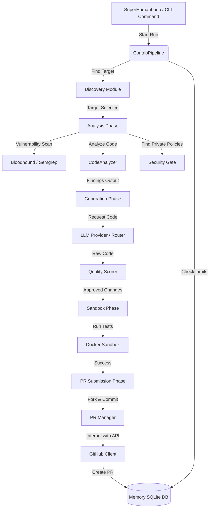

# Project Map: Farm-Agent Architecture Blueprint

This document serves as the canonical architectural blueprint for Farm-Agent v3.0.0. It details the technologies in use, directory structure, module dependencies, and the core execution loops that power the autonomous agent.

## 1. System Overview & Tech Stack

Farm-Agent is built on a robust, asynchronous Python stack, orchestrating multiple Large Language Models and interacting seamlessly with the GitHub API.

| Technology / Library | Role in Project |
| :--- | :--- |
| **Python 3.11+** | The core programming language. |
| **Hatchling** | The build backend used for packaging (`pyproject.toml`). |
| **Pydantic (v2)** | Data validation and core system configuration models (`farm_agent/core/config.py`). |
| **httpx** | Asynchronous HTTP client for interacting with the GitHub API and LLM providers. |
| **aiosqlite** | Asynchronous SQLite interface for persistent memory, state, and quotas (`farm_agent/core/memory.py`). |
| **Docker SDK (v7.1+)** | Manages the Polyglot Sandbox environment to securely execute untrusted code and tests (`farm_agent/core/sandbox.py`). |
| **ChromaDB** | An ephemeral (RAM-only) Local Retrieval-Augmented Generation (RAG) engine for retrieving past findings. |
| **Rich & Click** | Powers the advanced, colorful Command Line Interface (`farm_agent/cli/main.py`). |
| **Semgrep & ast-grep** | Core tools for the "Bloodhound Red Team" and "Sentinel Radar" used to scan code for vulnerabilities and quality issues. |
| **Minimax, OpenRouter** | Primary Large Language Model providers used for generating code and analyzing issues. Minimax is the default for coding, while OpenRouter powers White-Hat Audits. |
| **Ruff** | Strict code linting and formatting tool used throughout the project. |

## 2. Directory Structure

The following ASCII tree outlines the `farm_agent` package structure and major file roles.

```text
farm_agent/
├── cli/
│   └── main.py          # Click-based CLI entry points (run, target, solve, patrol, superhuman, janitor)
├── core/
│   ├── config.py        # Pydantic models mapping to config.yaml (FarmAgentConfig)
│   ├── exceptions.py    # Custom system exceptions (GitHubAPIError, LLMRateLimitError, etc.)
│   ├── logger.py        # Daily rolling file logger configuration
│   ├── memory.py        # SQLite persistent memory (Memory class interacting with memory.db)
│   ├── models.py        # Data models (Repository, Finding, Contribution, AnalysisResult)
│   ├── rag.py           # ChromaDB ephemeral Retrieval-Augmented Generation pipeline
│   ├── retry.py         # Async and HTTP retry decorators (@async_retry, @llm_retry)
│   └── sandbox.py       # Polyglot Docker Sandbox (executes code/tests securely)
├── generator/
│   ├── engine.py        # LLM integration to generate code modifications (ContributionGenerator)
│   ├── reviewer.py      # Automated review of generated code
│   └── scorer.py        # QualityScorer that strictly penalizes debug code and style violations
├── github/
│   ├── client.py        # Asynchronous GitHub API client (REST + GraphQL)
│   ├── discovery.py     # Discovers repositories meeting specific criteria (stars, languages)
│   ├── guidelines.py    # Extracts rules from CONTRIBUTING.md and PR templates
│   └── security_gate.py # Scans for private disclosure policies to prevent unwanted public PRs
├── analysis/
│   ├── analyzer.py      # Coordinates static code analysis
│   └── bloodhound.py    # Semgrep-powered vulnerability scanning pre-analysis
├── llm/
│   ├── provider.py      # Factory for LLM clients (Minimax, OpenRouter, Gemini, OpenAI, Ollama)
│   ├── models.py        # Definitions of model tiers, costs, and capabilities
│   └── router.py        # TaskRouter for assigning the best LLM based on task type
├── issues/
│   └── solver.py        # Classifies and proposes fixes for specific open GitHub issues
├── orchestrator/
│   ├── human.py         # SuperHumanLoop: The 24/7 daemon running the Terminator execution loop
│   ├── memory.py        # Alias/sibling reference to core/memory.py
│   └── pipeline.py      # ContribPipeline: The main control flow (Discover -> Analyze -> Generate -> PR)
├── pr/
│   ├── janitor.py       # PRJanitor: Uses Minimax to classify and close garbage PRs
│   ├── manager.py       # PRManager: Forks, branches, commits, pushes, and creates PRs on GitHub
│   └── patrol.py        # PRPatrol: Monitors open PRs, auto-responds to feedback, pushes fixes
├── notifications/
│   └── notifier.py      # Sends webhook alerts to Slack, Discord, and Telegram
├── templates/
│   └── registry.py      # System templates for PR descriptions and commit messages
└── __init__.py          # Version specification (v3.0.0)
```

## 3. Core Module Dependency Graph

This diagram illustrates how data flows through the main orchestration pipeline when contributing to a repository.



## 4. Core Execution Loops / Entry Points

### 1. `ContribPipeline` (The Core Engine)
Located in `farm_agent/orchestrator/pipeline.py`.
1.  **Initialization:** Loads configuration and establishes connections to GitHub, the LLM, and SQLite Memory.
2.  **Screening:** Fetches repo details, verifying activity and looking for `CONTRIBUTING.md` and `AI_POLICY.md` files concurrently via `asyncio.gather`.
3.  **Analysis:** Clones the repo to `self._clone_cache`. Runs the `BloodhoundAnalyzer` and `CodeAnalyzer` to identify issues. Drops "TRIVIAL" or blacklisted findings.
4.  **Generation:** The `ContributionGenerator` uses an LLM to craft fixes. The result passes through `QualityScorer` to ensure no prohibited debug code exists.
5.  **Validation:** The diff is applied inside the `DockerSandbox` where tests are run.
6.  **Submission:** The `PRManager` commits the fix to a fork and creates a PR.

### 2. `SuperHumanLoop` (The Terminator Loop)
Located in `farm_agent/orchestrator/human.py` and triggered via `farm_agent superhuman`.
1.  **Daemon Start:** Generates a daily target quota.
2.  **Continuous Execution:** Runs an infinite `while True:` loop executing `ContribPipeline.hunt()` or `ContribPipeline.run_circular()`.
3.  **Patrol Interleaving:** Periodically triggers `PRPatrol` to check on existing PRs.
4.  **Graceful Shutdown:** Intercepts `SIGINT`/`SIGTERM` to allow background tasks and database transactions to finish cleanly before exiting.

### 3. `PRPatrol` (The Responder)
Located in `farm_agent/pr/patrol.py`.
1.  **Fetch PRs:** Queries the SQLite DB for `open` PRs.
2.  **Review Comments:** Fetches new comments on those PRs from GitHub.
3.  **Classify & Act:** Uses an LLM to determine if the comment requires a `CODE_CHANGE`, a textual `QUESTION` reply, a `STYLE_FIX`, or a `CLA` signature.
4.  **Push Fixes:** If code changes are needed, it generates the fix, validates it, and pushes directly to the existing PR branch. Reaches deterministic closure if `MAX_DISCUSSION_REPLIES` is hit.

## 5. Database/State Schema

Farm-Agent utilizes `aiosqlite` to store its state in `data/memory.db`. Key tables include:

*   **`analyzed_repos`**: Tracks repositories that have been scanned.
    *   *Columns:* `repo` (str, primary key), `analyzed_at` (timestamp), `findings_count` (int), `status` (str).
*   **`submitted_prs`**: Logs every Pull Request created by the agent. Used heavily by `PRPatrol`.
    *   *Columns:* `id` (int), `repo` (str), `pr_number` (int), `pr_url` (str), `title` (str), `status` (str: 'open', 'merged', 'closed'), `created_at`, `updated_at`, `type`, `fork`.
*   **`run_log`**: Records execution cycles for statistical tracking.
*   **`findings_cache`**: Caches specific issues found during the Bloodhound/Analysis phases to avoid redundant work.
*   **`task_schedule`**: Replaced volatile in-RAM quota tracking to handle multi-process coordination securely.
*   **`knowledge_base`**: Stores "lessons learned" and QA audit history, accessed by the ChromaDB RAG system. Can be cleared via `farm_agent gc`.
*   **`blacklisted_repos` & `repo_preferences`**: Maintains settings to ensure the agent avoids hostile repositories or respects specific styling rules.
