# 🗺️ PROJECT_MAP.md

> **Architecture Blueprint for Farm-Agent (v3.0.0)**
> This document reflects the raw reality of the active codebase.

## 1. System Overview & Tech Stack

Farm-Agent is a highly autonomous, multi-layered AI system capable of full-lifecycle open source contribution, from initial discovery to post-PR code revisions. The v3.0 architecture introduces the **Bloodhound Red Team** (ast-grep pre-filter), **Circular Target Loop** (deterministic round-robin targeting), **DEV-QA Bounty Loop** (10-cycle adversarial quality gate), and **Knowledge Base GC** (stale lesson purging).

| Technology | Role |
| :--- | :--- |
| **Python 3.11+** | Core language, heavily utilizing `asyncio` for concurrent operations. |
| **Click & Rich** | Powers the robust Command-Line Interface (CLI) and terminal formatting. |
| **HTTPX** | Asynchronous HTTP client for communicating with GitHub and LLM APIs. |
| **SQLite (aiosqlite)** | Persistent, thread-safe (WAL mode) database for memory, quotas, PR tracking, and knowledge base. |
| **Minimax LLM** | Primary Large Language Model engine used for generation, analysis, and reasoning. Native integration with quota tracking. |
| **Pydantic & PyYAML**| Robust configuration parsing, validation, and settings management (`config.yaml`). |
| **Docker (SDK)** | Ephemeral "Polyglot Sandbox" containers to execute tests and validate code patches safely. |
| **ChromaDB** | Ephemeral, in-memory vector database for Retrieval-Augmented Generation (RAG) context to identify cross-file dependencies. |
| **ast-grep (`sg`)** | CLI-based AST pattern matching tool used as a pre-filter in the Bloodhound Red Team pipeline to find exact buggy snippets before LLM analysis. |
| **Pytest & Ruff** | Standardized testing framework and aggressive code formatting/linting. |

---

## 2. Directory Structure

```text
farm_agent/
├── cli/                 # Command-Line Interface entry points
│   ├── main.py          # Primary Click CLI (`hunt`, `hunt-circular`, `superhuman`, `gc`, etc.)
│   └── tui.py           # Text User Interface module
├── core/                # Core domain models, configuration, and infrastructure
│   ├── config.py        # Pydantic configuration definitions
│   ├── middleware.py    # Pipeline execution middlewares (Rate limits, DCO, Quality Gates)
│   ├── models.py        # Shared data structures (Contribution, Repository, Finding, Vulnerability, VulnerabilityDossier, QAResult, TargetRepoEntry)
│   ├── rag.py           # ChromaDB integration for contextual code search
│   └── sandbox.py       # Docker-based Polyglot Sandbox for testing patches
├── github/              # Interfacing with the GitHub REST API
│   ├── client.py        # Main Async HTTPX client for GitHub API
│   ├── discovery.py     # RepoDiscovery (API search) + JsonTargetDiscovery (circular loop)
│   └── guidelines.py    # Parsers for CONTRIBUTING.md and PR templates
├── orchestrator/        # The brains of the operation connecting subsystems
│   ├── human.py         # SuperHumanLoop: 24/7 stochastic daily schedule + KB GC
│   ├── memory.py        # SQLite persistence layer (aiosqlite) + knowledge_base table
│   └── pipeline.py      # ContribPipeline: discovery → bloodhound → DEV-QA loop → PR
├── analysis/            # Code scanning and issue identification
│   ├── analyzer.py      # CodeAnalyzer (legacy) + BloodhoundAnalyzer (ast-grep → LLM)
│   ├── mapper.py        # Repository structural mapper
│   └── skills.py        # Progressive analysis skill definitions
├── generator/           # Patch generation and validation
│   ├── engine.py        # ContributionGenerator + TemplateViolationError + anti-template retry
│   ├── scorer.py        # QualityScorer (heuristic) + QAHardcoreScorer (LLM-adversarial)
│   └── reviewer.py      # Adversarial ReviewerAgent for self-review
├── issues/              # Issue-driven contribution logic
│   └── solver.py        # Analyzes and solves open GitHub issues
├── pr/                  # Pull Request lifecycle management
│   ├── manager.py       # Forks, branches, commits, and creates PRs
│   ├── patrol.py        # Monitors open PRs for feedback and auto-pushes fixes
│   └── janitor.py       # Sweeps and destroys garbage/low-quality PRs
├── llm/                 # Abstractions for Language Models
│   ├── provider.py      # Factory and interface for LLM clients (Minimax, Gemini, etc.)
│   ├── context.py       # System prompt construction and style guide injection
│   └── router.py        # Task-based routing to different LLM models
├── notifications/       # Alerting system
│   └── notifier.py      # Telegram/Slack/Discord webhook integrations
├── agents/              # Sub-agents for specialized tasks
│   └── registry.py      # Agent registry
└── tools/               # LLM Function Calling Tools
    └── protocol.py      # Tool registry for the LLM to interact with the environment

ast_rules/               # AST-grep rule files (YAML) for Bloodhound pre-filtering
├── python-*.yaml        # Python vulnerability rules (sqli, deserialization, etc.)
├── js-*.yaml            # JavaScript vulnerability rules
├── ts-*.yaml            # TypeScript vulnerability rules
├── go-*.yaml            # Go vulnerability rules
├── rust-*.yaml           # Rust vulnerability rules
└── solidity-*.yaml      # Solidity vulnerability rules

target_repo.json         # Circular Target Loop data: list of target repos with scan timestamps
```

---

## 3. Core Module Dependency Graph

```mermaid
graph TD
    CLI[farm_agent.cli.main] --> Orchestrator[orchestrator.pipeline.ContribPipeline]
    CLI --> SuperHuman[orchestrator.human.SuperHumanLoop]
    CLI --> Patrol[pr.patrol.PRPatrol]
    CLI --> Janitor[pr.janitor.PRJanitor]
    CLI --> Solver[issues.solver.IssueSolver]

    SuperHuman --> Orchestrator
    SuperHuman --> Patrol
    SuperHuman --> Memory[orchestrator.memory.Memory]

    Orchestrator --> Config[core.config.FarmAgentConfig]
    Orchestrator --> GitHub[github.client.GitHubClient]
    Orchestrator --> Discovery[github.discovery.RepoDiscovery]
    Orchestrator --> JsonDiscovery[github.discovery.JsonTargetDiscovery]
    Orchestrator --> Bloodhound[analysis.analyzer.BloodhoundAnalyzer]
    Orchestrator --> Analyzer[analysis.analyzer.CodeAnalyzer]
    Orchestrator --> Generator[generator.engine.ContributionGenerator]
    Orchestrator --> QAScorer[generator.scorer.QAHardcoreScorer]
    Orchestrator --> IssueSolver[issues.solver.IssueSolver]
    Orchestrator --> PRManager[pr.manager.PRManager]
    Orchestrator --> Memory

    Bloodhound --> ASTRules[ast_rules/*.yaml]
    Bloodhound --> LLM[llm.provider.LLMProvider]
    Bloodhound --> GitHub

    Generator --> LLM
    Generator --> RAG[core.rag.ChromaDB]
    Generator --> Sandbox[core.sandbox.DockerSandbox]
    Generator --> Memory

    QAScorer --> LLM

    JsonDiscovery --> TargetRepo[target_repo.json]

    Analyzer --> LLM
    IssueSolver --> LLM
    IssueSolver --> GitHub
    PRManager --> GitHub
    Patrol --> GitHub
    Patrol --> LLM
```



---

## 4. Core Execution Loops / Entry Points

### A. Main Pipeline (`hunt`, `target`, `run`)
1. **Discovery**: `RepoDiscovery` uses the GitHub Search API to find repositories matching criteria (stars, language). Prioritizes "Familiar Grounds" (repos we previously successfully merged PRs to).
2. **Vibe Check**: Analyzes maintainer's recent comments to avoid toxic/hostile repositories.
3. **Analysis / Issue Solving**:
    - The pipeline attempts to find solvable issues using `IssueSolver`.
    - If no issues are solvable, it falls back to static code scanning via `CodeAnalyzer` to identify bugs, security flaws, or optimizations.
4. **Anti-Farming Filters**: Strict LLM and keyword-based gating to drop trivial (typos), documentation-only, or spammy formatting PRs.
5. **Generation**: `ContributionGenerator` uses `ChromaDB` for cross-file context (RAG) and the LLM to generate a `FileChange` patch.
6. **Adversarial Self-Review**: The `ReviewerAgent` independently audits each patch before submission. If rejected, the generator rewrites with the critique appended.
7. **Hybrid Contribution Protocol**:
    - *Route A (Direct PR)*: For Security fixes and Critical/High severity bugs.
    - *Route B (Issue-First)*: For Refactors/Optimizations, it creates a polite GitHub Issue to discuss before writing code.
8. **Sandbox Guillotine**: Generated patches are verified inside ephemeral Docker containers. If tests/linters fail, the LLM attempts iterative self-correction.
9. **PR Creation**: `PRManager` forks the repo, pushes the branch, applies DCO sign-offs, and opens the Pull Request (if Route A).

### B. Circular Target Loop (`hunt-circular`)
A deterministic round-robin bounty loop that reads targets from `target_repo.json`:

1. **Target Selection**: `JsonTargetDiscovery.get_next_target()` reads `target_repo.json`, sorts by `scanned_at` ascending (null = epoch), and returns the oldest-scanned repo.
2. **Crash-Safe Mark**: Immediately updates `scanned_at` to `now()` and atomically saves before any analysis/LLM calls. Guarantees that a crash won't cause the same repo to be re-picked.
3. **Bloodhound Pre-Filter** (`BloodhoundAnalyzer`):
    - Checks `sg` binary availability; aborts with empty dossier if not found.
    - Maps repo language to `ast_rules/` prefix (e.g., `Python → python-*.yaml`).
    - Shallow-clones the repo (`git clone --depth 1`).
    - Runs all matching `sg scan --rule <rule> --json=compact` concurrently via `asyncio.gather`.
    - If no matches: returns empty dossier → marks `COMPLETED_NO_VULN` → skips LLM entirely (cost savings).
    - If matches found: formats context string and sends to LLM White-Hat audit.
4. **DEV-QA Bounty Loop** (if bugs found):
    - Up to 10 cycles of: DEV generates patch → QA scores patch → if score ≥ 9.0, approved; else record critiques as QA lessons and retry.
    - `generate_from_dossier()` injects QA lessons from the knowledge base and uses a 3-cycle anti-template interceptor (regex catches `...`, `TODO`, `[Insert Code]`, etc.) with escalating warnings on retry.
    - `QAHardcoreScorer` grades patches on Logic (30%), Architecture (25%), Idioms (20%), Security (15%), Scope/Tests (10%). Only ≥ 9.0/10.0 passes.
5. **Status Tracking**: `mark_status()` atomically updates `target_repo.json` status to `COMPLETED_NO_VULN`, `PR_SUBMITTED`, or `COMPLETED_QA_REJECTED`.

### C. Issue Solver (`solve`)
A specialized loop that targets a specific repository, discovers open issues, filters for solvable ones (e.g., specific bugs, feature requests), and routes them through the Generator and Sandbox to create a PR closing the issue.

### D. Super Human Mode (`superhuman`)
An infinite, stochastic `while` loop designed to bypass behavioral detection:
- Wakes up and sets a random daily PR target.
- **Runs knowledge base garbage collection** once per day (purges entries older than 90 days).
- Interleaves running the **Main Pipeline** (Hunting) and **PR Patrol**.
- Implements simulated human delays (e.g., "typing" time based on patch size, coffee breaks, mandatory lunch).
- Once the daily quota is reached, switches exclusively to monitoring mode (Patrol).

### E. PR Patrol (`patrol`)
A post-submission operational loop:
- Scans memory for all open PRs previously created by Farm-Agent.
- Checks GitHub for new review comments.
- Uses the LLM to classify feedback (`CODE_CHANGE`, `QUESTION`, `STYLE_FIX`).
- Automatically generates and pushes new commits to the branch to satisfy the maintainer's requests.

### F. PR Janitor (`janitor`)
A self-cleanup utility:
- Scans live open PRs under the agent's GitHub account.
- Uses the LLM to evaluate the PR. If deemed "garbage" (low impact, formatting-only, exploratory), it forcibly closes the PR and deletes the branch.

### G. Garbage Collection (`gc`)
CLI command for manual knowledge base cleanup:
- `farm_agent gc --days 90` purges `knowledge_base` entries older than N days.
- Also runs automatically once per day inside the SuperHuman loop at day boundary.

---

## 5. Database/State Schema

Farm-Agent uses an asynchronous SQLite database (`memory.db` with WAL mode) for state persistence, quota tracking, and knowledge management.

| Table Name | Description | Key Columns |
| :--- | :--- | :--- |
| `run_log` | High-level audit log of execution runs. | `id`, `started_at`, `ended_at`, `repos_analyzed`, `prs_created` |
| `analyzed_repos` | Tracks repos that have been processed to avoid redundant scanning. | `full_name`, `language`, `analyzed_at`, `findings` |
| `submitted_prs` | Core table tracking active and historical Pull Requests and Issues. | `repo`, `pr_number`, `status` (open/merged/closed), `type`, `updated_at`, `ci_fix_attempts` |
| `findings_cache` | Caches identified issues to save LLM tokens across restarts. | `repo`, `type`, `severity`, `status` |
| `pr_outcomes` | Records the outcome of PRs (merged, closed, rejected) for learning. | `repo`, `pr_number`, `pr_type`, `outcome`, `feedback` |
| `repo_preferences`| Stores behavioral traits of repositories (preferred contribution types). | `repo`, `preferred_types`, `merge_rate` |
| `blacklisted_repos`| Repositories where PRs are banned (e.g., due to toxic maintainers or AI policies). | `repo`, `reason`, `blacklisted_at` |
| `api_usage_log` | Tracks LLM and GitHub API requests for sliding-window rate limiting. | `timestamp`, `provider` |
| `task_schedule` | General purpose key-value store for scheduling background tasks. | `task_key`, `next_run` |
| `knowledge_base` | Stores QA lessons and audit history for the DEV-QA Bounty Loop. | `repo_name`, `entry_type` (qa_lesson, audit_history), `content`, `created_at` |

### External State Files

| File | Description |
| :--- | :--- |
| `target_repo.json` | Array of `TargetRepoEntry` objects driving the Circular Target Loop. Each entry has `repo_url`, `status`, `scanned_at`, `language`, and bounty metadata. Updated atomically (temp-file-then-rename) by `JsonTargetDiscovery`. |
| `ast_rules/*.yaml` | AST-grep rule YAML files organized by language prefix (e.g., `python-sqli-fstring-execute.yaml`, `go-unchecked-error.yaml`). Used by `BloodhoundAnalyzer` as a pre-filter before LLM analysis. |

---

## 6. Key Data Models (Pydantic)

| Model | Location | Purpose |
| :--- | :--- | :--- |
| `TargetRepoEntry` | `core/models.py` | Single target from `target_repo.json`. Contains `repo_url`, `status`, `scanned_at`, `language`, `bounty_amount`, `diamond_target`, etc. |
| `Vulnerability` | `core/models.py` | A single validated vulnerability from Bloodhound. Fields: `file`, `line`, `snippet`, `poc`, `fix`, `impact`. |
| `VulnerabilityDossier` | `core/models.py` | Dossier of vulnerabilities for a repo. Has `has_bugs()` method that returns `False` if all matches were false positives (file="NONE"). |
| `QAResult` | `core/models.py` | Result of `QAHardcoreScorer` evaluation. Fields: `score` (0.0-10.0), `critiques` (list of strings), `approved` (True only if score ≥ 9.0). |
| `Contribution` | `core/models.py` | Generated patch with finding, changes, commit message, branch name. |
| `Finding` | `core/models.py` | Identified issue with severity, file path, description, suggestion. |
| `RepoContext` | `core/models.py` | Full repository context for LLM prompting (file tree, content, guidelines). |

---

## 7. Key Algorithms & Protocols

### 7.1 Crash-Safe Circular Target Rotation
`JsonTargetDiscovery` reads `target_repo.json`, sorts by `scanned_at` ascending (null = epoch), and returns the oldest entry. `mark_scanned()` updates `scanned_at` and atomically writes the file **before** any GitHub API or LLM calls. This guarantees that if the agent crashes, the next restart picks a different target.

### 7.2 Bloodhound Red Team Protocol
1. `BloodhoundAnalyzer.run_bloodhound(repo)` checks for `sg` binary.
2. Maps repo language to `ast_rules/` prefix (e.g., `Python → python-*.yaml`).
3. Shallow-clones repo, runs all matching `sg scan` rules concurrently.
4. Parses NDJSON output line-by-line with `json.JSONDecodeError` per line.
5. Deduplicates matches by `(file, line, rule)`.
6. If no matches → returns empty `VulnerabilityDossier` → **skips LLM entirely**.
7. If matches → formats context string, sends to LLM White-Hat audit.
8. LLM returns JSON array of validated vulnerabilities (or `[{"file": "NONE", ...}]` for false positives).
9. Cleans up temp clone directory in `finally` block.

### 7.3 Anti-Template Generation (DEV Agent)
`generate_from_dossier()` iterates over `VulnerabilityDossier.vulnerabilities` and calls `_generate_single_vuln()` for each. The inner method:
1. Fetches QA lessons from `Memory.get_qa_lessons(repo_url)` and injects them as warnings.
2. Uses a hardened system prompt forbidding `...`, `TODO`, `[Insert Code]`, `<variable>`, `TBD`.
3. Runs a **3-cycle retry loop**: if `_FORBIDDEN_PATTERNS` regex detects lazy code, appends an escalating `SYSTEM WARNING` to the prompt and retries.
4. On clean output, parses via `_parse_changes()` and runs Gag Order check.
5. If all 3 cycles fail → `RuntimeError("Failed to generate strict code after 3 attempts")`.

### 7.4 QA Hardcore Scoring
`QAHardcoreScorer.evaluate(dossier, contribution)` grades a patch against the originating vulnerability dossier. The LLM is prompted to return strict JSON with `score`, `critiques`, and `approved`. The `approved` field is **always** computed from `score >= 9.0` — never blindly trusting the LLM's boolean. If JSON parsing fails, defaults to `QAResult(score=0.0, critiques=["System Error: QA Agent failed to return valid JSON."], approved=False)`.

### 7.5 10-Cycle DEV-QA Bounty Loop
Inside `run_circular()`, after Bloodhound finds bugs:
1. Build `RepoContext` with vulnerable file contents fetched via GitHub API.
2. For up to 10 cycles:
   - DEV generates patches via `generate_from_dossier()` (auto-injects QA lessons).
   - QA evaluates via `QAHardcoreScorer.evaluate()`.
   - If `approved` (score ≥ 9.0): break, proceed to PR submission.
   - If rejected: record each critique as a QA lesson via `Memory.record_qa_lesson()`.
3. If passed: submit PR via `PRManager`, mark status `PR_SUBMITTED`.
4. If all 10 cycles fail: mark status `COMPLETED_QA_REJECTED`.

### 7.6 Knowledge Base Garbage Collection
`Memory.run_kb_garbage_collection(days=90)` executes `DELETE FROM knowledge_base WHERE created_at < datetime('now', '-90 days')`. Runs automatically once per day in the `SuperHumanLoop._new_day_check()` method (triggered at each calendar day boundary). Also available as a manual CLI command: `farm_agent gc --days 90`.