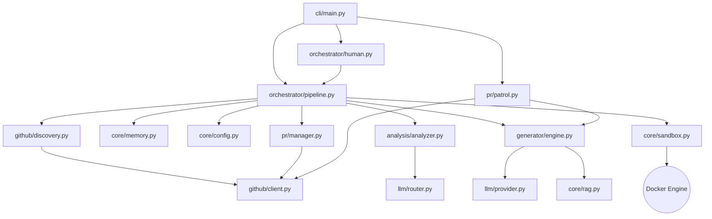

# PROJECT_MAP.md — Farm-Agent Ground Truth

**Generated:** 2026-04-15
**Version:** v3.2.0 (from git tag at commit `0b96a08`)
**Entry Point:** `farm_agent/cli/main.py` → `cli()` (Click-based CLI)
**Language:** Python 3.11+

---

## 1. System Overview & Tech Stack

**What the system actually does:**

Farm-Agent is an autonomous AI agent that discovers open-source GitHub repositories matching criteria (language, star range, activity), scans their code for issues (security vulnerabilities, code quality bugs, performance problems, etc.), generates patches via LLM, validates patches in Docker sandboxes, and creates PRs or GitHub Issues to contribute back.

**Active Tech Stack:**

| Component | Technology | Role |
|-----------|------------|----------|
| Language | Python 3.11+ | Backbone runtime. |
| Configuration | Pydantic v2 + YAML | Defines configuration across `FarmAgentConfig`. |
| HTTP client | `httpx` (async) | Async network ops. |
| LLM Providers | MiniMax, OpenRouter | Power generative outputs and Red Team analyzer. |
| Database | SQLite via `aiosqlite` | Persistent context, caching via WAL mode. |
| Docker | `docker>=7.1,<8.0` | Powers Polyglot Sandbox for testing validation. |
| Scheduling | `apscheduler>=3.10,<4.0` | Task scheduling. |
| CLI | `click>=8.1,<9.0` + `rich>=13.0,<14.0` | Command line orchestrator. |
| Vector DB | `chromadb>=0.4,<1.0` | Backs Retrieval-Augmented Generation (RAG) feature. |
| Git Python | `gitpython>=3.1,<4.0` | Local git abstraction operations. |

---

## 2. Directory Structure

```
farm_agent/
├── agents/             # Registry defining AI personas and behavioral rules.
├── analysis/           # Deep-scan engines. Contains BloodhoundAnalyzer and CodeAnalyzer.
├── cli/
│   ├── main.py         # Primary entry point utilizing Click for run, hunt, patrol, etc.
│   └── tui.py          # Interactive Terminal User Interface wrappers.
├── core/
│   ├── config.py       # Pydantic-based configuration system `FarmAgentConfig`.
│   ├── middleware.py   # Quota and quality gating loops (DeerFlow pattern).
│   ├── models.py       # Dataclasses and Pydantic abstractions for the domain.
│   ├── memory.py       # SQLite database logic and queries utilizing `aiosqlite`.
│   ├── rag.py          # Ephemeral RAG system backed by ChromaDB.
│   └── sandbox.py      # The Polyglot Docker Sandbox responsible for code validation.
├── generator/
│   ├── engine.py       # Code modification module (`ContributionGenerator.generate()`).
│   ├── reviewer.py     # Independent code verifier.
│   └── scorer.py       # QAHardcoreScorer asserting style guide penalties.
├── github/
│   ├── client.py       # Rest/GraphQL abstraction layers and token rotation logic.
│   ├── discovery.py    # Logic executing targeted repository targeting via API.
│   ├── guidelines.py   # Dynamic parser for CONTRIBUTING.md protocols.
│   └── security_gate.py# Disclosure checker averting potential PR collisions.
├── issues/
│   └── solver.py       # `IssueSolver` component to decipher complexity heuristically.
├── llm/
│   ├── provider.py     # Instantiation logic for model providers (MiniMax, Anthropic).
│   └── router.py       # OpenRouter interface for dispatching the Red Team tasks.
├── notifications/      # Webhook dispatches (Telegram/Slack) reflecting state shifts.
├── orchestrator/
│   ├── human.py        # SuperHuman daemon running the relentless Terminator Loop.
│   └── pipeline.py     # Coordinates the overarching system run.
├── plugins/            # Extensibility points and modular capability add-ons.
├── pr/
│   ├── manager.py      # `PRManager` steering forks, commits, and API dispatches.
│   └── patrol.py       # The module handling feedback responses and limit shutdowns.
├── templates/          # Jinja-like text blueprints for outputs and prompts.
└── tools/
    └── protocol.py     # Base abstraction schema outlining standardized sandbox interfaces.
```

---

## 3. Core Execution Pipeline & Data Flow

### Core Execution Loops / Entry Points

The fundamental sequence triggered by executing a command (e.g. `farm_agent run`) maps specifically to a defined state machine:

1. **Discovery:**
   - Evaluates search constraints against GitHub's database via the `GitHubClient`.
   - Optionally resolves pre-defined entities utilizing `DatabaseTargetDiscovery` to engage the Circular Target Loop.
2. **Gate:**
   - Inspects against the local `blacklisted_repos` and the `security_gate.py` to prevent trivial PRs or collision events.
3. **Analysis:**
   - The system retrieves files (using concurrent fetches deduplicated with semaphores) to pass into `BloodhoundAnalyzer` and `CodeAnalyzer`.
   - Analyzers identify vulnerabilities (`Finding` objects) and output a standardized contextual dossier.
4. **Engine:**
   - `ContributionGenerator` interacts with local `RAG` and configured LLM providers (`minimax` typically) to generate specific source modifications mapped against project style guides.
5. **Sandbox:**
   - The orchestrator relays code variations to the Polyglot Docker `sandbox.py` (e.g. using `python -m pytest`) which validates logical assertions locally, mitigating downstream CI errors.
6. **PR:**
   - Successful variations are formatted via `PRManager` utilizing valid commits pushed directly to a spawned GitHub repository fork prior to requesting a PR upstream.
   - Outputs are logged meticulously back to the SQLite `Memory` node.

*Note on SuperHumanMode:* Orchestrator initiates a relentless "Terminator execution loop" operating endlessly, disregarding artificial organic lunch breaks, strictly executing up to configured quota maximums via `human.py`.

### Core Module Dependency Graph



---

## 4. Database Schema & State

**SQLite DB at:** `data/memory.db` (default, configurable via `storage.db_path`)

**WAL Journal Mode** — falls back to DELETE on Docker volume filesystems.

**Schema (from `memory.py`):**

| Table | Primary Columns | Purpose |
|-------|-----------------|---------|
| `analyzed_repos` | `full_name` (PK), `language`, `stars`, `analyzed_at`, `findings`, `metadata` | Track which repos have been scanned |
| `submitted_prs` | `id`, `repo`, `pr_number` (UNIQUE), `pr_url`, `title`, `type`, `status`, `branch`, `fork`, `created_at`, `updated_at`, `ci_fix_attempts`, `discussion_replies` | All PRs submitted by the agent |
| `findings_cache` | `id`, `repo`, `type`, `severity`, `title`, `file_path`, `status`, `created_at` | Cached analysis findings |
| `run_log` | `id`, `started_at`, `finished_at`, `repos_analyzed`, `prs_created`, `findings`, `errors`, `metadata` | Historical pipeline runs |
| `pr_outcomes` | `id`, `repo`, `pr_number` (UNIQUE), `pr_url`, `pr_type`, `outcome`, `feedback`, `time_to_close_hours`, `recorded_at` | Outcome tracking for learning |
| `repo_preferences` | `repo` (PK), `preferred_types`, `rejected_types`, `merge_rate`, `avg_review_hours`, `notes`, `updated_at` | Per-repo learned preferences |
| `blacklisted_repos` | `repo` (PK), `reason`, `pr_number`, `blacklisted_at` | Permanently blocked repos |
| `api_usage_log` | `id`, `timestamp` (Unix epoch), `provider` | LLM API usage for quota tracking |
| `task_schedule` | `task_key` (PK), `next_run`, `updated_at` | Persistent task scheduling |
| `knowledge_base` | `repo_name`, `entry_type`, `content`, `created_at` (UNIQUE) | QA lessons, audit history |
| `target_repos` | `repo_url` (PK), `status`, `scanned_at` (Unix ts), `language`, `bounty_amount`, `diamond_target` | Circular loop targets |
| `repo_style_guides` | `repo` (PK), `style_summary`, `contributing_md`, `pr_template`, `created_at`, `updated_at` | Cached CONTRIBUTING.md parses |

**Migrations:** On init, `ci_fix_attempts` and `discussion_replies` columns are added to `submitted_prs` if missing.

