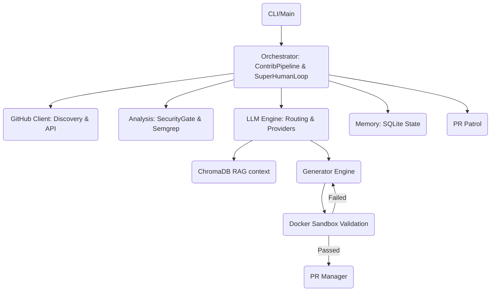

# PROJECT_MAP.md — Farm-Agent Architectural Blueprint

## 1. System Overview & Tech Stack

Farm-Agent is an autonomous agent designed to solve open-source issues and contribute high-quality patches using LLMs. It operates an advanced orchestration pipeline handling repository discovery, target filtering, code analysis, RAG-assisted patch generation, docker-isolated validation, and automated GitHub contributions.

**Active Tech Stack:**

| Component | Technology | Primary Purpose |
|-----------|------------|-----------------|
| Language | Python 3.11+ | Core implementation backend |
| HTTP client | `httpx` (async) | Interfacing with APIs asynchronously |
| LLM Providers | MiniMax (ABAB), OpenRouter | Model routing for issue solving and code analysis |
| Database | SQLite via `aiosqlite` | Persistent memory and state tracking (WAL mode) |
| Container | Docker SDK (`docker>=7.1`) | Ephemeral polyglot sandbox for patch execution |
| Scheduling | `apscheduler` | Managing deferred tasks |
| Config | Pydantic v2 + YAML | Strongly-typed configurations |
| CLI | `click` + `rich` | Terminal user interface |
| Vector DB | `chromadb` | RAG indexing for cross-file context retrieval |
| VCS | GitPython | Local git tree management |

---

## 2. Directory Structure

```ascii
farm_agent/
├── cli/
│   └── main.py          # Click-based CLI entry points (run, target, hunt, patrol, etc.)
├── core/
│   ├── config.py        # Pydantic-based configuration management
│   ├── exceptions.py    # Custom pipeline and execution exceptions
│   ├── memory.py        # Local SQLite state persistence mappings
│   ├── middleware.py    # Gatekeeping middleware components
│   ├── models.py        # Shared data definitions and enums
│   ├── rag.py           # ChromaDB local semantic context generation
│   ├── retry.py         # Resiliency wrappers for network operations
│   └── sandbox.py       # Docker SDK isolated polyglot environment
├── generator/
│   ├── engine.py        # LLM-driven contribution patching engine
│   ├── reviewer.py      # Code patch review module
│   └── scorer.py        # Quality assurance evaluation
├── github/
│   ├── client.py        # Wrapped GitHub REST & GraphQL API Client
│   ├── discovery.py     # Repo targeting and issue crawling
│   └── security_gate.py # Security scanning (preventing private disclosure leaks)
├── issues/
│   └── solver.py        # Issue classification and solvability heuristics
├── llm/
│   ├── provider.py      # Factory for generating LLM models (Minimax/Openrouter)
│   ├── models.py        # LLM token/tier categorization
│   └── router.py        # Task-based dynamic model routing
├── orchestrator/
│   ├── human.py         # 24/7 Super Human Mode continuous execution loop
│   ├── memory.py        # Core persistent storage interfaces (aliases core/memory.py)
│   └── pipeline.py      # Central execution logic bridging all subsystems
├── pr/
│   ├── manager.py       # GitHub fork, commit, and PR push logic
│   ├── patrol.py        # PR feedback monitor and auto-reply subsystem
│   └── janitor.py.DISABLED # Offline/disabled script for stale PR cleanup
└── __init__.py
```

---

## 3. Core Module Dependency Graph



---

## 4. Core Execution Loops / Entry Points

Farm-Agent primarily initializes from `farm_agent/cli/main.py`. The two core execution pipelines are:

1. **Standard Targeted/Hunt Execution (`ContribPipeline`)**:
   - **Discovery:** Target list fetched manually via URL or automatically scraped from GitHub.
   - **Gate:** Pre-validation against repo restrictions (e.g. contributor limits, `SECURITY.md` private disclosures, AI-bans).
   - **Analysis:** Codebase scanned via `BloodhoundAnalyzer` (Semgrep) or open issues scanned and heuristics ranked (`IssueSolver`).
   - **Engine:** `ContributionGenerator` uses Minimax to craft file patches, using local RAG indexing for semantic insight.
   - **Sandbox:** The patch is executed in `DockerSandbox`. The container's network is disabled (`none`). If tests/linters fail, the output error is fed back to the engine for self-correction up to 3 times.
   - **PR:** Upon successful verification, the repo is forked, committed, and a PR is pushed via `PRManager`.

2. **24/7 Continuous Loop (`SuperHumanLoop`)**:
   - Alternates continuously between a stochastic hunting execution loop and a patrol execution loop (PR monitoring).
   - Abides by hardcap daily limits and enforces LLM usage throttling.
   - Triggers `PRPatrol` automatically to monitor open PRs, respond to feedback via Minimax, and append follow-up commits natively to existing PR branches.

---

## 5. Database/State Schema

State management is persistently backed by an embedded SQLite Database (`data/memory.db`) managed via `aiosqlite` in `farm_agent/orchestrator/memory.py`.

**Core Tables:**
- `analyzed_repos`: Tracks scanned repositories (languages, stars, parsed dates).
- `submitted_prs`: Logs successful PR submissions (repo, pr_url, branch, fork, PR outcomes).
- `findings_cache`: Tracks individual analysis findings to deduplicate agent effort.
- `target_repos`: Coordinates target rotation (primarily in `hunt-circular` mode).
- `api_usage_log`: Persistent sliding-window token and request quota tracking for the LLM providers.
- `knowledge_base`: Stores learning contexts (QA lessons, formatting guides, historical audit outcomes) for specific repositories.
- `blacklisted_repos` & `repo_preferences`: Caches specific repository preferences (e.g. hostility checks) to speed up future runs.