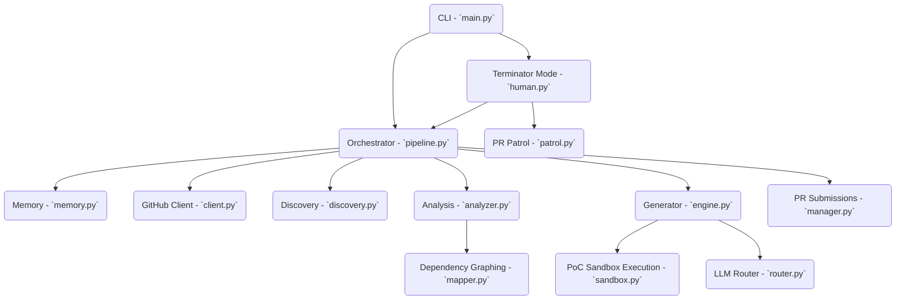

# 🗺️ Agent-Farm Project Map (v4.0.0)

This document serves as the **Architecture Blueprint** for the Agent-Farm system. It details the precise module structure, execution flow, tech stack, and state schema that power the autonomous pipeline.

---

## 1. System Overview & Tech Stack

| Technology | Role |
|------------|------|
| **Python (3.11+)** | Core backend language |
| **Hatchling** | Build backend and project metadata management (`pyproject.toml`) |
| **SQLite (memory.db)** | Persistent database with WAL mode for fast concurrent operations |
| **Docker** | Spawns sibling containers to run test beds & validate PoCs in isolated network sandboxes |
| **ChromaDB** | Vector database for Omniscient Context Engine (RAG documentation retrieval) |
| **PyYAML & Pydantic** | Config processing, structured data validation, and runtime environments |
| **httpx** | High-performance asynchronous HTTP networking (GitHub API, LLM calls) |
| **Click & Rich** | robust CLI handling and rich terminal UI feedback |
| **GitPython** | Programmatic fork handling, commits, patching, and PR creation |
| **APScheduler** | Job scheduling mechanisms |
| **Google GenAI / OpenAI / Anthropic** | Multiple LLM integrations (routed by `TaskRouter` and `TaskType`) |

---

## 2. Directory Structure

```ascii
.
├── Dockerfile                  # Multi-stage image build (builder -> runtime)
├── docker-compose.yml          # Network configurations (internet_access & sandbox_isolated)
├── start.sh                    # Unix quick-start (1-Click Docker Launch)
├── start.bat                   # Windows quick-start (1-Click Docker Launch)
├── pyproject.toml              # Build & dependency declarations
└── farm_agent/                 # Primary application package
    ├── cli/
    │   └── main.py             # CLI entrypoint; registers click commands (run, hunt, superhuman, etc)
    ├── core/
    │   ├── config.py           # Configuration schema handling
    │   ├── daily_log.py        # Markdown formatting of daily activities
    │   ├── exceptions.py       # Base exceptions
    │   ├── leaderboard.py      # Leaderboard query execution
    │   ├── logger.py           # Application logging mechanisms
    │   ├── middleware.py       # Context manipulation tools
    │   ├── models.py           # Standard data classes
    │   ├── notifier.py         # Handles Telegram, Slack, and Discord integrations
    │   ├── profiles.py         # Presets (thorough, quick, standard)
    │   ├── quotas.py           # Limits execution by tracking allocations
    │   ├── rag.py              # Semantic chunking and vector mapping logic
    │   ├── retry.py            # Async wrappers for transient HTTP issues
    │   └── sandbox.py          # Isolated environment manager for verifying code fixes
    ├── analysis/
    │   ├── analyzer.py         # Implements the Bloodhound Red Team pipeline logic
    │   └── mapper.py           # AST-based dependency graph mapping
    ├── generator/
    │   ├── engine.py           # Invokes patch generation from models
    │   ├── poc.py              # Constructs Proof-of-Concept testing loops
    │   ├── reviewer.py         # AI critique evaluation loop
    │   └── scorer.py           # Expert appraisal and confidence scoring gating
    ├── github/
    │   ├── client.py           # REST / GraphQL abstractions for GitHub
    │   ├── discovery.py        # Module for crawling repositories and evaluating criteria
    │   ├── guidelines.py       # Detects and maps contributing standards
    │   └── security_gate.py    # Discovers private bug reporting pathways
    ├── issues/
    │   └── solver.py           # Coordinates logic to fix existing GitHub issues
    ├── llm/
    │   ├── agents.py           # Prompt and context mapping per capability
    │   ├── context.py          # Data aggregator for the LLM
    │   ├── models.py           # Enumerates integrated LLM endpoints
    │   ├── provider.py         # Core API connection module
    │   └── router.py           # Maps required models to specific tasks dynamically
    ├── orchestrator/
    │   ├── human.py            # SuperHumanLoop (Terminator Mode) automated loop
    │   ├── memory.py           # Async state persistence via aiosqlite
    │   └── pipeline.py         # Primary orchestration controller
    ├── pr/
    │   ├── manager.py          # PR publishing algorithms
    │   └── patrol.py           # CI auto-fix logic and maintainer feedback handling
    ├── agents/
    │   └── registry.py         # Instantiates configured task agents
    ├── templates/
    │   ├── __init__.py
    │   └── registry.py         # Bootstraps contribution formats
    ├── notifications/
    │   ├── __init__.py
    │   └── notifier.py         # Interface for alerting systems
    ├── plugins/                # Plugin implementations
    └── tools/
        └── protocol.py         # Tools framework and configuration
```

---

## 3. Core Module Dependency Graph



---

## 4. Core Execution Loops / Entry Points

- **`farm_agent.cli.main`**: The primary CLI entry point that initializes the app, parses command-line arguments utilizing Click, builds configurations, and kicks off different orchestration methods (e.g. `run`, `superhuman`, `patrol`, etc.).
- **`Pipeline` (`orchestrator/pipeline.py`)**: The central hub that runs a single target through the entire lifecycle: downloading context (GitHub discovery), analyzing the AST using `analyzer.py`, sending data through generative engines (`engine.py`, `poc.py`), building patches, and using `manager.py` to create the final PR.
- **`SuperHumanLoop` / Terminator Mode (`orchestrator/human.py`)**: A relentless continuous 24/7 background worker. It coordinates finding repos (`hunt`), handling existing opened PRs by reacting to reviews or CI failure (`patrol`), and enforces daily quota limitations across LLM APIs.
- **`PRPatrol` (`pr/patrol.py`)**: Responsible for auditing the list of currently open PRs generated by the bot. It evaluates whether maintaining developers left reviews, utilizes `gemini-3.5-flash` to craft appropriate replies or adjust patches, and intercepts broken GitHub actions to generate auto-fixes.

---

## 5. Database/State Schema

The local memory (`memory.db`) tracks the entire life of the agent across its run iterations utilizing WAL mode.

| Table Name | Description |
|------------|-------------|
| **`analyzed_repos`** | Tracks repositories that have already been examined to prevent duplicated scans. |
| **`submitted_prs`** | Tracks state, type, fork/branch info, and error tracking of bot-generated PRs. |
| **`findings_cache`** | Temporary buffer of code issues discovered before they are passed into generation. |
| **`run_log`** | Execution trace logs, durations, and cumulative system error metrics. |
| **`pr_outcomes`** | Stores merged/closed PR states alongside maintainer feedback analysis. |
| **`repo_preferences`** | A continuously updated matrix of project vibe guidelines derived from `pr_outcomes`. |
| **`blacklisted_repos`** | Repos restricted from scanning because they feature hostile maintainers. |
| **`api_usage_log`** | A ledger tracking exact LLM provider timestamps to orchestrate limits and quotas. |
| **`task_schedule`** | Async task queue used inside the Terminator execution loops. |
| **`knowledge_base`** | Learned concepts, architectures, and lessons extracted per repository to fine-tune responses. |
| **`target_repos`** | Deterministic list of target repositories for the system to process via the hunting mechanism. |
| **`repo_style_guides`** | Parsed configuration details related to PR formatting logic from contributing documents. |

