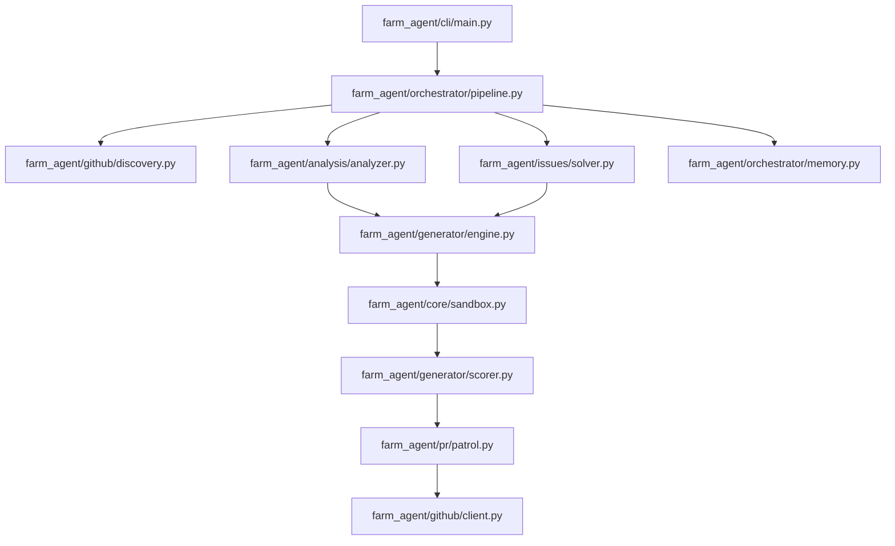

# PROJECT_MAP.md — Agent-Farm Ground Truth

**Generated:** 2026-06-02  
**Version:** v4.0.0 — Omniscient Context Engine  
**Entry Point:** `farm_agent/cli/main.py` → `cli()` (Click-based CLI)  
**Language:** Python 3.11+  

---

## 1. System Overview & Active Tech Stack

**What it does:** Autonomous AI agent system that discovers open-source GitHub repositories or scans targets for issues and vulnerabilities. It analyzes code via multi-phase LLM prompts, generates patches, validates them in isolated Docker sandboxes, runs a two-layer expert filter (Qwen → Gemini), and submits pull requests or private disclosures. It also runs a PR Patrol loop to auto-reply to comments, address code reviews, and self-correct CI failures.

Version 4.0.0 introduces the **Omniscient Context Engine**, which recursively discovers repository documentation, chunks it semantically by markdown headers, ingests it into ChromaDB, and maps local module/function dependency linkages to provide deep subsystem context to LLM agents. Furthermore, version 4.0.0 incorporates **Dynamic Bug Verification** (generating and executing Proof-of-Concept exploits in an isolated container sandbox, evaluated via LLM) and **Blast Radius & Regression Auditing** (using baseline test suite runs and downstream dependent analysis to guarantee zero regressions).

| Component | Technology | Role |
|-----------|------------|--------|
| Language | Python 3.11+ | Core runtime |
| HTTP client | `httpx` (async) | API interactions (GitHub, LLMs) |
| Code Gen LLM | `deepseek/deepseek-v4-pro` via OpenRouter | Patches and PR generation |
| Layer 1 Appraiser | `qwen/qwen3.7-max` via OpenRouter | Strict findings appraisal |
| Layer 2 Supreme Auditor | `google/gemini-3.5-flash` via OpenRouter | Final PR gate check |
| Red Team (Bloodhound) | `deepseek/deepseek-v4-flash` via OpenRouter | Finding bugs |
| Database | SQLite (`aiosqlite`) | Persistent local state storage |
| Docker Sandbox | `docker>=7.1` | Complete network + capability isolation for testing |
| Config | Pydantic v2 + YAML + `.env` | Environment configuration |
| CLI | `click>=8.1` + `rich>=13.0` | CLI Interface |
| Vector DB | `chromadb>=0.4` | RAG for file & documentation context |

---

## 2. Directory Structure

```text
farm_agent
├── __init__.py
├── agents             # Agent definitions
│   └── registry.py    # DeerFlow custom registry-based agent architecture
├── analysis           # Code Analysis and finding vulnerabilities
│   ├── analyzer.py    # CodeAnalyzer, BloodhoundAnalyzer
│   └── mapper.py      # RepoMapper for Context linkage
├── cli                # Entry points for running the agent
│   └── main.py        # Click CLI setup and subcommands
├── core               # Core business logic and shared models
│   ├── config.py      # Pydantic configuration loaded from yaml/.env
│   ├── logger.py      # Configurable logging
│   ├── memory.py      # SQLite memory database (deprecated, moved to orchestrator/memory.py in some usages)
│   ├── models.py      # Core data models (dataclasses)
│   ├── rag.py         # Local ChromaDB RAG logic
│   └── sandbox.py     # Docker sandbox execution logic
├── generator          # Generating code/patches/PoC
│   ├── engine.py      # Engine for generating contributions
│   ├── poc.py         # PoC Generator
│   └── scorer.py      # QAHardcoreScorer
├── github             # Interacting with GitHub API
│   ├── client.py      # Async wrapper for GitHub API
│   ├── discovery.py   # Discovering repos
│   └── security_gate.py # Security checks
├── issues             # Handling issues proactively
│   └── solver.py      # IssueSolver logic
├── llm                # Interfacing with various LLMs
│   ├── provider.py    # create_llm_provider logic
│   └── router.py      # Routing task types to models
├── notifications      # Notifications (Discord/Slack/Telegram)
│   └── notifier.py
├── orchestrator       # Tying everything together
│   ├── memory.py      # Actual memory database management
│   └── pipeline.py    # The main FarmAgentPipeline orchestrator
└── pr                 # Managing submitted Pull Requests
    ├── manager.py     # Manager for creating and interacting with PRs
    └── patrol.py      # PRPatrol for checking/replying to active PRs
```

---

## 3. Core Module Dependency Graph



---

## 4. Core Execution Loops

* `run_single` Loop:
  1. Initialize `Memory` and `FarmAgentPipeline`.
  2. Discover target via `GitHubClient`.
  3. Clone the repo and analyze using `BloodhoundAnalyzer`.
  4. Generate PoC and Fixes using `ContributionGenerator`.
  5. Validate fixes inside `DockerSandbox`.
  6. Final scoring via Qwen/Gemini filters.
  7. Generate PR using `GitHubClient`.

* `superhuman` Loop:
  1. Relentless 24/7 autonomous loop.
  2. Runs `run_circular()` on pending queue.
  3. Periodically invokes `PRPatrol.patrol()` to handle active feedback.
  4. Human-like timing delays injected to avoid API rate limits.

---

## 5. Database Schema

The agent stores persistent state in a local SQLite file (default `memory.db`), managed by `farm_agent/orchestrator/memory.py`:

* `analyzed_repos`: Tracks repos that have been scanned.
* `submitted_prs`: Logs successful PR creation along with URL.
* `findings_cache`: Caches discovered issues to avoid redundant reporting.
* `run_log`: Historical run data.
* `pr_outcomes`: Tracks the status of PRs (merged, closed, open).
* `repo_preferences`: Heuristics of successful contribution types per repo.
* `blacklisted_repos`: Repos to skip.
* `api_usage_log`: Logs API utilization.
* `task_schedule`: Internal scheduling mechanism.
* `knowledge_base`: The long-term context cache.
* `target_repos`: Queue of user-defined target targets.
* `repo_style_guides`: Cached contributing guidelines and PR templates.
