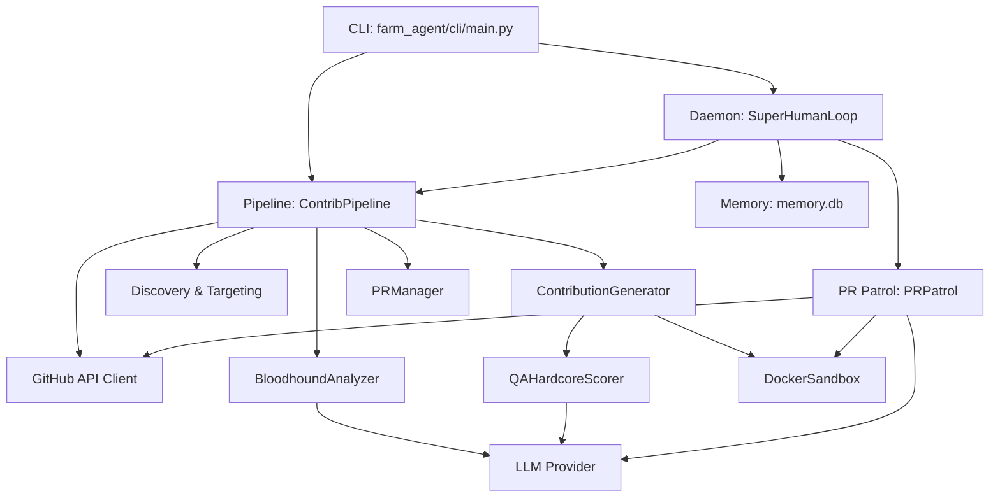

# Project Architecture Blueprint

This document provides a deep-dive architectural guide to the Farm-Agent codebase. It reflects the exact directory structure, module responsibilities, and system interactions currently present in the source.

## 1. System Overview & Tech Stack

| Technology | Role in Project |
| :--- | :--- |
| **Python (3.11+)** | Core backend language |
| **Hatchling** | Build backend (defined in `pyproject.toml`) |
| **Click & Rich** | CLI framework and rich console output (`farm_agent/cli/main.py`) |
| **Docker SDK (7.1+)** | Polyglot Sandbox for local validation of code patches (`farm_agent/core/sandbox.py`) |
| **SQLite (aiosqlite)** | Persistent state and memory database (WAL mode, `farm_agent/orchestrator/memory.py`) |
| **Pydantic** | Data validation and configuration management (`farm_agent/core/models.py`, `config.py`) |
| **HTTPX** | Async HTTP client for API interactions |
| **ChromaDB** | Ephemeral RAM-only Local RAG (Retrieval-Augmented Generation) engine |
| **LLMs** | Core reasoning (Minimax `ABAB` models and OpenRouter) (`farm_agent/llm/provider.py`) |

## 2. Directory Structure

```text
farm_agent/
├── agents/             # Agent definitions and registries
├── analysis/           # Code analysis, Bloodhound Red Team, maintainer vibe checks
├── cli/                # Command-line interface definitions
│   └── main.py         # Primary CLI entry point
├── core/               # Core configuration, models, exceptions, logging, sandbox
│   ├── config.py       # Pydantic configuration loader
│   ├── models.py       # Core data models
│   ├── memory.py       # Database schema and SQLite interactions
│   └── sandbox.py      # Docker-based Polyglot Sandbox
├── generator/          # Code generation and DEV-QA Bounty loop models
│   ├── engine.py       # Main contribution generation engine
│   └── scorer.py       # Quality QA scoring logic
├── github/             # GitHub API clients, repository discovery, security gates
├── issues/             # Issue solving components
├── llm/                # LLM provider integrations and multi-model routing
│   └── provider.py     # Minimax and OpenRouter integrations
├── notifications/      # Notification handlers (e.g. Telegram, Slack)
├── orchestrator/       # Main execution loops and memory tracking
│   ├── human.py        # SuperHumanLoop (Terminator daemon)
│   ├── memory.py       # SQLite persistent storage
│   └── pipeline.py     # Main ContribPipeline (orchestrates the whole flow)
├── plugins/            # Extensible plugin framework
├── pr/                 # Pull Request management and autonomous patrol
│   ├── manager.py      # PR creation, fork generation
│   ├── patrol.py       # Autonomous PR Patrol logic
│   └── janitor.py.DISABLED # Inactive garbage collection system
├── templates/          # Contribution templates
├── tools/              # Tooling protocol definitions
└── web/                # Web UI components (if applicable)
```

## 3. Core Module Dependency Graph



## 4. Core Execution Loops / Entry Points

1. **CLI Invocation (`farm_agent/cli/main.py`)**: Users execute commands like `farm_agent superhuman` or `farm_agent run`.
2. **Pipeline Orchestration (`farm_agent/orchestrator/pipeline.py`)**:
   - `ContribPipeline` handles the primary execution paths.
   - It discovers targets using `RepoDiscovery`.
   - Passes the target to the `BloodhoundAnalyzer` to locate vulnerabilities.
   - Forwards findings to the `ContributionGenerator`, which triggers the **DEV-QA Bounty Loop**.
   - Tests patches locally using `DockerSandbox`.
   - Delegates PR creation to `PRManager`.
3. **Super Human Mode (`farm_agent/orchestrator/human.py`)**:
   - `SuperHumanLoop` runs continuously in a `while True` loop.
   - Alternates between the pipeline Hunt process and the PR Patrol process.
   - Honors LLM rate limits and maximum PR quotas safely via SQLite concurrency checks.
4. **PR Patrol (`farm_agent/pr/patrol.py`)**:
   - Scans open Pull Requests for feedback.
   - Uses the LLM to classify feedback (e.g., Code Change, Question).
   - Generates and tests fixes, then pushes directly to the fork branch.

## 5. Database/State Schema

State is managed by an SQLite database operating in WAL mode (`memory.db`), defined in `farm_agent/orchestrator/memory.py`.

**Key Tables:**
*   `analyzed_repos`: Tracks scanned repositories to prevent duplicate processing.
*   `submitted_prs`: Logs created pull requests, states (open/merged/closed), CI retry limits, and discussion reply limits.
*   `pr_outcomes` & `repo_preferences`: Stores history and stats for the 'Familiar Grounds' logic.
*   `api_usage_log`: Used by the sliding-window mechanism to manage LLM quotas securely.
*   `target_repos`: Manages the queue for the Circular Target Loop ensuring crash-safe iterations.
*   `knowledge_base`: Caches semantic data, such as QA lessons extracted during code generation.
*   `task_schedule`: Tracks timestamps for delayed operations (like simulated human reading time).