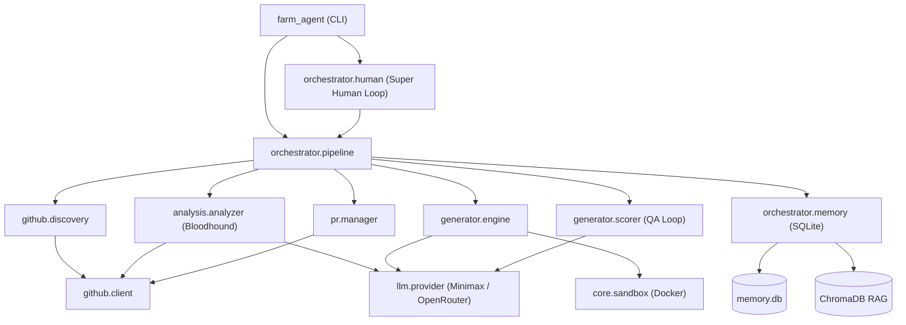

# Farm-Agent Project Blueprint

This document serves as a deep-dive architectural guide to the Farm-Agent (`farm_agent`) codebase. It mirrors the exact, implemented reality of the project framework.

## 1. System Overview & Tech Stack

Farm-Agent relies on a high-performance, resilient stack tuned for autonomous operations:

| Technology | Role / Purpose |
| ---------- | -------------- |
| **Python 3.11+** | The primary runtime orchestrating all asynchronous routines via `asyncio`. |
| **Hatchling** | Python build backend (as specified in `pyproject.toml`). |
| **Docker (DooD)** | **Polyglot Sandbox Guillotine:** Validates untrusted patches locally by mounting the host Docker socket (`/var/run/docker.sock`) into the agent's container. |
| **SQLite (aiosqlite)** | Persistent memory via `memory.db` enabling WAL mode for tracking targeted repos, past PRs, knowledge bases, and tasks. |
| **ChromaDB** | Ephemeral (RAM-only) Local Retrieval-Augmented Generation (RAG) engine for memory searches. |
| **Minimax LLM / OpenRouter** | The underlying LLM orchestrators. Minimax powers primary generation/scoring logic, while OpenRouter acts as a Red Team validator/auditor fallback. |
| **httpx** | Fast asynchronous library for connecting to the GitHub REST API. |
| **Click & Rich** | CLI argument parsing and highly stylized, readable terminal output. |

## 2. Directory Structure

The project is structured efficiently to segregate duties between the core engine, CLI, GitHub interactors, LLM plugins, and orchestration logic.

```text
.
├── Makefile                     # Helper commands (install, lint, test, docker, etc.)
├── docker-compose.yml           # DooD architecture orchestration for Superhuman mode
├── pyproject.toml               # Dependency tracking and hatchling configuration
├── farm_agent/
│   ├── cli/                     # CLI interfaces mapping to core orchestration
│   │   ├── main.py              # CLI entrypoint commands (run, superhuman, analyze, patrol)
│   │   └── tui.py               # Interactive CLI TUI
│   ├── core/                    # Engine configurations, exceptions, sandbox & middleware
│   │   ├── sandbox.py           # Docker-driven Sandbox Guillotine executing code validations
│   │   ├── config.py            # Environment-loaded pydantic-settings
│   │   ├── middleware.py        # DeerFlow pattern chains
│   │   └── exceptions.py        # Granular API error hierarchies (RateLimit, GitHubAPIError)
│   ├── orchestrator/            # High-level loop and logic flow management
│   │   ├── pipeline.py          # ContribPipeline: Coordinates discovery → analysis → PR
│   │   ├── memory.py            # SQLite state management interaction logic
│   │   └── human.py             # Super Human Mode relentless Terminator Loop logic
│   ├── generator/               # Code parsing, generation, and LLM-scoring utilities
│   │   ├── engine.py            # Fix generation routines (includes AI Gag Order filtering)
│   │   └── scorer.py            # DEV-QA loop QAHardcoreScorer for code quality assertions
│   ├── github/                  # External GitHub API boundaries
│   │   ├── client.py            # Raw asynchronous HTTP interactions with GitHub
│   │   └── discovery.py         # Repository discovery engines
│   ├── pr/                      # Handling Pull Request lifecycles and interactions
│   │   ├── manager.py           # PR forks, branch creating, commits
│   │   ├── patrol.py            # PR Patrol logic parsing maintainer comments for auto-fixes
│   │   └── janitor.py.DISABLED  # (Non-functional) PR cleanup routines
│   ├── llm/                     # Model integration endpoints
│   ├── issues/                  # Issue solving sub-components
│   └── plugins/                 # Extensible tool logic
└── tests/                       # Synchronous and async Pytest unit tests
```

## 3. Core Module Dependency Graph



## 4. Core Execution Loops / Entry Points

Farm-Agent is driven largely by multi-stage loops. These operate independently depending on the command executed from `farm_agent/cli/main.py`.

### A. Hunt / Pipeline Loop (`farm_agent run` / `farm_agent hunt`)
1. **Discovery:** Discovers candidate repos based on language and star configurations via the GitHub API (`github.discovery`).
2. **Analysis / Bloodhound Scan:** Before engaging heavy LLMs, repositories are scanned using fast static tools like `ast-grep`/`Semgrep`.
3. **Anti-Farming Gatekeeper:** Scraps findings related to purely cosmetic changes (docs, typo, unused imports) to prevent farming violations.
4. **DEV-QA Bounty Loop:** The engine attempts to generate a code patch (`generator.engine`). The output is scored against `generator.scorer`. If it fails the threshold, the failure context is injected back as a QA lesson for a retry (up to 3 cycles).
5. **Polyglot Sandbox Guillotine:** Validated LLM code is sent to an ephemeral Docker container mimicking the environment. If compilation/tests fail, it triggers self-correction.
6. **PR Creation:** The fix is committed to a fork, and a PR is filed via `pr.manager`.

### B. Super Human Loop (`farm_agent superhuman`)
- This is the **Terminator Execution Loop**.
- Bypasses traditional human delay simulations. Runs 24/7 maximizing daily throughput until daily rate limits or PR caps are reached.
- Periodically interleaves standard code generation with PR Patrol scans (`farm_agent/pr/patrol.py`).

### C. Circular Target Loop (`farm_agent hunt-circular`)
- Reads from a static file `target_repo.json`.
- Safely processes one target per invocation, updating the `scanned_at` timestamp immediately before making GitHub API calls to remain entirely crash-safe.

### D. PR Patrol Loop
- Queries the SQLite database for open PRs authored by the agent.
- Polls the GitHub API for maintainer review comments.
- Analyzes the tone/sentiment of comments. Generates inline code patches or written responses dynamically based on those reviews, pushing the commits straight to the branch.

## 5. Database/State Schema (`memory.db`)

Farm-Agent relies heavily on `aiosqlite` connected to `memory.db` for avoiding repetition and rate limits. Important tables include:

- `analyzed_repos`: Records repositories previously scanned to prevent redundant polling.
- `submitted_prs`: Logs successful submissions, including PR Number, URL, Title, and Fork metadata, allowing `PR Patrol` to map active engagements.
- `findings_cache`: Caches vulnerability detections and analysis results.
- `run_log`: Standard logging table detailing daily quota tracking.
- `repo_preferences`: Memory storage mapping repository behaviors or 'vibes' to alter Agent interaction tones.
- `knowledge_base`: Stores the results of specific DEV-QA feedback loops. Allows the agent to look up previous failed PRs to learn not to repeat semantic mistakes on a per-repo basis.
