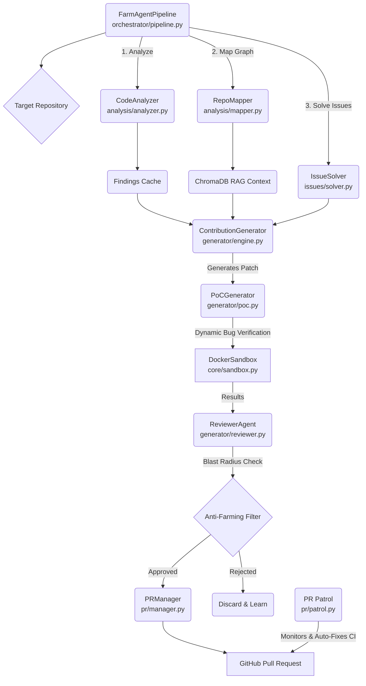

# 🗺️ Agent-Farm (v4.0.0) Architecture Blueprint

This document serves as a deep-dive architectural guide to the inner workings of Agent-Farm v4.0.0. It maps out the exact state of the project, including module responsibilities, tech stack applications, data models, and the core execution loops that govern autonomous behavior.

---

## 1. System Overview & Tech Stack

Agent-Farm leverages a diverse and powerful technology stack to enable deep codebase analysis, secure sandbox execution, and autonomous decision-making.

| Component | Technology | Primary Role / Description |
| :--- | :--- | :--- |
| **Core Framework** | Python >= 3.11 | The foundation of the orchestration layer and all agent logic. |
| **Containerization** | Docker >= 7.1 | Powers the `DockerSandbox` for isolated bug validation, PoC execution, and testing. |
| **Dependency Manager** | Hatchling | Used as the build backend and project manager (via `pyproject.toml`). |
| **Configuration** | Pydantic / Pydantic-Settings | Enforces strict typed validation for `.env` configurations and core data models. |
| **Persistence** | SQLite (`aiosqlite`) | Maintains persistent state across runs (repos, PRs, findings) operating in WAL mode. |
| **Vector Database** | ChromaDB | Backs the **Omniscient Context Engine** RAG system, semantic-chunking markdown files. |
| **HTTP Clients** | `httpx` | Handles asynchronous web requests for GitHub API integration. |
| **Git Integration** | `gitpython` | Facilitates local repository cloning, branch management, and patch application. |
| **CLI Framework** | Click | Drives the command-line interface suite (`farm_agent` commands). |
| **Code Structure** | AST Parsing & Regex | Used to generate the Subsystem Dependency Graphs by mapping module imports/calls. |
| **Formatting** | Ruff | Enforces strict code style rules (100-character line limit) globally. |
| **Language Models** | OpenRouter, Minimax, Gemini, DeepSeek | Provide logic capabilities (DeepSeek: Generation/PoCs, Qwen: L1 Appraisal, Gemini: L2 Audit). |

---

## 2. Directory Structure

Below is the annotated directory structure for the workspace, identifying the responsibilities of each module (ignoring trivial metadata files).

```text
.
├── Dockerfile                          # Stage 1 builder (wheel creation) + Stage 2 lean runtime v4.0.0
├── docker-compose.yml                  # agent-farm service definition with volumes (data/, logs/, secret_findings/)
├── start.sh                            # Unix quick start wrapper script
├── start.bat                           # Windows quick start wrapper script
├── pyproject.toml                      # Project metadata and Hatchling build configuration
├── requirements.txt                    # Project requirements specifications
├── app_current.txt                     # FastAPI internal state routing references
├── Makefile                            # Build automation targets (install, test, lint, docker)
├── farm_agent/                         # Core Python package root
│   ├── __init__.py
│   ├── cli/
│   │   └── main.py                     # Click CLI — houses all command registrations (e.g., run, superhuman, patrol)
│   ├── core/
│   │   ├── config.py                   # Pydantic v2 config and YAML loading
│   │   ├── daily_log.py                # Formats daily markdown activity logs
│   │   ├── exceptions.py               # Custom hierarchy of system exception types
│   │   ├── leaderboard.py              # Repository contribution and success metrics leaderboards
│   │   ├── logger.py                   # File rotation logging implementation
│   │   ├── middleware.py               # Context middleware chain configurations
│   │   ├── models.py                   # Global Pydantic data schemas defining core entities
│   │   ├── notifier.py                 # Multi-channel push notification alerts (Telegram, Slack, Discord)
│   │   ├── profiles.py                 # Execution presets (thorough, standard, quick)
│   │   ├── quotas.py                   # Usage quota trackers for LLM rate-limiting
│   │   ├── rag.py                      # ChromaDB vector implementations (markdown parsing and semantic chunking)
│   │   ├── retry.py                    # Resilience logic wrapping HTTP/LLM service interactions
│   │   └── sandbox.py                  # DockerSandbox engine (Polyglot execution environments, PoC isolated tests)
│   ├── analysis/
│   │   ├── analyzer.py                 # CodeAnalyzer: Orchestrates security, quality, and UX scans (Bloodhound)
│   │   └── mapper.py                   # RepoMapper: AST & RegEx-driven subsystem dependency graph generators
│   ├── generator/
│   │   ├── engine.py                   # ContributionGenerator: Implements patches based on generated fixes
│   │   ├── poc.py                      # PoCGenerator: Orchestrates Dynamic Bug Verification
│   │   ├── reviewer.py                 # ReviewerAgent: Validates blast-radius and regression consequences
│   │   └── scorer.py                   # Hardcore QA scoring evaluations
│   ├── github/
│   │   ├── client.py                   # Asynchronous interface for GitHub REST/GraphQL endpoints
│   │   ├── discovery.py                # Identifies target repositories via network crawls and searches
│   │   ├── guidelines.py               # Ingests repository contributing norms, subsystem docs, and PR templates
│   │   └── security_gate.py            # Determines protocols for private vulnerability disclosures
│   ├── issues/
│   │   └── solver.py                   # IssueSolver: Cross-file context engine for addressing active repository issues
│   ├── llm/
│   │   ├── agents.py                   # Persona assignments and prompt engineering for LLM instances
│   │   ├── context.py                  # Orchestrates contextual system instructions for LLM generators
│   │   ├── models.py                   # Model registry and metadata definitions (e.g., costs, limits)
│   │   ├── provider.py                 # Integrates external LLM network providers (e.g., OpenRouter)
│   │   └── router.py                   # Intelligent model router for tasks and cost efficiency
│   ├── orchestrator/
│   │   ├── memory.py                   # SQLite datastore interface governing persistent memory state
│   │   ├── pipeline.py                 # Core contribution pipeline orchestration (Standard & Circular variants)
│   │   └── human.py                    # Implementation of `Terminator Mode` (`SuperHumanLoop`)
│   ├── pr/
│   │   ├── manager.py                  # Handles GitHub PR operations (Forking, Committing, Pushing, PR Open)
│   │   └── patrol.py                   # PR Patrol engine: Interacts with code reviewers and drives CI auto-fixes
│   ├── plugins/                        # Extendable system plugin logic
│   ├── templates/                      # Baseline project scaffolding configuration files
│   └── tools/
│       └── protocol.py                 # Interfaces standard protocols used by CLI and Sub-Agents
└── tests/                              # Comprehensive pytest suite testing unit boundaries
```

---

## 3. Core Module Dependency Graph

This `mermaid` diagram illustrates the high-level data flow and interaction pathways of the primary autonomous contribution pipeline orchestrated by `FarmAgentPipeline`.



---

## 4. Core Execution Loops

### The `FarmAgentPipeline` Standard Loop
Found in `farm_agent/orchestrator/pipeline.py`, this is the heart of a single execution flow:
1. **Intake:** Configures context limits, parses language configurations, and prepares GitHub instances.
2. **Analysis:** Executes `CodeAnalyzer` to run Bloodhound Red Team logic finding anomalies or vulnerabilities.
3. **Drafting:** `ContributionGenerator` uses insights (assisted by `RepoMapper` dependency maps and `rag.py` document index chunks) to prepare FileChange patches.
4. **Validation:** `PoCGenerator` verifies the logic. The `DockerSandbox` runs efficacy (patch solves bug) and regression (patch doesn't break tests) passes.
5. **Quality Control:** Findings are filtered through Layer 1 & 2 Auditors (`Anti-Farming Filter`) blocking generic/dead-code patches.
6. **Delivery:** Approved findings enter `PRManager` to manage the Git logistics, branch creation, and PR execution.

### Terminator Mode (`SuperHumanLoop`)
Found in `farm_agent/orchestrator/human.py`, the `farm_agent superhuman` command initiates this continuous loop:
- Eliminates standard artificial delays (relentless execution).
- Pulls deterministically from the SQLite `target_repos` cache rather than relying heavily on stochastics.
- Integrates `PR Patrol` inline to heal active PR CI-failures immediately.

### Issue-First Pipeline
Found in `farm_agent/issues/solver.py`:
- Parses open GitHub issues instead of broad code-scanning.
- Classifies issue intents (Bug, Feature, Security).
- Develops an architectural plan via AST context mappings before drafting multi-file modifications to resolve complex user-reported tickets.

---

## 5. Database & State Schema (`memory.db`)

The Agent-Farm project employs a locally stored SQLite Database in WAL (Write-Ahead Logging) mode, mapped and interfaced inside `farm_agent/orchestrator/memory.py`.

**Core Tables & Responsibilities:**

* **`analyzed_repos`**: Tracks repositories that have already been audited.
  * Columns: `full_name` (PK), `language`, `stars`, `analyzed_at`, `findings`, `metadata`.
* **`submitted_prs`**: Keeps an exact log of agent-created Pull Requests and active limits.
  * Columns: `id` (PK), `repo`, `pr_number`, `pr_url`, `title`, `type`, `status`, `branch`, `fork`, `ci_fix_attempts`.
* **`pr_outcomes`**: Stores post-mortem PR states (Merged/Closed) to train repository preferences.
  * Columns: `id` (PK), `repo`, `pr_number`, `pr_type`, `outcome`, `feedback`.
* **`repo_preferences`**: A learned matrix determining which projects accept what patch types.
  * Columns: `repo` (PK), `preferred_types`, `rejected_types`, `merge_rate`.
* **`findings_cache`**: Temporary cache storing identified actionable anomalies prior to PR creation.
  * Columns: `id` (PK), `repo`, `type`, `severity`, `title`, `file_path`, `status`.
* **`target_repos`**: The deterministic circular queue leveraged heavily by the Terminator Mode loop.
  * Columns: `repo_url` (PK), `status`, `language`, `diamond_target`.
* **`run_log`**: Historical tracking of global pipeline runtime performance.
  * Columns: `id` (PK), `started_at`, `finished_at`, `repos_analyzed`, `prs_created`, `errors`.
* **`knowledge_base`**: Stores internal learning structures, filtered rejection rationale, and architectural contexts.
  * Columns: `repo_name`, `entry_type`, `content`.
* **`api_usage_log`**: Detailed cost center metrics identifying LLM token allocation and provider API calls.
* **`blacklisted_repos`**: A ban-list of repositories identified as having hostile maintainers or impossible PR structures.

*Composite indices (e.g., `idx_api_usage` on `(provider, timestamp)`) are enforced to optimize database operations during high-velocity pipelines.*
