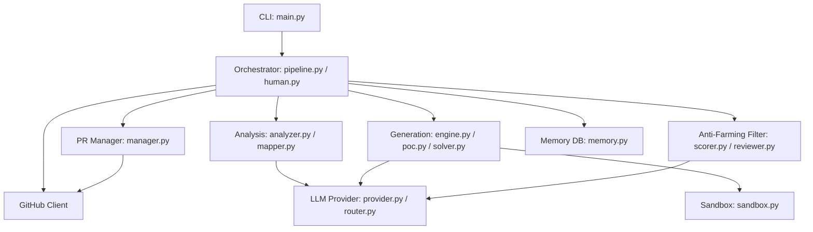

# PROJECT_MAP.md — Agent-Farm Architecture Blueprint

**Version:** v4.0.0 — Omniscient Context Engine  
**Entry Point:** `farm_agent/cli/main.py` → `cli()` (Click-based CLI)  
**Language:** Python 3.11+  

---

## 1. System Overview & Tech Stack

Agent-Farm is an autonomous AI agent system designed to crawl open-source GitHub repositories, pinpoint security vulnerabilities, solve issues, and generate precise patches. It validates fixes dynamically in isolated Docker sandboxes (Dynamic Bug Verification) and performs rigorous Blast Radius & Regression Auditing. It uses a dual-layer Anti-Farming Filter (Qwen and Gemini) to block trivial PRs.

| Component | Technology / Detail |
|-----------|-------------------|
| **Language** | Python 3.11+ |
| **HTTP client** | `httpx` (async) |
| **Primary Code Gen LLM** | `deepseek/deepseek-v4-pro` (via OpenRouter) |
| **Red Team (Bloodhound)** | `deepseek/deepseek-v4-flash` (via OpenRouter) |
| **Layer 1 Appraiser** | `qwen/qwen3.7-max` (via OpenRouter) |
| **Layer 2 Supreme Auditor** | `google/gemini-3.5-flash` (via OpenRouter) |
| **Semgrep rulesets** | `p/security-audit`, `p/cwe-top-25`, `p/default`, `p/golang`, `p/rust`, `p/smart-contracts` |
| **Database** | SQLite (`aiosqlite`) — WAL mode, fallback to DELETE |
| **Docker Sandbox** | `docker>=7.1` — Network + capability isolation |
| **Configuration** | Pydantic v2 + YAML + `.env` |
| **CLI Framework** | `click>=8.1` + `rich>=13.0` |
| **Vector DB (RAG)** | `chromadb>=0.4` — Semantic markdown chunking for codebase mapping |
| **Notifications** | Telegram, Slack, Discord |

---

## 2. Directory Structure

```text
.                                       # Workspace Root (v4.0.0)
├── Dockerfile                          # Stage 1 builder (wheel creation) + Stage 2 lean runtime v4.0.0
├── docker-compose.yml                  # agent-farm service definition with volumes (data/, logs/, secret_findings/)
├── start.sh                            # Unix quick start wrapper script
├── start.bat                           # Windows quick start wrapper script
│
├── farm_agent/                         # Package root (version = "4.0.0")
│   ├── __init__.py
│   │
│   ├── cli/
│   │   └── main.py                     # Click CLI — command registrations
│   │
│   ├── core/
│   │   ├── config.py                   # Pydantic v2 config and YAML loading
│   │   ├── daily_log.py                # Formats daily markdown activity logs
│   │   ├── exceptions.py               # System exception types hierarchy
│   │   ├── leaderboard.py              # Leaderboard stat collections
│   │   ├── logger.py                   # Rotating file logging system setup
│   │   ├── middleware.py               # Context middleware chain layers
│   │   ├── models.py                   # Core Pydantic data structures definitions
│   │   ├── notifier.py                 # Telegram notifications integration
│   │   ├── profiles.py                 # Thorough, quick, and standard run configurations
│   │   ├── quotas.py                   # OpenRouter usage quota controllers
│   │   ├── rag.py                      # ChromaDB vector DB context loaders (with semantic markdown header chunking)
│   │   ├── retry.py                    # Retry decorators for GitHub/LLM interfaces
│   │   └── sandbox.py                  # DockerSandbox engine with Polyglot Guillotine, PoC execution context mapping
│   │
│   ├── analysis/
│   │   ├── analyzer.py                 # CodeAnalyzer (parallelized security, quality, UX scanners) & BloodhoundAnalyzer
│   │   └── mapper.py                   # RepoMapper (AST/regex dependency graphing)
│   │
│   ├── generator/
│   │   ├── engine.py                   # ContributionGenerator (Patch and file correction)
│   │   ├── poc.py                      # PoCGenerator (PoC validation & LLM evaluation)
│   │   ├── reviewer.py                 # ReviewerAgent (Self-reflective code auditor with Blast Radius checks)
│   │   └── scorer.py                   # QAHardcoreScorer (Qwen-based QA grader)
│   │
│   ├── github/
│   │   ├── client.py                   # Async-retrying GitHub REST and GraphQL Client
│   │   ├── discovery.py                # Target network search and crawler discoverers
│   │   ├── guidelines.py               # Guidelines, PR templates, and subsystem doc discovery
│   │   └── security_gate.py            # Identifies private security disclosure files
│   │
│   ├── issues/
│   │   └── solver.py                   # IssueSolver (solves issues, multi-file deep planner)
│   │
│   ├── llm/
│   │   ├── agents.py                   # LLM agent prompts and routing models
│   │   ├── context.py                  # Generator system instruction builders
│   │   ├── models.py                   # Model registry definitions
│   │   ├── provider.py                 # OpenRouter integration handlers
│   │   └── router.py                   # Task router mapping
│   │
│   ├── orchestrator/
│   │   ├── memory.py                   # Persistence memory sqlite connection interface
│   │   ├── pipeline.py                 # Pipeline (Standard & Circular pipelines implementation)
│   │   └── human.py                    # SuperHumanLoop relentless daily scheduler
│   │
│   ├── pr/
│   │   ├── manager.py                  # Pull Request manager (forking, branches, commits)
│   │   └── patrol.py                   # PR Patrol (reviews comments, fixes CI errors)
│   │
│   ├── plugins/
│   │   └── __init__.py
│   ├── templates/
│   │   ├── builtin/
│   │   └── registry.py
│   ├── notifications/
│   │   └── notifier.py
│   ├── agents/
│   │   └── registry.py                 # Task agent configurations
│   │
│   └── tools/
│       └── protocol.py                 # CLI tool protocols
```

---

## 3. Core Module Dependency Graph



---

## 4. Core Execution Loops / Entry Points

**Primary Entry Point:** `farm_agent/cli/main.py` executing CLI commands via Click.

**1. Terminator Mode (SuperHumanLoop):**
- Invoked via `farm_agent superhuman`.
- Pulls targets exclusively from the SQLite `target_repos` table in a relentless, continuous loop.
- It interleaves new target analysis/hunting with the PR Patrol routine.

**2. Target Discovery and Pipeline Execution:**
- Managed by `FarmAgentPipeline` in `farm_agent/orchestrator/pipeline.py`.
- **Phase 1: Reconnaissance.** Analyzes codebase, discovers documentation via RAG (`rag.py`), and builds AST call graphs (`mapper.py`).
- **Phase 2: Bug Hunting & Issue Solving.** Either searches for vulnerabilities using Bloodhound Red Team, or targets specific open issues via `IssueSolver`.
- **Phase 3: Validation.** Generates a patch and a Proof-of-Concept. Executes the PoC and native test suites inside `DockerSandbox` (`sandbox.py`) to guarantee the bug is fixed with zero regressions.
- **Phase 4: Filtering.** `QAHardcoreScorer` (Layer 1 Qwen) and Supreme Auditor (Layer 2 Gemini) evaluate the patch. Strict blocks on documentation or trivial formatting fixes.
- **Phase 5: Submission.** Submits the code as a Pull Request (via `manager.py`) or as a private security disclosure.

**3. PR Patrol:**
- Invoked via `farm_agent patrol` or inside the Terminator loop.
- Checks open PRs for maintainer comments or CI test failures.
- Automatically generates CI fixes using the LLM and pushes new commits to the existing branch.

---

## 5. Database/State Schema

Agent-Farm utilizes an `aiosqlite` database (`data/memory.db`) in WAL mode.

*   **`analyzed_repos`**: Tracks repositories that have already been scanned to avoid duplicate work.
*   **`submitted_prs`**: Logs bot-created PRs, linking `repo`, `pr_number`, `title`, and `status`. Used to check limits and route PR Patrol.
*   **`findings_cache`**: Caches code findings discovered during analysis.
*   **`run_log`**: Records pipeline runs, metrics, and durations.
*   **`pr_outcomes`**: Tracks merged/closed PR states and maintainer review remarks.
*   **`repo_preferences`**: Learned project contribution preferences updated dynamically based on past outcomes.
*   **`blacklisted_repos`**: Projects blocked due to hostile maintainer checks or pipeline failures.
*   **`api_usage_log`**: Logs LLM API usage with a composite index on `(provider, timestamp)` for quota checking.
*   **`task_schedule`**: Persistent schedule queue for tasks.
*   **`knowledge_base`**: Stores lessons, past critiques, and architectural context mappings for RAG retrieval.
*   **`target_repos`**: Deterministic circular target queue utilized by Terminator mode (`SuperHumanLoop`).
*   **`repo_style_guides`**: Caches contributing templates, PR templates, and formatting preferences.
