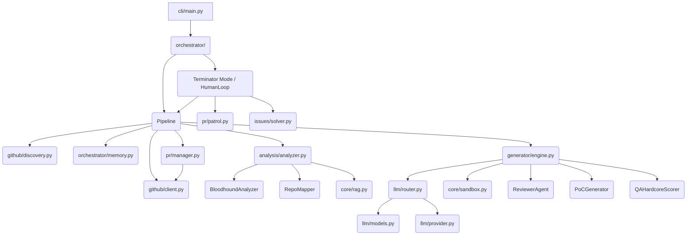

# Agent-Farm Architecture Blueprint (v4.0.0)

This document provides a deep dive into the underlying architecture of Agent-Farm, mapping out the main systems, file structure, component dependencies, logic flows, and database schema.

## 1. System Overview & Tech Stack

Agent-Farm is built on a modern, asynchronous Python stack leveraging advanced LLMs and secure containerization to automate open-source contributions.

| Technology | Role in Project |
| :--- | :--- |
| **Python 3.11+** | Core programming language. |
| **Docker 7.1+** | Used for environment isolation (Dynamic Bug Verification) and the overall daemon execution. Networks: `internet_access` (bridge) & `sandbox_isolated` (internal). |
| **Hatchling** | Build backend and project metadata management (`pyproject.toml`). |
| **Pydantic / Pydantic-Settings** | Configuration management (`core/config.py`) and strict typed data structures (`core/models.py`). |
| **Click & Rich** | CLI framework (`cli/main.py`) providing a feature-rich console interface. |
| **ChromaDB** | Vector database for the Omniscient Context Engine / RAG capabilities, enabling semantic header-based chunking of documentation (`core/rag.py`). |
| **SQLite (aiosqlite)** | Persistent memory database (`orchestrator/memory.py`) managing state for targets, PR outcomes, learning context, and API logs using WAL mode. |
| **OpenRouter & Fallbacks** | Primary access portal to advanced LLMs (`llm/provider.py`) like DeepSeek, Qwen (QA Scoring), and Gemini (Supreme Audit). Falls back to Minimax M2.7. |
| **GitPython** | Manages local repository state for analysis and PR preparation (`pr/manager.py`). |
| **HTTPX** | Asynchronous HTTP client for interacting with the GitHub API (REST & GraphQL) (`github/client.py`). |
| **PyYAML** | Configuration loading (`config.example.yaml`). |

## 2. Directory Structure

This structure highlights the active, core logic modules of the v4.0.0 architecture.

```text
.                                       # Workspace Root (v4.0.0)
├── Dockerfile                          # Stage 1 builder + Stage 2 lean runtime
├── docker-compose.yml                  # agent-farm service definition with volumes (data/, logs/, secret_findings/)
├── start.sh                            # Unix quick start wrapper script
├── start.bat                           # Windows quick start wrapper script
├── pyproject.toml                      # Hatchling build backend and project configuration
├── requirements.txt                    # Core project dependencies
│
├── farm_agent/                         # Package root (version = "4.0.0")
│   ├── __init__.py
│   │
│   ├── cli/
│   │   └── main.py                     # Click CLI — command registrations
│   │
│   ├── core/
│   │   ├── config.py                   # Pydantic v2 config and YAML loading
│   │   ├── daily_log.py                # Formats daily markdown activity logs
│   │   ├── exceptions.py               # System exception types hierarchy
│   │   ├── leaderboard.py              # Leaderboard stat collections
│   │   ├── logger.py                   # Rotating file logging system setup
│   │   ├── middleware.py               # Context middleware chain layers
│   │   ├── models.py                   # Core Pydantic data structures definitions
│   │   ├── notifier.py                 # Telegram notifications integration
│   │   ├── profiles.py                 # Thorough, quick, and standard run configurations
│   │   ├── quotas.py                   # OpenRouter usage quota controllers
│   │   ├── rag.py                      # ChromaDB vector DB context loaders (with semantic markdown header chunking)
│   │   ├── retry.py                    # Retry decorators for GitHub/LLM interfaces
│   │   └── sandbox.py                  # DockerSandbox engine with Polyglot Guillotine, PoC execution context mapping
│   │
│   ├── analysis/
│   │   ├── analyzer.py                 # CodeAnalyzer (parallelized security, quality, UX scanners) & BloodhoundAnalyzer
│   │   └── mapper.py                   # RepoMapper (AST/regex dependency graphing)
│   │
│   ├── generator/
│   │   ├── engine.py                   # ContributionGenerator (Patch and file correction)
│   │   ├── poc.py                      # PoCGenerator (PoC validation & LLM evaluation)
│   │   ├── reviewer.py                 # ReviewerAgent (Self-reflective code auditor with Blast Radius checks)
│   │   └── scorer.py                   # QAHardcoreScorer (Qwen-based QA grader)
│   │
│   ├── github/
│   │   ├── client.py                   # Async-retrying GitHub REST and GraphQL Client
│   │   ├── discovery.py                # Target network search and crawler discoverers
│   │   ├── guidelines.py               # Guidelines, PR templates, and subsystem doc discovery
│   │   └── security_gate.py            # Identifies private security disclosure files
│   │
│   ├── issues/
│   │   └── solver.py                   # IssueSolver (solves issues, multi-file deep planner)
│   │
│   ├── llm/
│   │   ├── agents.py                   # LLM agent prompts and routing models
│   │   ├── context.py                  # Generator system instruction builders
│   │   ├── models.py                   # Model registry definitions
│   │   ├── provider.py                 # OpenRouter integration handlers
│   │   └── router.py                   # Task router mapping
│   │
│   ├── notifications/
│   │   └── notifier.py                 # Multi-channel notification dispatcher
│   │
│   ├── orchestrator/
│   │   ├── human.py                    # Terminator Mode relentless daily scheduler
│   │   ├── memory.py                   # Persistence memory sqlite connection interface
│   │   └── pipeline.py                 # Pipeline (Standard & Circular pipelines implementation)
│   │
│   ├── plugins/                        # Extensible plugin architecture hooks
│   │
│   ├── pr/
│   │   ├── manager.py                  # Pull Request manager (forking, branches, commits)
│   │   └── patrol.py                   # PR Patrol (reviews comments, fixes CI errors)
│   │
│   ├── templates/                      # Boilerplate structures and styles
│   │   ├── builtin/
│   │   └── registry.py
│   │
│   └── tools/
│       └── protocol.py                 # CLI tool protocols
```

## 3. Core Module Dependency Graph



## 4. Core Execution Loops / Entry Points

### Terminator Mode (`farm_agent superhuman`)
1. **Initialization:** Driven by `farm_agent/orchestrator/human.py`. Seeds the internal loop pulling targets deterministically from `target_repos` table in the SQLite Database.
2. **Execution Loop:**
   - Evaluates Token Pools and API limits.
   - Rotates through pending targets executing the `FarmAgentPipeline`.
   - Engages `pr/patrol.py` to review external comments and handle PR updates (including fixing CI errors).
   - Utilizes `issues/solver.py` for issue-first contributions.
3. **Pipeline Flow (`farm_agent/orchestrator/pipeline.py`):**
   - **Target Acquisition:** Syncs fork via `GitHubClient`.
   - **Analysis:** `CodeAnalyzer` maps dependencies, reads documentation (via RAG ChromaDB chunks), and detects flaws (using the Bloodhound Red Team / Semgrep logic).
   - **Generation:** `ContributionGenerator` dispatches LLM tasks via the `TaskRouter`.
   - **Validation:** Generated code executes inside `DockerSandbox` for isolated validation, and evaluated by `QAHardcoreScorer`.
   - **Submission:** If validations pass the Anti-Farming Filter and Blast Radius checks, `PRManager` commits the changes and opens a PR.

## 5. Database/State Schema

Agent-Farm leverages an SQLite database (configured for Write-Ahead Logging/WAL) located via `memory.db` to maintain persistent state.

- **`analyzed_repos`**: Tracks repositories that have undergone analysis (saves repetitive scans).
- **`submitted_prs`**: Logs bot-created PRs/issues, tracking their status (open, merged, closed), and limits counters. (Unique constraints on `repo` and `pr_number`).
- **`findings_cache`**: Temporarily caches detected code anomalies pending contribution generation.
- **`run_log`**: Records aggregate run metrics (durations, PR counts, findings).
- **`pr_outcomes`**: Stores merged/closed state details and maintainer remarks, feeding into the learning systems.
- **`repo_preferences`**: Dynamic state updating learned preferences (preferred/rejected contribution types) from historical outcomes.
- **`blacklisted_repos`**: Blocks processing for projects deemed hostile or failing continuously.
- **`api_usage_log`**: Detailed metrics on LLM API usage, essential for token rotation and rate limiting.
- **`task_schedule`**: Persistent queue managing future actions for the SuperHumanLoop.
- **`knowledge_base`**: Central repository for learned lessons, architectural context mappings, and historical critiques.
- **`target_repos`**: The primary deterministic circular queue driving Terminator mode executions.
- **`repo_style_guides`**: Caches and updates contributing guidelines and format profiles per target repository.
