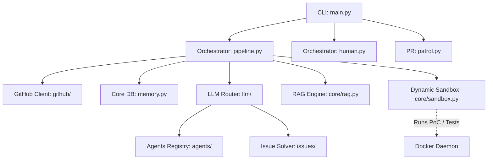

# PROJECT_MAP.md — Agent-Farm Architectural Blueprint

This document serves as the ground-truth technical and architectural blueprint for **Agent-Farm** (v4.0.0).

---

## 1. System Overview & Tech Stack

Agent-Farm is an autonomous system that discovers GitHub repositories, analyzes them for vulnerabilities or bugs, generates patches, and dynamically validates those fixes via isolated Docker sandboxes before submitting pull requests.

| Component | Technology / Role |
| --- | --- |
| **Language** | Python 3.11+ |
| **Build System** | Hatchling (`pyproject.toml`) |
| **Database/State** | SQLite (`aiosqlite`) – manages memory, targets, PR history |
| **LLM Orchestration** | DeepSeek (Core Code Gen), Qwen (Layer 1 Filter), Gemini (Layer 2 Audit), OpenRouter |
| **Sandbox Execution** | Docker Engine (`docker>=7.1`) – fully isolated container verification (`sandbox_isolated` internal network) |
| **Security Auditing** | Semgrep (`Red Team Bloodhound`), AST-grep |
| **Configuration** | Pydantic Settings, PyYAML, `.env` |
| **CLI & Output** | Click, Rich |
| **Git Interactions** | GitPython |
| **Retrieval-Augmented Gen**| ChromaDB (Omniscient Context Engine) |

---

## 2. Directory Structure

```text
.
├── Makefile                # Core build/test/lint targets
├── PROJECT_MAP.md          # This architecture document
├── README.md               # Main project documentation
├── docker-compose.yml      # Defines `agent-farm` service and isolated sandbox networks
├── pyproject.toml          # Hatchling build backend and project configuration
├── requirements.txt        # Base dependencies (`docker`, dev tools)
├── start.bat / start.sh    # 1-Click Desktop Docker launchers
└── farm_agent/             # Core Package Root
    ├── cli/                # Command Line Interface entry points
    │   └── main.py         # Defines click commands: `run`, `superhuman`, `patrol`, etc.
    ├── agents/             # Agent definitions & base execution patterns
    │   └── registry.py     # SubAgent protocol and AgentRegistry
    ├── analysis/           # Codebase parsing and Red Team (Semgrep) tooling
    ├── core/               # Shared system components and utilities
    │   ├── logger.py       # Rich-based logging system
    │   ├── rag.py          # Omniscient Context Engine via ChromaDB
    │   ├── sandbox.py      # Docker execution environment and Dynamic Verification
    │   ├── exceptions.py   # Custom exception classes
    │   ├── leaderboard.py  # Tracks PR outcomes and success metrics
    │   └── middleware.py   # Request/response interceptors
    ├── generator/          # Code patch generation models and logics
    ├── github/             # GitHub API client and token rotation
    ├── issues/             # Issue-First Pipeline logic
    │   └── solver.py       # Proposes fixes for specific open GitHub issues
    ├── llm/                # Language Model routing, context, and prompts
    │   ├── provider.py     # Base interfaces for LLM interaction
    │   ├── router.py       # Task-based routing to appropriate LLMs (Qwen, Gemini, DeepSeek)
    │   └── models.py       # Definitions for TaskType, ModelTier, ModelSpec
    ├── notifications/      # Webhook handling (Slack, Discord, Telegram)
    │   └── notifier.py     # Base notifier implementations
    ├── orchestrator/       # Central control flow logic
    │   ├── pipeline.py     # Main `FarmAgentPipeline` executing the end-to-end contribution flow
    │   ├── memory.py       # `aiosqlite` interactions to track execution and system state
    │   └── human.py        # Terminator Mode loop (`SuperHumanLoop`)
    ├── plugins/            # Extensible plugins
    ├── pr/                 # Pull Request management and Post-submission actions
    │   └── patrol.py       # CI fixing and PR comment handling
    ├── templates/          # Prompt templates and scaffolding files
    └── tools/              # Available tools and self-correction utilities
```

---

## 3. Core Module Dependency Graph



---

## 4. Core Execution Loops / Entry Points

1. **Target Identification & Cloning (`run` or `superhuman`)**:
   - The CLI triggers the `FarmAgentPipeline`.
   - The system queries `memory.db` (via `memory.py`) to fetch a target repository or accepts a manual input.
   - The repository is cloned via GitPython into a temporary directory.

2. **Analysis & RAG Ingestion**:
   - The **Omniscient Context Engine** (`core/rag.py`) reads the codebase, parses markdown and code files, and chunks them semantically into ChromaDB.
   - **Bloodhound Red Team** runs Semgrep/AST-grep to discover preliminary findings.

3. **Two-Layer Anti-Farming Filter**:
   - **Gate 1 (Layer 1 Appraisal)**: Qwen 3.7 Max evaluates initial findings. Trivial/documentation issues are rejected.
   - **Gate 2 (Layer 2 Supreme Audit)**: Gemini 3.5 Flash reviews approved targets to ensure the code affected is active and the contribution adds real-world value.

4. **Dynamic Bug Verification & Patch Generation**:
   - A Proof-of-Concept (PoC) exploit or minimal reproduction script is generated (DeepSeek v4 Pro).
   - The PoC is executed in a highly isolated Docker container (`core/sandbox.py`) using the `sandbox_isolated` internal network.
   - If the PoC confirms the bug, the system generates a patch.
   - The test suite is re-run (Blast Radius & Regression Audit) to confirm the patch fixes the issue without introducing new errors.

5. **PR Submission & Patrol**:
   - The patch is committed and pushed via the GitHub client.
   - A descriptive PR is submitted.
   - The **PR Patrol** (`pr/patrol.py`) subsequently monitors the PR. If CI fails, the system pulls the logs, generates a new fix, and commits it.

---

## 5. Database / State Schema

The Agent-Farm project utilizes a local SQLite database (`memory.db`), heavily managed by `farm_agent/orchestrator/memory.py`. Key schemas include:

- **`analyzed_repos`**: Tracks repositories that have been fully scanned to prevent duplicate work.
- **`submitted_prs`**: Logs created pull requests, their status (`open`, `merged`, `closed`), type, and URLs.
- **`target_repos`**: A pool of available target repositories that `Terminator Mode` (SuperHumanLoop) pulls from sequentially.
- **`findings_cache`**: Caches AST-grep and Semgrep vulnerabilities.
- **`run_logs`**: Tracks historical execution runs, limits, and quotas.
- **`knowledge_base` / `style_guides`**: Stores learned insights about specific repos (e.g., maintainer vibe, specific coding conventions).
- **`blacklisted_repos`**: Repositories flagged for exclusion (e.g., hostile maintainers, fundamentally incompatible languages).
- **`api_usage_logs`**: Tracks and caps LLM/OpenRouter token spending to ensure adherence to daily context budgets.
