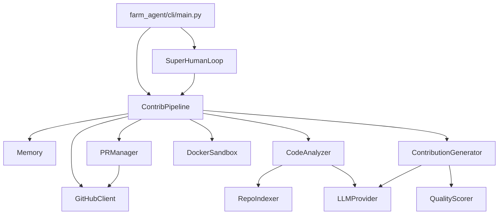

# PROJECT_MAP.md

This document serves as the canonical architectural blueprint for Farm-Agent v3.0, mapping its directory structures, technology stack, logic flows, and database schemas. It strictly reflects the current raw reality of the codebase.

---

## 1. System Overview & Tech Stack

The Farm-Agent system leverages the following core technologies to execute its autonomous contribution loops:

| Technology | Role |
| :--- | :--- |
| **Python 3.11+** | The core programming language running the pipeline and orchestration. |
| **Hatchling** | The build system backend used to package `farm_agent`. |
| **Click / Rich** | Used to create the command-line interface (`farm_agent/cli/main.py`) with rich terminal output. |
| **Docker SDK** | Facilitates Polyglot Sandbox Validation by isolating generated code execution within Docker containers. |
| **aiosqlite** | Asynchronous SQLite driver used to persist state and memory logic without race conditions. |
| **Pydantic** | Validates internal configurations (`config.yaml`) and data schemas. |
| **ChromaDB** | Vector database for Retrieval-Augmented Generation (RAG) providing context for issue-solving patches. |
| **Minimax** | Primary Large Language Model API used for generative coding tasks. |
| **OpenRouter** | Fallback and Red Team LLM routing for the Bloodhound Pipeline (e.g. `dolphin-mistral`). |

---

## 2. Directory Structure

The repository is modularly segmented into logical domains:

```ascii
farm_agent/
├── agents/             # Agent definitions and registries
├── analysis/           # Code analysis logic
│   ├── analyzer.py     # CodeAnalyzer - static code analysis
│   └── mapper.py       # RepoMapper - extracts class/function signatures
├── cli/                # Command Line Interface logic
│   └── main.py         # Main entry point (hunt, target, solve, superhuman, patrol)
├── core/               # Shared domain logic
│   ├── config.py       # Pydantic configuration schemas
│   ├── exceptions.py   # Custom domain exceptions
│   ├── logger.py       # Daily rolling file logger
│   ├── middleware.py   # Quota and pipeline middleware rules
│   ├── models.py       # Core Pydantic data models
│   ├── rag.py          # Code chunking and RepoIndexer via ChromaDB
│   ├── retry.py        # Async retry mechanisms and caching
│   └── sandbox.py      # Docker Sandbox definition and validation execution
├── generator/          # Large Language Model interaction engines
│   ├── engine.py       # ContributionGenerator - synthesizes code patches
│   ├── reviewer.py     # ReviewAgent - self-reviews generated patches
│   └── scorer.py       # QualityScorer - QA evaluation heuristics
├── github/             # Interaction with GitHub via API or Git
│   ├── client.py       # GitHubClient implementation using httpx
│   ├── discovery.py    # Target repo discovery
│   ├── guidelines.py   # PR guidelines extraction
│   └── security_gate.py# Discovers private disclosure security phrases to skip
├── issues/
│   └── solver.py       # IssueSolver - heuristics to classify and rank open issues
├── llm/                # LLM integrations
│   ├── context.py      # Context tracking
│   ├── models.py       # Definitions for TaskType, ModelTier, ModelSpec
│   ├── provider.py     # Wrappers for Minimax, OpenRouter, and local LLMs
│   └── router.py       # TaskRouter strategy implementation
├── notifications/      # Webhook interactions (Slack/Telegram/Discord)
├── orchestrator/       # High-level pipeline management
│   ├── human.py        # SuperHumanLoop - runs the 24/7 daemon sequence
│   ├── memory.py       # Memory persistence class executing SQLite actions
│   └── pipeline.py     # ContribPipeline - main execution core
├── pr/                 # Pull Request life-cycle logic
│   ├── manager.py      # PRManager - git interactions, commits, branches, pushing
│   └── patrol.py       # PRPatrol - listens for review feedback and resolves
└── templates/          # Code generation prompt templates
    └── registry.py     # TemplateRegistry handling prompt variables
```

---

## 3. Core Module Dependency Graph

The overarching control structure is governed by the `ContribPipeline` orchestrating specific domain classes.



---

## 4. Core Execution Loops / Entry Points

The fundamental sequence follows a **Terminator execution loop** ensuring safety and quality:
`Discovery -> Gate -> Analysis -> Engine -> Sandbox -> PR`

1. **Discovery (`hunt`):** Utilizing `RepoDiscovery`, the agent searches GitHub with parameters from the config (e.g., `stars_range`, `languages`).
2. **Gate:** The repository is checked against `Memory` to see if it's blacklisted or recently analyzed. The `SecurityGate` runs to detect restricted contexts.
3. **Analysis:** The `CodeAnalyzer` (or `IssueSolver`) evaluates the repository. If solving an issue, the `IssueSolver` ranks issues based on complexity and references. RAG is leveraged here to find pertinent chunks.
4. **Engine:** The `ContributionGenerator` receives the dossier or issue details. It interacts with the `LLMProvider` (like Minimax) to output exact Git merge diffs or complete file overwrites.
5. **Sandbox:** The patch is immediately written to an isolated `DockerSandbox`. The environment validates the syntax (e.g., via `pytest`). If the sandbox throws an error, the pipeline attempts to heal the code using the LLM before a max retry threshold.
6. **PR:** Using the `PRManager`, a fork is checked out, the validated patch is committed, pushed, and a PR is officially opened on GitHub.

### Supplemental Loops
- **Super Human Mode (`superhuman`):** Wraps the pipeline in a relentless continuous execution loop managed by `SuperHumanLoop`, running sequential rounds and checking quotas.
- **PR Patrol (`patrol`):** Independently managed by `PRPatrol`. Fetches all previously opened PRs from `Memory`, reads review comments from maintainers, generates updates using LLMs, and pushes directly to the existing PR branch.

---

## 5. Database/State Schema

State memory is preserved between pipeline runs in `memory.db` via SQLite (utilizing `aiosqlite`). Schema tables:

- **`analyzed_repos`**: Tracks repos that have undergone `hunt` or `analysis`. Prevents duplicate scanning.
- **`submitted_prs`**: Keeps the history of successfully created PRs, their URL, and title. Vital for the `patrol` action.
- **`run_log`**: Aggregated stats on pipeline invocations, durations, and errors.
- **`findings_cache`**: Caches structural defects identified by the `CodeAnalyzer` or Red Team Bloodhound scan.
- **`pr_outcomes`**: Logs whether PRs were merged or closed and the feedback received.
- **`repo_preferences`**: Analyzes the types of contributions a repo accepts or rejects to improve future hits.
- **`blacklisted_repos`**: Repositories where PRs failed too often, where maintainers left hostile vibes, or where security policies block automated PRs.
- **`api_usage_log`**: Tallies up provider API requests to enforce quotas.
- **`task_schedule`**: Schedules future events like garbage collection.
- **`knowledge_base`**: Retains knowledge chunks, style-guides, and previous RAG deductions.