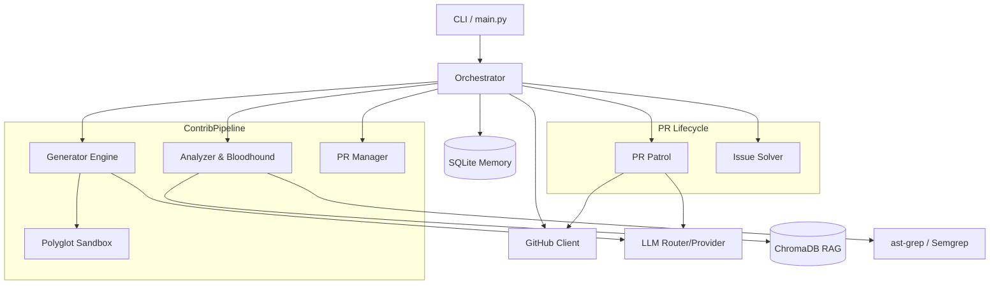

# Farm-Agent 🚜🤖 - Architecture Blueprint

This document serves as the architectural guide for Farm-Agent. It maps out the actual structure, tech stack, dependency flows, and execution loops implemented in the codebase.

## 1. System Overview & Tech Stack

| Component | Technology | Description / Role |
| :--- | :--- | :--- |
| **Core Language** | Python (3.11+) | The primary programming language used for the entire agent architecture. |
| **CLI Framework** | `Click` & `Rich` | Drives the command-line interface, terminal rendering, tables, and colored logging (`farm_agent/cli/main.py`). |
| **LLM Orchestration** | Minimax (Primary), Gemini, OpenAI, Anthropic, Ollama, OpenRouter | Generates code fixes, classifies PR comments, and powers the Red Team audit. Managed via `farm_agent/llm/`. |
| **Data Validation** | `Pydantic` & `Pydantic-Settings` | Handles configuration parsing (`config.yaml`), validation, and structured data outputs from LLMs. |
| **Persistent Memory** | SQLite (`aiosqlite`) | A local `memory.db` operating in WAL mode that stores run logs, analyzed repos, PR states, and rate limit tracking. |
| **RAG / Vector DB** | ChromaDB | Ephemeral RAM-only vector store used during analysis to match code snippets and context. |
| **Code Execution** | Docker SDK | The `Polyglot Sandbox` (`farm_agent/core/sandbox.py`) executing untrusted generated code validation in isolated containers. |
| **GitHub Interaction** | `httpx` & `gitpython` | Manages asynchronous REST API requests to GitHub and local `git` operations (clones, branches, commits). |
| **Static Analysis** | `ast-grep` & `Semgrep` | Forms the backbone of the "Bloodhound" Red Team module, identifying security and quality flaws. |

## 2. Directory Structure

```text
farm_agent/
├── .agents/                 # Internal project guidelines / agent instructions
├── ast_rules/               # AST-grep rule definitions for static analysis
├── docs/                    # Project documentation
├── farm_agent/              # Core application source code
│   ├── analysis/            # Code scanning and Red Team evaluation modules
│   ├── cli/                 # Command-line interface definitions (Click + Rich)
│   │   ├── main.py          # Primary entry point mapped to `farm_agent` CLI
│   │   └── tui.py           # Interactive terminal user interface
│   ├── core/                # Core configurations, exceptions, sandbox, logger
│   │   ├── config.py        # Pydantic configuration loader
│   │   ├── exceptions.py    # Custom exception hierarchy (GitHubAPIError, etc.)
│   │   └── sandbox.py       # Polyglot Sandbox Docker isolation implementation
│   ├── generator/           # Fix generation, code writing, and patching logic
│   │   ├── engine.py        # LLM text/patch generation enforcement
│   │   └── scorer.py        # Heuristic scoring of generated PR code
│   ├── github/              # Interfaces with GitHub REST API and local Git
│   │   └── client.py        # Asynchronous GitHub operations manager
│   ├── issues/              # Issue solving pipeline
│   │   └── solver.py        # Filters open issues and constructs fixes
│   ├── llm/                 # Multi-provider LLM integrations
│   │   ├── provider.py      # Factory and base classes for LLM clients
│   │   └── router.py        # Dynamic routing strategy between LLM tiers
│   ├── notifications/       # Telegram / Slack / Discord webhooks
│   ├── orchestrator/        # High-level pipeline management and execution loops
│   │   ├── human.py         # SuperHuman Loop (24/7 autonomous daily routine)
│   │   ├── memory.py        # SQLite persistent storage manager
│   │   └── pipeline.py      # ContribPipeline coordinating clones, fixes, PRs
│   ├── plugins/             # Extensible plugin system
│   ├── pr/                  # Pull request lifecycle management
│   │   ├── manager.py       # Forking, committing, signing, and PR opening
│   │   └── patrol.py        # PR Patrol: Reads comments, answers, fixes code
│   ├── templates/           # Contribution templates and prompts
│   └── tools/               # Various helper tools
├── tests/                   # Pytest test suite (unit and integration tests)
├── .env.example             # Example environment variables
├── config.example.yaml      # Example configuration schema
├── docker-compose.yml       # Docker definition for containerized daemon runs
├── Makefile                 # Make targets for linting, testing, and building
├── pyproject.toml           # Python package metadata and build specifications
└── README.md                # Main project overview and instructions
```

## 3. Core Module Dependency Graph



## 4. Core Execution Loops & Entry Points

### A. ContribPipeline (The Backbone)
Located in `farm_agent/orchestrator/pipeline.py`.
1. **Clone & Setup:** Caches local repository clones and establishes a secure workspace.
2. **Analysis:** Runs code via analyzers (`Bloodhound`, `Semgrep`) and indexes code context into ChromaDB.
3. **Generation:** Passes issues to the Generator Engine to propose changes via the chosen LLM.
4. **Validation:** Executes the `Polyglot Sandbox` to run linters/tests over the generated code.
5. **Submission:** The `PRManager` handles the Git push and GitHub REST PR creation.

### B. SuperHuman Loop (24/7 Autonomous Operations)
Located in `farm_agent/orchestrator/human.py`.
* Triggered via `farm_agent superhuman`.
* Bootstraps a daily loop that randomized PR quotas.
* Interleaves `Hunt` rounds (discovering new repositories) and `Patrol` rounds (addressing PR feedback).
* Once the daily quota is reached, gracefully shifts entirely into `Patrol`-only mode until the next scheduled cycle.

### C. PR Patrol
Located in `farm_agent/pr/patrol.py`.
* Queries memory for all `open` PRs created by the agent.
* Iterates through the GitHub PR comments via the REST API.
* Uses the LLM to classify feedback (e.g., `CODE_CHANGE`, `QUESTION`, `CLA`).
* Generates the requested code modifications, pushes to the existing PR branch, and posts a follow-up comment.

### D. Circular Target Loop
Mapped as `farm_agent hunt-circular`.
* Reads from `target_repo.json`.
* Selects the target with the oldest `scanned_at` timestamp.
* Immediately updates the timestamp (crash-safe) and processes the target through the Pipeline.

## 5. Database/State Schema (`memory.db`)

Farm-Agent utilizes an asynchronous SQLite database operating in WAL mode for robustness. The main schema entities accessed via `farm_agent/orchestrator/memory.py` include:

*   **`run_log`**: Tracks historical pipeline runs, recording duration, configurations, and overall outcome statistics.
*   **`analyzed_repos`**: Keeps a ledger of repositories the agent has touched, preventing duplicate processing within specified timeframes.
*   **`submitted_prs`**: The master ledger of all pull requests. Tracks `repo`, `pr_number`, `title`, and current live `status` (open, merged, closed). Used heavily by `PR Patrol` and Alumni Sync.
*   **`findings_cache`**: Caches static analysis results to prevent repeating expensive deep scans on unchanged repositories.
*   **`knowledge_base`**: Stores historical learnings and specific domain rules encountered across repositories, utilized to improve future LLM prompts.
*   **`api_usage_log` & `pr_outcomes`**: Telemetry tables for tracking token usage (costs) and long-term PR success metrics (Merge Rates).
