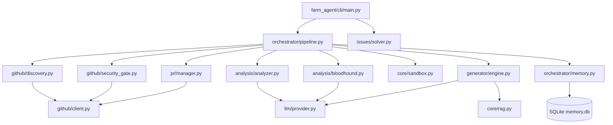

# Project Architecture Blueprint (Farm-Agent v3.0)

This document serves as the canonical architectural guide for the Farm-Agent project, mapping the active tech stack, directory structure, module dependencies, and state schema based on the current implementation.

## 1. System Overview & Tech Stack

| Technology | Role | Details |
| :--- | :--- | :--- |
| **Python 3.11+** | Core Language | The entire orchestrator, pipeline, and CLI are written in modern Python using `asyncio` for high concurrency. |
| **Hatchling** | Build Backend | Used for packaging and dependency management as configured in `pyproject.toml`. |
| **Docker** | Execution Sandbox | Provides a strictly isolated, polyglot environment (12 languages) using `network_mode="none"`, memory constraints (`mem_limit="512m"`), and OS-level `timeout --signal=KILL` to safely run generated code and tests. |
| **SQLite (aiosqlite)** | Persistent Memory | Stores project state, analyzed repos, generated PRs, findings cache, and an API usage log in `data/memory.db`. |
| **ChromaDB** | Local RAG Engine | Used for Retrieval-Augmented Generation (`farm_agent/core/rag.py`) to provide context-aware code suggestions. |
| **Pydantic** | Configuration & Data Validation | Validates application settings (`config.yaml`), environment variables, and core data models (`farm_agent/core/models.py`). |
| **Click & Rich** | Command-Line Interface | Drives the `farm_agent` CLI, providing complex commands (`run`, `target`, `hunt`, etc.) and structured, colored console output. |
| **GitPython** | Source Control Management | Used to manipulate Git repositories, clone, checkout branches, stage files, and commit changes dynamically. |
| **Semgrep & ast-grep** | Bloodhound Red Team | "Sentinel Radar" security scanner used to proactively discover vulnerabilities and code quality issues before passing them to the LLM. |
| **Minimax / OpenRouter / Ollama** | Large Language Models | Powers the codebase analysis and code generation. Minimax is the default provider; OpenRouter is utilized by the Bloodhound Red Team for white-hat audits, and Ollama provides a localized LLM fallback. |

## 2. Directory Structure

```ascii
farm_agent/
├── cli/
│   └── main.py          # Click CLI, all commands (run, hunt, patrol, solve, analyze, etc.)
├── core/
│   ├── config.py        # Pydantic config system, load_config(), FarmAgentConfig
│   ├── exceptions.py    # GitHubAPIError, LLMRateLimitError, ConfigError, RateLimitError
│   ├── middleware.py    # Middleware chain (DeerFlow pattern) for quota/quality enforcement
│   ├── models.py        # Pydantic models: Repository, Finding, Contribution, AnalysisResult, Severity, etc.
│   ├── memory.py        # SQLite-backed Memory class (all tables defined here)
│   ├── logger.py        # Daily rolling file logger setup
│   ├── notifier.py      # TelegramNotifier
│   ├── profiles.py      # Contribution profiles (quick/standard/thorough)
│   ├── quotas.py        # Quota tracking
│   ├── leaderboard.py   # PR stats and repo rankings
│   ├── rag.py           # ChromaDB RAG pipeline for knowledge retrieval
│   ├── retry.py         # @async_retry, @github_retry, @llm_retry decorators + LRUCache
│   └── sandbox.py       # DockerSandbox — Polyglot Guillotine (12 languages supported)
├── generator/
│   ├── engine.py        # ContributionGenerator.generate() + generate_from_dossier()
│   ├── reviewer.py      # ContributionReviewer
│   └── scorer.py        # QAHardcoreScorer — QA evaluation with repo_style_guide penalty
├── github/
│   ├── client.py        # GitHubClient — all GitHub API interactions (REST + GraphQL)
│   ├── discovery.py     # RepoDiscovery + DatabaseTargetDiscovery
│   ├── guidelines.py    # fetch_repo_guidelines() — parses CONTRIBUTING.md + PR template
│   └── security_gate.py # Security Disclosure Gate (private disclosure detection)
├── analysis/
│   ├── analyzer.py      # CodeAnalyzer.analyze() — static code analysis
│   └── bloodhound.py    # BloodhoundAnalyzer — Semgrep pre-scan for vulnerability discovery
├── llm/
│   ├── provider.py      # create_llm_provider() — MiniMax, OpenRouter, or multi-model routing
│   ├── models.py        # ALL_MODELS catalog, TaskType enum, model capabilities/tiers/costs
│   ├── router.py        # TaskRouter — default model assignments per task type
│   └── agents.py        # LLM agent definitions
├── issues/
│   └── solver.py        # IssueSolver — fetch + classify + solve GitHub issues
├── orchestrator/
│   ├── pipeline.py      # ContribPipeline — main orchestrator (THIS IS THE CORE ENGINE)
│   ├── memory.py        # Alias/sibling to core/memory.py
│   └── human.py         # SuperHumanLoop — 24/7 organic operation loop
├── pr/
│   ├── manager.py       # PRManager.create_pr() — fork, branch, commit, push, create PR
│   └── patrol.py        # PRPatrol — check open PRs for review feedback, auto-respond
├── agents/
│   └── registry.py      # create_default_registry() — DeerFlow agent system
├── plugins/
│   └── __init__.py      # Plugin architecture integration points
├── notifications/
│   └── notifier.py      # Notifier — Slack/Discord/Telegram webhooks
├── templates/
│   ├── builtin/         # Built-in contribution YAML templates (e.g., add-gitignore, add-license)
│   └── registry.py      # TemplateRegistry
└── tools/
    └── protocol.py      # create_default_tools() — DeerFlow tool system
```

*Note: Legacy/unused modules (e.g., `analysis/language_rules.py`, `analysis/skills.py`, `analysis/strategies.py`, `pr/janitor.py.DISABLED`, and `cli/tui.py`) have been removed or disabled to accurately reflect the v3.0 core execution path.*

## 3. Core Module Dependency Graph



## 4. Core Execution Loops / Entry Points

The primary entry point is the CLI (`farm_agent/cli/main.py`). Executing `farm_agent run` triggers the relentless `Terminator execution loop`, orchestrating the `ContribPipeline` in `farm_agent/orchestrator/pipeline.py`.

The exact sequential pipeline stages are:
1. **Discovery:** Scours GitHub for target repositories that match the configured discovery criteria (e.g., specific languages, stars range, recent activity).
2. **Gate:** Repositories are rigorously evaluated through an Anti-Farming Filter and the Security Disclosure Gate. The pipeline automatically aborts if the repository explicitly requests private vulnerability disclosure or features an actively hostile maintainer vibe.
3. **Analysis:** The `CodeAnalyzer` and `BloodhoundAnalyzer` scan the target repositories to map the architecture and detect code quality flaws or security vulnerabilities using Red Team tactics and Semgrep.
4. **Engine:** The `ContributionGenerator` receives the dossier, utilizing the configured LLM provider (Minimax, OpenRouter, or local Ollama) combined with RAG (`core/rag.py`) to synthesize reliable code patches and detailed PR descriptions.
5. **Sandbox:** Generated patches are strictly evaluated within `DockerSandbox`. The polyglot execution environment ensures changes compile and pass tests. A rigid OS-level timeout ensures infinite loops are killed. PR creation is unequivocally blocked if validation fails or Docker is unavailable.
6. **PR:** The `PRManager` orchestrates the creation of a Git fork, commits the validated patch using `GitPython`, pushes the branch, and officially submits the Pull Request via the GitHub API. The `PRPatrol` component acts asynchronously to auto-respond to comments on generated PRs.

## 5. Database/State Schema

Farm-Agent utilizes SQLite via `aiosqlite` for persistent state storage, ensuring state is retained across runs. The schema, initialized in `farm_agent/orchestrator/memory.py`, includes:

- **`analyzed_repos`**: Tracks repositories that have been scanned, storing their `full_name`, `language`, `stars`, and `analyzed_at` timestamp.
- **`submitted_prs`**: Maintains a record of successfully submitted PRs with their `repo`, `pr_number`, `pr_url`, and `title`.
- **`findings_cache`**: A temporary cache tracking discovered vulnerabilities/issues to avoid reprocessing, storing `repo`, `type`, `severity`, and `title`.
- **`run_log`**: Records start and end times for pipeline execution loops alongside aggregate statistics (`repos_analyzed`, `prs_created`).
- **`pr_outcomes`**: Tracks long-term status of PRs (e.g., merged, closed) for internal success metrics.
- **`repo_preferences`**: A feedback loop mechanism logging target repository specific `preferred_types` and `rejected_types` based on historical PR outcomes.
- **`blacklisted_repos`**: Contains repositories excluded from future pipeline runs along with the `reason` (e.g., hostile maintainer, repeated failures).
- **`api_usage_log`**: Detailed record of API interactions to monitor usage quotas for providers (Minimax, OpenRouter, GitHub).
- **`task_schedule`**: Facilitates multi-process coordination for periodic pipeline tasks.
- **`knowledge_base`**: Central storage for contextual project details and specific knowledge utilized by the RAG system.
- **`target_repos`**: Queue system mapping URLs to specific analysis priorities or bounty goals.
- **`repo_style_guides`**: Extracted documentation rules, `CONTRIBUTING.md` excerpts, and template schemas to guide code generation to blend natively into target projects.