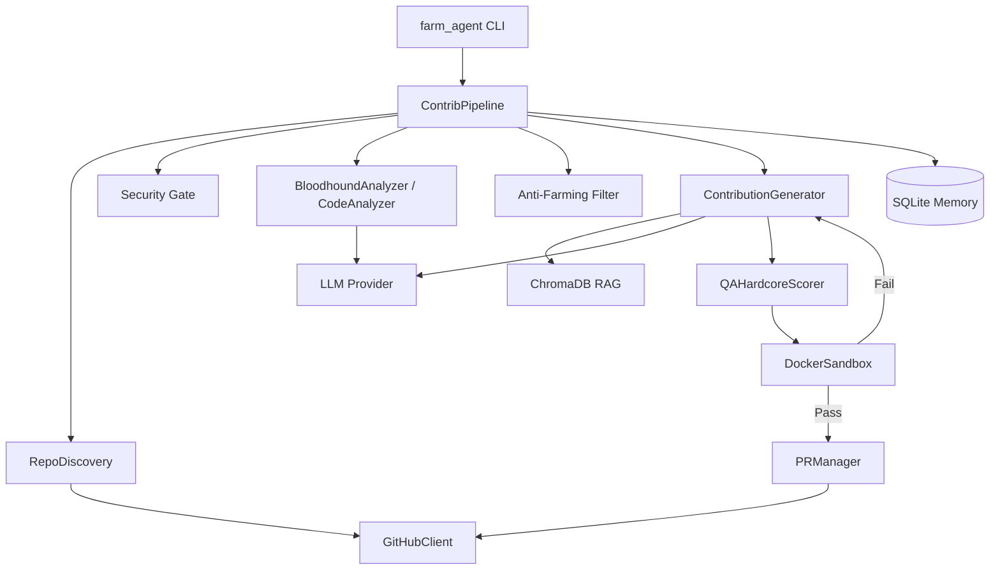

# PROJECT_MAP.md — Farm-Agent Ground Truth

**Generated:** 2026-04-15
**Version:** v3.0.0
**Entry Point:** `farm_agent/cli/main.py` → `cli()` (Click-based CLI)
**Language:** Python 3.11+

---

## 1. System Overview & Tech Stack

**What the system actually does:**

Farm-Agent is an autonomous AI agent that discovers open-source GitHub repositories matching criteria (language, star range, activity), scans their code for issues (security vulnerabilities, code quality bugs, performance problems, etc.), generates patches via LLM, validates patches in Docker sandboxes, and creates PRs or GitHub Issues to contribute back.

**Active Tech Stack & Roles:**

| Component | Technology | Role in the Project |
|-----------|------------|---------------------|
| **Language** | Python 3.11+ | Core implementation language enforcing strict typing and linting logic via Ruff. |
| **CLI Framework** | `click` + `rich` | Orchestrates operations, flags, commands, and console outputs (`farm_agent/cli/main.py`). |
| **HTTP Client** | `httpx` (async) | Facilitates all asynchronous interactions with the GitHub REST and GraphQL APIs. |
| **LLM Providers** | MiniMax & OpenRouter | Generates, reviews, and corrects code contributions (primary model: `MiniMax-M2.7`). |
| **Database** | SQLite via `aiosqlite` | Persistent storage for pipeline state, quotas, caches, and PR tracking, using WAL mode. |
| **Patch Sandboxing** | Docker (`docker>=7.1`) | Executes the Polyglot Guillotine container validation for language-agnostic testing of generated patches. |
| **Vector Engine** | ChromaDB | Local, ephemeral RAG (Retrieval-Augmented Generation) vector store for multi-file contextual alignment. |
| **Version Control** | `gitpython` | Facilitates localized repository clones and patch application in isolated temporary environments. |
| **Job Scheduling** | `apscheduler` | Manages recurrent operations and time-bound task looping logic. |
| **Configuration** | Pydantic v2 + YAML | Strictly enforces validation schema models (`FarmAgentConfig`) globally. |

---

## 2. Directory Structure

```text
farm_agent/
├── cli/
│   └── main.py              # Click CLI, all commands (run, target, hunt, superhuman, etc.)
├── core/
│   ├── config.py            # Pydantic config system, load_config(), FarmAgentConfig
│   ├── exceptions.py        # Custom errors (GitHubAPIError, LLMRateLimitError, etc.)
│   ├── middleware.py        # Middleware chain (DeerFlow pattern)
│   ├── models.py            # Shared data transfer models (Repository, Finding, PRResult, etc.)
│   ├── memory.py            # SQLite database interactions and state
│   ├── rag.py               # RAG pipeline using ChromaDB for code context
│   ├── retry.py             # async_retry, github_retry decorators
│   └── sandbox.py           # Docker Sandbox (Polyglot Guillotine execution)
├── generator/
│   ├── engine.py            # LLM patch generation
│   ├── reviewer.py          # LLM contribution review and fix looping
│   └── scorer.py            # Hardcore QAScorer to evaluate patch logic
├── github/
│   ├── client.py            # Core asynchronous REST/GraphQL HTTP bindings
│   ├── discovery.py         # Repo searching and targeting logic
│   ├── guidelines.py        # Parsing repo CONTRIBUTING.md policies
│   └── security_gate.py     # Discovers and enforces explicit private disclosure policies
├── issues/
│   └── solver.py            # Issue matching and complexity scoring
├── analysis/
│   ├── analyzer.py          # Static code analyzer prompting logic
│   └── bloodhound.py        # Semgrep-backed pre-scan logic
├── llm/
│   ├── provider.py          # LLM integration abstractions
│   ├── models.py            # Available models and configurations
│   └── router.py            # Task-specific LLM routing
├── orchestrator/
│   ├── pipeline.py          # Main execution loop orchestrating the entire system
│   ├── memory.py            # Alias to core/memory.py
│   └── human.py             # SuperHumanLoop defining relentless daemon cycles
├── pr/
│   ├── manager.py           # PR workflows (Fork, Commit, Push, PR)
│   └── patrol.py            # Scans existing PRs to reply to maintainers
└── __init__.py
```

---

## 3. Core Module Dependency Graph

The entire execution operates around `ContribPipeline` working with supporting components in sequential stages: Discovery -> Security Gate -> Analysis -> Code Engine -> Sandbox validation -> PR Submission.



---

## 4. Core Execution Pipeline & Data Flow

### Primary CLI Commands (from `main.py`)

| Command | Description |
|---------|-------------|
| `farm_agent run` | Auto-discover repos → analyze → generate → PR |
| `farm_agent target <url>` | Target a specific repo |
| `farm_agent hunt` | Aggressive multi-round discovery + contribution |
| `farm_agent hunt-circular` | Round-robin from `target_repo.json` |
| `farm_agent patrol` | Check open PRs for review feedback, auto-respond |
| `farm_agent superhuman` | 24/7 organic loop maximizing continuous execution |
| `farm_agent solve <url>` | Solve open issues in a specific repo |
| `farm_agent analyze <url>` | Analyze only, no PR creation |

### Pipeline Data Flow (for `run` command)

```
CLI.run()
  → load_config()        [Source: config.py:232-263]
  → ContribPipeline.run() [Source: pipeline.py:333-434]
      → RepoDiscovery.discover()      → list[Repository]
      → asyncio.Semaphore(max_conc=3, capped at 5 for Minimax)
          → _process_repo()           [pipeline.py:1001-1724]
              1. _check_ai_policy()   → skip if AI-banned repo
              2. check_interaction_limits() → skip if contributor-only
              3. fetch_repo_guidelines() → CommitFormat, PR template
              4. run_security_gate()  → abort if private disclosure requested
              5. check_maintainer_vibe() → abort if HOSTILE
              6. CodeAnalyzer.analyze() → list[Finding]
              7. Pre-filter: skip non-code files, protected meta files
              8. Anti-Farming gate: drop LOW/TRIVIAL impact, banned types
              9. Duplicate filter: check local memory + GitHub API
              10. _validate_findings() → LLM re-checks each finding
              11. Limit to 2 findings per repo
              12. For each validated finding:
                  - Route A (SECURITY_FIX or CRITICAL/HIGH): direct PR
                  - Route B (everything else): Issue-First protocol
              13. For Route A:
                  → ContributionGenerator.generate()
                  → DockerSandbox.run_in_sandbox() (max 3 retries, self-correction)
                  → PRManager.create_pr()
                  → record_pr() to SQLite
                  → check_compliance_and_fix()
                  → _check_ci_and_close_if_failed()
```

### Hunt Mode Flow (`pipeline.py:436-585`)

```
Hunt mode (rounds × delay):
  → shuffled star tiers each round
  → RepoDiscovery.discover()
  → prepend "friendly repos" (VIP alumni repos off cooldown)
  → _hunt_process_repo() — Issues FIRST, then analysis
  → Issues mode skips analysis if ≥1 issue PR created
```

### Circular Target Loop (`pipeline.py:691-985`)

```
run_circular():
  → DatabaseTargetDiscovery.get_next_target() — picks oldest scanned_at
  → BloodhoundAnalyzer.run_bloodhound() — Semgrep pre-scan
  → if no bugs: mark COMPLETED_NO_VULN, return
  → filter production_vulns (skip LOW_PRIORITY_CONTEXT)
  → run_security_gate() → abort if private disclosure
  → DEV-QA Cycle Loop (max 3):
      → ContributionGenerator.generate_from_dossier()
      → QAHardcoreScorer.evaluate() — if approved, break
      → else record QA lessons, inject into failure_context
  → if QA passed: PRManager.create_pr()
  → mark status: PR_SUBMITTED / COMPLETED_TOO_COMPLEX
```

---

## 5. Database Schema & State

**SQLite DB at:** `data/memory.db` (default, configurable via `storage.db_path`)

**WAL Journal Mode** — falls back to DELETE on Docker volume filesystems.

**Schema (from `memory.py:19-135`):**

| Table | Primary Columns | Purpose |
|-------|-----------------|---------|
| `analyzed_repos` | `full_name` (PK), `language`, `stars`, `analyzed_at`, `findings`, `metadata` | Track which repos have been scanned |
| `submitted_prs` | `id`, `repo`, `pr_number` (UNIQUE), `pr_url`, `title`, `type`, `status`, `branch`, `fork`, `created_at`, `updated_at`, `ci_fix_attempts`, `discussion_replies` | All PRs submitted by the agent |
| `findings_cache` | `id`, `repo`, `type`, `severity`, `title`, `file_path`, `status`, `created_at` | Cached analysis findings |
| `run_log` | `id`, `started_at`, `finished_at`, `repos_analyzed`, `prs_created`, `findings`, `errors`, `metadata` | Historical pipeline runs |
| `pr_outcomes` | `id`, `repo`, `pr_number` (UNIQUE), `pr_url`, `pr_type`, `outcome`, `feedback`, `time_to_close_hours`, `recorded_at` | Outcome tracking for learning |
| `repo_preferences` | `repo` (PK), `preferred_types`, `rejected_types`, `merge_rate`, `avg_review_hours`, `notes`, `updated_at` | Per-repo learned preferences |
| `blacklisted_repos` | `repo` (PK), `reason`, `pr_number`, `blacklisted_at` | Permanently blocked repos |
| `api_usage_log` | `id`, `timestamp` (Unix epoch), `provider` | LLM API usage for quota tracking |
| `task_schedule` | `task_key` (PK), `next_run`, `updated_at` | Persistent task scheduling |
| `knowledge_base` | `repo_name`, `entry_type`, `content`, `created_at` (UNIQUE) | QA lessons, audit history |
| `target_repos` | `repo_url` (PK), `status`, `scanned_at` (Unix ts), `language`, `bounty_amount`, `diamond_target` | Circular loop targets |
| `repo_style_guides` | `repo` (PK), `style_summary`, `contributing_md`, `pr_template`, `created_at`, `updated_at` | Cached CONTRIBUTING.md parses |

---

## 6. Critical Guardrails, Limits & Business Rules

### 6.1 Thresholds & Limits

| Limit | Value | Source |
|-------|-------|--------|
| `max_repos_per_run` | 5 | `config.py:20` |
| `max_prs_per_day` | 10 | `config.py:21` |
| `min_daily_prs` | 4 | `config.py:22` |
| `max_daily_prs` | 10 | `config.py:23` |
| `rate_limit_buffer` | 3 (stop when GitHub API remaining < 3) | `config.py:24` |
| `max_concurrent_repos` | 3 (capped to 5 for Minimax) | `config.py:180`, `pipeline.py:229-233` |
| `timeout_per_repo_sec` | 300 | `config.py:181` |
| `max_ci_retries` | 3 | `config.py:183` |
| `max_discussion_replies` | 3 | `config.py:184` |
| `max_patch_retries` | 2 | `config.py:185` |
| `max_review_retries` | 2 | `config.py:186` |
| `max_files_per_pr` | 10 | `config.py:136` |
| `run_tests_before_pr` | True | `config.py:137` |
| `max_file_size_kb` | 500 | `config.py:92` |
| `max_snippet_chars` | 15000 (OpenRouter) | `config.py:68` |
| `red_team_daily_limit` | 1000 (OpenRouter calls/day) | `config.py:114` |
| `sandbox_validation_enabled` | **hardcoded True** — can never be bypassed | `config.py:188` |
| `max_prs_per_day` (hard cap in `pipeline.py:351-360`) | Checked before pipeline run | `pipeline.py:354` |
| LLM Quota: 5-hour window | 950 requests (95% of 1000 limit) | `memory.py:943` |
| LLM Quota: 7-day window | 9500 requests (95% of 10000 limit) | `memory.py:953` |

### 6.2 Validation Rules (Active Guards)

**AI Policy Block:**
- Scans `AI_POLICY.md`, `.github/AI_POLICY.md` for ban keywords ("do not accept ai", "no ai-generated", etc.)
- If banned, repo is skipped.

**Interaction Limits Block:**
- `github.check_interaction_limits()` — skips repos restricting to prior contributors only.

**Security Disclosure Gate:**
- Scans `SECURITY.md`, `.github/SECURITY.md`, `docs/SECURITY.md` for private disclosure phrases.
- If found: saves findings to `secret_findings/{repo}.json` and aborts pipeline for that repo.

**Protected Meta Files — NEVER modify:**
- `CONTRIBUTING.md`, `CODE_OF_CONDUCT.md`, `LICENSE*`, `SECURITY.md`, `.github/CODEOWNERS`, `.all-contributorsrc`
- All `tsconfig*.json`, `.eslintrc*`, `.prettierrc*`, `webpack.config.*`, `vite.config.*`, `babel.config.*`
- `package.json`, `package-lock.json`, `yarn.lock`, `pnpm-lock.yaml`
- `.github/workflows/*.yml`, `.env*` files

**Anti-Farming Filter Gates:**
1. **Impact level gate:** `LOW` and `TRIVIAL` findings are ALWAYS dropped.
2. **Docs ban gate:** `README_FIX` and `DOCS_IMPROVE` types are BANNED.
3. **File extension guillotine:** `.md`, `.txt`, `.rst` files are BLOCKED regardless of type.
4. **Keyword blacklist gate:** 50+ farming keywords (docstring, docs, format, spelling, test, typo, etc.) block findings.

**Duplicate Detection:**
- Title similarity via bigram overlap (80% threshold).
- Checks both local SQLite memory AND GitHub API for existing PRs.

**Sandbox Guillotine (P0-FIX):**
- Docker container security: `network_mode="none"`, `mem_limit="512m"`, `nano_cpus=500_000_000`, `cap_drop=["ALL"]`, `pids_limit=128`.
- Hard 60-second timeouts. If sandbox unavailable, PR creation is BLOCKED.
