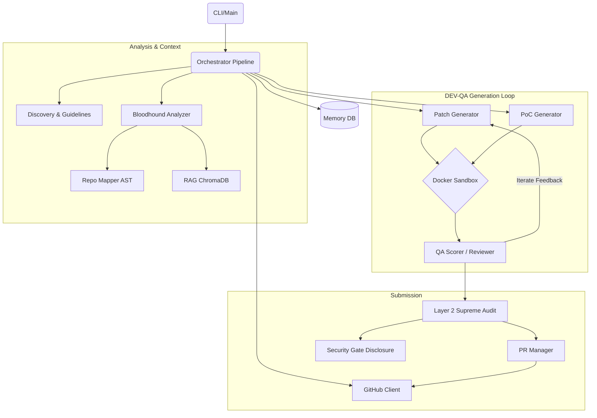

# 🗺️ Agent-Farm Project Architecture Map (v4.0.0)

This document provides a deep dive into the underlying architecture, execution pipelines, and state schemas of the Agent-Farm project. It serves as the definitive reference for developers and contributors to understand how the system is organized and how data flows through the various subsystems.

---

## 1. System Overview & Tech Stack

Agent-Farm utilizes a modern, typed, and async Python stack, relying on isolated Docker environments for execution.

| Component | Technology | Description |
|-----------|------------|-------------|
| **Core Framework** | Python 3.11+ | The entire system is written in modern async Python (`asyncio`). |
| **CLI Framework** | `click` | Drives the `farm_agent` terminal commands and subcommands. |
| **Configuration** | `pydantic-settings` | Manages complex environment configurations via `.env` and `config.yaml`. |
| **Data Models** | `pydantic` | Strongly typed schemas for findings, PRs, and execution context. |
| **Database/Memory** | `aiosqlite` | Asynchronous SQLite interface for state, leaderboards, and rate limits (`memory.db`). |
| **Vector Database** | `chromadb` | Local vector database used by the RAG context engine for semantic doc chunking. |
| **Build Backend** | `hatchling` | Configured in `pyproject.toml` for standard packaging and wheel creation. |
| **Testing** | `pytest`, `pytest-asyncio` | Test execution, requiring async compatibility. |
| **Execution Sandbox** | `docker` API | Spawns isolated sibling containers for Proof-of-Concept testing and patching. |
| **Static Analysis** | `ast-grep`, `semgrep` | (Bloodhound Red Team) Native and regex-based static code scanners for finding vulnerabilities. |
| **LLM Integration** | `google-genai`, `openai`, `anthropic`, `httpx` | Interfaces with multiple backend models (Qwen, DeepSeek, Gemini) via OpenRouter and direct APIs. |

---

## 2. Directory Structure

Below is an annotated ASCII directory tree of the active `farm_agent` codebase, filtering out trivial files and `__pycache__`:

```text
.
├── Dockerfile                          # Stage 1 builder (wheel creation) + Stage 2 lean runtime v4.0.0
├── docker-compose.yml                  # agent-farm service definition with networks and volumes (data/, logs/, secret_findings/)
├── start.sh                            # Unix 1-Click Desktop Launch script
├── start.bat                           # Windows 1-Click Desktop Launch script
├── Makefile                            # Build and test orchestration commands
├── pyproject.toml                      # Project metadata and Hatchling backend config
├── requirements.txt                    # System dependencies including Docker bounds
├── config.example.yaml                 # Template for application-level configuration
├── .env.example                        # Template for core environment variables
│
├── farm_agent/                         # Application package root
│   ├── __init__.py
│   ├── cli/                            # Command Line Interface module
│   │   └── main.py                     # Click CLI command registrations (run, hunt, patrol, etc.)
│   ├── core/                           # System core logic
│   │   ├── config.py                   # Pydantic configuration loader
│   │   ├── daily_log.py                # Formatting for activity logs
│   │   ├── exceptions.py               # Centralized exception models
│   │   ├── leaderboard.py              # Statistics tracking
│   │   ├── logger.py                   # Rich terminal logging
│   │   ├── middleware.py               # Middleware chain execution
│   │   ├── models.py                   # Core Pydantic data structures
│   │   ├── notifier.py                 # Telemetry & webhook integrations
│   │   ├── profiles.py                 # Preset execution profiles
│   │   ├── quotas.py                   # OpenRouter and API quota controllers
│   │   ├── rag.py                      # ChromaDB integration and semantic text chunking
│   │   ├── retry.py                    # Backoff logic for API requests
│   │   └── sandbox.py                  # Docker isolated execution environment wrapper
│   ├── analysis/                       # Static analysis and metadata parsers
│   │   ├── analyzer.py                 # Security, code quality, UI scanners (Bloodhound)
│   │   └── mapper.py                   # AST-based dependency graph construction
│   ├── generator/                      # Code patch generation pipelines
│   │   ├── engine.py                   # Main Patch Generator
│   │   ├── poc.py                      # Proof-of-Concept validation generators
│   │   ├── reviewer.py                 # Self-reflection and blast-radius auditing
│   │   └── scorer.py                   # QAHardcoreScorer (Qwen-based)
│   ├── github/                         # GitHub integration
│   │   ├── client.py                   # Async REST & GraphQL API Client
│   │   ├── discovery.py                # Target repository crawling
│   │   ├── guidelines.py               # Parsing repository contribution rules
│   │   └── security_gate.py            # Disclosure handling
│   ├── issues/                         # Issue-first workflow logic
│   │   └── solver.py                   # Pipeline for proactively solving repo issues
│   ├── llm/                            # Large Language Model integrations
│   │   ├── agents.py                   # Model instruction prompting
│   │   ├── context.py                  # System instruction assemblers
│   │   ├── models.py                   # Model routing definitions
│   │   ├── provider.py                 # Raw API caller interfaces
│   │   └── router.py                   # Determines the best model for a given task
│   ├── orchestrator/                   # High-level pipeline management
│   │   ├── human.py                    # SuperHuman (Terminator Mode) execution loop
│   │   ├── memory.py                   # SQLite persistence memory operations
│   │   └── pipeline.py                 # Core orchestration logic (FarmAgentPipeline)
│   ├── pr/                             # Pull Request lifecycle management
│   │   ├── manager.py                  # Submitting and branching PR logic
│   │   └── patrol.py                   # CI fixes and maintainer interactions
│   ├── templates/                      # Prompts and response templates
│   │   ├── builtin/
│   │   └── registry.py
│   ├── notifications/                  # Outbound alerts to Telegram/Slack/Discord
│   │   └── notifier.py
│   ├── plugins/                        # Plugin registry
│   └── tools/                          # Internal tooling execution
│       └── protocol.py
├── tests/                              # Unit and integration tests
│   └── unit/
└── scripts/                            # Auxiliary dev scripts
```

---

## 3. Core Module Dependency Graph

This diagram illustrates how data flows between system boundaries, from initialization to contribution.



---

## 4. Core Execution Loops / Entry Points

The system has multiple distinct execution profiles invoked from the CLI:

### Standard Target Run (`farm_agent run` / `farm_agent target`)
1. **Initialization:** Invokes `FarmAgentPipeline.run()` or `run_single()`. Clones target repo to a local temporary directory.
2. **Contextual Analysis:** Uses `discover_subsystem_docs()` to locate docs, feeds them to RAG via `RepoIndexer.index_repo()`. Maps AST structure via `RepoMapper.get_module_dependencies()`.
3. **Vibe Check:** Scans recent PRs and issues for maintainer sentiment (`check_maintainer_vibe()`). If hostile, repository is blacklisted.
4. **Bloodhound Scan:** `CodeAnalyzer.analyze()` scans codebase. Results filtered by the **Anti-Farming Filter** (Gate 1 - Qwen-3.7-Max and Gate 2 - Deprecation checks) to eliminate low-effort suggestions.
5. **DEV-QA Verification:**
   - `PoCGenerator` writes an exploit script and runs it in `DockerSandbox`. The bug must be proven.
   - `ContributionGenerator` writes the code fix.
   - Passes are verified against native repo tests and the generated PoC to prevent regressions (Blast Radius Audit).
6. **Supreme Audit & Submission:** Verified fixes are passed through a Layer 2 Gemini evaluation before `PRManager.create_pr()` pushes the change to a new fork branch and submits it.

### Circular Loop (`farm_agent hunt-circular`)
- Invokes `FarmAgentPipeline.run_circular()`.
- Fetches the next un-analyzed target from the SQLite `target_repos` table deterministically.
- Executes the standard analysis and DEV-QA pipelines continuously, iterating through the list.

### Terminator Mode (`farm_agent superhuman`)
- Invokes `SuperHumanLoop.run_daily_routine()`.
- A 24/7 relentless loop running the circular hunt without artificial delays.
- Periodically interleaves the `patrol` action.

### PR Patrol (`farm_agent patrol`)
- Invokes `PRPatrol.patrol()`.
- Iterates over the `submitted_prs` database table.
- Pulls CI action logs from the PR branch via GitHub API. Parses traces with `_guess_file_from_traceback()`.
- Automatically proposes CI fixes via Docker Sandbox and pushes commits.
- Replies to maintainer comments using the LLM agent.

### Issue Solver Workflow (`farm_agent solve`)
- Specifically bypasses the raw code scanning and focuses purely on scraping open issues from the repository.
- Generates plans and patches strictly adhering to issue instructions via `IssueSolver`.

---

## 5. Database & State Schema

The persistent state is maintained asynchronously using SQLite WAL mode inside `/app/data/memory.db`.

| Table Name | Primary Key | Purpose | Key Columns |
|------------|-------------|---------|-------------|
| `analyzed_repos` | `full_name` | Tracks repositories that have already been evaluated. | `language`, `stars`, `findings`, `metadata` |
| `submitted_prs` | `id` | Logs PRs/issues created by the bot. | `repo`, `pr_number`, `title`, `type`, `status` |
| `findings_cache` | `id` | Temporary storage for active vulnerabilities. | `repo`, `type`, `severity`, `file_path`, `status` |
| `pr_outcomes` | `id` | Stores outcome evaluations based on maintainer feedback. | `repo`, `pr_number`, `outcome`, `feedback`, `time_to_close_hours` |
| `repo_preferences` | `repo` | Learned contribution styles dynamic index. | `preferred_types`, `rejected_types`, `merge_rate` |
| `blacklisted_repos` | `repo` | Hostile environments blocked from future attempts. | `reason`, `blacklisted_at` |
| `api_usage_log` | `id` | Tracks token consumption per LLM provider. | `timestamp`, `provider` |
| `knowledge_base` | `(repo_name, entry_type, content)` | Stores RAG lessons, architectural context, and filter lessons. | `repo_name`, `entry_type`, `content` |
| `target_repos` | `repo_url` | Circular queue deterministic source targets. | `status`, `bounty_amount`, `scanned_at` |

**Optimization Note:** The system employs composite indices on tables like `api_usage_log` (`provider`, `timestamp`) and unique constraints (e.g. `(repo, pr_number)` in `submitted_prs`) to ensure efficient query execution and prevent data race conditions during async scaling.
