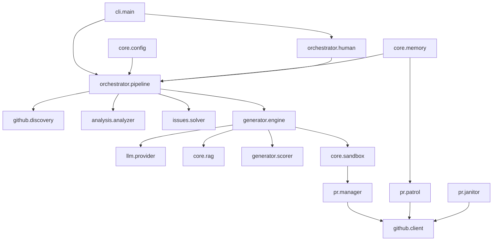

# PROJECT_MAP.md — Farm-Agent Architectural Blueprint

## 1. System Overview & Tech Stack

Farm-Agent is an autonomous AI system designed to discover open-source GitHub repositories matching criteria (language, star range, activity), scan their code for issues (security vulnerabilities, code quality bugs, performance problems, etc.), generate patches via LLM, validate patches in Docker sandboxes, and create PRs or GitHub Issues to contribute back.

| Component | Technology | Role |
|-----------|------------|------|
| Language | Python >=3.11 | Core application logic and execution engine. |
| HTTP client | `httpx` (async) | Interfacing with GitHub REST/GraphQL APIs and LLMs. |
| LLM Providers | MiniMax, OpenRouter (Anthropic/OpenAI/Gemini), Ollama | Generating code patches, reviewing, and scoring QA. |
| Database | SQLite via `aiosqlite` | Persistent memory managed with WAL mode (`memory.db`). |
| Sandbox Validation | Docker >=7.1 | Polyglot Guillotine sandbox for testing PR patches before submission. |
| Scheduling | `apscheduler` | Managing and running periodic tasks. |
| CLI | `click`, `rich` | Terminal UI, execution commands (`farm_agent run`, `farm_agent hunt`, etc.). |
| Configuration | Pydantic v2 + YAML | Strict schema validation of the configuration inputs. |
| Vector DB | `chromadb` | RAG indexing for complex multi-file patches. |
| Git Manipulation | `gitpython` | Cloning, committing, and branching locally before pushing PRs. |

## 2. Directory Structure

```text
farm_agent/
├── agents/             # DeerFlow agent definitions
├── analysis/           # Code analyzers (Bloodhound, static scanners)
│   ├── analyzer.py     # Static code analysis driver
│   ├── bloodhound.py   # Semgrep pre-scan logic
│   └── mapper.py       # Syntax mapping tools
├── cli/                # Command Line Interface via Click
│   └── main.py         # Entry point for 'farm_agent' CLI command
├── core/               # Shared utilities, config, exceptions
│   ├── config.py       # Pydantic schema for configuration mapping
│   ├── logger.py       # Daily rolling file logger
│   ├── memory.py       # SQLite logic for state and quota management
│   ├── middleware.py   # Quota/Quality enforcement middleware
│   ├── models.py       # Pydantic data models for domain logic
│   ├── rag.py          # ChromaDB RAG index logic
│   ├── retry.py        # API/LLM request retry decorators
│   └── sandbox.py      # Docker environment executor (Polyglot Guillotine)
├── generator/          # Patch generation logic
│   ├── engine.py       # ContributionGenerator
│   ├── reviewer.py     # Code patch reviewer
│   └── scorer.py       # QA Hardcore Scorer
├── github/             # GitHub API wrappers
│   ├── client.py       # Authenticated client for GitHub actions
│   ├── discovery.py    # Repository discovery strategies
│   ├── guidelines.py   # Parsing CONTRIBUTING.md
│   └── security_gate.py# Security disclosure gate logic
├── issues/             # Issue-First Pipeline logic
│   └── solver.py       # Logic for filtering and solving open issues
├── llm/                # LLM interface and routing
│   ├── models.py       # Model capability/tier mapping
│   ├── provider.py     # LLM Provider logic
│   └── router.py       # Multi-model TaskRouter
├── notifications/      # Webhook and external alerts
│   └── notifier.py     # Slack/Telegram/Discord logic
├── orchestrator/       # The Core Engine
│   ├── human.py        # SuperHumanLoop (24/7 autonomous daemon)
│   ├── memory.py       # Storage bridge logic
│   └── pipeline.py     # ContribPipeline (Main flow control)
├── plugins/            # Add-on modular extensions
├── pr/                 # Pull Request life-cycle logic
│   ├── janitor.py      # LLM-evaluated sweep and delete for garbage PRs
│   ├── manager.py      # Branch, commit, and PR API logic
│   └── patrol.py       # Monitoring feedback and pushing auto-fixes
├── templates/          # Base PR description logic
│   └── registry.py     # Template tracking
└── tools/              # Available execution tools for agents
```

## 3. Core Module Dependency Graph



## 4. Core Execution Loops / Entry Points

1. **Discovery -> Gate**
   - Initiated via `farm_agent run` or `farm_agent superhuman` routing to `ContribPipeline.run()`.
   - Repositories are found via `github.discovery`.
   - The repository goes through gates like `_check_ai_policy()` and `check_interaction_limits()`.
   - The `run_security_gate()` detects any repository with private disclosure policies and aborts if necessary.

2. **Analysis / Issue-First Pipeline**
   - The agent checks if it should run in "Issues First" mode using `IssueSolver`.
   - Otherwise, `CodeAnalyzer` is invoked to perform static analysis.
   - `BloodhoundAnalyzer` can run Semgrep for deep vulnerability scanning.
   - The anti-farming filter throws out TRIVIAL issues and documentation-only attempts.

3. **Engine -> Sandbox**
   - The `ContributionGenerator` receives the findings/issues and calls the active `llm.provider`.
   - Local patches are generated.
   - The `QAHardcoreScorer` tests the quality of the LLM change.
   - The `DockerSandbox` runs the patched code within a network-isolated environment (`sandbox_validation_enabled = True`). Any test failures trigger a self-correction retry loop (up to 3 times).

4. **PR Submission & Maintenance**
   - `PRManager.create_pr()` performs git branching and push logic.
   - PR data is persisted back into SQLite.
   - `farm_agent patrol` acts continuously to monitor PR feedback and react automatically.
   - `farm_agent janitor` sweeps low-quality PRs.

## 5. Database/State Schema

The local persistent state is driven by an SQLite database operating in WAL mode (`aiosqlite`). Memory logic lives within `farm_agent/core/memory.py` and `farm_agent/orchestrator/memory.py`.

### Primary Tables

*   **`analyzed_repos`**: Tracks metadata about scanned repositories (language, stars, and timestamp of last run).
*   **`submitted_prs`**: Stores all PRs the agent submits (repo url, issue type, status, and PR url). Tracks metrics like `ci_fix_attempts` and `discussion_replies`.
*   **`run_log`**: Historical pipeline execution run context.
*   **`pr_outcomes`**: Used for the machine learning loop by analyzing time-to-close metrics, merge rates, and feedback.
*   **`repo_preferences`**: A feedback dictionary mapping target repositories to the styles, rejected items, and preferences they respond favorably to.
*   **`target_repos`**: Manages the persistent queue for the Circular Target Loop via `hunt-circular`.
*   **`knowledge_base`**: Acts as long-term RAG/QA lesson storage to guide the generator and scorer.