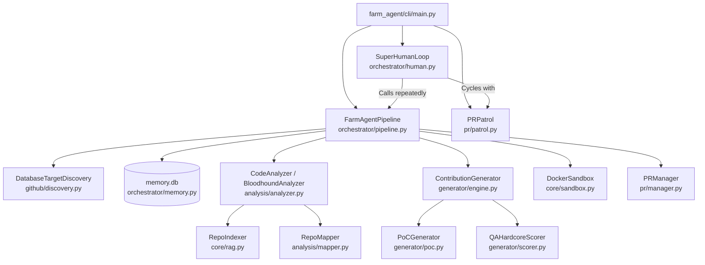

# PROJECT_MAP.md — Agent-Farm Ground Truth

**Generated:** 2026-06-02  
**Version:** v4.0.0 — Omniscient Context Engine  
**Entry Point:** `farm_agent/cli/main.py` → `cli()` (Click-based CLI)  
**Language:** Python 3.11+  
**Evidence basis:** Direct code inspection. No assumptions. All line numbers and file paths are verified.

---

## 1. System Overview & Active Tech Stack

Agent-Farm is an autonomous AI agent system designed to discover GitHub repositories, scan them for security vulnerabilities and code flaws, generate patches, and validate those patches in an isolated sandbox before submitting Pull Requests. It operates relentlessly through its Terminator Mode (`SuperHumanLoop`) and manages PR lifecycles via a `PRPatrol` daemon.

| Component | Technology | Usage/Role |
|-----------|------------|------------|
| Language | Python 3.11+ | Primary application logic (`farm_agent` package). |
| Build Tool | `hatchling` | Defined in `pyproject.toml` as the build backend. |
| HTTP Client | `httpx` (async) | Used in `GitHubClient` for API communication. |
| Configuration | `pydantic-settings` & `PyYAML` | Type-safe configuration loading from `.env` and `config.yaml`. |
| Database / State | SQLite (`aiosqlite`) | `memory.db` runs in WAL mode to track state (PRs, targets, API usage). |
| Vector DB (RAG) | `chromadb` | Indexes and chunks subsystem documentation in `RepoIndexer`. |
| Sandbox Execution | `docker` | Uses the Docker SDK to spawn isolated containers (`DockerSandbox`). |
| Red Team Analysis | `semgrep` | Utilized in `BloodhoundAnalyzer` for early static vulnerability detection. |
| LLM Providers | `openrouter`, `google-genai` | Multi-model routing (DeepSeek for generation, Qwen for Layer 1, Gemini for Layer 2). |
| CLI Framework | `click` & `rich` | Rich terminal UI and command parsing in `farm_agent/cli/main.py`. |

---

## 2. Directory Structure

This is the active directory structure of the `farm_agent` package. (Disabled or trivial files have been omitted).

```text
farm_agent/
├── __init__.py
├── agents/
│   ├── __init__.py
│   └── registry.py                     # Agent configuration and task registry
├── analysis/
│   ├── __init__.py
│   ├── analyzer.py                     # CodeAnalyzer & BloodhoundAnalyzer logic
│   └── mapper.py                       # AST and regex-based RepoMapper for dependency graphing
├── cli/
│   ├── __init__.py
│   └── main.py                         # Click CLI entry points (run, superhuman, patrol, etc.)
├── core/
│   ├── __init__.py
│   ├── config.py                       # Pydantic v2 configuration models
│   ├── daily_log.py                    # Daily markdown activity logger
│   ├── exceptions.py                   # Custom error hierarchy (e.g., LLMRateLimitError)
│   ├── leaderboard.py                  # Statistics and PR success rate tracking
│   ├── logger.py                       # Rotating file logging setup
│   ├── middleware.py                   # Context middleware chain
│   ├── models.py                       # Core data structures (Repository, Finding, Contribution)
│   ├── notifier.py                     # Telegram notification integration
│   ├── profiles.py                     # Run profiles (quick, standard, thorough)
│   ├── quotas.py                       # API usage and quota controllers
│   ├── rag.py                          # ChromaDB vector DB and markdown semantic chunking
│   ├── retry.py                        # Async retry decorators
│   └── sandbox.py                      # DockerSandbox implementation (Polyglot Guillotine)
├── generator/
│   ├── __init__.py
│   ├── engine.py                       # ContributionGenerator for writing patches
│   ├── poc.py                          # PoCGenerator for dynamic bug verification scripts
│   ├── reviewer.py                     # Self-reflective code auditor
│   └── scorer.py                       # QAHardcoreScorer for evaluating generated patches
├── github/
│   ├── __init__.py
│   ├── client.py                       # Async-retrying GitHub REST/GraphQL client
│   ├── discovery.py                    # Repository crawlers and DatabaseTargetDiscovery
│   ├── guidelines.py                   # Parses CONTRIBUTING.md, PR templates, and docs
│   └── security_gate.py                # Identifies private security disclosure protocols
├── issues/
│   ├── __init__.py
│   └── solver.py                       # IssueSolver for processing existing open issues
├── llm/
│   ├── __init__.py
│   ├── agents.py                       # LLM agent system prompts
│   ├── context.py                      # Context builders for LLM instructions
│   ├── models.py                       # Model capability registry
│   ├── provider.py                     # OpenRouter integration and API handlers
│   └── router.py                       # Maps tasks to optimal LLM models
├── notifications/
│   ├── __init__.py
│   └── notifier.py                     # Multi-channel notification dispatcher
├── orchestrator/
│   ├── __init__.py
│   ├── human.py                        # SuperHumanLoop (Terminator Mode) execution scheduler
│   ├── memory.py                       # SQLite memory database interface and schema
│   └── pipeline.py                     # Main FarmAgentPipeline and DEV-QA logic
├── plugins/
│   └── __init__.py
├── pr/
│   ├── __init__.py
│   ├── manager.py                      # PR creation, forking, and branch management
│   └── patrol.py                       # PRPatrol daemon for reading comments and fixing CI
├── templates/
│   ├── __init__.py
│   ├── builtin/                        # YAML templates for PR descriptions
│   └── registry.py
└── tools/
    ├── __init__.py
    └── protocol.py                     # CLI tool protocols
```

---

## 3. Core Module Dependency Graph



---

## 4. Core Execution Loops / Entry Points

The system is driven by a series of distinct operational loops, coordinated primarily through the CLI.

### 4.1 Terminator Mode (`SuperHumanLoop`)
Located in `farm_agent/orchestrator/human.py`, triggered by `farm_agent superhuman`.
1. **Continuous Execution:** A relentless `while True` loop that runs continuously, handling rate limits via dynamic cooldowns.
2. **Action Cycling:** Cycles between hunting for new vulnerabilities (`_do_hunt`) and patrolling existing PRs (`_do_patrol`).
3. **Safety Caps:** Respects the `max_prs_per_day` configuration. Once reached, it falls back to a "patrol-only" mode.

### 4.2 Circular Target Pipeline (`run_circular`)
Located in `farm_agent/orchestrator/pipeline.py`, triggered by `farm_agent hunt-circular` or by `SuperHumanLoop`.
1. **Target Selection:** Fetches the oldest scanned target from the `target_repos` SQLite table.
2. **Analysis:** Runs `BloodhoundAnalyzer` for a fast initial pass. If clean, marks as `COMPLETED_NO_VULN`.
3. **DEV-QA Bounty Loop:** Generates a fix via `ContributionGenerator`. Scores the fix using Qwen (`QAHardcoreScorer`). Rejections generate lessons stored in the DB.
4. **Sandbox Validation:** The `DockerSandbox` validates the fix using Efficacy (running the PoC) and Regression (running native test suites).
5. **Supreme Audit & Submission:** Gemini 3.5 evaluates the full dossier. If approved, the PR is opened via `PRManager`.

### 4.3 PR Patrol Daemon (`PRPatrol`)
Located in `farm_agent/pr/patrol.py`, triggered by `farm_agent patrol`.
1. **Feedback Collection:** Queries open and pending PRs from the database.
2. **Comment Analysis:** Fetches recent maintainer comments and CI status from GitHub. Uses an LLM to classify feedback (e.g., `CODE_FIX`, `QUESTION`, `CI_FAILURE`).
3. **Auto-Fixing:** If a code change or CI fix is required, it parses error logs, identifies the buggy file, generates a new fix in the sandbox, and pushes the commit directly to the existing PR branch.

---

## 5. Database/State Schema

All state is persisted via `aiosqlite` in `data/memory.db`. The system runs in WAL (Write-Ahead Logging) mode for concurrent access. Defined in `farm_agent/orchestrator/memory.py`.

* **`analyzed_repos`**: Tracks repositories that have already been scanned to avoid duplicate work (`full_name`, `language`, `stars`, `analyzed_at`, `findings`).
* **`submitted_prs`**: The core ledger of all bot-created PRs and issues (`repo`, `pr_number`, `pr_url`, `status`, `ci_fix_attempts`, `discussion_replies`).
* **`findings_cache`**: Temporary storage for detected code findings.
* **`run_log`**: Historical metrics of pipeline runs (repos analyzed, PRs created, errors).
* **`pr_outcomes`**: Tracks merged/closed states and records maintainer feedback.
* **`repo_preferences`**: Learned data (merge rate, rejected types) updated dynamically based on outcomes.
* **`blacklisted_repos`**: Projects explicitly banned due to toxic maintainer interactions or repeated failures.
* **`api_usage_log`**: Tracks LLM calls (provider, timestamp) to enforce sliding-window quotas.
* **`task_schedule`**: Persistent scheduling for tasks (e.g., quota cleanups).
* **`knowledge_base`**: Stores AI lessons, QA critiques, and architectural context to prevent repeating mistakes (`repo_name`, `entry_type`, `content`).
* **`target_repos`**: The queue for the Circular Target Loop (`repo_url`, `status`, `scanned_at`, `bounty_amount`).
* **`repo_style_guides`**: Caches parsed `CONTRIBUTING.md` rules and style summaries.
