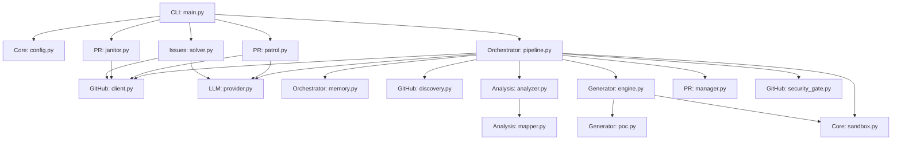

# PROJECT_MAP.md — Agent-Farm Ground Truth

**Generated:** 2026-06-02  
**Version:** v4.0.0 — Omniscient Context Engine  
**Entry Point:** `farm_agent/cli/main.py` → `cli()` (Click-based CLI)  
**Language:** Python 3.11+  

---

## 1. System Overview & Active Tech Stack

Agent-Farm is an autonomous AI agent system that discovers open-source GitHub repositories or scans targets for issues and vulnerabilities. It analyzes code via multi-phase LLM prompts, generates patches, validates them in isolated Docker sandboxes, runs a two-layer expert filter, and submits pull requests or private disclosures.

| Component | Technology | Description |
|-----------|------------|--------|
| **Language** | Python >= 3.11 | Core implementation language. |
| **Package Manager** | Hatchling | Build backend configured in `pyproject.toml`. |
| **HTTP Client** | `httpx` | Async retrying HTTP client for REST and GraphQL API calls. |
| **Configuration** | Pydantic v2 + YAML | Runtime configuration and environment variables definition. |
| **CLI Framework** | `click` + `rich` | Rich command-line interfaces (`farm_agent/cli/main.py`). |
| **Database** | SQLite (`aiosqlite`) | Local memory and state persistence configured in WAL mode. |
| **Vector DB** | ChromaDB | Used for local RAG indexing of documentation context (`farm_agent/core/rag.py`). |
| **Sandbox Execution** | Docker >= 7.1 | Isolated execution of PoC scripts and test suites. |
| **Containerization** | `docker-compose` | Deploys the main `agent-farm` container. |

---

## 2. Directory Structure

```ascii
.
├── .env.example                # Example environment variables configuration
├── config.example.yaml         # Example runtime configuration
├── docker-compose.yml          # Docker Compose service definition
├── Dockerfile                  # Stage 1 builder and Stage 2 runtime definitions
├── Makefile                    # Make targets: install, test, test-quick, lint, docker
├── pyproject.toml              # Project dependencies and build configuration (Hatchling)
├── requirements.txt            # Core required dependencies
├── start.bat                   # Windows 1-Click Docker Quick-Start Script
├── start.sh                    # Unix 1-Click Docker Quick-Start Script
├── farm_agent/                 # Package root
│   ├── agents/                 # Task agent configurations
│   ├── analysis/               # CodeAnalyzer, BloodhoundAnalyzer, RepoMapper
│   ├── cli/                    # Click CLI commands and entry point
│   ├── core/                   # Config, logging, models, RAG (ChromaDB), DockerSandbox
│   ├── generator/              # ContributionGenerator, PoCGenerator, ReviewerAgent
│   ├── github/                 # Async-retrying GitHub REST and GraphQL Client
│   ├── issues/                 # IssueSolver
│   ├── llm/                    # Agent prompts, openrouter integrations, model routing
│   ├── notifications/          # Integration handlers (Telegram, Slack, Discord)
│   ├── orchestrator/           # Main pipeline (FarmAgentPipeline), Memory (SQLite)
│   ├── plugins/                # Plugin handlers
│   ├── pr/                     # PRManager, PRPatrol, PRJanitor
│   ├── templates/              # PR formatting templates
│   └── tools/                  # CLI tool protocols
└── tests/                      # Unit and integration test suites
```

---

## 3. Core Module Dependency Graph



---

## 4. Core Execution Loops / Entry Points

The CLI provides entry points to several autonomous execution loops:

### A. Super Human Loop (`farm_agent superhuman`)
An organic 24/7 operational loop mimicking a human developer. It dynamically sets random daily PR quotas, injects human-like delays, interleaves the Circular Target Loop (`hunt-circular`) and the PR Patrol (`patrol`), and shifts to patrol-only mode once the PR quota is reached.

### B. Circular Target Loop (`farm_agent hunt-circular`)
Processes targets deterministically from `target_repo.json` using a round-robin approach.
1. Fetches oldest scanned target.
2. Evaluates targets via the **Bloodhound Red Team Analysis**.
3. Initiates a 3-Cycle **DEV-QA Bounty Loop** for code patch generation.
4. Subjects fixes to **Dynamic Bug Verification** and **Blast Radius** auditing in the Docker Sandbox.
5. Invokes the **Layer 2 Supreme Auditor** for final approval before `PRManager` submits the Pull Request.

### C. Standard Run Pipeline (`farm_agent run`)
Discover repositories based on criteria and pass them through `_process_repo()`.
1. Clones the repository locally and evaluates AI policies or interaction limits.
2. Indexes subsystem documentation into ChromaDB via `RepoIndexer`.
3. Performs a vibe check on recent maintainer comments to avoid toxic interactions.
4. Generates an AST-based dependency graph and uses an **Anti-Farming Filter** to block low-impact/garbage changes.
5. Generates code fixes or private vulnerability disclosures, validates them via Sandbox, and submits a PR.

### D. PR Patrol (`farm_agent patrol`)
Runs continuously to manage active PRs.
1. Scans open PRs created by the agent.
2. Classifies maintainer feedback into `CODE_FIX`, `QUESTION`, `CLA_RECHECK`, `CI_FAILURE`, or `TRIVIAL`.
3. Synthesizes responses, downloads CI logs, isolates tracebacks, launches an LLM to draft a CI fix, validates locally, and pushes a commit.

---

## 5. Database & State Schema

The persistent state is maintained via a SQLite database (`data/memory.db`) operating in Write-Ahead Logging (WAL) mode.

* **`analyzed_repos`**: Tracks repositories that have already gone through analysis (prevents duplicate runs).
* **`submitted_prs`**: Logs bot-created Pull Requests, issues, their URLs, status, branch, fork, and CI fix tracking info.
* **`findings_cache`**: Temporary cache of detected code findings.
* **`run_log`**: Log of overall run metrics (duration, repos analyzed, PRs created).
* **`pr_outcomes`**: Stores states of merged or closed PRs alongside maintainer review remarks.
* **`repo_preferences`**: Learned project contribution preferences updated dynamically from historical outcomes.
* **`blacklisted_repos`**: Projects blacklisted due to hostile maintainer checks or recurring failures.
* **`api_usage_log`**: Tracks LLM API usage. Includes composite index `idx_api_usage` for efficient quota querying.
* **`task_schedule`**: Persistent schedule queue for tasks in the `SuperHumanLoop`.
* **`knowledge_base`**: Central repository for lessons, QA critiques, and architectural context records.
* **`target_repos`**: Deterministic circular target queue.
* **`repo_style_guides`**: Caches contributing templates, formatting rules, and structures.