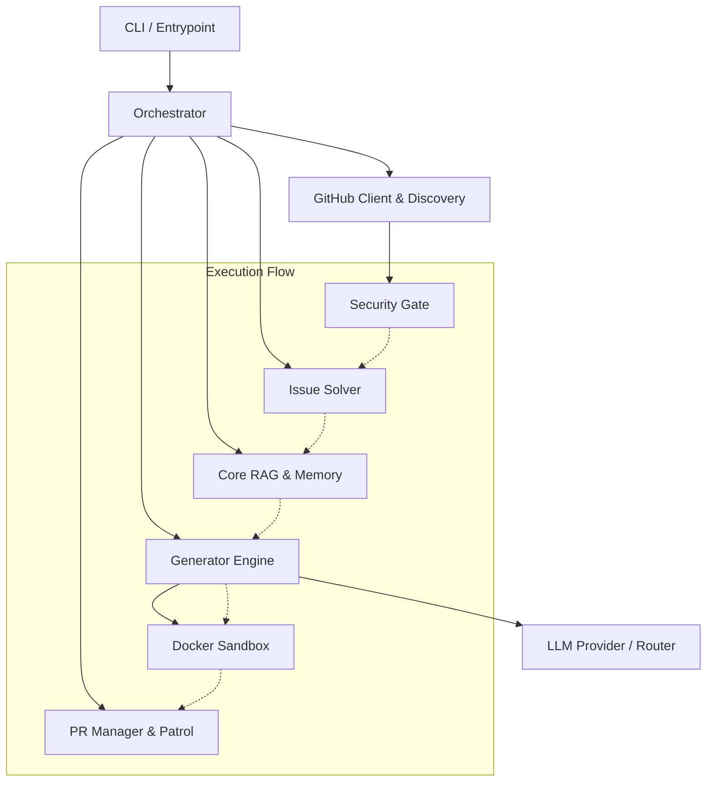

# Farm-Agent Architecture Blueprint

This document details the precise architecture, module interactions, and system designs of the Farm-Agent project. It reflects the live state of the codebase.

## 1. System Overview & Tech Stack

| Technology | Role |
| :--- | :--- |
| **Python 3.11+** | Core runtime and orchestrator implementation. |
| **Hatchling** | Build backend and project management (`pyproject.toml`). |
| **Docker** | Isolated sandbox for executing Proof of Concept (PoC) tests and running the Bloodhound pipeline components securely. |
| **SQLite (via `aiosqlite`)** | Persistent state management and orchestrator memory (`memory.db`). |
| **ChromaDB** | Vector store used for local Retrieval-Augmented Generation (RAG) to index and search codebase context. |
| **Semgrep** | Code security and static analysis tool utilized as a "Sentinel Radar" by the Bloodhound Red Team. |
| **LLMs (OpenRouter/Ollama)** | Powers code generation, analysis (DeepSeek), task routing, layer 1 appraisal (Qwen), and layer 2 audits (Gemini). |
| **Click & Rich** | Powers the advanced CLI interface and colorful terminal output. |

## 2. Directory Structure

```text
farm_agent/
├── __init__.py
├── cli/
│   └── main.py                 # Core CLI entrypoints (run, hunt, superhuman, patrol)
├── core/
│   ├── config.py               # Central configuration (Pydantic models for config.yaml)
│   ├── daily_log.py
│   ├── exceptions.py
│   ├── leaderboard.py          # Statistics tracking and merged PR scoring
│   ├── logger.py               # Rotating file and Rich console logging
│   ├── middleware.py
│   ├── models.py
│   ├── notifier.py             # Slack, Discord, and Telegram integration
│   ├── profiles.py             # Customizable execution profiles
│   ├── quotas.py
│   ├── rag.py                  # Local ChromaDB integration for semantic codebase search
│   ├── retry.py
│   └── sandbox.py              # Docker sandbox wrapper for running untrusted code/tests
├── generator/
│   ├── engine.py               # Core LLM prompt building and code generation
│   ├── poc.py                  # Proof of concept generation and execution
│   ├── reviewer.py
│   └── scorer.py
├── github/
│   ├── client.py               # Async GitHub REST API wrapper with rate-limit handling
│   ├── discovery.py            # Repository search and filtering
│   ├── guidelines.py
│   └── security_gate.py        # Prevents targeting repos demanding private vulnerability disclosure
├── issues/
│   └── solver.py               # Issue classification, complexity heuristics, and task routing
├── llm/
│   ├── agents.py
│   ├── models.py               # Model definitions (DeepSeek, Qwen, Gemini, Minimax)
│   ├── provider.py
│   └── router.py               # Multi-model routing logic for specialized tasks
├── orchestrator/
│   ├── human.py                # Super Human Mode loop with unpredictable delays
│   ├── memory.py               # Async SQLite database interface for run state
│   └── pipeline.py             # Master 'DeerFlow' execution sequence logic
└── pr/
    ├── manager.py
    └── patrol.py               # Auto-reply, maintainer feedback loop, and CLA signer
```

*(Note: Trivial configuration files, templates, plugins, disabled scripts, and tests are excluded for brevity.)*

## 3. Core Module Dependency Graph

The following Mermaid diagram outlines the 'DeerFlow' registry-based agent architecture, showing how the Orchestrator interacts with various modules:



## 4. Core Execution Loops

Farm-Agent is driven by several nested loops, orchestrated primarily through the CLI.

### Super Human Loop (`farm_agent superhuman`)
This is a 24/7 autonomous loop that mimics an organic developer:
1. **Quota Generation:** Randomly generates a daily PR quota based on configuration parameters.
2. **Task Interleaving:** Alternates randomly between initiating a `Hunt` (new targets) and a `Patrol` (maintaining existing PRs).
3. **Simulated Delays:** Injects unpredictable human-like sleep intervals (e.g., "coffee breaks") between operations to avoid strict robotic cadences.
4. **Shutdown Hooks:** Gracefully manages SIGINT/SIGTERM to flush the DB and clean up.

### The Pipeline Sequence (The 'DeerFlow')
For any single repository target, the pipeline strictly executes:
1. **Discovery:** Repository is found or ingested from `target_repo.json`.
2. **Gate:** The `security_gate.py` scans `SECURITY.md` for explicit phrases requesting private disclosure. If found, it aborts.
3. **Analysis:** The codebase is cloned shallowly, parsed (AST/Semgrep), and indexed into local RAG.
4. **Engine:** The Generator utilizes LLMs to synthesize fixes for known bugs or issues (`issues/solver.py`).
5. **Sandbox:** Generated modifications are applied and validated within the isolated Docker container to ensure functionality.
6. **PR:** A pull request is created.
7. **Patrol:** The PR is periodically checked by `pr/patrol.py` for feedback to automatically generate subsequent fix commits.

## 5. Database & State Schema

The system uses an asynchronous SQLite database (`aiosqlite`), initialized idempotently at `data/memory.db`. Key tables include:

*   **`analyzed_repos`**: Tracks repositories that have been processed to prevent immediate re-analysis.
*   **`submitted_prs`**: Records every created Pull Request, its repository, state (`open`, `merged`, `closed`), and timestamp. Used heavily by the PR Patrol system.
*   **`run_log`**: Detailed audit trail of operations, durations, and exceptions.
*   **`findings_cache`**: Caches static analysis (Semgrep) results for performance.
*   **`knowledge_base`**: Stores historical learnings (QA lessons, audit history) which can be garbage-collected via `farm_agent gc`.
*   **`target_repos`**: Maintains a queue of user-specified repositories.

*Migrations are handled implicitly in `Memory.init()` using `try-except` blocks that capture `sqlite3.OperationalError`.*
