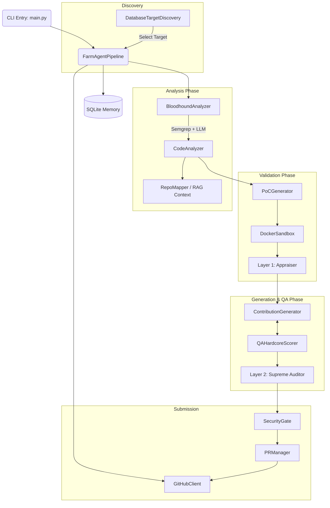

# 🗺️ Agent-Farm (v4.0.0) — Architecture Blueprint

This document serves as a deep-dive architectural guide for new developers, reflecting the current state of the Agent-Farm codebase.

---

## 1. System Overview & Tech Stack

Agent-Farm is built with a highly modular, decoupled architecture focused on safety, precision, and autonomy. The core system operates in isolated execution phases coordinated by an asynchronous orchestrator.

| Component / Layer | Technology | Role in Project |
|-------------------|------------|-----------------|
| **Core Language** | Python 3.11+ | Main implementation language. Leveraging `asyncio` for high concurrency. |
| **CLI / TUI** | Click, Rich | Provides the terminal interface and subcommands. |
| **Configuration** | Pydantic, YAML | Typed configuration loading from `config.yaml` and `.env` fallback. |
| **API Client** | HTTPX | Asynchronous GitHub API interactions with rate-limit and TOCTOU defense. |
| **LLM Provider** | OpenRouter (DeepSeek, Qwen, Gemini) | Multi-model routing. DeepSeek for generation/PoC, Qwen for Layer 1, Gemini for Layer 2. |
| **Local Knowledge** | ChromaDB | Retrieval-Augmented Generation (RAG) vector store for indexing subsystem docs. |
| **State Storage** | SQLite (`aiosqlite`) | Persistent memory tracking analyzed repos, submitted PRs, and targets (`memory.db`). |
| **Execution Sandbox**| Docker Engine | Executes PoC scripts and test suites safely using strict Linux capabilities isolation. |
| **Pre-Scan Engine** | Semgrep | Used by Bloodhound Red Team for fast, deterministic vulnerability detection before LLMs. |

---

## 2. Directory Structure

A high-level view of the `farm_agent` module structure and key files.

```ascii
farm_agent/
├── agents/             # Modular tool-using sub-agents
│   └── registry.py     # Registers custom agents for specialized tasks
├── analysis/           # Codebase Scanning and Vulnerability Detection
│   ├── analyzer.py     # Integrates Bloodhound (Semgrep) and LLM-based CodeAnalyzer
│   └── mapper.py       # AST-based dependency graph and RepoMapper
├── cli/                # Command-Line Interface
│   └── main.py         # Entry point for all CLI commands (run, hunt, superhuman, etc.)
├── core/               # System Configurations and Core Logic
│   ├── config.py       # Pydantic configuration definitions
│   ├── logger.py       # Daily rotating file logger and Rich integration
│   ├── memory.py       # SQLite database abstraction layer (persistent state)
│   ├── middleware.py   # DeerFlow pattern middleware execution chain
│   ├── rag.py          # ChromaDB integration for Omniscient Context Engine
│   └── sandbox.py      # DockerSandbox implementation with strict constraints
├── generator/          # Code patch generation and PoC logic
│   ├── engine.py       # ContributionGenerator for fixes
│   ├── poc.py          # PoCGenerator for dynamic bug verification
│   └── scorer.py       # QAHardcoreScorer for evaluating generated patches
├── github/             # GitHub API Interactions
│   ├── client.py       # Async wrapper for GitHub API and GraphQL
│   ├── discovery.py    # Target repo discovery (DatabaseTargetDiscovery)
│   ├── guidelines.py   # Parses CONTRIBUTING.md and style guides
│   └── security_gate.py# Scans for private disclosure requirements
├── issues/             # Issue-First Protocol
│   └── solver.py       # Locates and proposes solutions to open GitHub issues
├── llm/                # LLM Integration and Multi-Model Routing
│   ├── provider.py     # Provider abstraction
│   ├── models.py       # Definitions for TaskType and Provider configurations
│   └── router.py       # TaskRouter for delegating to correct models
├── notifications/      # Real-time Webhook Notifications
│   └── notifier.py     # Integration for Slack, Discord, Telegram
├── orchestrator/       # Pipeline and Flow Control
│   ├── human.py        # SuperHumanLoop (Terminator Mode) implementation
│   └── pipeline.py     # FarmAgentPipeline: main execution flow
├── plugins/            # Extensibility framework for 3rd party plugins
├── pr/                 # Pull Request Management
│   ├── manager.py      # PR creation and compliance validation
│   └── patrol.py       # PRPatrol for responding to maintainer reviews
├── templates/          # Contribution formatting rules
└── tools/              # Tools accessible by the agents (ToolRegistry)
```

*(Note: Deprecated scripts or files with a `.DISABLED` extension are excluded.)*

---

## 3. Core Module Dependency Graph

The following Mermaid graph illustrates the interactions between the main architectural components when processing a single repository.



---

## 4. Core Execution Loops / Entry Points

The heartbeat of Agent-Farm is orchestrated in `farm_agent/orchestrator/pipeline.py`. When a target repository is selected, the application follows this step-by-step path:

1. **Discovery & Selection (`_discovery.get_next_target`)**:
   Targets are picked deterministically from the persistent `target_repos` SQLite table.

2. **Pre-Scan / Analysis (`_analyzer.analyze`)**:
   - `BloodhoundAnalyzer` runs Semgrep to find hard security bugs.
   - `CodeAnalyzer` refines findings.
   - The system checks repository meta-files (like `CONTRIBUTING.md`) and assesses the maintainer's vibe to decide whether to proceed.

3. **Dynamic Bug Verification (`PoCGenerator` + `DockerSandbox`)**:
   Before generating a fix, the pipeline writes a Proof-of-Concept script. It mounts the repo inside `DockerSandbox` and executes the PoC. If it fails to trigger the bug, the finding is discarded.

4. **Appraisal (Layer 1 Appraiser)**:
   A lightweight, highly critical model (Qwen) verifies if the finding is a genuine, exploitable vulnerability.

5. **Fix Generation (DEV-QA Loop)**:
   - `ContributionGenerator` outputs a code patch.
   - `QAHardcoreScorer` reviews the patch against the repo's style guide. If rejected, critiques are recorded and injected into the failure context for the next cycle (up to 3 cycles).

6. **Regression Audit (`DockerSandbox`)**:
   The sandbox clones the repository, applies the proposed patch, and runs the native test suite (Pass 2). It also re-runs the PoC (Pass 1) to ensure the bug is actually squashed.

7. **Final Audit & Submission**:
   - **Layer 2 Supreme Auditor** (Gemini) does a final sanity check of the dossier, the patch, and the sandbox execution logs.
   - **Security Disclosure Gate** ensures the maintainers do not require a private disclosure via HackerOne or GitHub Security Advisories.
   - If all checks pass, `PRManager` pushes the commit and opens a pull request, logging the state back into SQLite.

---

## 5. Database/State Schema

Agent-Farm utilizes an `aiosqlite` backend (`memory.db`) to ensure crash-safe persistence and rate-limit tracking. Key tables include:

* **`target_repos`**: Powers the Circular Target Loop. Stores `repo_url` and `scanned_at` timestamps to ensure deterministic round-robin targeting.
* **`run_log`**: Tracks execution statistics per pipeline run (e.g., findings found, PRs created, duration).
* **`analyzed_repos`**: Caches previously analyzed repositories to avoid redundant API usage.
* **`submitted_prs`**: Stores all PRs created by the agent, mapped by `status` (open, merged, closed). This table powers the `PRPatrol` subsystem and Alumni Sync logic.
* **`knowledge_base`**: Stores learned insights, QA critiques, and repository-specific style rules.
* **`findings_cache`**: Caches specific vulnerability findings to prevent duplication.
* **`pr_outcomes`**: Statistical tracking of what types of PRs succeed or fail.
* **`repo_preferences` & `blacklisted_repos`**: Manages interaction limits, toxic maintainer identification, and compliance bypasses.
