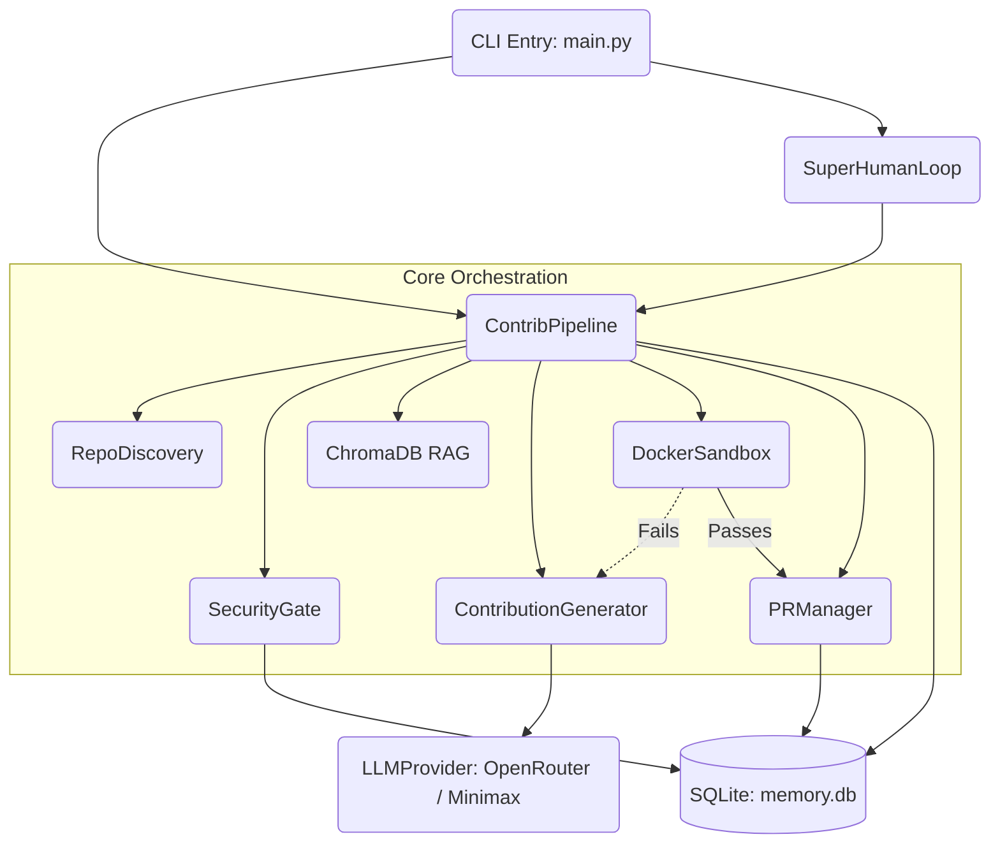

# PROJECT_MAP.md — Farm-Agent Architectural Blueprint

## 1. System Overview & Tech Stack

Farm-Agent is a highly orchestrated AI system built to discover repositories, identify vulnerabilities, generate patches, and autonomously submit verified Pull Requests.

| Component             | Technology                          | Role in System                                                                                               |
| --------------------- | ----------------------------------- | ------------------------------------------------------------------------------------------------------------ |
| **Language**          | Python 3.11+                        | Core logic and execution. Enforces strict `ruff` linting and modern async constructs.                        |
| **HTTP Client**       | `httpx` (async)                     | Handles asynchronous interactions with GitHub REST API and external LLM APIs.                                |
| **LLM Engine**        | MiniMax, OpenRouter (Anthropic/OAI) | Drives patch generation (`ContributionGenerator`), PR feedback evaluation, and Bloodhound QA/Red Team tasks. |
| **Vector DB**         | `chromadb`                          | Local embeddings storage for Retrieval-Augmented Generation (RAG) to maintain file context.                  |
| **Execution Sandbox** | Docker SDK (`docker`)               | Polyglot Sandbox Guillotine. Runs compiled code, linters, and tests in network-isolated containers.          |
| **State Management**  | SQLite (`aiosqlite`)                | Persistent WAL-mode database holding analysis findings, repo blacklists, API quotas, and outcome logs.       |
| **CLI Framework**     | `click`, `rich`                     | Drives execution commands (`run`, `target`, `superhuman`, `patrol`) with robust terminal output.             |
| **Git Management**    | `gitpython`                         | Manages local repository clones, branch checkouts, and applying patch sets.                                  |
| **Config Validation** | `pydantic`, `pydantic-settings`     | Strictly types and validates `config.yaml` / environment variables at runtime.                               |

## 2. Directory Structure

```ascii
farm_agent/
├── __init__.py          # Package root
├── cli/
│   ├── main.py          # Primary entry point: defines Click CLI commands (run, target, patrol, superhuman)
├── core/
│   ├── config.py        # Pydantic configuration and env var loading
│   ├── exceptions.py    # Custom domain exceptions (LLMRateLimitError, ConfigError, etc.)
│   ├── leaderboard.py   # Stats aggregation for repo metrics and PR merge rates
│   ├── logger.py        # Structured daily rolling file logger setup
│   ├── middleware.py    # Middleware chain enforcing pipeline limits
│   ├── models.py        # Core Pydantic domain models (Repository, Finding, Contribution, FileChange)
│   ├── notifier.py      # Slack/Discord/Telegram webhook execution
│   ├── profiles.py      # Contribution style configurations
│   ├── quotas.py        # Cross-run logic for enforcing PR rate limits
│   ├── rag.py           # ChromaDB semantic chunking and search for context augmentation
│   ├── retry.py         # Async and HTTP retry decorators
│   └── sandbox.py       # DockerSandbox: strict execution engine for patch validation
├── generator/
│   ├── engine.py        # Generates code patches and PR bodies using LLM
│   ├── reviewer.py      # LLM-based secondary review layer
│   └── scorer.py        # QA evaluation (QAHardcoreScorer) to enforce code guidelines
├── github/
│   ├── client.py        # Abstracts raw GitHub API interactions
│   ├── discovery.py     # Discovers new target repos matching stars/language criteria
│   ├── guidelines.py    # Fetches CONTRIBUTING.md and repo style preferences
│   └── security_gate.py # Security Disclosure Gate: blocks PRs for private-disclosure-only repos
├── issues/
│   └── solver.py        # Fetch, classify, and attempt to resolve open GitHub Issues
├── llm/
│   ├── models.py        # Supported LLM catalog and capabilities
│   ├── provider.py      # Instantiates LLM clients (Minimax, OpenRouter)
│   ├── router.py        # Dynamically assigns the best model depending on the task type
│   └── context.py       # Context assembly
├── notifications/
│   └── notifier.py      # General notifications routing
├── orchestrator/
│   ├── human.py         # SuperHumanLoop: relentless 24/7 daemon loop execution
│   ├── memory.py        # Core aiosqlite interface for schemas like `analyzed_repos` and `submitted_prs`
│   └── pipeline.py      # ContribPipeline: Core execution flow bringing all phases together
├── pr/
│   ├── manager.py       # Fork, branch, commit, push, and PR creation via GitPython and GitHubClient
│   ├── patrol.py        # PR Patrol: Auto-responds to PR comments and pushes fixes
│   └── janitor.py.DISABLED # Disabled PR cleanup module
├── templates/
│   └── registry.py      # Common contribution boilerplate structures
└── tools/
    └── protocol.py      # LLM tool calling schema definitions
```

## 3. Core Module Dependency Graph



## 4. Core Execution Loops

### The Standard Pipeline Loop (`farm_agent run` / `target`)
1. **Discovery / Target Acquisition:** Obtains a target repository via the CLI argument or the `RepoDiscovery` module.
2. **Pre-Flight Gates:** Checks AI policy rules, contributor limits, and runs the `SecurityGate` to abort if the repo requires private vulnerability disclosure.
3. **Analysis:** Deep static code scans (like Bloodhound/Semgrep) build a dossier of findings. The "Anti-Farming Filter" immediately drops trivial or formatting issues.
4. **Context Building:** `ChromaDB` generates embeddings for affected files to ensure the LLM has accurate scope.
5. **Generation & QA (DEV-QA Loop):** The LLM generates a patch. `QAHardcoreScorer` evaluates the diff. If it fails, failure context is fed back into the generator up to a retry limit.
6. **Validation:** The `DockerSandbox` clones the repo, applies the patch, and runs native test suites/linters.
7. **Submission:** `PRManager` forks the repo (if needed), checks out a branch, commits the validated patch, and creates a PR.

### The Superhuman / Terminator Loop (`farm_agent superhuman`)
1. An infinite daemon loop that constantly polls for available API quotas and PR caps.
2. Iterates between `RepoDiscovery` and executing the Standard Pipeline Loop across multiple repos.
3. Rotates between fallback tokens (`GITHUB_SECONDARY_TOKENS`) to maximize throughput.

### The PR Patrol Loop (`farm_agent patrol`)
1. Queries the SQLite DB for open `submitted_prs`.
2. Checks GitHub for recent maintainer comments on those PRs.
3. If new feedback is detected, feeds the diff and comments into the LLM.
4. Pushes an auto-fix commit to the existing branch.

## 5. Database/State Schema (`data/memory.db`)

Managed by `farm_agent/orchestrator/memory.py` via `aiosqlite` in WAL-mode.

*   `analyzed_repos`: Tracks scanned repositories (`full_name`, `analyzed_at`, `findings`) to prevent redundant scans.
*   `submitted_prs`: Master ledger of created PRs (`pr_number`, `repo`, `branch`, `status`, `ci_fix_attempts`).
*   `findings_cache`: Caches `Bloodhound` and static analysis results.
*   `run_log`: High-level metrics for pipeline executions.
*   `pr_outcomes`: Tracks whether PRs were merged, closed, or remained open, allowing the system to calculate merge rates.
*   `repo_preferences`: Stores specific style preferences and historical average merge times per repo.
*   `blacklisted_repos`: Repos to permanently ignore (e.g., due to hostile maintainer feedback).
*   `api_usage_log`: Used by the sliding-window quota checker to track LLM provider consumption.
*   `task_schedule`: Coordinates periodic background tasks (e.g., db cleanup) across multiple processes.
*   `target_repos`: Manages the round-robin queues for the Circular Target Loop.
*   `repo_style_guides`: Caches extracted PR templates and `CONTRIBUTING.md` guidelines.
