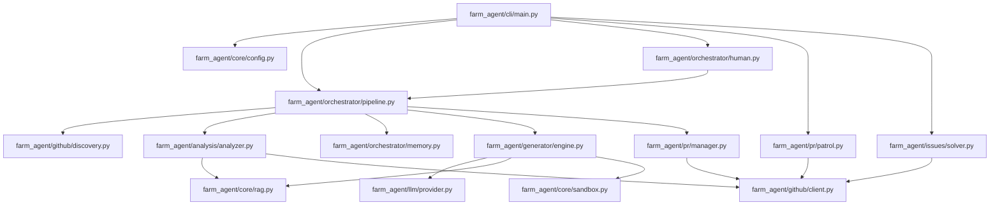

# PROJECT_MAP.md — Farm-Agent Ground Truth

**Generated:** 2026-04-15
**Version:** v3.0.0
**Entry Point:** `farm_agent/cli/main.py` → `cli()` (Click-based CLI)
**Language:** Python 3.11+

---

## 1. System Overview & Current State

**What the system actually does:**

Farm-Agent is an autonomous AI agent that discovers open-source GitHub repositories matching criteria (language, star range, activity), scans their code for issues (security vulnerabilities, code quality bugs, performance problems, etc.), generates patches via LLM, validates patches in Docker sandboxes, and creates PRs or GitHub Issues to contribute back.

**Active Tech Stack:**

| Component | Technology | Evidence |
|-----------|------------|----------|
| Language | Python 3.11+ | `requires-python = ">=3.11"` in `pyproject.toml` |
| HTTP client | `httpx` (async) | `httpx>=0.27,<1.0` |
| LLM Providers | MiniMax, OpenAI, Anthropic, Gemini, Ollama | `farm_agent/core/config.py` |
| Database | SQLite via `aiosqlite` | `memory.py` — WAL mode, `data/memory.db` default |
| Docker | `docker>=7.1,<8.0` | `pyproject.toml`, `sandbox.py` |
| Scheduling | `apscheduler>=3.10,<4.0` | `pyproject.toml` |
| Config | Pydantic v2 + YAML | `config.py` — all config in `FarmAgentConfig` |
| CLI | `click>=8.1,<9.0` + `rich>=13.0,<14.0` | `main.py` |
| Vector DB | `chromadb>=0.4,<1.0` | `pyproject.toml` |
| Git Python | `gitpython>=3.1,<4.0` | `pyproject.toml` |

---

## 2. Directory Structure

```text
farm_agent/
├── __init__.py          # Version = "3.0.0"
├── agents/
│   ├── __init__.py
│   └── registry.py      # DeerFlow agent system
├── analysis/
│   ├── __init__.py
│   ├── analyzer.py      # CodeAnalyzer.analyze() — static code analysis
│   └── mapper.py
├── cli/
│   ├── __init__.py
│   └── main.py          # Click CLI, all commands (run, hunt, patrol, etc.)
├── core/
│   ├── __init__.py
│   ├── config.py        # Pydantic config system
│   ├── daily_log.py
│   ├── exceptions.py
│   ├── leaderboard.py
│   ├── logger.py
│   ├── middleware.py    # Middleware chain (DeerFlow pattern)
│   ├── models.py        # Pydantic models
│   ├── notifier.py
│   ├── profiles.py
│   ├── quotas.py
│   ├── rag.py           # ChromaDB RAG engine
│   ├── retry.py         # Retry decorators
│   └── sandbox.py       # DockerSandbox — Polyglot Sandbox Validation
├── generator/
│   ├── __init__.py
│   ├── engine.py        # ContributionGenerator
│   ├── reviewer.py      # ContributionReviewer
│   └── scorer.py        # QA evaluation
├── github/
│   ├── __init__.py
│   ├── client.py        # GitHubClient
│   ├── discovery.py     # RepoDiscovery + DatabaseTargetDiscovery
│   ├── guidelines.py    # CONTRIBUTING.md parsing
│   └── security_gate.py # Security Disclosure Gate
├── issues/
│   ├── __init__.py
│   └── solver.py        # IssueSolver — fetch + classify + solve GitHub issues
├── llm/
│   ├── __init__.py
│   ├── agents.py
│   ├── context.py
│   ├── models.py
│   ├── provider.py      # LLM Provider initialization
│   └── router.py        # TaskRouter
├── notifications/
│   ├── __init__.py
│   └── notifier.py
├── orchestrator/
│   ├── __init__.py
│   ├── human.py         # SuperHumanLoop — 24/7 autonomous daemon
│   ├── memory.py        # SQLite-backed persistent state
│   └── pipeline.py      # ContribPipeline — main orchestrator
├── plugins/
│   └── __init__.py
├── pr/
│   ├── __init__.py
│   ├── manager.py       # PRManager — create and manage PRs
│   └── patrol.py        # PRPatrol — monitor open PRs
├── templates/
│   ├── __init__.py
│   ├── builtin/         # Built-in contribution templates
│   └── registry.py
└── tools/
    ├── __init__.py
    └── protocol.py      # DeerFlow tool system
```

---

## 3. Core Module Dependency Graph



---

## 4. Core Execution Loops / Entry Points

### Pipeline Execution Flow (Discovery -> Gate -> Analysis -> Engine -> Sandbox -> PR)

1. **Discovery:**
   - `RepoDiscovery.discover()` finds target repositories using GitHub Search or Database targets.
   - `github.check_interaction_limits()` skips repos restricting to prior contributors only.
2. **Gate (Security & Policy Checks):**
   - AI Policy Block: Checks for bans in `AI_POLICY.md`.
   - Security Disclosure Gate: Aborts if private disclosure phrases exist.
   - Anti-Farming Filter: Drops LOW/TRIVIAL impact findings and documentation-only fixes.
3. **Analysis / Issues Solver:**
   - Either `IssueSolver` fetches available issues, or `CodeAnalyzer` statically analyzes the codebase.
   - Validated findings are forwarded.
4. **Engine (Code Generation):**
   - `ContributionGenerator` uses LLM + Context/RAG to generate patches based on findings or issues.
5. **Sandbox (Validation):**
   - Patches are built and run in an isolated `DockerSandbox`.
   - Validation ensures tests/linters pass. Failure leads to self-correction (max 3 retries).
6. **PR (Submission):**
   - `PRManager.create_pr()` forks, branches, pushes, and creates the PR.
   - Records the submission in `memory.db`.

### Circular Target Loop (DEV-QA Bounty Loop)

When running `farm_agent hunt-circular`:
- Target is fetched from `DatabaseTargetDiscovery`.
- DEV-QA Cycle Loop runs: `ContributionGenerator` proposes a fix.
- `QAHardcoreScorer` evaluates the fix against repository style guides.
- If rejected, QA lessons are injected into failure context and retry happens (up to 3 times).
- If approved, PR is submitted.

### Super Human Mode
Runs via `farm_agent superhuman`:
- Background 24/7 autonomous engine orchestrated via `SuperHumanLoop`.
- Follows stochastic schedules, simulating coding delays and quota restrictions to mimic a human workflow.

---

## 5. Database Schema & State

**SQLite DB at:** `data/memory.db`

The schema is defined in `farm_agent/orchestrator/memory.py` and includes:

| Table | Primary Columns | Purpose |
|-------|-----------------|---------|
| `analyzed_repos` | `full_name` (PK), `language`, `stars`, `analyzed_at`, `findings`, `metadata` | Track which repos have been scanned |
| `submitted_prs` | `id`, `repo`, `pr_number` (UNIQUE), `pr_url`, `title`, `type`, `status`, `branch`, `fork`, `created_at`, `updated_at`, `ci_fix_attempts`, `discussion_replies` | All PRs submitted by the agent |
| `findings_cache` | `id`, `repo`, `type`, `severity`, `title`, `file_path`, `status`, `created_at` | Cached analysis findings |
| `run_log` | `id`, `started_at`, `finished_at`, `repos_analyzed`, `prs_created`, `findings`, `errors`, `metadata` | Historical pipeline runs |
| `pr_outcomes` | `id`, `repo`, `pr_number` (UNIQUE), `pr_url`, `pr_type`, `outcome`, `feedback`, `time_to_close_hours`, `recorded_at` | Outcome tracking for learning |
| `repo_preferences` | `repo` (PK), `preferred_types`, `rejected_types`, `merge_rate`, `avg_review_hours`, `notes`, `updated_at` | Per-repo learned preferences |
| `blacklisted_repos` | `repo` (PK), `reason`, `pr_number`, `blacklisted_at` | Permanently blocked repos |
| `api_usage_log` | `id`, `timestamp` (Unix epoch), `provider` | LLM API usage for quota tracking |
| `task_schedule` | `task_key` (PK), `next_run`, `updated_at` | Persistent task scheduling |
| `knowledge_base` | `repo_name`, `entry_type`, `content`, `created_at` (UNIQUE) | QA lessons, audit history |
| `target_repos` | `repo_url` (PK), `status`, `scanned_at` (Unix ts), `language`, `bounty_amount`, `diamond_target` | Circular loop targets |
| `repo_style_guides` | `repo` (PK), `style_summary`, `contributing_md`, `pr_template`, `created_at`, `updated_at` | Cached CONTRIBUTING.md parses |

Database migrations in the orchestrator's persistent memory (`Memory.init()`) are implemented idempotently by wrapping DDL operations in try-except blocks that ignore 'already exists' or 'duplicate column name' errors from `sqlite3.OperationalError`.
