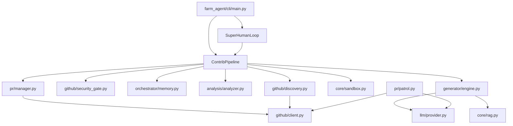

# PROJECT_MAP.md — Farm-Agent Ground Truth

**Generated:** 2026-04-15
**Version:** v3.2.0 (from git tag at commit `0b96a08`)
**Entry Point:** `farm_agent/cli/main.py` → `cli()` (Click-based CLI)
**Language:** Python 3.11+

---

## 1. System Overview & Current State

**What the system actually does:**

Farm-Agent is an autonomous AI agent that discovers open-source GitHub repositories matching criteria (language, star range, activity), scans their code for issues (security vulnerabilities, code quality bugs, performance problems, etc.), generates patches via LLM, validates patches in Docker sandboxes, and creates PRs or GitHub Issues to contribute back.

**Active Tech Stack:**

| Component | Technology | Evidence |
|-----------|------------|----------|
| Language | Python 3.11+ | `requires-python = ">=3.11"` in `pyproject.toml` |
| HTTP client | `httpx` (async) | `httpx>=0.27,<1.0` |
| LLM Providers | MiniMax, OpenRouter (via `google-genai` + `openai` + `anthropic`) | `config.py:55-68` |
| Database | SQLite via `aiosqlite` | `memory.py` — WAL mode, `data/memory.db` default |
| Docker | `docker>=7.1,<8.0` | `pyproject.toml`, `sandbox.py` |
| Scheduling | `apscheduler>=3.10,<4.0` | `pyproject.toml` |
| Config | Pydantic v2 + YAML | `config.py` — all config in `FarmAgentConfig` |
| CLI | `click>=8.1,<9.0` + `rich>=13.0,<14.0` | `main.py` |
| Vector DB | `chromadb>=0.4,<1.0` | `pyproject.toml` |
| Git Python | `gitpython>=3.1,<4.0` | `pyproject.toml` |

## 2. Directory Structure

```text
farm_agent/
├── __init__.py
├── agents/             # Registration/loading of specific agent logic
│   └── registry.py
├── analysis/           # Code scanners
│   ├── analyzer.py     # CodeAnalyzer & BloodhoundAnalyzer logic
│   └── mapper.py       # Context mapper
├── cli/                # Terminal interface
│   └── main.py         # Primary entry point (click group)
├── core/               # System primitives
│   ├── config.py       # Pydantic setup
│   ├── exceptions.py   # Custom errors
│   ├── logger.py       # Rich formatting
│   ├── models.py       # Data structures
│   ├── rag.py          # Vector embeddings via chromadb
│   └── sandbox.py      # Docker compilation & tests
├── generator/          # LLM Generation flow
│   ├── engine.py       # GenerationEngine logic
│   ├── reviewer.py     # Self-correction validation
│   └── scorer.py       # Confidence scores
├── github/             # External API interfaces
│   ├── client.py       # wrapper for `httpx` and API logic
│   ├── discovery.py    # `hunt` flow discovery
│   └── security_gate.py# Bounty & sensitivity checks
├── issues/             # Target issues specific tasks
│   └── solver.py       # Parses open github issues
├── llm/                # Providers logic
│   ├── context.py
│   ├── models.py
│   ├── provider.py
│   └── router.py
├── notifications/      # Alerting webhooks
│   └── notifier.py
├── orchestrator/       # Master Flow Control
│   ├── human.py        # SuperHumanLoop (stochastic scheduling)
│   ├── memory.py       # SQLite WAL database wrapper
│   └── pipeline.py     # ContribPipeline (the main loop)
├── pr/                 # PR handling
│   ├── manager.py      # Branch, Commit, Open PR logic
│   └── patrol.py       # PRPatrol (reads comments and replies)
├── templates/          # Prompt strings
│   └── registry.py
└── tools/
    └── protocol.py     # JSON tool definitions
```

## 3. Core Module Dependency Graph



## 4. Core Execution Loops / Entry Points

The primary entry point is the `farm_agent` CLI, resolving to functions in `farm_agent/cli/main.py`. The standard execution flow heavily depends on the **Pipeline**:

**Discovery -> Gate -> Analysis -> Engine -> Sandbox -> PR**

1.  **Discovery:** Searches GitHub based on config criteria (languages, stars, activity) using `github/discovery.py`.
2.  **Gate:** Repositories pass through the `SecurityDisclosureGate` (`github/security_gate.py`) to prevent operations on sensitive or bounty projects.
3.  **Analysis:** Clones the repo and runs `analysis/analyzer.py` (including `CodeAnalyzer` and `BloodhoundAnalyzer`) to identify targets or `IssueSolver` for existing GitHub issues.
4.  **Engine:** The `GenerationEngine` uses LLMs to draft patches. It builds context utilizing local RAG (`core/rag.py`).
5.  **Sandbox:** The drafted patch is deployed into an ephemeral Docker container (`core/sandbox.py`) to execute language-specific tests and verify the code compiles/runs safely.
6.  **PR:** If the sandbox validates the patch, `PRManager` (`pr/manager.py`) commits the code and pushes a Pull Request using `GitHubClient`. `Memory` records the success.

**Super Human Mode:**
A dedicated daemon (`SuperHumanLoop`) continuously runs the pipeline with simulated breaks, organic coding delays, and varied quotas to mimic human working patterns, driven by `apscheduler`.

**PR Patrol:**
`PRPatrol` monitors active PRs that the agent created. It responds to reviews, fixes CI failures, and interacts with maintainers autonomously.

## 5. Database/State Schema

State persistence is managed via an SQLite database (WAL mode) configured in `orchestrator/memory.py`.

**Core Tables:**
- `analyzed_repos`: Stores repositories processed (columns: `full_name`, `language`, `stars`, `analyzed_at`, `findings`, `metadata`).
- `submitted_prs`: Logs successful Pull Requests (columns: `id`, `repo`, `pr_number`, `pr_url`, `title`, `type`, `status`, `branch`, `fork`, `created_at`, `updated_at`, `ci_fix_attempts`, `discussion_replies`).
- `findings_cache`: Caches results of code scans (columns: `id`, `repo`, `type`, `severity`, `file_path`, `title`, `description`, `found_at`).
- `run_log`: High-level execution logs.
- `pr_outcomes`: Tracks granular metadata for merged or closed PRs.
- `api_usage_log`: Logs token usage for budgeting.
- `knowledge_base`: Persists successfully applied fix patterns.
- `task_schedule`: Schedules tasks for `SuperHumanMode`.
- `target_repos` and `blacklisted_repos`: Whitelists and blacklists respectively.
- `repo_preferences` and `repo_style_guides`: Mappings for styling guidelines discovered in individual repos.
