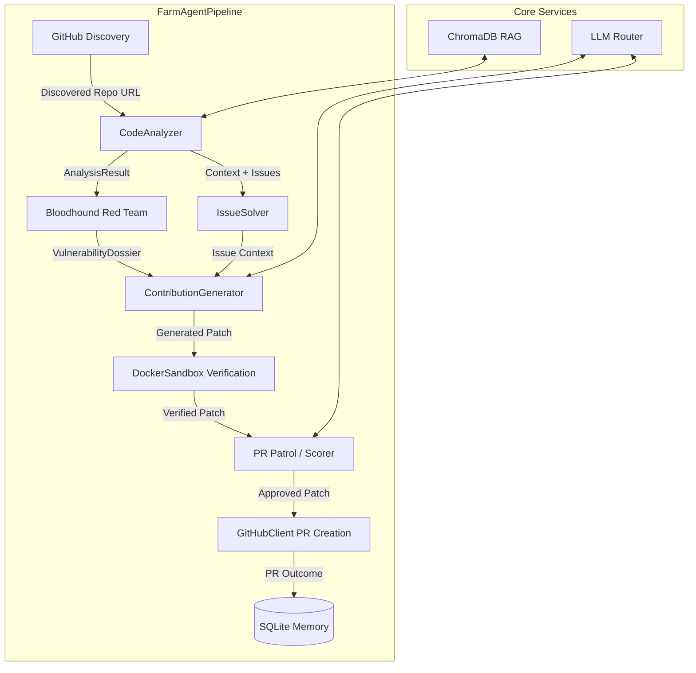

# Agent-Farm Architecture Blueprint

This document serves as a deep-dive architectural guide for developers working on the `farm_agent` codebase.

## 1. System Overview & Tech Stack

| Technology | Role in System |
|---|---|
| **Python 3.11+** | Core runtime and logic implementation. |
| **Hatchling** | Build backend and project management (`pyproject.toml`). |
| **Pytest** | Testing framework, including async support via `pytest-asyncio`. |
| **Docker >=7.1** | Containerization and isolated `DockerSandbox` execution for verifying bugs. |
| **SQLite (aiosqlite)** | Persistent memory and state management (`memory.db`). |
| **ChromaDB** | Local RAG (Retrieval-Augmented Generation) indexing for contextually precise codebase mapping. |
| **DeepSeek (OpenRouter)** | General task LLM and codebase generation. |
| **Qwen (Layer 1)** | First-pass PR appraisal and patch scoring. |
| **Gemini (Layer 2)** | Supreme Audit for high-stakes PR validation. |
| **Pydantic** | Strong typing and configuration validation (`farm_agent/core/config.py`). |
| **Click / Rich** | Powerful and stylized CLI framework (`farm_agent/cli/main.py`). |
| **GitPython** | Programmatic git operations and repository management. |

## 2. Directory Structure

```text
farm_agent/
├── agents/             # Registry-based agent logic (DeerFlow pattern)
├── analysis/           # CodeAnalyzer and Bloodhound Red Team (AST/Semgrep scanning)
├── cli/                # Command Line Interface (Click/Rich implementation)
├── core/               # Configuration, middleware, and base data models
├── generator/          # Contribution generation and QAHardcoreScorer
├── github/             # GitHub API client, discovery logic, and Security Disclosure Gate
├── issues/             # Issue-First Pipeline logic for prioritizing open issues
├── llm/                # LLM provider routing and multi-model abstractions
├── notifications/      # Discord, Slack, and Telegram notification dispatchers
├── orchestrator/       # FarmAgentPipeline (main loop) and SQLite Memory schemas
├── plugins/            # Extensible plugin system
├── pr/                 # PRManager and PR Patrol (enforces AI Gag Order & Anti-Farming)
├── templates/          # Jinja/Text templates for PR descriptions and issues
└── tools/              # Tools protocol and default integrations
```
*(Note: Excludes build artifacts, tests, and caching directories like `__pycache__` and `.git`)*

## 3. Core Module Dependency Graph

The following Mermaid diagram illustrates the data flow and orchestration within `farm_agent/orchestrator/pipeline.py`.



## 4. Core Execution Loops / Entry Points

The system execution starts from `farm_agent/cli/main.py` which maps to various orchestrator functions.

1. **Discovery Phase:**
   - CLI command `farm_agent run` or `farm_agent superhuman` triggers the execution loop.
   - `GitHubClient` or `DatabaseTargetDiscovery` selects a target repository.
2. **Analysis Phase:**
   - The repository is cloned.
   - `CodeAnalyzer` parses the code to extract AST, architecture maps, and stores them in ChromaDB.
   - `BloodhoundAnalyzer` scans for vulnerabilities.
   - `SecurityGate` checks meta-files to ensure safe disclosure constraints are met.
3. **Generation Phase:**
   - `ContributionGenerator` or `IssueSolver` uses the gathered context to formulate a fix via the LLM Provider.
   - The patch undergoes isolated validation via `DockerSandbox`.
4. **Validation Phase:**
   - `QAHardcoreScorer` (using Layer 1/2 LLMs) evaluates the proposed `FileChange`.
   - `PRManager` and `PR Patrol` enforce the Anti-Farming Filter to block trivial updates and ensure the PR doesn't use AI-identifying terms ("bot", "ai").
5. **Submission & Memory Phase:**
   - The PR is created on GitHub.
   - The outcome is recorded in the SQLite `Memory` module.

## 5. Database/State Schema

Persistent state is managed by `farm_agent/orchestrator/memory.py` using SQLite.

- **`target_repos`**: Queue of repositories to analyze (especially used in Terminator Mode).
- **`analyzed_repos`**: Log of repositories already scanned to prevent duplicate work.
- **`submitted_prs`**: Details of PRs created (URL, status, SHA).
- **`pr_outcomes`**: Statistics on PR merge/close rates for self-reflection.
- **`findings_cache`**: Vulnerabilities or issues discovered by the Bloodhound/CodeAnalyzer.
- **`run_log`**: Execution history of the pipeline.
- **`repo_preferences` & `repo_style_guides`**: Inferred styling rules to match human contributors.
- **`blacklisted_repos`**: Repositories flagged to be ignored.
- **`api_usage_log`**: Metrics on LLM token consumption.
- **`task_schedule`**: Timers and crons for background tasks.
- **`knowledge_base`**: Cached insights or RAG document mappings.
