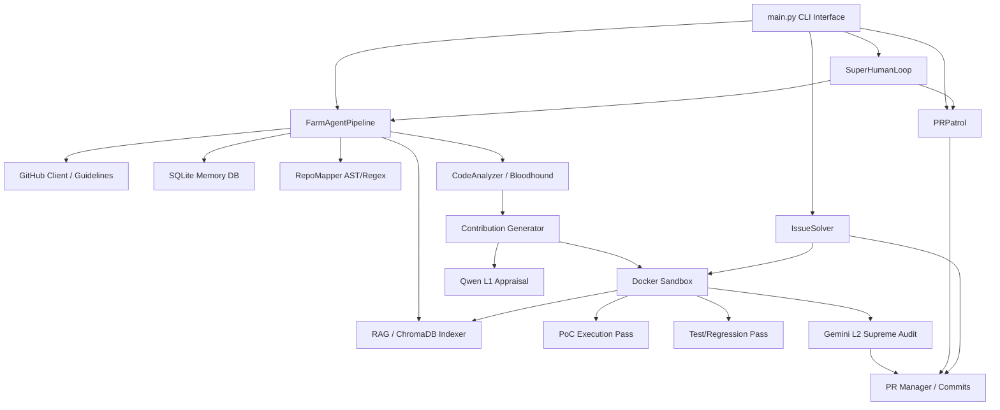

# PROJECT_MAP.md — Agent-Farm Ground Truth

**Version:** v4.0.0 — Omniscient Context Engine  
**Entry Point:** `farm_agent/cli/main.py` → `cli()` (Click-based CLI)  
**Language:** Python 3.11+  
**Architecture:** 'DeerFlow' Custom Registry-Based Agent Architecture

---

## 1. System Overview & Active Tech Stack

Agent-Farm is an autonomous AI ecosystem designed to discover open-source GitHub repositories or target specific URLs, scan for complex logic or security issues, generate high-quality patches, validate them dynamically in isolated Docker sandboxes, and submit them via Pull Requests or private disclosure.

| Component | Technology | File Origin |
|-----------|------------|-------------|
| **Core Language** | Python 3.11+ | `pyproject.toml` |
| **HTTP Client** | `httpx` (Async) | `farm_agent/github/client.py` |
| **Core Database / State** | SQLite (`aiosqlite`) — WAL Mode | `farm_agent/orchestrator/memory.py` |
| **Vector DB / RAG** | ChromaDB (`chromadb>=0.4`) | `farm_agent/core/rag.py` |
| **Docker Sandbox** | Docker Engine API (`docker>=7.1`) | `farm_agent/core/sandbox.py` |
| **CLI Framework** | `click>=8.1` & `rich>=13.0` | `farm_agent/cli/main.py` |
| **Settings / Config** | Pydantic v2 + YAML + `.env` | `farm_agent/core/config.py` |
| **Primary Code Gen LLM** | DeepSeek V4 Pro (`deepseek/deepseek-v4-pro`) | `farm_agent/orchestrator/pipeline.py` |
| **Appraisal Agent L1** | Qwen 3.7 Max (`qwen/qwen3.7-max`) | `farm_agent/orchestrator/pipeline.py` |
| **Audit Agent L2** | Gemini 3.5 Flash (`google/gemini-3.5-flash`) | `farm_agent/orchestrator/pipeline.py` |
| **Red Team (Bloodhound)** | Semgrep + DeepSeek V4 Flash | `farm_agent/analysis/analyzer.py` |

---

## 2. Directory Structure

```text
farm_agent/
├── __init__.py                # Package version configuration (v4.0.0)
├── agents/                    # DeerFlow Custom Registry Handlers
│   └── registry.py            # Task agent configurations
├── analysis/                  # Red Team & Discovery Scanners
│   ├── analyzer.py            # Parallelized CodeAnalyzer & BloodhoundAnalyzer
│   └── mapper.py              # RepoMapper (AST/Regex module dependency graphing)
├── cli/                       # Command-Line Interface
│   └── main.py                # Click CLI registration & command functions
├── core/                      # Global Systems & Interfaces
│   ├── config.py              # Pydantic schema validation & YAML config loading
│   ├── daily_log.py           # Formats daily Markdown activity logs
│   ├── exceptions.py          # Custom exceptions hierarchy
│   ├── leaderboard.py         # Leaderboard computation tools
│   ├── logger.py              # File and CLI logging setup
│   ├── middleware.py          # Context middleware layers
│   ├── models.py              # Foundational Pydantic structs
│   ├── notifier.py            # External service push notifications (Telegram)
│   ├── profiles.py            # Run profile setup (quick, standard, thorough)
│   ├── quotas.py              # LLM token/API usage quotas
│   ├── rag.py                 # ChromaDB Vector indexers & semantic chunking
│   ├── retry.py               # Resilience and exponential backoff
│   └── sandbox.py             # Docker environment management for PoCs & testing
├── generator/                 # Auto-Patch Generators
│   ├── engine.py              # ContributionGenerator (Fix generation & patch diffing)
│   ├── poc.py                 # Proof-of-Concept validation tools
│   ├── reviewer.py            # Evaluator for proposed patches & blast radius
│   └── scorer.py              # QAHardcoreScorer for code quality checks
├── github/                    # Extracted GitHub API Wrappers
│   ├── client.py              # Async HTTP GitHub operations (GraphQL & REST)
│   ├── discovery.py           # GitHub crawler and target selector
│   ├── guidelines.py          # Extracts project contributing styles & templates
│   └── security_gate.py       # Identifies repositories that request private disclosure
├── issues/                    # Dedicated Issue Solver Loop
│   └── solver.py              # Planners for proactive bug fixing
├── llm/                       # Model Invocation & Routing
│   ├── agents.py              # Specialized System prompts & Agent configs
│   ├── context.py             # Context window optimization
│   ├── models.py              # Pydantic LLM representation models
│   ├── provider.py            # Integrates with OpenRouter, Minimax, etc.
│   └── router.py              # Model selection/routing maps
├── notifications/             # Generic notification abstractions
│   └── notifier.py
├── orchestrator/              # The Brains: Scheduling & State
│   ├── human.py               # SuperHumanLoop 24/7 autonomous daily routine
│   ├── memory.py              # SQLite persistent schema & connection mapping
│   └── pipeline.py            # The central pipeline loops (hunt, circular, single)
├── plugins/                   # Future extensible components
├── pr/                        # GitHub PR interactions
│   ├── janitor.py.DISABLED    # Legacy Garbage collection routines
│   ├── manager.py             # Committing patches, managing forks & branches
│   └── patrol.py              # Replies to PR comments and fixes CI failures
├── templates/                 # Builtin PR descriptions & style fallbacks
│   └── registry.py
└── tools/                     # Utility subroutines
    └── protocol.py
```

---

## 3. Core Module Dependency Graph



---

## 4. Core Execution Loops & Pipelines

Agent-Farm leverages an adaptive loop to process tasks safely and intelligently, adhering to rate limits and context boundaries.

### A. The Core Target Loop (`pipeline.py:1172 - _process_repo`)
This outlines the process the bot takes when analyzing a new repository:
1. **Repository Retrieval:** Clones repository early and evaluates its guidelines, templates, and basic structures (`github/guidelines.py`).
2. **Knowledge Indexing (RAG):** The system recursively searches for documentation folders/files, semantically chunks them by Markdown headers, and adds them to ChromaDB (`core/rag.py`).
3. **Dependency Injection:** AST-based code graphs map internal library interactions, feeding the LLMs "imports", "calls", and "dependents" (`analysis/mapper.py`).
4. **Vibe & Filter Check:** Discards the repository if maintainer comments are hostile, and uses anti-farming filters to block typo/documentation patches.
5. **Vulnerability Analysis:** Bloodhound or standard LLM scanners look for critical issues (`analysis/analyzer.py`).
6. **PoC Verification:** A self-contained script is generated to trigger the vulnerability inside an isolated `DockerSandbox`. The finding is rejected if the PoC fails.
7. **Double-Pass QA Gate:**
    - The LLM writes a patch and runs the PoC again (must be fixed).
    - The native repository tests are executed to ensure zero regressions.
8. **Supreme Audit & Submission:** Evaluated by Gemini 3.5 Flash; if passed, changes are committed to a fork via `pr/manager.py` and a PR is pushed, or it triggers a private disclosure.

### B. The Patrol Loop (`pr/patrol.py`)
1. **Fetch Pending Feedback:** Pulls recent Review comments or pending CI actions on open PRs.
2. **Categorize Action:** Categorizes the feedback using an LLM. Handles CLA checks, direct Questions, Code Fixes, or CI errors.
3. **Self-Correction:** On CI Failure, extracts stack traces, determines the file, runs the fix in the Docker Sandbox to verify it passes, and automatically pushes an amendment to the branch.

### C. The Super Human Loop (`orchestrator/human.py`)
A relentless 24/7 background scheduler (`farm_agent superhuman`). It utilizes time boundaries to execute specific actions dynamically (e.g., spending 60 minutes actively hunting for issues, followed by 30 minutes patrolling active pull requests), simulating actual human contribution behaviors with periodic rests to conserve rate limits.

---

## 5. Database Schema & State Management

The core persistence layer resides in `memory.db` via the `Memory` class in `orchestrator/memory.py`, which is operated in Write-Ahead Logging (WAL) mode for concurrency.

**Key Tables:**
* `analyzed_repos`: Tracks scanned repositories, language, stars, and findings.
* `submitted_prs`: Logs active, merged, and closed pull requests and issues, tracking `ci_fix_attempts` and `discussion_replies` to prevent spamming.
* `findings_cache`: Tracks code flaws detected but not necessarily fixed yet.
* `run_log`: Historical aggregate of completed bot runs.
* `api_usage_log`: Logs token interactions per-provider for rate-limit quota adherence. Includes an optimized composite index.
* `knowledge_base`: Caches self-learned architectural boundaries, project formatting preferences, and "lessons" when PRs are rejected.
* `target_repos`: A determinist queue used during the `run_circular()` command.
* `pr_outcomes`: Saves historical feedback and success rates from maintainers to build predictive preference maps.
