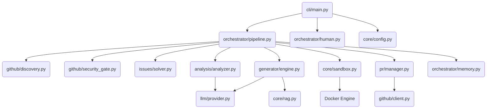

# PROJECT_MAP.md — Farm-Agent Architecture Blueprint

**Generated:** 2026-04-15
**Entry Point:** `farm_agent/cli/main.py` → `cli()` (Click-based CLI)
**Language:** Python 3.11+

---

## 1. System Overview & Tech Stack

| Component | Technology | Role |
|-----------|------------|------|
| Language | Python 3.11+ | Core implementation language. |
| HTTP client | `httpx` (async) | Interacting with GitHub API and LLM providers. |
| LLM Providers | MiniMax, OpenRouter | Code analysis, fix generation, review, scoring. |
| Database | SQLite via `aiosqlite` | Persistent memory storage (WAL mode). |
| Containerization | Docker | Polyglot sandbox validation for patches. |
| Scheduling | `apscheduler` | Managing cyclic tasks (e.g., in Super Human mode). |
| Vector DB | `chromadb` | RAG context retrieval for accurate patch generation. |
| Config | Pydantic v2 + YAML | Configuration loading and validation. |
| CLI | `click` + `rich` | Terminal user interface and command routing. |

---

## 2. Directory Structure

```
farm_agent/
├── __init__.py
├── agents/             # DeerFlow agent definitions
│   └── registry.py
├── analysis/           # Code scanning and analysis modules
│   ├── analyzer.py     # Main CodeAnalyzer
│   └── mapper.py       # Code mapping utilities
├── cli/                # Command-line interface definitions
│   └── main.py         # Primary CLI entry point
├── core/               # Core configuration, models, and shared utilities
│   ├── config.py       # Pydantic configuration definitions
│   ├── exceptions.py   # Custom exception classes
│   ├── leaderboard.py  # Leaderboard tracking functionality
│   ├── logger.py       # Logging setup
│   ├── middleware.py   # DeerFlow middleware patterns
│   ├── models.py       # Pydantic data models
│   ├── notifier.py     # Notification interface
│   ├── profiles.py     # Contribution profiles
│   ├── quotas.py       # Quota management
│   ├── rag.py          # RAG pipeline implementation
│   ├── retry.py        # Retry decorators and utilities
│   └── sandbox.py      # Docker-based execution sandbox
├── generator/          # Code generation and evaluation
│   ├── engine.py       # ContributionGenerator
│   ├── reviewer.py     # ContributionReviewer
│   └── scorer.py       # QAHardcoreScorer
├── github/             # GitHub API interaction and processing
│   ├── client.py       # GitHub REST/GraphQL client
│   ├── discovery.py    # Repository discovery strategies
│   ├── guidelines.py   # Extracting repo guidelines
│   └── security_gate.py# Security disclosure gatekeeper
├── issues/             # Issue processing
│   └── solver.py       # Issue resolution logic
├── llm/                # LLM provider implementations and routing
│   ├── agents.py       # LLM agent definitions
│   ├── context.py      # Context management for LLMs
│   ├── models.py       # Available models and configurations
│   ├── provider.py     # LLM provider abstraction
│   └── router.py       # Task routing logic
├── notifications/      # Notification dispatch
│   └── notifier.py     # Notification dispatcher (e.g., Slack, Telegram)
├── orchestrator/       # High-level pipeline management
│   ├── human.py        # Super Human 24/7 execution loop
│   ├── memory.py       # SQLite database interactions
│   └── pipeline.py     # Main Contribution Pipeline
├── plugins/            # Plugin definitions
├── pr/                 # Pull Request management
│   ├── janitor.py.DISABLED
│   ├── manager.py      # Pull request creation and management
│   └── patrol.py       # PR monitoring and responses
├── templates/          # Contribution templates
│   ├── builtin/        # Pre-defined PR templates
│   └── registry.py     # Template registry logic
└── tools/              # DeerFlow tool definitions
    └── protocol.py     # Tool protocols
```

---

## 3. Core Module Dependency Graph



---

## 4. Core Execution Loops / Entry Points

**Main Pipeline Flow (from `farm_agent run`):**
1. **Initialization:** The CLI initializes the configuration and database via `orchestrator/memory.py`.
2. **Discovery:** Identifies repositories using `github/discovery.py` or directly targets specified repos.
3. **Filtering & Pre-Checks:** Checks AI policies, contribution guidelines, maintainer "vibe", and passes through the `SecurityGate`.
4. **Analysis/Issue Resolution:**
   - Uses `issues/solver.py` to target existing open issues (Issue-First Pipeline).
   - Uses `analysis/analyzer.py` to run static code analysis.
5. **Anti-Farming & Validation Gate:** Drops trivial issues and filters out "farming" activities.
6. **Code Generation:** `generator/engine.py` generates the code patch using the LLM and RAG context.
7. **Sandbox Validation:** The patch is executed in an isolated Docker container (`core/sandbox.py`). Retries are performed if tests fail.
8. **PR Creation:** Once validated, `pr/manager.py` forks the repository, pushes the branch, and creates the PR via the GitHub API.
9. **Persistence:** The outcome is recorded in SQLite by `orchestrator/memory.py`.

---

## 5. Database/State Schema

Persistent memory is managed using SQLite (`aiosqlite`) via `farm_agent/orchestrator/memory.py`. The schema includes:

- `analyzed_repos`: Tracks scanned repositories, language, stars, and findings count.
- `submitted_prs`: Records created PRs, their status, URLs, types, and CI fix attempts.
- `findings_cache`: Stores generated findings to avoid redundant analysis.
- `run_log`: Historical log of pipeline runs.
- `pr_outcomes`: Detailed outcome metrics for learning.
- `repo_preferences`: Per-repo maintainer preferences and merge statistics.
- `blacklisted_repos`: Banned repositories and the reason for the ban.
- `api_usage_log`: Tracks LLM and API quota usage.
- `task_schedule`: Schedules asynchronous cyclic tasks.
- `knowledge_base`: A local repository for QA lessons and rules.
- `target_repos`: Circular processing loop targets.
- `repo_style_guides`: Parsed repository style guides and contribution structures.