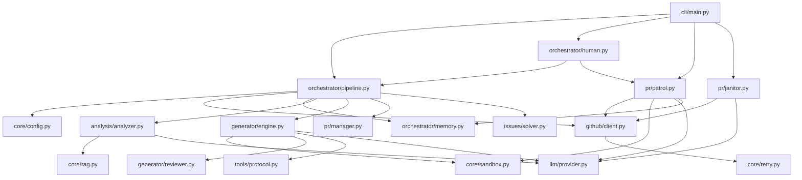

# 🗺️ PROJECT_MAP.md

> **Architecture Blueprint for Farm-Agent (v2.5.0)**
> This document reflects the raw reality of the active codebase.

## 1. System Overview & Tech Stack

Farm-Agent is an autonomous AI agent that discovers open-source GitHub repositories, analyzes their code, generates fixes, submits pull requests, monitors feedback, and auto-responds without human intervention.

| Layer | Technology | Role |
| :--- | :--- | :--- |
| **Language** | Python 3.11+ | Core implementation language using `async/await` for all I/O operations. |
| **CLI Framework** | `click` + `rich` | Rich command-line interface, interactive TUI, logging, and tables. |
| **HTTP Client** | `httpx` (async) | Persistent `AsyncClient` for GitHub REST API and LLM API requests with rate limit handling. |
| **Database** | SQLite via `aiosqlite` | Persistent memory storage with WAL mode (`memory.db`) for tracking repos, PRs, and scheduling. |
| **LLM Provider** | Minimax, OpenAI, Anthropic, Gemini, Vertex | Configurable LLM engine for analysis, generation, self-review, and issue solving. |
| **Config** | `pydantic` + `PyYAML` | Type-safe configuration management via `FarmAgentConfig` and `config.yaml`. |
| **Validation** | `docker` (Python SDK) | Polyglot sandbox environment (`DockerSandbox`) for testing and validating patches across 11 languages. |
| **RAG Engine** | `chromadb` (ephemeral) | In-memory vector database (`RepoIndexer`) for semantic cross-file code search and context retrieval. |
| **Tests & Linting** | `pytest`, `ruff` | Testing framework and code styling/linting. |

## 2. Directory Structure

```text
farm_agent/
├── __init__.py                    # Version (__version__) and package metadata.
├── agents/                        # Sub-agent registry wrapping core components.
│   └── registry.py
├── analysis/                      # CodeAnalyzer and language-specific skills.
│   ├── analyzer.py                # Parallel LLM analyzers (security, testing, UI, etc.).
│   ├── mapper.py                  # Project map generation.
│   └── skills.py                  # Progressive skills implementation.
├── cli/                           # Click CLI and Interactive TUI.
│   ├── __init__.py
│   ├── main.py                    # Main entry point defining commands (`run`, `hunt`, `patrol`, `superhuman`).
│   └── tui.py                     # Text-based User Interface.
├── core/                          # Shared models, config, RAG, and sandbox logic.
│   ├── config.py                  # Pydantic configuration models.
│   ├── daily_log.py               # Markdown logging for daily runs.
│   ├── exceptions.py              # Custom exceptions (`GenerationError`, `RateLimitError`).
│   ├── leaderboard.py             # Leaderboard calculation logic.
│   ├── logger.py                  # Rotating file logger setup.
│   ├── middleware.py              # Filtering middleware (DCO, QualityGate).
│   ├── models.py                  # Core dataclasses (`Repository`, `Contribution`, `Finding`).
│   ├── notifier.py                # Telegram notifications logic.
│   ├── profiles.py                # Contribution profile management.
│   ├── quotas.py                  # API quota tracking.
│   ├── rag.py                     # ChromaDB-based ephemeral semantic search engine.
│   ├── retry.py                   # Async retry logic.
│   └── sandbox.py                 # Polyglot Docker execution environment for code validation.
├── generator/                     # Contribution generation and scoring.
│   ├── engine.py                  # Core patch generation, parsing, and formatting logic.
│   ├── reviewer.py                # Adversarial reviewer for code generation.
│   └── scorer.py                  # Quality scoring for generated PRs.
├── github/                        # GitHub API client and repository discovery.
│   ├── client.py                  # `GitHubClient` wrapping HTTP requests with rate-limit backoff.
│   ├── discovery.py               # `RepoDiscovery` logic for finding target repos.
│   └── guidelines.py              # Logic to fetch and parse `CONTRIBUTING.md` and templates.
├── issues/                        # Issue solver logic.
│   └── solver.py                  # Fetches and solves open GitHub issues.
├── llm/                           # LLM provider abstractions.
│   ├── agents.py                  # Abstract base classes for agent tools.
│   ├── context.py                 # System prompt construction and context injection.
│   ├── models.py                  # LLM Model definitions and capabilities.
│   ├── provider.py                # Abstraction layer for Minimax/OpenAI/Gemini integrations.
│   └── router.py                  # Multi-model task routing logic.
├── notifications/                 # External notification integrations (Slack, Discord).
│   └── notifier.py
├── orchestrator/                  # Main execution loops and memory layer.
│   ├── __init__.py
│   ├── human.py                   # `SuperHumanLoop` logic for autonomous 24/7 daemon.
│   ├── memory.py                  # `aiosqlite` interactions for persistent state management.
│   └── pipeline.py                # `ContribPipeline` orchestrating the analysis/generation/PR flow.
├── plugins/                       # Extensibility plugins.
├── pr/                            # Pull Request lifecycle, patrol, and janitor.
│   ├── janitor.py                 # LLM-based logic to auto-close garbage PRs.
│   ├── manager.py                 # PR creation, fork handling, branching, and auto-checking templates.
│   └── patrol.py                  # `PRPatrol` logic to auto-respond to reviews and heal CI failures.
├── scheduler/                     # Job scheduling.
├── templates/                     # Jinja2 templates for PRs and commits.
│   └── registry.py
└── tools/                         # Tool protocol for LLM function calling.
    └── protocol.py                # `GitHubTool` and `LLMTool` wrapper schemas (e.g. `read_file`).
```

## 3. Core Module Dependency Graph



## 4. Core Execution Loops / Entry Points

### 1. Main Pipeline (`hunt`, `target`)
*   **Discovery**: `github/discovery.py` finds open-source repositories based on configurations or Familiar Grounds (alumni repos).
*   **Issue Solving (Optional)**: `issues/solver.py` attempts to solve open GitHub issues before falling back to static analysis.
*   **Analysis**: `analysis/analyzer.py` fetches the file tree, builds a context, and runs enabled parallel LLM analyzers (security, code quality, etc.) on code files.
*   **Filtering (Anti-Farming)**: Filters out low-impact findings, docs, and keyword-triggering results.
*   **Generation**: `generator/engine.py` builds the fix using the LLM. It searches across files via ChromaDB (`core/rag.py`), uses the `read_file` tool to fetch code, parses the patch output, and verifies it with an adversarial `ReviewerAgent`.
*   **Validation**: The generated patch is executed within `core/sandbox.py`. Docker determines the repository language and runs the corresponding test framework (e.g., `pytest`, `npm test`, `cargo test`). Failed validations trigger LLM self-correction.
*   **Submission**: `pr/manager.py` forks the repository, creates a branch, commits the changes with DCO sign-offs, and opens a Pull Request.

### 2. Super Human Mode (`superhuman`)
An infinite 24/7 background daemon (`orchestrator/human.py`) that operates autonomously.
*   **Stochastic Delays**: Randomizes API call delays, circadian rhythm sleep cycles (e.g., 1-hour lunch break), and typing WPM simulation.
*   **Random Quotas**: Selects a random PR target limit between `min_daily_prs` and `max_daily_prs`.
*   **Routing**: Interleaves Hunt mode (discovering and PR-ing) and Patrol mode based on a stochastic dice roll. Once the daily quota is met, it switches purely to Patrol-only mode.

### 3. PR Patrol (`patrol`)
Actively monitors open PRs to engage with maintainer feedback (`pr/patrol.py`).
*   **Feedback Ingestion**: Scans all `open` or `pending` Farm-Agent PRs.
*   **LLM Classification**: Uses the LLM to classify review comments into actions (`CODE_CHANGE`, `STYLE_FIX`, `QUESTION`, `HOSTILE_REJECT`, etc.).
*   **Auto-Responses**:
    *   Generates and pushes new code fixes.
    *   Replies to questions using natural, concise developer language.
    *   Re-signs CLAs (EasyCLA, CLAAssistant).
*   **CI Auto-Healing**: Analyzes GitHub Check Run failures, extracts error tracebacks, generates a fix, validates it via Docker, and pushes the commit.

### 4. PR Janitor (`janitor`)
A ruthless sweep utility (`pr/janitor.py`) to auto-close garbage PRs.
*   Scans open PRs evaluating titles and bodies.
*   Identifies low-impact or exploratory PRs and automatically closes them while deleting their branches.

## 5. Database/State Schema

State is persistently tracked using an `aiosqlite` database (`memory.db`) operating in WAL mode.

*   **`analyzed_repos`**: Records repositories processed to prevent re-analysis (`full_name`, `language`, `stars`, `analyzed_at`, `findings`).
*   **`submitted_prs`**: Stores submitted PRs and issue proposals (`id`, `repo`, `pr_number`, `pr_url`, `title`, `type`, `status`, `ci_fix_attempts`, `discussion_replies`).
*   **`findings_cache`**: Caches analysis findings to optimize LLM usage (`id`, `repo`, `type`, `severity`, `title`, `file_path`, `status`).
*   **`run_log`**: Logs history of pipeline executions (`id`, `started_at`, `finished_at`, `repos_analyzed`, `prs_created`, `findings`, `errors`).
*   **`pr_outcomes`**: Records final PR results (merged, closed, rejected) (`id`, `repo`, `pr_number`, `pr_type`, `outcome`).
*   **`repo_preferences`**: Maintains a learned profile of historical maintainer preferences (`repo`, `preferred_types`, `rejected_types`, `merge_rate`, `avg_review_hours`).
*   **`blacklisted_repos`**: Banned repositories preventing future interactions (`repo`, `reason`, `blacklisted_at`).
*   **`api_usage_log`**: Rolling 7-day log of LLM API requests for quota management (`id`, `timestamp`, `provider`).
*   **`task_schedule`**: Schedules throttling states for cron-like jobs (`task_key`, `next_run`, `updated_at`).