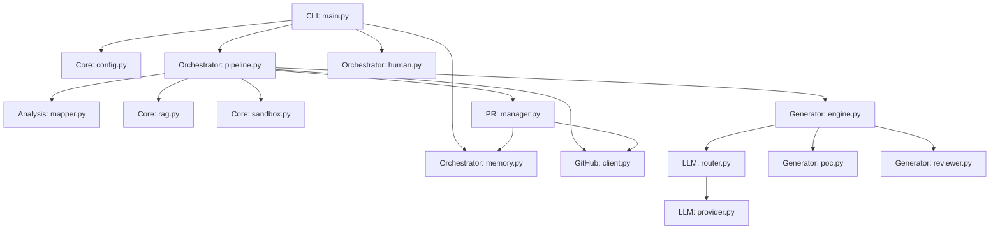

# 🗺️ Agent-Farm (v4.0.0) Architecture Blueprint

This document serves as a deep-dive architectural guide for new developers, reflecting the exact state of the `farm_agent` codebase.

---

## 1. System Overview & Tech Stack

| Component | Technology | Role |
| :--- | :--- | :--- |
| **Language & Runtime** | Python 3.11+ | Core engine implementation. |
| **CLI Framework** | Click | Commands handling and terminal UI (`farm_agent/cli/main.py`). |
| **Validation & Config** | Pydantic v2 & PyYAML | Data modeling, strict typing, and environment/YAML configuration. |
| **HTTP Client** | HTTPX | Async HTTP client for GitHub API and Webhooks. |
| **Database** | SQLite & aiosqlite | Persistent memory for runs, repos, PRs, and targets (WAL mode). |
| **Vector DB / RAG** | ChromaDB | Semantic documentation chunking and indexing. |
| **Containerization** | Docker (>= 7.1) | Isolated execution sandbox for validation and PoCs. |
| **LLM Interfaces** | OpenRouter, OpenAI, Anthropic, Google GenAI | Multi-provider model routing (DeepSeek, Qwen, Gemini). |
| **Git Integration** | GitPython | Local fork and branch manipulation. |
| **Build System** | Hatchling | Modern PEP 517 build backend. |

---

## 2. Directory Structure

```text
.
├── Dockerfile                          # Build configurations and runtime base image
├── docker-compose.yml                  # Compose definition with volumes and networks
├── Makefile                            # Common dev tasks (install, test, lint, docker)
├── start.sh                            # Unix setup script
├── start.bat                           # Windows setup script
└── farm_agent/                         # Core Python package root
    ├── __init__.py
    ├── agents/                         # Agent configurations and registry
    ├── analysis/                       # Static code analysis
    │   ├── analyzer.py                 # CodeAnalyzer (Security, Quality, UX scanning)
    │   └── mapper.py                   # RepoMapper (AST-based dependency graphing)
    ├── cli/                            # Command Line Interface
    │   └── main.py                     # Entry points for all CLI commands
    ├── core/                           # Configuration and Core Primitives
    │   ├── config.py                   # Pydantic v2 config loading
    │   ├── exceptions.py               # Application-specific exceptions
    │   ├── leaderboard.py              # Leaderboard stat collections
    │   ├── middleware.py               # Context middleware chain layers
    │   ├── models.py                   # Data schemas
    │   ├── notifier.py                 # Webhook and Telegram notifications
    │   ├── profiles.py                 # Run configurations loading
    │   ├── quotas.py                   # OpenRouter usage quota controllers
    │   ├── rag.py                      # ChromaDB vector DB context loaders
    │   ├── retry.py                    # Retry decorators for resiliency
    │   └── sandbox.py                  # DockerSandbox engine and PoC execution
    ├── generator/                      # Code Generation & Review
    │   ├── engine.py                   # ContributionGenerator (Patch creation)
    │   ├── poc.py                      # PoCGenerator (Proof-of-Concept scripting)
    │   ├── reviewer.py                 # ReviewerAgent (Self-reflective code auditor)
    │   └── scorer.py                   # QAHardcoreScorer (QA grading)
    ├── github/                         # GitHub Interactions
    │   ├── client.py                   # Async REST/GraphQL API wrappers
    │   ├── discovery.py                # Target repository search
    │   ├── guidelines.py               # PR templates and subsystem doc parsing
    │   └── security_gate.py            # Private security disclosure checks
    ├── issues/                         # Issue Handling
    │   └── solver.py                   # IssueSolver (Complexity estimation & resolution)
    ├── llm/                            # LLM Abstractions
    │   ├── agents.py                   # Agent prompts
    │   ├── context.py                  # Instruction builders
    │   ├── models.py                   # Registry and routing definitions
    │   ├── provider.py                 # Provider integration (OpenRouter)
    │   └── router.py                   # Task routing logic
    ├── notifications/                  # Dedicated notifications handlers
    ├── orchestrator/                   # Main Logic & State
    │   ├── human.py                    # SuperHumanLoop daily scheduler
    │   ├── memory.py                   # SQLite persistence and cache management
    │   └── pipeline.py                 # Main orchestration pipeline (FarmAgentPipeline)
    ├── plugins/                        # Extensibility hooks
    ├── pr/                             # Pull Request Lifecycle
    │   ├── manager.py                  # Branching, committing, PR submission
    │   ├── patrol.py                   # CI failure auto-healing and comments
    │   └── janitor.py                  # Clean up stale/garbage PRs
    ├── templates/                      # Contribution templates
    └── tools/                          # Internal protocols and utilities
```

---

## 3. Core Module Dependency Graph



---

## 4. Core Execution Loops / Entry Points

The primary entry point is through the CLI (e.g., `farm_agent run` or `farm_agent superhuman`).

### The Standard Contribution Pipeline (`pipeline.py`)

1. **Initialization:** Loads config, initializes GitHub client, connects to SQLite `Memory`.
2. **Targeting:** `discovery.py` finds suitable repositories if not explicitly provided.
3. **Exploration & Analysis:**
   - Evaluates the repository constraints.
   - `guidelines.py` searches for subsystem docs (`.md`, `.txt`) and indexes them using `rag.py`.
   - `mapper.py` uses AST parsing to build module dependencies.
   - `analyzer.py` parallel-scans the repository for actionable findings.
4. **Generation & Verification (DEV-QA Loop):**
   - For a given finding, `poc.py` attempts to write an isolated PoC script to reproduce it in `sandbox.py` (Docker).
   - If reproduction fails, it's considered a False Positive and dropped.
   - If successful, `engine.py` invokes LLMs to craft patches (`FileChange` operations).
   - Patches are applied to a local clone inside the sandbox. The PoC is re-run (Pass 1) and native tests run (Pass 2).
5. **Submission:**
   - `manager.py` forks the repository, creates a dedicated branch, stages changes, and pushes the commit.
   - Creates the Pull Request on GitHub, recording the result in `Memory`.

### The PR Patrol Loop (`patrol.py`)

1. Identifies open PRs previously created by the agent.
2. Checks CI statuses. If CI failed, retrieves tracebacks, guesses the buggy file, and invokes the LLM to draft a CI fix.
3. Fixes are tested via sandbox and pushed directly to the branch.

---

## 5. Database/State Schema

The persistence layer (`orchestrator/memory.py`) utilizes SQLite in Write-Ahead Logging (WAL) mode for performance and thread-safety. It uses `aiosqlite` for async access.

### Key Tables
* **`analyzed_repos`**: `(full_name, language, stars, analyzed_at, findings, metadata)`
* **`submitted_prs`**: `(id, repo, pr_number, pr_url, title, type, status, branch, fork, created_at, updated_at, ci_fix_attempts, discussion_replies)`
* **`findings_cache`**: Caches findings to avoid repetitive analyses.
* **`run_log`**: Records telemetry on pipeline executions.
* **`pr_outcomes`**: Stores merged/closed PR states and maintainer review remarks to dynamically build `repo_preferences`.
* **`blacklisted_repos`**: Maintains a blocklist for hostile/incompatible repos.
* **`knowledge_base`**: Retains learned lessons and context chunks.
* **`task_schedule`**: Persistence for the `SuperHumanLoop` task queues.

*Note: Database migrations in `Memory.init()` use idempotent SQL wrappers to catch table/column existence errors gracefully.*
