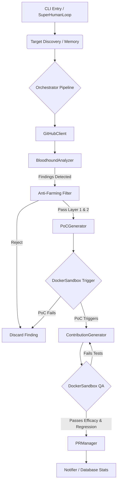

# Agent-Farm: Project & Architecture Map (v4.0.0)

This document provides a deep-dive architectural guide to the Agent-Farm system, mapping out the core modules, their dependencies, data structures, and the execution flows that drive autonomous bug discovery and patching.

---

## 1. System Overview & Tech Stack

Agent-Farm leverages an array of robust tools for containerization, language parsing, and multi-model routing.

| Component / Goal | Technology | Exact Role in Codebase |
| :--- | :--- | :--- |
| **Core Runtime** | Python 3.11+ | Primary execution environment, asyncio orchestration. |
| **Sandbox Execution** | Docker SDK | Provides isolated environments (via `DockerSandbox`) to run PoC triggers and execute repository tests dynamically. |
| **Memory & State** | SQLite (WAL) | Persists tracking for repositories (`analyzed_repos`), PRs (`submitted_prs`), findings (`findings_cache`), and LLM quotas. |
| **Code Intelligence** | ChromaDB, AST | **ChromaDB** stores vectorized documentation chunks (via `rag.py`) for semantic retrieval. **AST/Regex** maps module dependencies (`mapper.py`) for contextual prompt injection. |
| **Red Team Auditing** | Semgrep | Used in the `BloodhoundAnalyzer` to perform fast, parallel radar scans of known security vulnerability patterns. |
| **LLM Routing** | OpenRouter, Pydantic | Multi-model orchestration handling specialized tasks (e.g., Qwen/Gemini for audits, DeepSeek for generative logic). |
| **Task Routing** | Click, APScheduler | CLI command structures and execution of continuous scheduling loops. |

---

## 2. Directory Structure

A top-down view of the active Agent-Farm codebase structure (ignoring trivial files and `.DISABLED` components).

```text
.
├── Dockerfile                  # Stage 1 builder (wheel creation) + Stage 2 lean runtime v4.0.0
├── docker-compose.yml          # 'agent-farm' service definition with 'internet_access' and 'sandbox_isolated' networks
├── start.sh / start.bat        # Entry point wrappers for local one-click deployment
├── Makefile                    # Make targets (install, test, lint, docker, build, clean, stats)
├── pyproject.toml              # Build config (hatchling), dependencies, Ruff linting rules
└── farm_agent/                 # Package root
    ├── __init__.py
    ├── cli/
    │   └── main.py             # Click CLI router (run, target, solve, hunt, superhuman, patrol, etc.)
    ├── core/
    │   ├── config.py           # Configuration loading via Pydantic
    │   ├── exceptions.py       # Custom exception hierarchy
    │   ├── leaderboard.py      # Tracks PR submission and merge statistics
    │   ├── middleware.py       # Intercept layers for chain execution
    │   ├── notifier.py         # Discord/Telegram/Slack message dispatching
    │   ├── quotas.py           # Safety mechanism tracking LLM API thresholds
    │   ├── rag.py              # Semantic markdown header chunking and ChromaDB ingestion
    │   └── sandbox.py          # Isolated Docker execution layer for test and PoC running
    ├── analysis/
    │   ├── analyzer.py         # Static scanners and Bloodhound Red Team pipeline
    │   └── mapper.py           # AST-based dependency graphing for Python/Go/Rust/JS
    ├── generator/
    │   ├── engine.py           # ContributionGenerator responsible for logic and file patches
    │   ├── poc.py              # Generates PoC files to dynamically validate bugs in the sandbox
    │   ├── reviewer.py         # Audits proposed code changes and checks for blast radius impacts
    │   └── scorer.py           # Hardcore scoring routines to appraise contribution value
    ├── github/
    │   ├── client.py           # GitHub REST API client with rotation logic for `secondary_tokens`
    │   ├── discovery.py        # Module for crawling and finding target repositories
    │   ├── guidelines.py       # Discovers contributing templates and repo subsystem docs
    │   └── security_gate.py    # Checks for private disclosure guidelines and security contacts
    ├── issues/
    │   └── solver.py           # Autonomous Issue-First pipeline logic for fixing specific GitHub issues
    ├── llm/
    │   ├── agents.py           # Base agent logic and prompt configurations
    │   ├── provider.py         # OpenRouter API communication layer
    │   └── router.py           # TaskRouter determining the best LLM model based on `TaskType`
    ├── notifications/
    │   └── notifier.py         # Extends messaging features
    ├── orchestrator/
    │   ├── human.py            # SuperHumanLoop: relentless Terminator Mode execution loop
    │   ├── memory.py           # Core SQLite interactions (`analyzed_repos`, `task_schedule`, etc.)
    │   └── pipeline.py         # `FarmAgentPipeline` orchestrating CodeAnalyzer, Generator, PRManager
    ├── pr/
    │   ├── manager.py          # Git branch, fork, commit, and PR generation routines
    │   └── patrol.py           # PR Patrol: Auto-healing CI failures and responding to maintainer comments
    ├── agents/
    │   └── registry.py         # Agent creation registry
    ├── plugins/                # Extensible integration stubs
    ├── templates/              # Internal messaging templates
    └── tools/
        └── protocol.py         # Protocols for custom tool invocations
```

---

## 3. Core Module Dependency Graph

The execution pipeline routes through several discrete verification points before a PR is formulated.



---

## 4. Core Execution Loops & Entry Points

### Terminator Mode / `SuperHumanLoop` (`farm_agent/orchestrator/human.py`)
This is the relentless execution loop activated by `farm_agent superhuman`.
1. The loop pulls a target deterministically from the SQLite `target_repos` table.
2. It invokes the **Orchestrator Pipeline**.
3. It performs a continuous execution cycle without artificial delays.
4. Periodically, it triggers the **PR Patrol** (`pr/patrol.py`) to auto-heal CI failures and process maintainer feedback.

### Orchestrator Pipeline (`farm_agent/orchestrator/pipeline.py`)
1. **Fetch/Clone:** Uses `GitHubClient` to shallow-clone the repository.
2. **Context Engine mapping:** `RepoMapper` performs AST inspection to capture the layout, while `rag.py` processes documentation.
3. **Analysis:** The `CodeAnalyzer` and Semgrep perform a deep structural scan.
4. **Filtration:** The `Anti-Farming Filter` strictly evaluates the validity and non-triviality of findings using Qwen (Layer 1 Appraisal) and Gemini (Layer 2 Audit).
5. **Generative Phase:** If valid, a PoC is written and executed. If triggered, the `ContributionGenerator` writes patches to memory.
6. **Validation:** The `DockerSandbox` re-runs the PoC and natively executes the repository test suite against the local file patches.
7. **Execution:** The `PRManager` commits the successful patch to a new branch, pushes to a fork, and creates the PR.

---

## 5. Database & State Schema

The persistent state is maintained in `memory.db` (SQLite 3 via `aiosqlite`) running in Write-Ahead Logging (WAL) mode for concurrency.

* **`analyzed_repos`**: Keeps a ledger of inspected repositories to avoid repeated initial processing.
  *(Columns: `full_name`, `language`, `stars`, `analyzed_at`)*
* **`target_repos`**: The circular target queue utilized by `SuperHumanLoop`.
  *(Columns: `repo_url`, `status`, `scanned_at`, `language`, `bounty_amount`)*
* **`submitted_prs`**: Logs bot-created Pull Requests, their states, CI fix attempts, and maintainer discussion iterations.
  *(Columns: `repo`, `pr_number`, `pr_url`, `title`, `type`, `status`)*
* **`findings_cache`**: Caches issues before they undergo final auditing and processing.
* **`api_usage_log`**: Utilized heavily by `quotas.py` to enforce rate-limiting thresholds (e.g., OpenRouter limitations).
* **`task_schedule`**: Orchestrates state transitions for the continuous schedule queue.
* **`repo_preferences`**: A feedback loop mechanism storing target-specific formatting rules or maintainer rejections, ensuring the bot does not repeat past mistakes.
