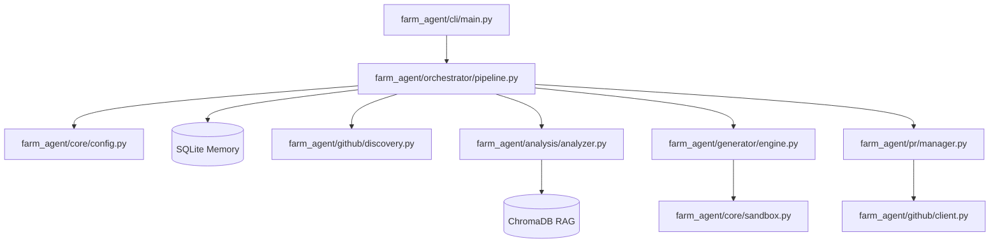

# PROJECT_MAP.md — Farm-Agent Ground Truth

**Generated:** 2026-04-15
**Version:** v3.0.0
**Entry Point:** `farm_agent/cli/main.py` → `cli()` (Click-based CLI)
**Language:** Python 3.11+

---

## 1. System Overview & Active Tech Stack

Farm-Agent is an autonomous AI agent that discovers open-source GitHub repositories matching criteria, scans their code for issues or existing GitHub issues, generates patches via LLM, validates patches in Docker sandboxes, and creates PRs or GitHub Issues to contribute back.

| Component | Technology | Target / Config |
|-----------|------------|-----------------|
| Language | Python 3.11+ | `requires-python = ">=3.11"` |
| HTTP client | `httpx` (async) | `httpx>=0.27,<1.0` |
| Database | SQLite via `aiosqlite` | Default: `data/memory.db` |
| Docker | `docker>=7.1,<8.0` | `farm_agent/core/sandbox.py` |
| CLI | `click>=8.1` + `rich>=13.0` | `farm_agent/cli/main.py` |
| Vector DB | `chromadb>=0.4,<1.0` | `farm_agent/core/rag.py` |
| Scheduling | `apscheduler>=3.10,<4.0`| `pyproject.toml` |
| Config | Pydantic v2 + YAML | `farm_agent/core/config.py` |
| LLM Providers | MiniMax, OpenRouter (via Gemini, OpenAI, Anthropic) | `farm_agent/llm/provider.py` |

---

## 2. Directory Structure

```ascii
farm_agent/
├── cli/
│   └── main.py          # Click CLI, all commands (run, hunt, patrol, etc.)
├── core/
│   ├── config.py        # Pydantic config system, FarmAgentConfig
│   ├── exceptions.py    # Custom exceptions
│   ├── leaderboard.py   # PR stats and repo rankings
│   ├── logger.py        # Daily rolling file logger setup
│   ├── middleware.py    # Middleware chain (DeerFlow pattern)
│   ├── models.py        # Pydantic models (Repository, Finding, Contribution)
│   ├── notifier.py      # TelegramNotifier
│   ├── profiles.py      # Contribution profiles
│   ├── quotas.py        # Quota tracking
│   ├── rag.py           # ChromaDB RAG engine
│   ├── retry.py         # Async retry decorators
│   └── sandbox.py       # DockerSandbox — Polyglot patch validation
├── generator/
│   ├── engine.py        # ContributionGenerator.generate()
│   ├── reviewer.py      # ContributionReviewer
│   └── scorer.py        # QAHardcoreScorer — QA evaluation
├── github/
│   ├── client.py        # GitHubClient (REST + GraphQL)
│   ├── discovery.py     # RepoDiscovery + DatabaseTargetDiscovery
│   ├── guidelines.py    # Parses CONTRIBUTING.md + PR template
│   └── security_gate.py # Security Disclosure Gate (private disclosure check)
├── issues/
│   └── solver.py        # IssueSolver — fetch + classify + solve GitHub issues
├── llm/
│   ├── provider.py      # create_llm_provider()
│   ├── models.py        # ALL_MODELS catalog, TaskType enum
│   ├── router.py        # TaskRouter
│   └── agents.py        # LLM agent definitions
├── notifications/
│   └── notifier.py      # Slack/Discord/Telegram webhooks
├── orchestrator/
│   ├── human.py         # SuperHumanLoop — 24/7 organic operation loop
│   ├── memory.py        # SQLite-backed persistent state
│   └── pipeline.py      # ContribPipeline — Main execution engine
├── pr/
│   ├── manager.py       # PRManager.create_pr() (fork, branch, commit, push)
│   └── patrol.py        # PRPatrol — monitors PR feedback, auto-responds
├── tools/
│   └── protocol.py      # create_default_tools()
└── templates/
    └── registry.py      # TemplateRegistry
```

---

## 3. Core Module Dependency Graph



---

## 4. Core Execution Loops

### Run Pipeline Data Flow (`run` command)

1. **Discovery**: `RepoDiscovery.discover()` fetches matching repos.
2. **Analysis Guardrails**: `_check_ai_policy()`, `check_interaction_limits()`, and `run_security_gate()` run to filter repos.
3. **Static Analysis**: `CodeAnalyzer.analyze()` scans code.
4. **Anti-Farming Gate**: Filters TRIVIAL/LOW impact findings, blocks documentation changes.
5. **Issue-First Protocol**: Prioritizes `IssueSolver` over static analysis if open issues exist.
6. **Code Generation**: `ContributionGenerator` uses LLM + ChromaDB to write fixes.
7. **Sandbox Guillotine**: Generated patch must pass Docker container execution. Retries via self-correction if failed.
8. **PR Submission**: `PRManager` forks, branches, pushes, and creates the PR. Saves state to SQLite.

### Hunt-Circular Loop Data Flow (`hunt-circular` command)

1. **Target Selection**: Retrieves oldest `scanned_at` from `target_repo.json`.
2. **Bloodhound Pre-Scan**: `BloodhoundAnalyzer` runs Semgrep.
3. **Security Gate**: `run_security_gate()` checks for private disclosure rules.
4. **DEV-QA Bounty Loop**: Generates fixes via `ContributionGenerator.generate_from_dossier()`, evaluated by `QAHardcoreScorer`. Re-attempts up to 3 cycles.
5. **PR Submission**: Submits if QA passes.

### Super Human Mode (`superhuman` command)
- Imitates a human developer by randomizing daily PR quota, introducing coding delays between PRs (`asyncio.sleep()`), interleaving hunt mode and PR Patrol loops, and resting once daily PR quotas are hit.

---

## 5. Database & State Schema

The system uses an SQLite database with WAL (Write-Ahead Logging) mode defined in `farm_agent/orchestrator/memory.py`.

### Primary Tables
- **`analyzed_repos`**: `full_name` (PK), `language`, `stars`, `analyzed_at`.
- **`submitted_prs`**: `id`, `repo`, `pr_number` (UNIQUE), `title`, `type`, `status`, `ci_fix_attempts`, `discussion_replies`.
- **`findings_cache`**: `id`, `repo`, `type`, `severity`, `title`, `file_path`.
- **`run_log`**: Historical pipeline runs.
- **`pr_outcomes`**: `repo`, `pr_number` (UNIQUE), `pr_type`, `outcome`.
- **`repo_preferences`**: Learned preferences for PR types per repository.
- **`blacklisted_repos`**: Permanently blocked repos.
- **`task_schedule`**: Persistent task scheduling.
- **`knowledge_base`**: QA lessons and audit history.
- **`target_repos`**: `repo_url` (PK), `scanned_at` (used for circular loop).
- **`api_usage_log`**: LLM API usage tracking.
- **`repo_style_guides`**: Cached parsed code style guidelines from `CONTRIBUTING.md`.