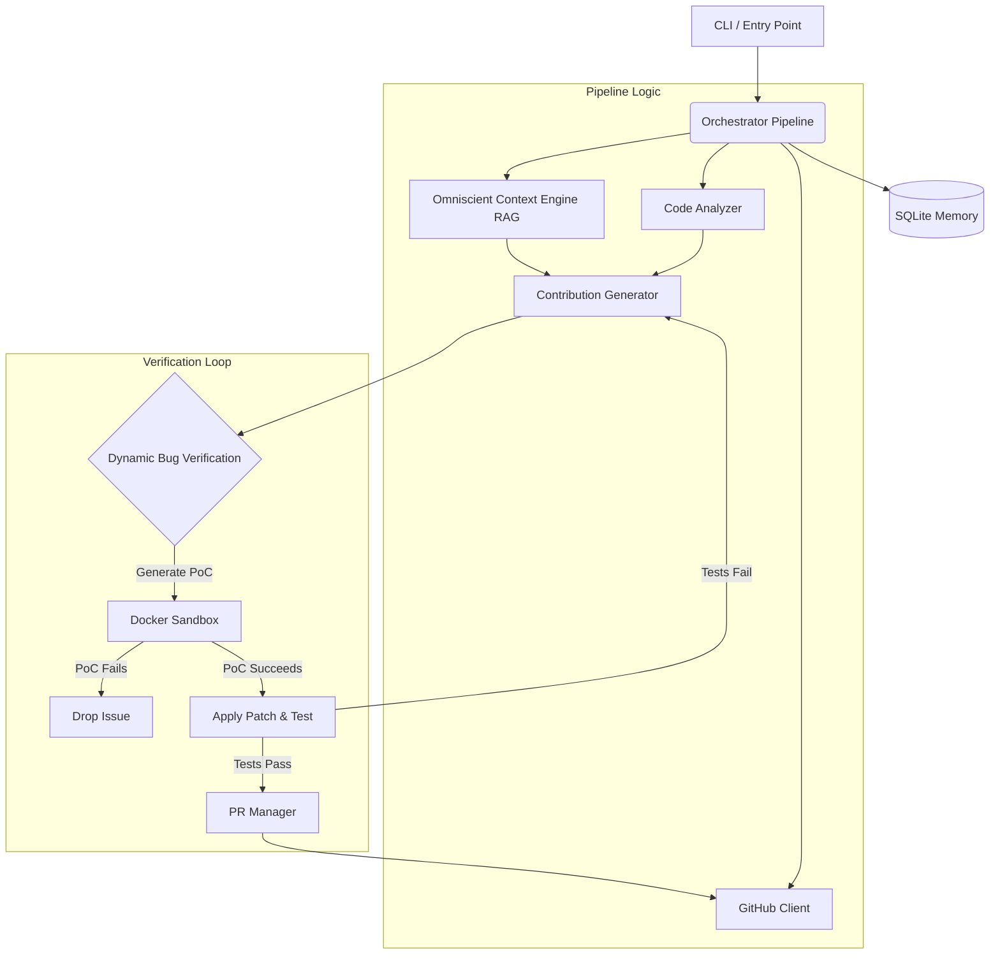

# 🗺️ Agent-Farm (v4.0.0) Architecture Blueprint

This document serves as a deep-dive architectural guide and structural blueprint for developers, detailing the exact active implementation in Agent-Farm v4.0.0.

---

## 1. System Overview & Tech Stack

| Technology | Role & Component |
|---|---|
| **Python 3.11+** | Primary language; strict typing; asynchronous execution (`asyncio`). |
| **Docker (>= 7.1)** | Isolation engine. Runs the primary daemon and nested dynamic dynamic PoC/QA environments (DockerSandbox). |
| **Pydantic / Pydantic Settings** | Core validation for configuration and LLM data modeling. |
| **Click / Rich** | CLI framework and rich terminal output. |
| **aiosqlite (SQLite)** | Persistent memory mapping across loops (WAL mode). Stored in `data/memory.db`. |
| **ChromaDB** | Vector DB for the Omniscient Context Engine (RAG documentation chunking). |
| **Hatchling** | Project build backend mapping. |
| **httpx / PyYAML** | Async HTTP interactions (GitHub API) and static YAML configurations. |
| **Google GenAI / Anthropic / OpenAI** | Backing APIs integrated alongside the main routing logic. |
| **OpenRouter** | Primary AI gateway utilizing models like `deepseek-v4-pro`, `qwen3.7-max`, and `gemini-3.5-flash`. |

---

## 2. Directory Structure

```text
Agent-Farm/
├── Dockerfile                  # Builds isolated daemon image with Python & Docker dependencies.
├── docker-compose.yml          # Provisions 'agent-farm' service via 'internet_access' and 'sandbox_isolated' networks.
├── start.sh                    # Unix initialization script (1-Click Launch).
├── start.bat                   # Windows initialization script (1-Click Launch).
├── requirements.txt            # System dependency definitions.
├── pyproject.toml              # Build config, Ruff settings, optional dev/test dependencies.
├── farm_agent/                 # Primary v4.0.0 Application Code
│   ├── cli/
│   │   └── main.py             # Click CLI mapping all main entry points (run, target, solve, superhuman, patrol, etc.).
│   ├── core/
│   │   ├── config.py           # Configuration data model parsing and defaults matching.
│   │   ├── middleware.py       # Context middleware layer management.
│   │   ├── models.py           # Universal Pydantic data schemas for finding and file payloads.
│   │   ├── rag.py              # ChromaDB-powered local context engine processing module.
│   │   └── sandbox.py          # Isolated Docker execution context and blast-radius validator.
│   ├── analysis/
│   │   ├── analyzer.py         # Static code analyzers including Red Team tools and Bloodhound integration.
│   │   └── mapper.py           # Subsystem dependency graphing.
│   ├── generator/
│   │   ├── engine.py           # Drafts core logic fixes and documentation patches.
│   │   ├── poc.py              # Self-contained dynamically executing PoC writer.
│   │   └── reviewer.py         # Autonomous self-correction reviewer agent.
│   ├── github/
│   │   ├── client.py           # Wrapped API interface against GitHub REST and GraphQL interfaces.
│   │   ├── guidelines.py       # Discovers contributing templates and formatting instructions.
│   │   └── security_gate.py    # Discovers private disclosure phrases to block public PR generation.
│   ├── issues/
│   │   └── solver.py           # Issue-First Pipeline logic solver.
│   ├── llm/
│   │   ├── models.py           # Local registry defining LLM instances.
│   │   └── router.py           # Workload router across various agent models.
│   ├── orchestrator/
│   │   ├── memory.py           # aiosqlite persistent state layer for memory.db.
│   │   └── pipeline.py         # Main execution orchestration.
│   ├── pr/
│   │   ├── manager.py          # Coordinates patch submissions, commits, and forking logic.
│   │   └── patrol.py           # Auto-heals failed CI checks and interacts with PR comments.
│   ├── plugins/                # Plugin hooks architecture.
│   ├── templates/              # Internal templating tools.
│   └── notifications/          # Messaging systems (e.g., Telegram bots).
└── tests/                      # Pytest unit testing suite.
```

---

## 3. Core Module Dependency Graph



---

## 4. Core Execution Loops / Entry Points

The fundamental lifecycle executed via Terminator Mode (`farm_agent superhuman`) operates seamlessly without delays:

1. **Target Selection (`orchestrator/pipeline.py`)**:
   The system queries the deterministic circular queue from `target_repos` in SQLite to acquire the next viable URL.
2. **Context & Audit (`analysis/analyzer.py` & `core/rag.py`)**:
   The target is cloned using a local filesystem cache limit. Documentation is mapped, chunked, and ingested into ChromaDB. The code base is then evaluated statically using the Bloodhound Red Team system.
3. **Appraisal (`generator/scorer.py` equivalent / `qwen3.7-max`)**:
   Findings are evaluated through Gate 1. Inviable bugs and dead code are filtered out immediately.
4. **Patch & Verification (`generator/engine.py` & `core/sandbox.py`)**:
   The generator drafts a PoC, verified by `DockerSandbox`. Then the patch is mapped into the `FileChange` model. The pipeline then synchronously applies the patch using `_apply_patch_sync` and executes pass-2 tests on the system inside `DockerSandbox`.
5. **Submission (`pr/manager.py`)**:
   The validated, finalized patch builds its AST representation, confirms passing tests, commits changes, and deploys it via `gh` CLI integrations or HTTP API as a structured PR.
6. **Patrol Mode (`pr/patrol.py`)**:
   Simultaneously checks for updates, maintainer replies, or CI tracebacks using the `_guess_file_from_traceback` logic, and regenerates solutions utilizing the CI error logs automatically.

---

## 5. Database / State Schema

The persistent state is maintained across system crashes or restarts using SQLite inside `data/memory.db`. Key tables include:

- **`analyzed_repos`**: Logs repositories completely processed and scraped for issues.
- **`target_repos`**: The primary hunting queue. Columns include `repo_url`, `status`, `scanned_at`, `language`, `bounty_amount`, and `diamond_target`.
- **`findings_cache`**: Temporary cache storing intermediate code vulnerability definitions.
- **`submitted_prs`**: Comprehensive map of issues drafted and PRs posted; contains status limits counters.
- **`pr_outcomes`**: Records responses to PRs including merges/closes and duration limits.
- **`run_log`**: Diagnostic table of historical throughput runs.
- **`api_usage_log`**: Records tracking data to regulate external OpenRouter limit ceilings.
- **`knowledge_base`**: Centralized mapping table for lesson tracking.
- **`repo_style_guides`**: Caches and tracks custom organizational preferences.