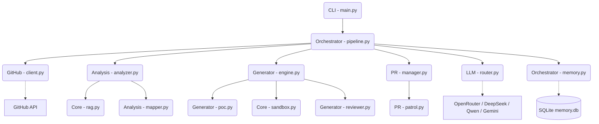

# PROJECT_MAP.md — Agent-Farm Architecture Blueprint

**Version:** v4.0.0 — Omniscient Context Engine
**Entry Point:** `farm_agent/cli/main.py`
**Language:** Python 3.11+

---

## 1. System Overview & Tech Stack

Agent-Farm is an autonomous AI agent system designed to discover open-source GitHub repositories or scan specific targets for vulnerabilities. It employs multi-phase LLM prompts to analyze code, generate patches, and dynamically validate fixes in isolated Docker sandboxes. It incorporates an advanced **Omniscient Context Engine** utilizing local RAG with ChromaDB, a robust **Dynamic Bug Verification** engine to execute Proof-of-Concept exploits in sandboxes, and a **Two-Layer Expert Filter** (Qwen and Gemini via OpenRouter) to evaluate and authorize pull requests, ensuring zero regressions.

| Component | Technology | Description |
| --- | --- | --- |
| Language | Python 3.11+ | Core implementation language. |
| Configuration | Pydantic v2 + YAML | Strongly-typed configuration system. |
| Dependency Management | Hatchling | Used as the build backend in `pyproject.toml`. |
| Primary LLM | `deepseek/deepseek-v4-flash` via OpenRouter | Used for main agent tasks and the Red Team Bloodhound analyzer. |
| Code Gen LLM | `deepseek/deepseek-v4-pro` via OpenRouter | Responsible for generating fixes. |
| Layer 1 Appraiser | `qwen/qwen3.7-max` via OpenRouter | Verifies finding is genuine and scores patches on strict metrics. |
| Layer 2 Supreme Auditor | `google/gemini-3.5-flash` via OpenRouter | Audits the incident dossier, sandbox logs, and proposed patches. |
| Red Team | Semgrep | Runs rulesets (e.g. security-audit, cwe-top-25) for discovering flaws. |
| Vector DB | `chromadb>=0.4` | Local RAG database for project context and documentation indexing. |
| Execution Sandbox | Docker (`docker>=7.1`) | Highly isolated container execution for PoC tests and build verifications. |
| Database | SQLite (`aiosqlite`) | Maintains states, queues, usage statistics, and the persistent memory cache. |
| CLI Interface | `click>=8.1` & `rich>=13.0` | Powers the feature-rich command-line interface. |

---

## 2. Directory Structure

```text
farm_agent
├── __init__.py
├── agents
│   └── registry.py               # Task agent configurations
├── analysis
│   ├── analyzer.py               # CodeAnalyzer (BloodhoundAnalyzer, parallelized security, quality scanners)
│   └── mapper.py                 # RepoMapper (AST/regex dependency graphing)
├── cli
│   └── main.py                   # Click CLI entry point and command definitions
├── core
│   ├── config.py                 # Config data structures, YAML loading, and Pydantic logic
│   ├── daily_log.py              # Formats daily markdown activity logs
│   ├── exceptions.py             # System exception hierarchy
│   ├── leaderboard.py            # Aggregates PR success statistics
│   ├── logger.py                 # Defines daily rotating file logging and formats
│   ├── middleware.py             # Context middleware chain handlers
│   ├── models.py                 # Pydantic data structures used system-wide
│   ├── notifier.py               # Notifications system (Telegram, Slack, Discord)
│   ├── profiles.py               # Pre-defined run configurations (thorough, quick, etc.)
│   ├── quotas.py                 # API quota controllers for providers like OpenRouter
│   ├── rag.py                    # ChromaDB vector DB context loaders with semantic chunking
│   ├── retry.py                  # Retry decorators for stable API requests
│   └── sandbox.py                # Isolated Docker sandbox engine for running verifications
├── generator
│   ├── engine.py                 # ContributionGenerator (Patch creation and source corrections)
│   ├── poc.py                    # PoCGenerator (Generates and tests dynamic Proof-of-Concepts)
│   ├── reviewer.py               # ReviewerAgent (Self-reflective code auditor)
│   └── scorer.py                 # QAHardcoreScorer (QA code grading logic)
├── github
│   ├── client.py                 # Async HTTP GitHub client (REST/GraphQL)
│   ├── discovery.py              # Repository discovery and target acquisition
│   ├── guidelines.py             # Subsystem for extracting documentation and PR templates
│   └── security_gate.py          # Checks for private disclosure requirements
├── issues
│   └── solver.py                 # Solves open issues using a deep planning system
├── llm
│   ├── agents.py                 # Defines prompts and core LLM conversational logic
│   ├── context.py                # Handles prompt building and context injection
│   ├── models.py                 # Central LLM model definitions
│   ├── provider.py               # OpenRouter/Ollama provider interface
│   └── router.py                 # Routes task types to the appropriate model
├── notifications
│   └── notifier.py               # Additional notification handlers
├── orchestrator
│   ├── human.py                  # SuperHumanLoop defining the 24/7 autonomous daily routine
│   ├── memory.py                 # Persistent SQLite database operations and states
│   └── pipeline.py               # Central FarmAgentPipeline handling all logic sequences
├── plugins
│   └── __init__.py               # Plugin architecture root
├── pr
│   ├── manager.py                # Automates PR forking, branches, and commits
│   └── patrol.py                 # PR Patrol loop for answering comments and fixing CI issues
├── templates
│   ├── builtin                   # Preset PR and issue YAML templates
│   └── registry.py               # System to parse and register standard formatting templates
└── tools
    └── protocol.py               # Inter-agent tool protocol definitions
```

---

## 3. Core Module Dependency Graph



---

## 4. Core Execution Loops / Entry Points

### Single / Batch Run Pipeline
The `farm_agent run` or `farm_agent target` commands initialize the `FarmAgentPipeline`.
1. **Target Acquisiton:** Analyzes criteria and fetches GitHub API metadata.
2. **Context Indexing:** `discover_subsystem_docs` searches the codebase and ingests documentation into ChromaDB via `rag.py`. AST linkages are mapped.
3. **Analysis:** The `BloodhoundAnalyzer` employs Semgrep and DeepSeek models to discover security issues.
4. **Appraisal Gate:** Uses `qwen3.7-max` to ensure only real, non-trivial vulnerabilities proceed.
5. **Generation & Verification:**
   - A PoC is generated and run in the Docker Sandbox to verify the vulnerability.
   - The fix is generated and applied.
   - The PoC is executed again to ensure the vulnerability is resolved.
   - The native test suite is run in the Docker Sandbox to prevent regressions.
6. **Final Audit:** `gemini-3.5-flash` analyzes the changes for complex secondary risks.
7. **Submission:** The PR Manager signs the CLA and commits to the fork, creating the PR.

### Super Human Mode (Terminator Loop)
Running `farm_agent superhuman` launches a continuous operational loop (`SuperHumanLoop` in `orchestrator/human.py`).
- Iterates over a persistent pool of targets from the SQLite `target_repos` table.
- Periodically interleaves `run_circular` target hunting and `PRPatrol` rounds.
- Dynamically assigns and adheres to daily PR limit caps.

### PR Patrol
Running `farm_agent patrol` instantiates `PRPatrol`.
- Pulls open PRs and reads maintainer comments.
- Uses LLM context to determine if a CODE_CHANGE, QUESTION answer, or CLA_RECHECK is needed.
- Auto-fixes failures by scraping traceback logs and deploying a fix cycle on a local Docker sandbox before pushing directly back to the branch.

---

## 5. Database / State Schema

The system uses `aiosqlite` for state management within `data/memory.db`. Key tables include:

*   **`analyzed_repos`**: Keeps track of repos already scanned to prevent duplicate processing.
*   **`submitted_prs`**: Stores tracking information for PRs, issues, status limits, and discussion trackers.
*   **`findings_cache`**: Caches code flaws discovered by the analysis engine.
*   **`run_log`**: Detailed metrics and diagnostic summaries of daily operations.
*   **`pr_outcomes`**: Tracks how maintainers handled the PR, and extracts behavior logic.
*   **`repo_preferences`**: Analyzed rules (preferred_types, rejected_types) inferred from PR outcomes for a specific repository.
*   **`blacklisted_repos`**: Repos skipped due to prior failures or hostile maintainer guidelines.
*   **`target_repos`**: The main queue database that powers the circular Terminator loop (`scanned_at`, `status`).
*   **`knowledge_base`**: Retains critical lessons like `FILTER_REJECTION_LESSON` and architectural instructions to avoid repeating mistakes on subsequent attempts.