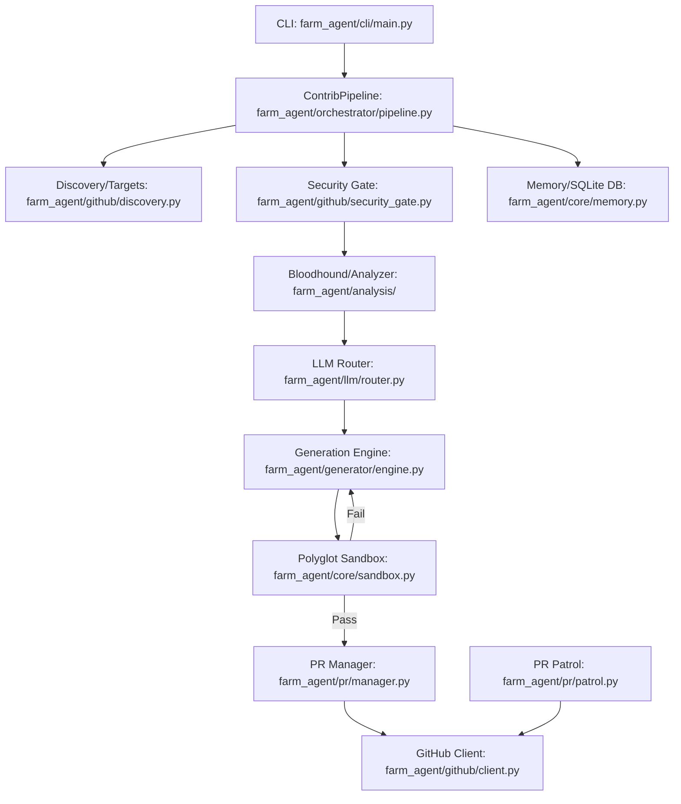

# PROJECT_MAP.md — Architecture Blueprint

This document serves as the canonical architectural guide to the **Farm-Agent** codebase. It outlines the core system flow, directory structures, active technical stack, and database schema mappings.

---

## 1. System Overview & Tech Stack

Farm-Agent is a high-throughput, autonomous open-source contribution engine. It relies heavily on concurrent asynchronous pipelines, resilient state-tracking databases, containerized validation layers, and intelligent multi-model LLM routing.

| Technology | Role |
|------------|------|
| **Python 3.11+** | Core execution runtime. |
| **Hatchling** | Build system backend and packaging. |
| **Docker SDK (7.1+)** | Powers the Polyglot Sandbox for isolated code validation and testing before PR creation. |
| **Click & Rich** | Powers the CLI interface (`farm_agent`) and provides colored, formatted console output. |
| **AioSQLite** | Asynchronous persistent state memory layer (tracks quotas, target rotation, and PR status). |
| **PyYAML & Pydantic** | Manages application configuration and strongly-typed data validation for system models. |
| **HTTPX** | Fast, asynchronous HTTP client used for GitHub API integration. |
| **GitPython** | Programmatic interface for cloning, modifying, committing, and pushing code patches. |
| **ChromaDB** | Provides local RAG (Retrieval-Augmented Generation) capabilities for complex issue solving. |
| **Minimax API** | Primary LLM provider for the code generation and analyzer engines. |
| **OpenRouter API** | Secondary LLM gateway enabling the Bloodhound Red Team pipeline for cost-effective vulnerability audits. |

---

## 2. Directory Structure

```text
farm_agent/
├── cli/
│   └── main.py          # Click CLI entry point, defining all commands (run, hunt, patrol, etc.)
├── core/
│   ├── config.py        # Configuration management via Pydantic
│   ├── exceptions.py    # Custom system exceptions (GitHubAPIError, RateLimitError, etc.)
│   ├── logger.py        # Logging setup
│   ├── memory.py        # Persistent SQLite state mapping tables (quotas, runs, PR outcomes)
│   ├── models.py        # Core data schemas (Repository, Finding, Contribution, TargetRepoEntry)
│   ├── retry.py         # Asynchronous retry mechanisms
│   └── sandbox.py       # Polyglot Docker Sandbox (code execution and validation guillotine)
├── generator/
│   ├── engine.py        # Code Generation Engine powered by LLMs
│   ├── reviewer.py      # LLM-based Contribution Reviewer
│   └── scorer.py        # Quality Scorer (checks repo style guidelines, debug code leaks)
├── github/
│   ├── client.py        # Primary wrapper around GitHub REST and GraphQL API
│   ├── discovery.py     # GitHub repository discovery routines
│   ├── guidelines.py    # Guideline extractor (CONTRIBUTING.md)
│   └── security_gate.py # Security Disclosure Gates (private vulnerability phrase filtering)
├── issues/
│   └── solver.py        # Solves specific GitHub issues via issue complexity classification
├── llm/
│   ├── agents.py        # Specific LLM agent logic wrappers
│   ├── models.py        # Catalogs supported LLM providers
│   ├── provider.py      # Manages API requests to Minimax and OpenRouter
│   └── router.py        # Routes tasks to the optimal LLM provider
├── orchestrator/
│   ├── human.py         # The relentless Terminator Execution Loop orchestrator
│   ├── memory.py        # Sibling connection to persistent sqlite DB
│   └── pipeline.py      # ContribPipeline (THE CORE ENGINE). Orchestrates concurrent tasks.
├── pr/
│   ├── janitor.py.DISABLED # Disabled PR cleanup mechanism
│   ├── manager.py       # Handles forks, branches, commits, pushing, and PR generation
│   └── patrol.py        # Autonomously checks for maintainer comments and acts on feedback
├── templates/
│   ├── builtin/         # Included built-in patch structures
│   └── registry.py      # Manages templated code injections
└── tools/
    └── protocol.py      # DeerFlow tool system management
```

---

## 3. Core Module Dependency Graph



---

## 4. Core Execution Loops / Entry Points

The fundamental sequence executed by `ContribPipeline` maps exactly to the following stages:

1. **Discovery Stage (`github/discovery.py`):**
   The pipeline queries GitHub for new target repositories or cycles through `DatabaseTargetDiscovery` leveraging a crash-safe circular rotation loop (`Circular Target Loop`).
2. **Gate Stage (`github/security_gate.py` & `Anti-Farming Filter`):**
   Identified repositories undergo rigorous vetting.
   - Filters out protected files (e.g. `package-lock.json`).
   - Ensures no secret vulnerabilities are disclosed via `Security Gate`.
   - The Anti-Farming Filter strictly drops "Trivial" impact severity bugs and simple documentation PRs.
3. **Analysis Stage (`Bloodhound Red Team`):**
   The application scans code using security tools like `semgrep`. Code is audited via an LLM acting under OpenRouter.
4. **Engine Stage (`generator/engine.py`):**
   Issues and code improvements are synthesized. Code changes are securely generated using `Minimax` as the code-gen core. Forbidden AI text signatures (like 'as an ai') are filtered via gag orders.
5. **Sandbox Stage (`core/sandbox.py`):**
   All patches undergo the **Polyglot Sandbox Verification**. The patch is injected into a severely limited, internet-isolated Docker container where linters and unit tests are executed. If it fails, the agent retries self-correction. If it repeatedly fails, the PR is aborted.
6. **PR Stage (`pr/manager.py`):**
   Successfully validated changes trigger the PR flow: fork repo -> branch -> apply diff -> commit via GitPython -> Push -> Create PR via GitHub API.

---

## 5. Database/State Schema

Farm-Agent utilizes an asynchronous SQLite database operating in WAL mode to orchestrate concurrency, tracking historical interactions reliably across execution processes.

**Core Tables:**

- `analyzed_repos`: Tracks GitHub repositories evaluated by the Bloodhound pipeline, saving timestamp and pass/fail state.
- `submitted_prs`: Logs successful Pull Requests (PR numbers, URLs, target branches) against external repositories to calculate quota limit exhaustion.
- `target_repos`: Houses the Circular Target Loop queue populated by initial JSON seeds, rotating to guarantee crash-safe operational continuity.
- `findings_cache`: Tracks specific file-path analysis findings securely to prevent duplicate generation loops.
- `pr_outcomes`: Tracks the eventual outcomes of opened PRs (e.g., merged, closed).
- `api_usage_log`: Logs specific API usage across Minimax, OpenRouter, and GitHub endpoints to restrict rate limit bursts and calculate operational costs.
- `task_schedule`: Multi-process coordinating table. Keeps PR cleanup state execution and bounds.
- `knowledge_base`: Associated RAG metadata mapping table for long-term codebase memory.
