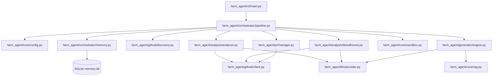

# Farm-Agent Project Blueprint

This document provides a deep-dive architectural guide to the Farm-Agent codebase. It reflects the exact structure, modules, and execution loops as they currently exist.

## 1. System Overview & Tech Stack

| Component | Technology | Role in System |
| :--- | :--- | :--- |
| **Language** | Python 3.11+ | Core programming language. |
| **Build System** | Hatchling | Package building and distribution. |
| **Configuration** | Pydantic & YAML | Environment and configuration management (`config.yaml`, `.env`). |
| **CLI** | Click & Rich | Command-line interface orchestration and stylized terminal output. |
| **Persistence** | SQLite (via `aiosqlite`) | Asynchronous, WAL-mode database for persistent state and memory. |
| **Validation** | Docker SDK | Polyglot Sandbox environment for untrusted code execution and patch validation. |
| **Vector DB** | ChromaDB | Local RAG index for cross-file context retrieval. |
| **LLM Integration** | Minimax, OpenRouter, etc. | Core intelligence for code analysis, generation, and PR review responses. |
| **VCS Interop** | GitPython | Local git repository manipulation for patching and diffing. |
| **HTTP Client** | HTTPX | Asynchronous API requests to GitHub and LLM providers. |

## 2. Directory Structure

```ascii
farm_agent/
├── agents/             # DeerFlow sub-agent registry and protocol
├── analysis/           # Code analyzers (Bloodhound, Semgrep radar)
├── cli/                # Command-line interface entry points (Click commands)
├── core/               # Core configurations, exceptions, memory, models, and RAG
│   ├── rag.py          # Local RAG engine using ChromaDB
│   └── sandbox.py      # Docker-backed polyglot sandbox for patch validation
├── generator/          # Code generation engine and QA hardcore scorer
├── github/             # GitHub API client, repo discovery, and security gates
├── issues/             # Issue-driven contribution solver
├── llm/                # LLM provider abstractions, task routing, and model definitions
├── notifications/      # Webhook notifiers (Telegram, Slack, Discord)
├── orchestrator/       # Pipeline orchestration (ContribPipeline, SuperHumanLoop)
├── plugins/            # Plugin system interfaces
├── pr/                 # PR manager, Janitor (disabled), and Patrol (auto-response)
├── templates/          # Contribution template registry
└── tools/              # DeerFlow tool system protocol
scripts/                # Standalone utility and benchmarking scripts
sg-extract/             # Semgrep extraction utilities
tests/                  # Unit and integration tests
```

## 3. Core Module Dependency Graph



## 4. Core Execution Loops

The primary workflow for Farm-Agent is orchestrated via the `ContribPipeline` in `farm_agent/orchestrator/pipeline.py`.

### The Terminator Execution Loop

1.  **Discovery:** The system searches for relevant repositories via GitHub APIs (`RepoDiscovery`) or reads from a local list (`DatabaseTargetDiscovery` for the Circular Target Loop).
2.  **Compliance & Gatekeeping:**
    *   **AI Policy Check:** Scans `CONTRIBUTING.md` and `AI_POLICY.md` to ensure AI-generated PRs are allowed.
    *   **Interaction Limits Check:** Ensures the repo accepts contributions from new contributors.
    *   **Security Disclosure Gate:** Checks if vulnerabilities must be reported privately (aborts PR if so).
    *   **Maintainer Vibe Check:** Checks recent comments for toxic/hostile behavior.
3.  **Bloodhound Pre-Scan:** Uses Semgrep to quickly find vulnerabilities before engaging expensive LLM calls.
4.  **Analysis:** The `CodeAnalyzer` statically analyzes the codebase to find issues.
5.  **Anti-Farming Filter:** A zero-tolerance gatekeeper drops trivial findings (formatting, typos) and documentation-only PRs.
6.  **Context Retrieval:** RAG via ChromaDB fetches relevant surrounding code and cross-file dependencies.
7.  **Generator Engine:** The `ContributionGenerator` formulates a patch to address the finding.
8.  **Sandbox Guillotine:** The `DockerSandbox` creates a secure container, applies the patch, and runs the repository's test suite.
    *   **DEV-QA Bounty Loop:** If tests fail, the QA scorer critiques the patch and feeds it back into the Generator for self-correction.
9.  **PR Submission:** The `PRManager` commits the validated patch to a fork and opens a Pull Request on the target repository.

## 5. Database Schema (`memory.db`)

Farm-Agent uses an `aiosqlite` WAL-mode database to maintain persistent state.

| Table Name | Description |
| :--- | :--- |
| `analyzed_repos` | Tracks repositories that have been completely analyzed to avoid redundant processing. |
| `submitted_prs` | Logs all Pull Requests created by the agent, including their current status (open, merged, closed). |
| `findings_cache` | Caches static analysis and Bloodhound findings. |
| `run_log` | Records statistics for each pipeline run (duration, repos analyzed, PRs created, errors). |
| `pr_outcomes` | Detailed tracking of specific PR outcomes and reasons for closure or merge. |
| `repo_preferences` | Stores accumulated preferences and style guide elements learned from repositories. |
| `blacklisted_repos` | A permanent blocklist of repositories to ignore (due to AI policies, hostile maintainers, etc.). |
| `api_usage_log` | Tracks LLM API usage to enforce quotas (e.g., Minimax 5-hour and 7-day limits). |
| `task_schedule` | Manages scheduled maintenance tasks like garbage collection or quota resets. |
| `knowledge_base` | General RAG-ready context and learned lessons from QA failures. |
