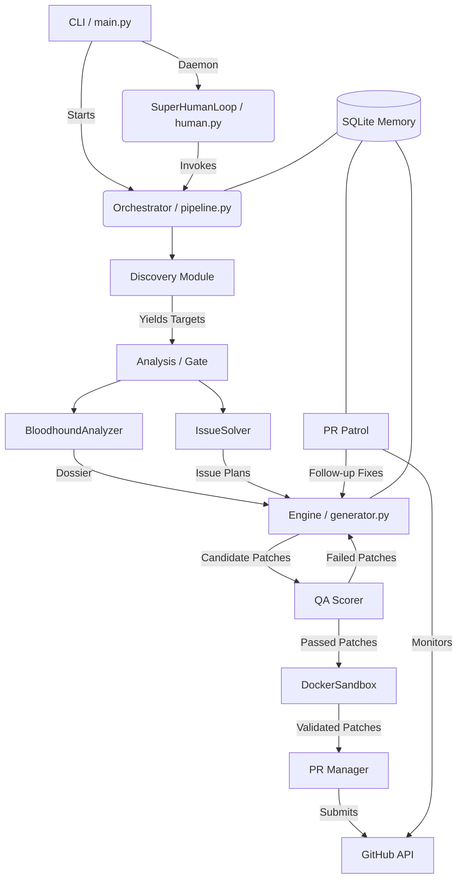

# Project Map & Architectural Blueprint

## 1. System Overview & Tech Stack

Farm-Agent is built on a modern, asynchronous Python stack leveraging advanced LLMs and Docker for secure execution.

| Technology/Library | Role in Project |
| ------------------ | --------------- |
| **Python 3.11+** | Core programming language. |
| **Hatchling** | Build backend/system defined in `pyproject.toml`. |
| **aiosqlite** | Asynchronous SQLite interface for persistent state (`memory.db`). |
| **Docker SDK** | Provisions isolated, polyglot sandboxes for testing patches securely. |
| **LLM APIs (Minimax, Anthropic, OpenRouter)** | Drives code analysis, finding validation, code generation, and issue solving. |
| **HTTPX / Respx** | Fast, asynchronous HTTP client for GitHub API and LLM API requests. |
| **Click & Rich** | Powers the robust CLI interface with colorful, structured terminal outputs. |
| **Pydantic** | Strong typing and data validation for models, events, and configuration. |
| **PyYAML** | Configuration management (`config.yaml`). |

## 2. Directory Structure

```text
farm_agent/
├── agents/             # Modular agent logic and registries for different tasks.
├── analysis/           # Code scanners: BloodhoundAnalyzer, CodeAnalyzer.
├── cli/
│   └── main.py         # Entry point for the CLI (`farm_agent run`, `hunt`, etc.).
├── core/               # Shared utilities, config loading, sandbox, exceptions.
│   ├── config.py       # Pydantic settings loading.
│   ├── sandbox.py      # Docker execution environment (`DockerSandbox`).
│   └── models.py       # Core data schemas (Findings, PRResult, etc.).
├── generator/
│   ├── engine.py       # Code generation LLM orchestrator.
│   └── scorer.py       # QA Hardcore Scorer for patches.
├── github/             # Interaction with GitHub API.
│   ├── client.py       # Async HTTP wrapper with token rotation and retries.
│   ├── discovery.py    # Locates repositories to target.
│   └── security_gate.py# Validates security disclosure constraints.
├── issues/
│   └── solver.py       # Analyzes open GitHub issues and plans deep solutions.
├── llm/                # Abstractions for multi-provider LLM interaction.
├── notifications/      # Webhook alerting (Telegram, Slack, Discord).
├── orchestrator/       # High-level control loops.
│   ├── pipeline.py     # Main `ContribPipeline` tying everything together.
│   ├── memory.py       # SQLite database interactions.
│   └── human.py        # Contains `SuperHumanLoop` daemon.
├── pr/                 # Pull Request lifecycle management.
│   ├── manager.py      # Branching, committing, and opening PRs.
│   └── patrol.py       # Monitors open PRs and auto-replies to maintainers.
├── templates/          # Contribution templates.
└── tools/              # Available tools protocol interface.
```

## 3. Core Module Dependency Graph



## 4. Core Execution Loops / Entry Points

Farm-Agent's core logic operates through the **Terminator Execution Loop** (SuperHuman Mode) and the **Pipeline Loop**.

**The Pipeline Flow:**
1. **Discovery:** The pipeline queries GitHub (via `github/discovery.py` or from `target_repo.json` in circular mode) to find high-impact repos matching language/star criteria.
2. **Gate:** Repositories are checked against AI policies (`AI_POLICY.md`), interaction limits, and maintainer "vibe" checks (toxic maintainer avoidance).
3. **Analysis:** The codebase is analyzed using Bloodhound/CodeAnalyzer for security flaws, or `IssueSolver` identifies solvable GitHub issues. The **Anti-Farming Filter** blocks trivial formatting changes and documentation-only modifications.
4. **Engine (DEV-QA Bounty Loop):**
   - DEV LLM generates a patch.
   - QA LLM (`QAHardcoreScorer`) critiques the patch. If it fails, the critique is fed back into DEV for up to 3 cycles.
5. **Sandbox (Polyglot Guillotine):** The winning patch is applied to a local clone inside an ephemeral, network-isolated Docker container (`core/sandbox.py`). Test suites (`npm test`, `pytest`, `cargo test`) are executed. If they fail, self-correction is attempted.
6. **PR:** If the sandbox validates the patch, `PRManager` forks the repo, commits the code (respecting DCO sign-offs and conventional commits), and opens a Pull Request.

## 5. Database/State Schema

State is persistently managed in an SQLite database (`data/memory.db`) via `aiosqlite` in `orchestrator/memory.py`.

**Key Tables:**
- `analyzed_repos`: Tracks repositories already processed to prevent duplicate scanning.
- `submitted_prs`: Logs all generated PRs. Used by `PRPatrol` and the CLI `status` command.
- `findings_cache`: Stores analyzed code patterns and identified flaws.
- `run_log`: High-level metrics for CLI `stats` tracking total runs, findings, and PRs.
- `pr_outcomes`: Tracks whether PRs were merged, closed, or remain open.
- `repo_preferences`: Caches dynamically determined style guides and repository instructions.
- `blacklisted_repos`: Prevents interactions with repos flagged by vibe checks or interaction limits.
- `task_schedule` & `target_repos`: Manages queued operations, including the `hunt-circular` deterministic target loop.
- `knowledge_base`: Stores semantic information, RAG snippets, and QA lessons learned from rejected patches.
