# PROJECT_MAP.md

> **Architecture Blueprint for Farm-Agent (v3.0.0)**
> This document reflects the raw reality of the active codebase.

## 1. System Overview & Tech Stack

Farm-Agent is a highly autonomous, multi-layered AI system capable of full-lifecycle open source contribution, from initial discovery to post-PR code revisions. The v3.0 architecture introduces the **Bloodhound Red Team** (ast-grep + Semgrep dual radar, OpenRouter validation), **Circular Target Loop** (deterministic round-robin targeting), **DEV-QA Bounty Loop** (10-cycle adversarial quality gate with Chain-of-Thought planning), **Token Pool Rotation** (multi-token GitHub API load distribution), **Terminator Execution Loop** (relentless continuous operation), and **Knowledge Base GC** (stale lesson purging).

| Technology | Role |
| :--- | :--- |
| **Python 3.11+** | Core language, heavily utilizing `asyncio` for concurrent operations. |
| **Click & Rich** | Powers the robust Command-Line Interface (CLI) and terminal formatting. |
| **HTTPX** | Asynchronous HTTP client for communicating with GitHub and LLM APIs. |
| **SQLite (aiosqlite)** | Persistent, thread-safe (WAL mode) database for memory, quotas, PR tracking, and knowledge base. |
| **Minimax LLM** | Primary Large Language Model engine used for generation, analysis, and reasoning. Native integration with quota tracking. |
| **OpenRouter** | Secondary LLM provider for Bloodhound Red Team vulnerability validation. Routes White-Hat audits through free/cheap models (e.g., dolphin-mistral-24b) to conserve Minimax quota. Configured via `OPENROUTER_API_KEY`. |
| **Pydantic & PyYAML**| Robust configuration parsing, validation, and settings management (`config.yaml`). |
| **Docker (SDK)** | Ephemeral "Polyglot Sandbox" containers to execute tests and validate code patches safely. Runs in Docker-outside-of-Docker (DooD) mode. |
| **ChromaDB** | Ephemeral, in-memory vector database for Retrieval-Augmented Generation (RAG) context to identify cross-file dependencies. |
| **ast-grep (`sg`)** | CLI-based AST pattern matching tool used as a pre-filter in the Bloodhound Red Team pipeline to find exact buggy snippets before LLM analysis. Installed via direct binary download in the Docker image. |
| **Semgrep** | Community-ruleset-based static analysis scanner that runs concurrently with ast-grep in the Bloodhound pipeline. Uses remote rulesets (`p/security-audit`, `p/cwe-top-25`, `p/default`). Installed via `pip install semgrep` in the Docker image. |
| **Pytest & Ruff** | Standardized testing framework and aggressive code formatting/linting. |

---

## 2. Directory Structure

```text
farm_agent/
├── cli/                 # Command-Line Interface entry points
│   ├── main.py          # Primary Click CLI (`hunt`, `hunt-circular`, `superhuman`, `gc`, etc.)
│   └── tui.py           # Text User Interface module
├── core/                # Core domain models, configuration, and infrastructure
│   ├── config.py        # Pydantic config (LLMConfig, AnalysisConfig with red_team_*/semgrep_*, GitHubConfig with secondary_tokens, FarmAgentConfig)
│   ├── middleware.py    # Pipeline execution middlewares (Rate limits, DCO, Quality Gates)
│   ├── models.py        # Shared data structures (Contribution, Repository, Finding, Vulnerability, VulnerabilityDossier, QAResult, TargetRepoEntry)
│   ├── rag.py           # ChromaDB integration for contextual code search
│   └── sandbox.py       # Docker-based Polyglot Sandbox for testing patches (DooD)
├── github/              # Interfacing with the GitHub REST API
│   ├── client.py        # Multi-token async HTTPX client with pool rotation (GET=pool, POST/PATCH=primary) + GraphQL
│   ├── discovery.py     # RepoDiscovery (API search) + JsonTargetDiscovery (circular loop)
│   └── guidelines.py    # Parsers for CONTRIBUTING.md and PR templates
├── orchestrator/        # The brains of the operation connecting subsystems
│   ├── human.py         # TerminatorLoop: relentless continuous execution + KB GC
│   ├── memory.py        # SQLite persistence layer (aiosqlite) + knowledge_base + OpenRouter tracking
│   └── pipeline.py      # ContribPipeline: discovery → bloodhound → DEV-QA loop → PR
├── analysis/            # Code scanning and issue identification
│   ├── analyzer.py      # CodeAnalyzer (legacy) + BloodhoundAnalyzer (ast-grep + Semgrep dual radar → OpenRouter/LLM)
│   ├── mapper.py        # Repository structural mapper
│   └── skills.py        # Progressive analysis skill definitions
├── generator/           # Patch generation and validation
│   ├── engine.py        # ContributionGenerator + TemplateViolationError + anti-template retry + CoT planning
│   ├── scorer.py        # QualityScorer (heuristic) + QAHardcoreScorer (LLM-adversarial)
│   └── reviewer.py      # Adversarial ReviewerAgent for self-review
├── issues/              # Issue-driven contribution logic
│   └── solver.py        # Analyzes and solves open GitHub issues
├── pr/                  # Pull Request lifecycle management
│   ├── manager.py       # Forks, branches, commits, and creates PRs
│   ├── patrol.py        # Monitors open PRs for feedback and auto-pushes fixes
│   └── janitor.py       # Sweeps and destroys garbage/low-quality PRs
├── llm/                 # Abstractions for Language Models
│   ├── provider.py      # Factory and interface for LLM clients (MinimaxProvider, OpenRouterProvider, _PROVIDERS registry)
│   ├── context.py       # System prompt construction and style guide injection
│   └── router.py        # Task-based routing to different LLM models
├── notifications/       # Alerting system
│   └── notifier.py      # Telegram/Slack/Discord webhook integrations
├── agents/              # Sub-agents for specialized tasks
│   └── registry.py      # Agent registry
└── tools/               # LLM Function Calling Tools
    └── protocol.py      # Tool registry for the LLM to interact with the environment

ast_rules/               # AST-grep rule files (YAML) for Bloodhound pre-filtering
├── python-*.yaml        # Python vulnerability rules (sqli, deserialization, etc.)
├── js-*.yaml            # JavaScript vulnerability rules
├── ts-*.yaml            # TypeScript vulnerability rules
├── go-*.yaml            # Go vulnerability rules
├── rust-*.yaml           # Rust vulnerability rules
└── solidity-*.yaml      # Solidity vulnerability rules

target_repo.json         # Circular Target Loop data: list of target repos with scan timestamps
```

### Docker Deployment Files

```text
Dockerfile               # Multi-stage build (python:3.11-slim), ast-grep binary, semgrep pip, wheel install
docker-compose.yml        # DooD architecture; single `farm_agent` service with Docker socket mount
.dockerignore             # Excludes venv/, tests/, .git/, .env, data/, logs/ from build context
entrypoint.sh             # Minimal `exec "$@"` — no DB seeding (v3.0 Memory.init() handles schema)
```

---

## 3. Core Module Dependency Graph

```mermaid
graph TD
    CLI[farm_agent.cli.main] --> Orchestrator[orchestrator.pipeline.ContribPipeline]
    CLI --> Terminator[orchestrator.human.SuperHumanLoop]
    CLI --> Patrol[pr.patrol.PRPatrol]
    CLI --> Janitor[pr.janitor.PRJanitor]
    CLI --> Solver[issues.solver.IssueSolver]

    Terminator --> Orchestrator
    Terminator --> Patrol
    Terminator --> Memory[orchestrator.memory.Memory]

    Orchestrator --> Config[core.config.FarmAgentConfig]
    Orchestrator --> GitHub[github.client.GitHubClient]
    Orchestrator --> Discovery[github.discovery.RepoDiscovery]
    Orchestrator --> JsonDiscovery[github.discovery.JsonTargetDiscovery]
    Orchestrator --> Bloodhound[analysis.analyzer.BloodhoundAnalyzer]
    Orchestrator --> Analyzer[analysis.analyzer.CodeAnalyzer]
    Orchestrator --> Generator[generator.engine.ContributionGenerator]
    Orchestrator --> QAScorer[generator.scorer.QAHardcoreScorer]
    Orchestrator --> IssueSolver[issues.solver.IssueSolver]
    Orchestrator --> PRManager[pr.manager.PRManager]
    Orchestrator --> Memory

    Bloodhound --> ASTRules[ast_rules/*.yaml]
    Bloodhound --> SemgrepRules[semgrep community rulesets]
    Bloodhound --> MinimaxLLM[llm.provider.MinimaxProvider]
    Bloodhound --> OpenRouter[llm.provider.OpenRouterProvider]
    Bloodhound --> GitHub
    Bloodhound --> Memory

    Generator --> MinimaxLLM
    Generator --> RAG[core.rag.ChromaDB]
    Generator --> Sandbox[core.sandbox.DockerSandbox]
    Generator --> Memory

    QAScorer --> MinimaxLLM

    JsonDiscovery --> TargetRepo[target_repo.json]

    Analyzer --> MinimaxLLM
    IssueSolver --> MinimaxLLM
    IssueSolver --> GitHub
    PRManager --> GitHub
    Patrol --> GitHub
    Patrol --> MinimaxLLM
```



---

## 4. Core Execution Loops / Entry Points

### A. Main Pipeline (`hunt`, `target`, `run`)
1. **Discovery**: `RepoDiscovery` uses the GitHub Search API to find repositories matching criteria (stars, language). Prioritizes "Familiar Grounds" (repos we previously successfully merged PRs to).
2. **Vibe Check**: Analyzes maintainer's recent comments to avoid toxic/hostile repositories.
3. **Analysis / Issue Solving**:
    - The pipeline attempts to find solvable issues using `IssueSolver`.
    - If no issues are solvable, it falls back to static code scanning via `CodeAnalyzer` to identify bugs, security flaws, or optimizations.
4. **Anti-Farming Filters**: Strict LLM and keyword-based gating to drop trivial (typos), documentation-only, or spammy formatting PRs.
5. **Generation**: `ContributionGenerator` uses `ChromaDB` for cross-file context (RAG) and the LLM to generate a `FileChange` patch.
6. **Adversarial Self-Review**: The `ReviewerAgent` independently audits each patch before submission. If rejected, the generator rewrites with the critique appended.
7. **Hybrid Contribution Protocol**:
    - *Route A (Direct PR)*: For Security fixes and Critical/High severity bugs.
    - *Route B (Issue-First)*: For Refactors/Optimizations, it creates a polite GitHub Issue to discuss before writing code.
8. **Sandbox Guillotine**: Generated patches are verified inside ephemeral Docker containers. If tests/linters fail, the LLM attempts iterative self-correction.
9. **PR Creation**: `PRManager` forks the repo, pushes the branch, applies DCO sign-offs, and opens the Pull Request (if Route A).

### B. Circular Target Loop (`hunt-circular`)
A deterministic round-robin bounty loop that reads targets from `target_repo.json`:

1. **Target Selection**: `JsonTargetDiscovery.get_next_target()` reads `target_repo.json`, sorts by `scanned_at` ascending (null = epoch), and returns the oldest-scanned repo.
2. **Crash-Safe Mark**: Immediately updates `scanned_at` to `now()` and atomically saves before any analysis/LLM calls. Guarantees that a crash won't cause the same repo to be re-picked.
3. **Bloodhound Dual Radar** (`BloodhoundAnalyzer`):
    - Checks `sg` binary availability and `semgrep` binary availability independently.
    - Maps repo language to `ast_rules/` prefix (e.g., `Python → python-*.yaml`).
    - Shallow-clones the repo (`git clone --depth 1`).
    - Runs ast-grep scans (`_run_ast_grep`) and/or Semgrep scans (`_run_semgrep`) concurrently via `asyncio.gather`, depending on config flags.
    - If neither tool is available: returns empty dossier.
    - Merges results from both radars and deduplicates by `(file, line)`.
    - If no matches: returns empty dossier → marks `COMPLETED_NO_VULN` → skips LLM entirely (cost savings).
    - If matches found: formats context string and sends to White-Hat audit.
4. **White-Hat Audit with OpenRouter Routing** (`_white_hat_audit`):
    - `_get_red_team_provider()` lazily initializes an `OpenRouterProvider` if `openrouter_api_key` is configured.
    - Checks daily usage limit via `Memory.get_openrouter_usage_today()`. If the limit (`red_team_daily_limit`, default 1000) is reached, falls back to Minimax.
    - If OpenRouter is available and under limit: routes the audit call through `OpenRouterProvider.complete()`, then records usage via `Memory.record_openrouter_usage()`.
    - If no OpenRouter key or limit reached: falls back to `self._llm.complete()` (Minimax).
5. **DEV-QA Bounty Loop** (if bugs found):
    - Up to 10 cycles of: DEV generates patch → QA scores patch → if score ≥ 9.0, approved; else record critiques as QA lessons and retry.
    - `generate_from_dossier()` uses **Chain-of-Thought (CoT) planning**: the LLM MUST output a `coding_plan` (root cause analysis + step-by-step strategy + edge cases) BEFORE writing code. The `_parse_changes()` parser extracts and logs this plan via `logger.info("[CoT] DEV Agent Plan: ...")`.
    - The 3-cycle anti-template interceptor catches `...`, `TODO`, `[Insert Code]`, etc. with escalating `SYSTEM WARNING` on retry.
    - `QAHardcoreScorer` grades patches on Logic (30%), Architecture (25%), Idioms (20%), Security (15%), Scope/Tests (10%). Only ≥ 9.0/10.0 passes.
6. **Status Tracking**: `mark_status()` atomically updates `target_repo.json` status to `COMPLETED_NO_VULN`, `PR_SUBMITTED`, or `COMPLETED_QA_REJECTED`.

### C. Issue Solver (`solve`)
A specialized loop that targets a specific repository, discovers open issues, filters for solvable ones (e.g., specific bugs, feature requests), and routes them through the Generator and Sandbox to create a PR closing the issue.

### D. Terminator Mode (`superhuman`)
A relentless continuous execution loop with no simulated human delays:
- **No stochastic delays**: No coffee breaks, no lunch breaks, no typing delays. 10-second safety sleep between iterations prevents CPU pegging.
- **Daily KB Garbage Collection**: `_new_day_check()` runs `run_kb_garbage_collection(days=90)` once per calendar day boundary.
- **Continuous action**: Each iteration selects hunt (60%) or patrol (40%) via dice roll.
- **Safety cap**: `max_prs_per_day` from config still enforced — when reached, switches to patrol-only mode with 60-second sleep.
- **Pending notification priority**: If open PRs have pending maintainer feedback, patrol runs first.
- **LLM quota cooldown**: 5-minute sleep on `LLMRateLimitError`, then continues.
- **Friendly-repos sync**: Runs on startup and every 24 hours via `_sync_historical_friendly_repos()`.
- **Time-warp mode**: `--time-warp` flag uses 1-second delays and exits after 10 iterations for testing.
- **Token Pool**: `GitHubClient` rotates through `secondary_tokens` for GET requests, keeping the primary token for all mutations (POST/PATCH/PUT/DELETE).

### E. PR Patrol (`patrol`)
A post-submission operational loop:
- Scans memory for all open PRs previously created by Farm-Agent.
- Checks GitHub for new review comments.
- Uses the LLM to classify feedback (`CODE_CHANGE`, `QUESTION`, `STYLE_FIX`).
- Automatically generates and pushes new commits to the branch to satisfy the maintainer's requests.

### F. PR Janitor (`janitor`)
A self-cleanup utility:
- Scans live open PRs under the agent's GitHub account.
- Uses the LLM to evaluate the PR. If deemed "garbage" (low impact, formatting-only, exploratory), it forcibly closes the PR and deletes the branch.

### G. Garbage Collection (`gc`)
CLI command for manual knowledge base cleanup:
- `farm_agent gc --days 90` purges `knowledge_base` entries older than N days.
- Also runs automatically once per day inside the Terminator loop at day boundary.

---

## 5. Database/State Schema

Farm-Agent uses an asynchronous SQLite database (`memory.db` with WAL mode) for state persistence, quota tracking, and knowledge management.

| Table Name | Description | Key Columns |
| :--- | :--- | :--- |
| `run_log` | High-level audit log of execution runs. | `id`, `started_at`, `ended_at`, `repos_analyzed`, `prs_created` |
| `analyzed_repos` | Tracks repos that have been processed to avoid redundant scanning. | `full_name`, `language`, `analyzed_at`, `findings` |
| `submitted_prs` | Core table tracking active and historical Pull Requests and Issues. | `repo`, `pr_number`, `status` (open/merged/closed), `type`, `updated_at`, `ci_fix_attempts` |
| `findings_cache` | Caches identified issues to save LLM tokens across restarts. | `repo`, `type`, `severity`, `status` |
| `pr_outcomes` | Records the outcome of PRs (merged, closed, rejected) for learning. | `repo`, `pr_number`, `pr_type`, `outcome`, `feedback` |
| `repo_preferences`| Stores behavioral traits of repositories (preferred contribution types). | `repo`, `preferred_types`, `merge_rate` |
| `blacklisted_repos`| Repositories where PRs are banned (e.g., due to toxic maintainers or AI policies). | `repo`, `reason`, `blacklisted_at` |
| `api_usage_log` | Tracks LLM and GitHub API requests for sliding-window rate limiting. Includes `provider='openrouter'` rows for Red Team daily limit enforcement. | `timestamp`, `provider` |
| `task_schedule` | General purpose key-value store for scheduling background tasks. | `task_key`, `next_run` |
| `knowledge_base` | Stores QA lessons and audit history for the DEV-QA Bounty Loop. | `repo_name`, `entry_type` (qa_lesson, audit_history), `content`, `created_at` |

### External State Files

| File | Description |
| :--- | :--- |
| `target_repo.json` | Array of `TargetRepoEntry` objects driving the Circular Target Loop. Each entry has `repo_url`, `status`, `scanned_at`, `language`, and bounty metadata. Updated atomically (temp-file-then-rename) by `JsonTargetDiscovery`. |
| `ast_rules/*.yaml` | AST-grep rule YAML files organized by language prefix (e.g., `python-sqli-fstring-execute.yaml`, `go-unchecked-error.yaml`). Used by `BloodhoundAnalyzer` as a pre-filter before LLM analysis. |
| `config.yaml` | Pydantic-validated YAML configuration. Contains `github.secondary_tokens`, `llm.openrouter_api_key`, `analysis.red_team_model`, `analysis.red_team_daily_limit`, `analysis.use_semgrep`, `analysis.semgrep_rulesets`, and all other settings. |
| `.env` | Environment variables for secrets (`GITHUB_TOKEN`, `GITHUB_SECONDARY_TOKENS`, `MINIMAX_API_KEY`, `MINIMAX_GROUP_ID`, `OPENROUTER_API_KEY`, `TELEGRAM_BOT_TOKEN`, `TELEGRAM_CHAT_ID`, etc.). Mounted read-only in Docker. |

---

## 6. Key Data Models (Pydantic)

| Model | Location | Purpose |
| :--- | :--- | :--- |
| `TargetRepoEntry` | `core/models.py` | Single target from `target_repo.json`. Contains `repo_url`, `status`, `scanned_at`, `language`, `bounty_amount`, `diamond_target`, etc. |
| `Vulnerability` | `core/models.py` | A single validated vulnerability from Bloodhound. Fields: `file`, `line`, `snippet`, `poc`, `fix`, `impact`. |
| `VulnerabilityDossier` | `core/models.py` | Dossier of vulnerabilities for a repo. Has `has_bugs()` method that returns `False` if all matches were false positives (file="NONE"). |
| `QAResult` | `core/models.py` | Result of `QAHardcoreScorer` evaluation. Fields: `score` (0.0-10.0), `critiques` (list of strings), `approved` (True only if score ≥ 9.0). |
| `Contribution` | `core/models.py` | Generated patch with finding, changes, commit message, branch name. |
| `Finding` | `core/models.py` | Identified issue with severity, file path, description, suggestion. |
| `RepoContext` | `core/models.py` | Full repository context for LLM prompting (file tree, content, guidelines). |

### Configuration Models

| Model | Location | Key Fields |
| :--- | :--- | :--- |
| `GitHubConfig` | `core/config.py` | `token`, `max_repos_per_run`, `max_prs_per_day`, `rate_limit_buffer`, `dco_signoff`, `secondary_tokens` (env: `GITHUB_SECONDARY_TOKENS`, comma-separated) |
| `LLMConfig` | `core/config.py` | `provider`, `model`, `api_key`, `minimax_group_id`, `openrouter_api_key` (env: `OPENROUTER_API_KEY`) |
| `AnalysisConfig` | `core/config.py` | `enabled_analyzers`, `severity_threshold`, `red_team_model`, `red_team_daily_limit`, `use_semgrep`, `semgrep_rulesets` |
| `FarmAgentConfig` | `core/config.py` | `github`, `llm`, `analysis`, `contribution`, `discovery`, `storage`, `pipeline`, `notifications`, `logging`, `multi_model` |

---

## 7. Key Algorithms & Protocols

### 7.1 Crash-Safe Circular Target Rotation
`JsonTargetDiscovery` reads `target_repo.json`, sorts by `scanned_at` ascending (null = epoch), and returns the oldest entry. `mark_scanned()` updates `scanned_at` and atomically writes the file **before** any GitHub API or LLM calls. This guarantees that if the agent crashes, the next restart picks a different target.

### 7.2 Bloodhound Red Team Protocol (Dual Radar)
1. `BloodhoundAnalyzer.run_bloodhound(repo)` clones the repo shallowly.
2. Builds a concurrent task list from available radars:
    - ast-grep (`_run_ast_grep`): if `sg` binary is available, resolves language-specific rule files and runs them concurrently.
    - Semgrep (`_run_semgrep`): if `use_semgrep=True` in config and `semgrep` binary is available, runs community rulesets (`p/security-audit`, `p/cwe-top-25`, `p/default`).
3. Runs all tasks via `asyncio.gather()` and merges results.
4. Cross-tool deduplication by `(file, line)` — ast-grep and semgrep reporting the same location is collapsed to a single entry.
5. If neither tool is available or no matches found → returns empty `VulnerabilityDossier` → **skips LLM entirely**.
6. If matches → calls `_white_hat_audit()`.

**White-Hat Audit Routing (v3.0):**
7. `_white_hat_audit()` first attempts to get an OpenRouter provider via `_get_red_team_provider()`.
8. If OpenRouter is available:
    - Checks `Memory.get_openrouter_usage_today()` against `red_team_daily_limit`.
    - If under limit: routes through `OpenRouterProvider.complete()`, records usage via `Memory.record_openrouter_usage()`.
    - If over limit: falls back to default LLM (Minimax).
9. If no `OPENROUTER_API_KEY` configured: falls back to `self._llm.complete()` (Minimax).
10. LLM returns JSON array of validated vulnerabilities (or `[{"file": "NONE", ...}]` for false positives).
11. Cleans up temp clone directory in `finally` block.

### 7.3 Chain-of-Thought (CoT) Planning + Anti-Template Generation
`generate_from_dossier()` iterates over `VulnerabilityDossier.vulnerabilities` and calls `_generate_single_vuln()` for each. The inner method:
1. Fetches QA lessons from `Memory.get_qa_lessons(repo_url)` and injects them as warnings.
2. Uses a CoT-mandating system prompt that forces the LLM to formulate a step-by-step architectural plan **before** writing any code.
3. The required JSON output format includes `"coding_plan"` as the **first** mandatory field, followed by `"changes"`. Example:
    ```json
    {
        "coding_plan": "1. Root cause analysis\n2. Step-by-step fix strategy\n3. Edge cases to handle",
        "changes": [{ "path": "...", "edits": [{ "search": "...", "replace": "..." }] }]
    }
    ```
4. `_parse_changes()` extracts `coding_plan` and logs it via `logger.info("[CoT] DEV Agent Plan: %s", ...)` before processing `changes`.
5. Runs a **3-cycle retry loop**: if `_FORBIDDEN_PATTERNS` regex detects lazy code (`...`, `TODO`, `[Insert Code]`, etc.), appends an escalating `SYSTEM WARNING` to the prompt and retries.
6. On clean output, parses via `_parse_changes()` and runs Gag Order check.
7. If all 3 cycles fail → `RuntimeError("Failed to generate strict code after 3 attempts")`.

### 7.4 QA Hardcore Scoring
`QAHardcoreScorer.evaluate(dossier, contribution)` grades a patch against the originating vulnerability dossier. The LLM is prompted to return strict JSON with `score`, `critiques`, and `approved`. The `approved` field is **always** computed from `score >= 9.0` — never blindly trusting the LLM's boolean. If JSON parsing fails, defaults to `QAResult(score=0.0, critiques=["System Error: QA Agent failed to return valid JSON."], approved=False)`.

### 7.5 10-Cycle DEV-QA Bounty Loop
Inside `run_circular()`, after Bloodhound finds bugs:
1. Build `RepoContext` with vulnerable file contents fetched via GitHub API.
2. For up to 10 cycles:
   - DEV generates patches via `generate_from_dossier()` (auto-injects QA lessons + CoT planning).
   - QA evaluates via `QAHardcoreScorer.evaluate()`.
   - If `approved` (score ≥ 9.0): break, proceed to PR submission.
   - If rejected: record each critique as a QA lesson via `Memory.record_qa_lesson()`.
3. If passed: submit PR via `PRManager`, mark status `PR_SUBMITTED`.
4. If all 10 cycles fail: mark status `COMPLETED_QA_REJECTED`.

### 7.6 Knowledge Base Garbage Collection
`Memory.run_kb_garbage_collection(days=90)` executes `DELETE FROM knowledge_base WHERE created_at < datetime('now', '-90 days')`. Runs automatically once per day in the `SuperHumanLoop._new_day_check()` method (triggered at each calendar day boundary). Also available as a manual CLI command: `farm_agent gc --days 90`.

### 7.7 OpenRouter Red Team Daily Enforcement
`BloodhoundAnalyzer._white_hat_audit()` consults `Memory.get_openrouter_usage_today()` before each LLM call routed through OpenRouter. Example: with `red_team_daily_limit=1000`, the 1001st audit call in a UTC day automatically falls back to Minimax. Rows in `api_usage_log` with `provider='openrouter'` are inserted by `Memory.record_openrouter_usage()` after each successful call.

### 7.8 Multi-Token Rotation (GitHub API)
`GitHubClient` maintains a token pool: `[primary_token] + secondary_tokens`. All mutation requests (`POST`, `PATCH`, `PUT`, `DELETE` to write endpoints) always use `primary_token`. All `GET` requests rotate through the pool using `current_token_index`. When `X-RateLimit-Remaining` drops below 50, or a 403 secondary rate limit is hit, the client rotates to the next token: `current_token_index = (current_token_index + 1) % len(pool_tokens)`. Secondary tokens are configured via `GITHUB_SECONDARY_TOKENS` env var (comma-separated) or `github.secondary_tokens` in `config.yaml`.

### 7.9 GraphQL Integration
`GitHubClient._request()` supports an `is_graphql=True` flag that:
1. Overrides the URL to `/graphql` (GitHub's GraphQL endpoint).
2. Routes the request through the **rotating token pool** (NOT the primary token) — GraphQL queries are read-only even though they use POST.
3. Bypasses the 2-second "mutation sleep" that applies to real mutation methods (POST/PATCH/PUT/DELETE).

All GraphQL calls inherit the existing Dynamic Header Backoff, retry, and rate-limit logic from `_request()` — no duplicate code.

- **`_graphql_query(query, variables)`**: Private convenience method that POSTs a GraphQL query through `_request(is_graphql=True)`. Raises `GitHubAPIError` on GraphQL errors (even though HTTP status is 200). Returns the `data` field from the response.
- **`fetch_repo_structure_graphql(owner, repo, branch)`**: Public method that fetches a repo's file tree via GraphQL. Falls back to REST `get_file_tree()` on any exception (GraphQL errors, network failures, missing data). Currently fetches top-level entries to resolve the branch name, then delegates to REST for the full recursive tree.

### 7.10 Terminator Execution Loop
`SuperHumanLoop.run_daily_routine()` runs a relentless `while True` loop with a 10-second safety sleep between iterations. Each iteration:
1. Checks for day boundary → resets PR counter + runs KB GC.
2. Checks `max_prs_per_day` safety cap → switches to patrol-only (60s sleep) if reached.
3. Checks pending_notifications → prioritizes patrol if maintainers are waiting.
4. Rolls dice: 60% hunt, 40% patrol.
5. On `LLMRateLimitError`: 5-minute cooldown, then continues.
6. All other errors: logged and swallowed (loop continues).
7. `--time-warp` mode: 1-second delays, exits after 10 iterations.

---

## 8. Docker Deployment

Farm-Agent runs 24/7 in a Docker container using **Docker-outside-of-Docker (DooD)** architecture. The container mounts the host's Docker socket so the Sandbox Guillotine can spawn sibling containers for patch validation.

### 8.1 Image Architecture

```
┌─────────────────────────────────────────────────────┐
│  farm-agent:3.0.0                                    │
│  ─────────────────── Runtime Stage ─────────────────  │
│  • python:3.11-slim                                 │
│  • git, curl, ca-certificates (system)              │
│  • ast-grep (sg) binary (direct download)           │
│  • semgrep (pip install)                            │
│  • farm_agent pip wheel (from builder stage)         │
│  • WORKDIR /app, ENTRYPOINT /app/entrypoint.sh      │
│  • CMD ["farm_agent", "superhuman"]                 │
├─────────────────────────────────────────────────────┤
│  Builder Stage (discarded)                           │
│  • python:3.11-slim + build-essential               │
│  • python -m build → dist/*.whl                     │
└─────────────────────────────────────────────────────┘
```

### 8.2 Key Docker Features

| Feature | Detail |
| :--- | :--- |
| **Base image** | `python:3.11-slim` (better ChromaDB/numpy compat than Alpine) |
| **Multi-stage build** | Builder compiles wheel → runtime installs wheel (no build-essential in prod) |
| **ast-grep install** | Direct binary download from GitHub releases via `curl` (avoids ~200MB Node.js dep). `SG_VERSION` build arg for easy upgrades. |
| **Semgrep install** | `pip install --no-cache-dir semgrep` in runtime stage (~200MB). Gracefully skipped if binary missing (`use_semgrep=False`). |
| **DooD** | `/var/run/docker.sock` mounted for Sandbox Guillotine to spawn sibling containers |
| **Data persistence** | `./data:/app/data` (SQLite + ChromaDB), `./target_repo.json:/app/target_repo.json` |
| **Secrets** | `./config.yaml:ro` and `./.env:ro` mounted read-only |
| **Logs** | `./logs:/app/logs` for daily rolling log persistence |
| **Timezone** | `TZ=Asia/Ho_Chi_Minh` for correct daily-boundary detection |
| **Restart policy** | `unless-stopped` — auto-restarts on crash or host reboot |

### 8.3 Startup Commands

```bash
# Build and start the daemon
docker compose up -d --build

# Follow logs
docker compose logs -f

# Stop
docker compose down
```

---

## 9. Deleted / Removed (Operation Deep Clean)

The following were removed during the v3.0 upgrade and no longer exist in the codebase:

- **`WebConfig`**, **`SchedulerConfig`**, **`QuotaConfig`** — orphaned Pydantic config classes (deleted from `config.py`)
- **`web/`**, **`scheduler/`**, **`quotas.py`** — modules that depended on deleted configs
- **`serve` CLI command** — Web Dashboard server (deleted from `main.py`)
- **`NotificationConfig.on_merge`**, **`.on_close`**, **`.on_run_complete`** — unused notification hooks (deleted from `config.py`)
- **`config.llm.use_vertex`** — bug that referenced a nonexistent field; fixed to use `config.llm.api_key` in 8 locations
- **Simulated human delays** — `_simulate_typing_delay()`, `_take_break()`, `_calculate_daily_target()`, `HUMAN_THOUGHTS` dict, Vietnamese persona messages, stochastic delay constants (`HUNT_DELAY_*`, `PATROL_DELAY_*`, `STRESS_BREAK_SEC`, etc.), mandatory lunch break, and `_daily_pr_target` randomized quota — all removed from `human.py` and replaced with the relentless Terminator loop