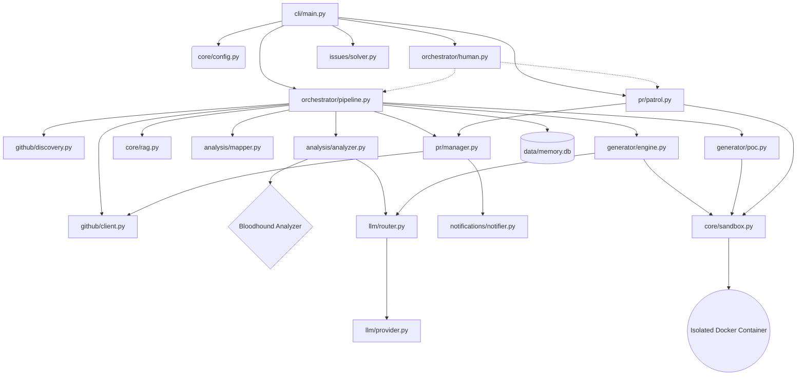

# PROJECT_MAP.md — Agent-Farm Ground Truth

**Generated:** 2026-06-02  
**Version:** v4.0.0 — Omniscient Context Engine  
**Entry Point:** `farm_agent/cli/main.py` → `cli()` (Click-based CLI)  
**Language:** Python 3.11+  
**Evidence basis:** Direct code inspection. No assumptions. All line numbers and features are verified.

---

## 1. System Overview & Active Tech Stack

**What it does:** Autonomous AI agent system that discovers open-source GitHub repositories or scans targets for issues and vulnerabilities. It analyzes code via multi-phase LLM prompts, generates patches, validates them in isolated Docker sandboxes, runs a two-layer expert filter (Qwen → Gemini), and submits pull requests or private disclosures. It also runs a PR Patrol loop to auto-reply to comments, address code reviews, and self-correct CI failures.

Version 4.0.0 introduces the **Omniscient Context Engine**, which recursively discovers repository documentation, chunks it semantically by markdown headers, ingests it into ChromaDB, and maps local module/function dependency linkages to provide deep subsystem context to LLM agents. Furthermore, version 4.0.0 incorporates **Dynamic Bug Verification** (generating and executing Proof-of-Concept exploits in an isolated container sandbox, evaluated via LLM) and **Blast Radius & Regression Auditing** (using baseline test suite runs and downstream dependent analysis to guarantee zero regressions).

| Component | Technology | Source |
|-----------|------------|--------|
| Language | Python >= 3.11 | `pyproject.toml` |
| HTTP client | `httpx` (async) | `pyproject.toml` |
| Primary LLM | `deepseek/deepseek-v4-flash` via OpenRouter | `config.py:56` |
| Code Gen LLM | `deepseek/deepseek-v4-pro` via OpenRouter | `pipeline.py:395` |
| Layer 1 Appraiser | `qwen/qwen3.7-max` via OpenRouter | `pipeline.py:2790` |
| Layer 2 Supreme Auditor | `google/gemini-3.5-flash` via OpenRouter | `pipeline.py:2851` |
| Red Team (Bloodhound) | `deepseek/deepseek-v4-flash` via OpenRouter | `config.py:109` |
| Semgrep rulesets | `p/security-audit`, `p/cwe-top-25`, `p/default`, `p/golang`, `p/rust`, `p/smart-contracts` | `config.py:114` |
| Database | SQLite (`aiosqlite`) — WAL mode, fallback to DELETE | `memory.py:151` |
| Docker Sandbox | `docker>=7.1` — complete network + capability isolation | `sandbox.py:198` |
| Config | Pydantic v2 + YAML + `.env` | `config.py:222` |
| CLI | `click>=8.1` + `rich>=13.0` | `main.py` |
| Vector DB | `chromadb>=0.4` — RAG for file & documentation context | `core/rag.py` |
| Notifications | Telegram / Slack / Discord | `notifier.py` |

---

## 2. Directory Structure & Module Architecture

```text
.                                       # Workspace Root (v4.0.0)
├── Dockerfile                          # Stage 1 builder + Stage 2 lean runtime
├── docker-compose.yml                  # agent-farm service definition with distinct networks
├── start.sh                            # Unix quick start wrapper script
├── start.bat                           # Windows quick start wrapper script
│
├── farm_agent/                         # Package root
│   ├── __init__.py
│   │
│   ├── cli/
│   │   └── main.py                     # Click CLI — command registrations
│   │
│   ├── core/
│   │   ├── config.py                   # Pydantic v2 config and YAML loading
│   │   ├── daily_log.py                # Formats daily markdown activity logs
│   │   ├── exceptions.py               # System exception types hierarchy
│   │   ├── leaderboard.py              # Leaderboard stat collections
│   │   ├── logger.py                   # Rotating file logging system setup
│   │   ├── middleware.py               # Context middleware chain layers
│   │   ├── models.py                   # Core Pydantic data structures
│   │   ├── notifier.py                 # Slack/Discord/Telegram notifications integration
│   │   ├── profiles.py                 # Thorough, quick, and standard run configurations
│   │   ├── quotas.py                   # LLM quota controllers
│   │   ├── rag.py                      # ChromaDB vector DB context loaders (semantic markdown chunking)
│   │   ├── retry.py                    # Retry decorators for GitHub/LLM interfaces
│   │   └── sandbox.py                  # DockerSandbox engine (PoC execution context)
│   │
│   ├── analysis/
│   │   ├── analyzer.py                 # Parallelized security, quality, UX scanners & BloodhoundAnalyzer
│   │   └── mapper.py                   # RepoMapper (AST/regex dependency graphing)
│   │
│   ├── generator/
│   │   ├── engine.py                   # ContributionGenerator (Patch and file correction)
│   │   ├── poc.py                      # PoCGenerator (PoC validation & LLM evaluation)
│   │   ├── reviewer.py                 # ReviewerAgent (Blast Radius & Regression checks)
│   │   └── scorer.py                   # QAHardcoreScorer (Qwen-based QA grader)
│   │
│   ├── github/
│   │   ├── client.py                   # Async-retrying GitHub REST and GraphQL Client
│   │   ├── discovery.py                # Target network search and crawler discoverers
│   │   ├── guidelines.py               # Guidelines, PR templates, and subsystem doc discovery
│   │   └── security_gate.py            # Identifies private security disclosure files
│   │
│   ├── issues/
│   │   └── solver.py                   # IssueSolver (solves issues, multi-file deep planner)
│   │
│   ├── llm/
│   │   ├── agents.py                   # LLM agent prompts and routing models
│   │   ├── context.py                  # Generator system instruction builders
│   │   ├── models.py                   # Model registry definitions
│   │   ├── provider.py                 # OpenRouter integration handlers
│   │   └── router.py                   # Task router mapping
│   │
│   ├── notifications/
│   │   └── notifier.py                 # Dedicated notification dispatch logic
│   │
│   ├── orchestrator/
│   │   ├── human.py                    # SuperHumanLoop (Terminator Mode relentless scheduler)
│   │   ├── memory.py                   # Persistence memory sqlite connection interface
│   │   └── pipeline.py                 # FarmAgentPipeline (Standard & Circular pipelines)
│   │
│   ├── plugins/                        # Extension module hook architecture
│   │
│   ├── pr/
│   │   ├── manager.py                  # Pull Request manager (forking, branches, commits)
│   │   └── patrol.py                   # PR Patrol (reviews comments, fixes CI errors)
│   │
│   ├── templates/
│   │   ├── builtin/                    # Built-in formatted PR description templates
│   │   └── registry.py                 # Template manager registry
│   │
│   ├── tools/
│   │   └── protocol.py                 # CLI tool protocols
│   │
│   └── agents/
│       └── registry.py                 # Task agent configurations and protocol interfaces
```

---

## 3. Core Module Dependency Graph



---

## 4. Core Execution Loops & Entry Points

### 4A. Standard Pipeline — `_process_repo()` ([pipeline.py:1172](file:///c:/Users/USER/Documents/GitHub/Agent-Farm/farm_agent/orchestrator/pipeline.py#L1172))

Processes a single repository through the full contribution pipeline:

```text
_process_repo(repo)
  │
  ├─ Early Clone Initialization                         # pipeline.py:1186
  │    └─ Clones repository early to local temporary directory to populate codebase
  │
  ├─ Baseline Native Test Run                           # pipeline.py:1194
  │    └─ Runs unpatched native tests once to establish pre-existing failure baseline
  │
  ├─ [GATE 0] _check_ai_policy()                        # pipeline.py:1206
  │    └─ Scans AI_POLICY.md for AI-generated PR bans → skip if matches found
  │
  ├─ [GATE 1] github.check_interaction_limits()         # pipeline.py:1215
  │    └─ Skips repository if restricted to prior contributors only
  │
  ├─ fetch_repo_guidelines()                            # pipeline.py:1225
  │    └─ Parses CONTRIBUTING.md, templates, and style guidelines
  │
  ├─ discover_subsystem_docs()                          # pipeline.py:1231
  │    └─ Recursively discovers doc files (.md, .txt, .rst) inside cloned repo directory
  │
  ├─ RepoIndexer.index_repo()                           # pipeline.py:1238
  │    └─ Semantically chunks documentation by headers and indexes into ChromaDB asynchronously
  │
  ├─ [GATE 2] check_maintainer_vibe()                   # pipeline.py:1260
  │    ├─ Fetches recent maintainer comments
  │    └─ If "HOSTILE" comments found → blacklist repo and abort run
  │
  ├─ CodeAnalyzer.analyze()                             # pipeline.py:1291
  │    └─ Runs parallel LLM analyzers (security, code_quality, docs, ui_ux)
  │
  ├─ AST Dependency Injection                           # pipeline.py:1295-1310
  │    ├─ Reads all files, generates structural skeleton via RepoMapper
  │    └─ Injects imports, calls, and dependents into Finding.metadata["module_dependencies"]
  │
  ├─ [GATE 3] Pre-Filter (Non-code files check)         # pipeline.py:1323
  │    ├─ Skips findings targeting SKIP_EXTENSIONS (.md, .txt, .yaml, etc.)
  │    └─ Skips config/build files (tsconfig, eslintrc, package.json, workflows)
  │
  ├─ [GATE 4] Anti-Farming Filters                      # pipeline.py:1385
  │    ├─ Gate 4a: Drops security findings unless severity is CRITICAL or HIGH (Route A rule) # pipeline.py:1459
  │    ├─ Gate 4b: Drops non-security findings if impact_level is LOW or TRIVIAL # pipeline.py:1468
  │    ├─ Gate 4c: Drops README_FIX and DOCS_IMPROVE types # pipeline.py:1480
  │    ├─ Gate 4d: Drops findings on documentation paths (e.g. /docs/, docs/) # pipeline.py:1495
  │    └─ Gate 4e: Keyword blacklist match on title/description # pipeline.py:1523
  │
  ├─ Deduplication                                      # pipeline.py:1642
  │    └─ Filters duplicate titles using bigram similarity check (80% threshold)
  │
  ├─ _validate_findings() (Devil's Advocate Gate)       # pipeline.py:1711 (impl: 2604)
  │    ├─ LLM evaluates findings skeptically using strict validation checklist
  │    └─ Requires is_real_vulnerability=True AND confidence_score>=90
  │
  ├─ Limit to maximum 2 findings per repo               # pipeline.py:1714
  │
  ├─ [GATE 5] _layer1_expert_appraisal()                # pipeline.py:1732 (impl: 2773)
  │    ├─ Model: qwen/qwen3.7-max
  │    └─ Verifies finding is genuine and severe. Fail-closed on error.
  │
  ├─ Hybrid Router (Route A vs Route B)                 # pipeline.py:1744
  │    ├─ Route A (Direct PR): Used for SECURITY_FIX and Severity CRITICAL/HIGH/MEDIUM
  │    └─ Route B (Issue-First): Propose fix in issue and skip PR (Performance, Refactor, UI/UX, etc.)
  │
  ├─ [Route A only] [Verification Gate] (Phase 3)       # pipeline.py:1759
  │    ├─ PoCGenerator.generate_poc() -> Creates test script # pipeline.py:1772
  │    ├─ Sandbox.verify_vulnerability_with_poc() -> Runs script in isolated container # pipeline.py:1776
  │    └─ PoCGenerator.evaluate_poc_result() -> LLM checks if vulnerability triggered (True Positive) # pipeline.py:1784
  │         └─ If not triggered → drop finding as False Positive (save token usage)
  │
  ├─ [Route A only] Fix Generation                      # pipeline.py:1816
  │    └─ ContributionGenerator.generate() with Style Guide context and dependents context
  │
  ├─ Double-Pass Sandbox Validation (DEV-QA Loop)       # pipeline.py:1832-1925
  │    ├─ Pass 1 (Efficacy): Executes PoC on patched code. PoC MUST NOT trigger vulnerability. # pipeline.py:1866
  │    ├─ Pass 2 (Regression): Runs native tests. Rejects if baseline passed but patched code fails. # pipeline.py:1888
  │    │    └─ Fallback: Runs compilation/syntax checks in sandbox if no native tests exist. # pipeline.py:1904
  │    └─ Clean State Reversion: Reverts cached clone via `git reset --hard` and `git clean -fd`
  │         before applying patch on retry
  │
  ├─ Self-Correction Loop                               # pipeline.py:1933
  │    └─ If validation fails, LLM retries fix with stderr logs (max 3 validation attempts)
  │
  ├─ [GATE 6] _layer2_supreme_audit()                   # pipeline.py:1969 (impl: 2837)
  │    └─ Model: google/gemini-3.5-flash checks incident dossier, sandbox logs & proposed patch
  │
  ├─ [GATE 7] Diplomat: Security Disclosure Gate        # pipeline.py:1984
  │    └─ Bypasses PR if security targets require private disclosure
  │
  └─ PRManager.create_pr()                              # pipeline.py:2017
```

### 4B. Circular target pipeline — `run_circular()` ([pipeline.py:834](file:///c:/Users/USER/Documents/GitHub/Agent-Farm/farm_agent/orchestrator/pipeline.py#L834))

Circular target pipeline loop extracting target repos from the local SQLite queue:

```text
run_circular()
  │
  ├─ DatabaseTargetDiscovery.get_next_target()          # Picks oldest scanned target # pipeline.py:854
  ├─ Check daily PR limit cap
  │
  ├─ [PHASE 1] BloodhoundAnalyzer.run_bloodhound()      # pipeline.py:906
  │    ├─ White-hat Semgrep pre-scan (CWE-Top-25, security-audit, language-specific rulesets)
  │    ├─ If clean sweep → status marked COMPLETED_NO_VULN, terminates run early
  │    └─ CPU Profiling recorded on start/finish
  │
  ├─ Filter production_vulns (Contextual intelligence)  # pipeline.py:927
  │    └─ Skips vulnerability targets located in non-production paths (test, demo, benchmark, docs)
  │
  ├─ Fetch repo files structures (GraphQL / REST fallback) # pipeline.py:950
  │
  └─ 3-Cycle DEV-QA Loop (FinOps Circuit Breaker)       # pipeline.py:1004
       │
       ├─ [PHASE 2] DEV patch generation                # pipeline.py:1012
       │    ├─ Injects past QA critiques, failure context, and FILTER_REJECTION_LESSON
       │    ├─ Generates code patch using Repository Mapper structural context and dependency maps
       │    └─ Bails out early if DEV classifies findings as False Positives
       │
       ├─ [PHASE 3] QAHardcoreScorer evaluation         # pipeline.py:1043
       │    ├─ Model: qwen/qwen3.7-max
       │    ├─ Scores patches on strict code quality metrics (out of 10.0)
       │    └─ Rejection → writes qa_lesson to knowledge_base, appends critique to context, and retries
       │
       ├─ [PHASE 4] Docker Sandbox validation (Inside DEV generator)
       │
       ├─ [PHASE 5] _layer2_supreme_audit()             # pipeline.py:1082
       │    └─ Gemini checks incident dossier. Rejection marks COMPLETED_TOO_COMPLEX.
       │
       ├─ [PHASE 6] Security Disclosure Gate            # pipeline.py:1093
       │    └─ If disclosure requested by repo → writes to /app/secret_findings/ and skips PR
       │
       └─ [PHASE 7] PRManager.create_pr()               # pipeline.py:1115
            └─ Submits PR. On success status marked PR_SUBMITTED.
```

### 4C. PR Patrol Daemon & CI Auto-Fix Loop ([patrol.py:152](file:///c:/Users/USER/Documents/GitHub/Agent-Farm/farm_agent/pr/patrol.py#L152))

Runs continuously to manage active contributions:

1. **Feedback Collection**: Queries open and pending PRs, pulling PR reviews, reviewer comments, and commit statuses.
2. **Comment Classification**: Feeds feedback to an LLM classifier, routing them into:
   - `CODE_FIX`: Requests to modify code implementation.
   - `QUESTION`: Queries requesting clarifications (the bot replies with a direct, professional message).
   - `CLA_RECHECK`: Requests for signing CLAs (bot triggers recheck workflow).
   - `CI_FAILURE`: System CI pipeline failures.
   - `GREETING` / `TRIVIAL`: Ignores or handles simple conversational remarks.
3. **Guardrails & Interaction Caps**:
   - **Discussion Limits**: Auto-reply replies are tracked in the database and capped at `max_discussion_replies` (default 3) per PR.
   - **CI Retry Limits**: Total CI auto-fix commits are tracked and capped at `max_ci_retries` (default 3) per PR. Exceeding either cap triggers auto-closure of the PR to prevent spam.
4. **CI Auto-Fix Cycle** ([patrol.py:1497](file:///c:/Users/USER/Documents/GitHub/Agent-Farm/farm_agent/pr/patrol.py#L1497)):
   - Parse raw logs, sanitize checks names, and isolate compiler tracebacks.
   - Use `_guess_file_from_traceback` (line 2004) to identify the buggy source file.
   - Launch LLM to draft a CI fix, mounting the workspace to the isolated Docker sandbox.
   - Auto-run local test commands. If sandbox validation passes, commit and push the fix directly.

### 4D. Terminator Mode (SuperHumanLoop) ([human.py](file:///c:/Users/USER/Documents/GitHub/Agent-Farm/farm_agent/orchestrator/human.py))

The relentless 24/7 daemon process:
1. Operates indefinitely pulling target URLs directly from the `target_repos` SQLite table.
2. Sequences cyclic calls to the Circular Pipeline (`hunt-circular`) and PR Patrol.

---

## 5. Database & State Schema

The system uses SQLite (`data/memory.db`) via `aiosqlite` operating in **WAL (Write-Ahead Logging)** mode for concurrency optimization.

### Core Tables

| Table Name | Role / Purpose | Key Columns |
|------------|---------------|-------------|
| **`analyzed_repos`** | Tracks processed repositories and their metadata to prevent re-processing. | `full_name` (PK), `analyzed_at`, `findings` |
| **`submitted_prs`** | Ledger of all active pull requests and issues created by the agent. Tracks retry limits. | `id` (PK), `repo`, `pr_number`, `status`, `ci_fix_attempts` |
| **`findings_cache`** | Temporary cache of detected code flaws pre-submission. | `id` (PK), `severity`, `title`, `file_path` |
| **`run_log`** | Aggregated session metrics indicating performance per CLI run. | `id` (PK), `started_at`, `prs_created`, `errors` |
| **`pr_outcomes`** | Stores merged/closed PR states and tracks maintainer feedback/toxicity metrics. | `id` (PK), `repo`, `outcome`, `feedback` |
| **`repo_preferences`** | Machine learning preference weights dynamically generated from historic outcomes. | `repo` (PK), `preferred_types`, `rejected_types` |
| **`blacklisted_repos`** | Blocked projects due to hostile maintainer behavior or catastrophic pipeline errors. | `repo` (PK), `reason`, `pr_number` |
| **`api_usage_log`** | Audit trail for LLM API request execution and quotas tracking. | `id` (PK), `timestamp`, `provider` |
| **`task_schedule`** | Persistent task scheduling loop for Terminator Mode. | `task_key` (PK), `next_run` |
| **`knowledge_base`** | RAG architecture context storing lessons, learned architectures, and past rejections. | `repo_name`, `entry_type`, `content` |
| **`target_repos`** | Deterministic circular target queue for hunting operations. | `repo_url` (PK), `status`, `scanned_at` |
| **`repo_style_guides`** | Cached CONTRIBUTING.md formats and code styles. | `repo` (PK), `style_summary` |

### Optimization & Indices
* **`idx_api_usage`**: Composite index on `(provider, timestamp)` to optimize LLM call counts and quota checks.
* **`idx_api_usage_cleanup`**: Index on `(timestamp)` to optimize daily purge queries.
