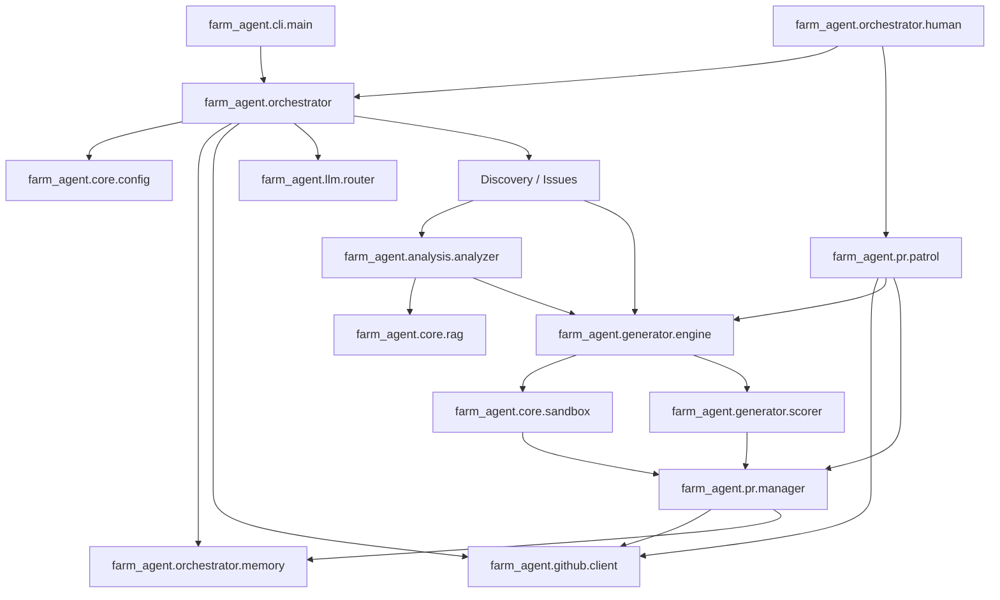

# Farm-Agent 3.0.0 — Architectural Blueprint

This document serves as the canonical deep-dive architectural guide for new developers working on the Farm-Agent codebase. It reflects the exact active mechanisms, module interactions, and project structure.

## 1. System Overview & Tech Stack

Farm-Agent is built on modern Python and heavily leverages asynchronous I/O to maximize throughput. It relies on a containerized polyglot sandbox for execution safety and an embedded SQLite database for state management.

| Technology | Role in System |
|---|---|
| **Python 3.11+** | Primary runtime environment. Strict typing and async/await syntax utilized throughout. |
| **Docker SDK (7.1+)** | Powers the Polyglot Sandbox, executing untrusted code in isolated container networks (`sandbox_isolated`, `internet_access`). |
| **SQLite (aiosqlite)** | Persistent memory storage configured in WAL mode for caching findings, tracking PR state, and enforcing API rate limits. |
| **Hatchling** | Build backend and project management (`pyproject.toml`). |
| **Pydantic / Pydantic-Settings** | Configuration validation and management schema structure. |
| **Click & Rich** | Powers the advanced command-line interface, providing banners, interactive tables, and logging interfaces. |
| **ChromaDB** | Drives the ephemeral (RAM-only) Local Retrieval-Augmented Generation (RAG) engine for intelligent context lookup. |
| **Minimax / OpenRouter** | Core LLM APIs. Minimax is primary for code generation, OpenRouter acts as the Red Team Bloodhound fallback. |
| **GitPython / httpx** | Git repository management and asynchronous HTTP calls to the GitHub API. |

## 2. Directory Structure

```ascii
Farm-Agent/
├── farm_agent/                   # Core application package
│   ├── cli/                      # Command-Line Interface
│   │   └── main.py               # Main CLI entry point, maps commands like `run`, `target`, `superhuman`
│   ├── core/                     # Fundamental application infrastructure
│   │   ├── config.py             # Pydantic settings loading and validation
│   │   ├── exceptions.py         # Custom error hierarchy
│   │   ├── leaderboard.py        # PR statistics and success rate tracking
│   │   ├── logger.py             # Configures daily rotating and console logging
│   │   ├── middleware.py         # API call interception/wrapping
│   │   ├── models.py             # Global data models
│   │   ├── profiles.py           # Configuration override sets
│   │   ├── quotas.py             # API rate limit and usage tracking
│   │   ├── rag.py                # Ephemeral ChromaDB integration
│   │   ├── retry.py              # Exponential backoff utilities
│   │   └── sandbox.py            # Docker-based isolated Polyglot Sandbox
│   ├── orchestrator/             # High-level pipeline management
│   │   ├── pipeline.py           # ContribPipeline: repo cloning, AI policy screening, cleanup
│   │   ├── human.py              # SuperHumanLoop: 24/7 continuous operation engine
│   │   └── memory.py             # SQLite interface for caching and PR history
│   ├── github/                   # GitHub integration
│   │   ├── client.py             # Async GitHub API client (token rotation, rate limits)
│   ├── generator/                # AI Code Generation and validation
│   │   ├── engine.py             # Code authoring, enforces 'AI Gag Order' on output
│   │   ├── reviewer.py           # Internal code review mechanism
│   │   └── scorer.py             # QualityScorer: debug code checks, complexity scoring
│   ├── analysis/                 # Code scanning and vulnerability detection
│   │   ├── analyzer.py           # Static analysis engine integration
│   │   └── mapper.py             # Codebase topology mapping
│   ├── issues/                   # Issue targeting and solving
│   │   └── solver.py             # Parses, categorizes, and filters solvable GitHub issues
│   ├── pr/                       # Pull Request management
│   │   ├── manager.py            # Forks repo, creates branch, pushes commit, opens PR
│   │   └── patrol.py             # Scans open PRs for feedback, answers questions, signs CLAs
│   ├── llm/                      # LLM Provider integrations
│   │   ├── router.py             # Routes tasks to optimal models
│   │   ├── models.py             # Model definitions and capabilities
│   ├── notifications/            # Push alerts
│   │   └── notifier.py           # Webhook integrations (Slack, Discord, Telegram)
│   └── plugins/                  # Extensibility
│   └── templates/                # Issue/PR description templates
├── tests/                        # Unit tests corresponding to farm_agent modules
├── Makefile                      # Standardized project tasks (install, lint, test)
├── Dockerfile                    # Containerization for running agent-farm daemon
├── docker-compose.yml            # Defines the dual-network setup for isolated execution
├── pyproject.toml                # Build configuration and dependencies
└── requirements.txt              # Standardized dependency list
```

## 3. Core Module Dependency Graph



### Module Interactions
- **CLI** bootstraps the application and loads the configuration.
- The **Orchestrator** initializes the connection to the persistent **Memory** (SQLite).
- The pipeline queries the **GitHub Client** for repository metadata and files.
- Files are parsed by the **Analysis Engine** and embedded into the **RAG Engine**.
- The **Generator Engine** queries the LLM to author code based on issues or analysis findings.
- The generated code is verified strictly by the **Quality Scorer** (rejecting raw debug codes like `print()` or `breakpoint()`) and the **Docker Sandbox** (running tests without outbound internet).
- Upon success, the **PR Manager** stages commits, handles GitHub forks, and pushes the Pull Request.
- Concurrently, **PR Patrol** polls previously submitted PRs from Memory, assesses new comments via LLM, and triggers Generator/PRManager to apply fixes.

## 4. Core Execution Loops

### The Terminator Loop (`SuperHumanLoop`)
1. Initiated via `farm_agent superhuman`.
2. Sets a daily quota (dynamically up to API caps).
3. **Execution Phase:** Repeatedly fires the `ContribPipeline` to discover a repository, analyze it, solve an issue, and submit a PR.
4. **Patrol Phase:** Interleaves `PRPatrol` to check on existing PRs and address human maintainer feedback.
5. Operates endlessly without artificial human delays (deprecated features removed). Gracefully drains and closes database connections on `SIGINT`.

### The Contribution Pipeline (`ContribPipeline`)
1. **Target Identification:** Either via `run` (auto-discovery) or `target` (specific URL).
2. **Screening:** Uses `asyncio.gather` to concurrently check for `AI_POLICY.md` and `CONTRIBUTING.md` rules. Trivial repos or anti-farming constraints abort the run.
3. **Cloning:** The target is cloned into a temporary directory (with recursive secure cleanup upon exit).
4. **Analysis/Solving:** Based on the mode, it either runs static analyzers (Bloodhound) or extracts the easiest open issues via `IssueSolver`.
5. **Generation:** Passes context to the LLM to write the patch. Enforces the AI Gag Order.
6. **Validation:** Runs the tests in the polyglot sandbox.
7. **Commit & Push:** Calls `PRManager` to construct the PR. Logs success to SQLite memory.

## 5. Database/State Schema

Farm-Agent relies heavily on an internal SQLite database (`memory.db`), operating in WAL mode to handle concurrent async writes smoothly.

### Key Tables
- `analyzed_repos`: Tracks which repositories have been scanned, preventing redundant loops. Keys on `repo_name` and `scanned_at`.
- `submitted_prs`: Logs successful PRs with `pr_number`, `repo`, `title`, and `status` ('open', 'merged', 'closed'). Used by the Alumni Sync and PR Patrol mechanisms.
- `findings_cache`: Stores JSON payloads of detected code issues mapped to file hashes to save LLM tokens on subsequent runs.
- `run_log`: Historical logs of the agent's operations.
- `knowledge_base`: Stores RAG QA lessons and Red Team audit histories, governed by a garbage collector (default 90-day retention).
- `api_usage_log`: Tracks LLM API usage tokens to ensure quotas are respected.