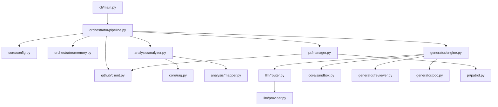

# Agent-Farm Architecture Blueprint

This document serves as a deep-dive architectural guide for Agent-Farm. It outlines the core tech stack, directory structure, module dependencies, execution loops, and database schemas.

## 1. System Overview & Tech Stack

Agent-Farm leverages a modern Python async ecosystem and a multi-agent LLM architecture to automate open-source contributions.

| Technology | Role in Project |
| :--- | :--- |
| **Python >= 3.11** | Core language for the async framework and CLI tools. |
| **Docker >= 7.1** | Provides `DockerSandbox` isolation for PoC testing and validation, utilizing dual networks (`internet_access`, `sandbox_isolated`). |
| **Hatchling** | Build backend and project package manager (`pyproject.toml`). |
| **Pydantic (v2)** | Strict data modeling, configuration management, and validation (`pydantic-settings`). |
| **ChromaDB** | Vector database for the Omniscient Context Engine, indexing semantic markdown headers for RAG. |
| **SQLite (aiosqlite)** | Persistent state management (WAL mode) tracking targets, outcomes, and rate limits. |
| **Click & Rich** | CLI framework (`farm_agent` commands) and rich terminal formatting/logging. |
| **OpenRouter / DeepSeek** | Primary LLM provider routing and task execution models (e.g., `deepseek-v4-pro`). |
| **Qwen / Gemini** | Utilized for Layer 1 Appraisal (Qwen) and Layer 2 Supreme Audit (Gemini). |
| **AST-grep / Semgrep** | Static analysis engines employed by the Bloodhound Red Team module for vulnerability discovery. |
| **Pytest** | Testing framework utilizing `pytest-asyncio` for asynchronous unit testing. |

## 2. Directory Structure

```text
.                                       # Workspace Root (v4.0.0)
├── Dockerfile                          # Stage 1 builder (wheel creation) + Stage 2 lean runtime v4.0.0
├── docker-compose.yml                  # agent-farm service definition with volumes (data/, logs/, secret_findings/)
├── start.sh                            # Unix quick start wrapper script
├── start.bat                           # Windows quick start wrapper script
├── Makefile                            # Standardized make targets (install, test, lint, docker, etc.)
├── pyproject.toml                      # Hatchling build config, dependencies, Ruff/Pytest settings
│
├── farm_agent/                         # Package root ("farm_agent")
│   ├── __init__.py
│   │
│   ├── cli/
│   │   └── main.py                     # Click CLI — command registrations and application entry points
│   │
│   ├── core/
│   │   ├── config.py                   # Pydantic v2 config and YAML loading
│   │   ├── daily_log.py                # Formats daily markdown activity logs
│   │   ├── exceptions.py               # System exception types hierarchy
│   │   ├── leaderboard.py              # Leaderboard stat collections
│   │   ├── logger.py                   # Rotating file logging system setup
│   │   ├── middleware.py               # Context middleware chain layers
│   │   ├── models.py                   # Core Pydantic data structures definitions
│   │   ├── notifier.py                 # Telegram notifications integration
│   │   ├── profiles.py                 # Thorough, quick, and standard run configurations
│   │   ├── quotas.py                   # OpenRouter usage quota controllers
│   │   ├── rag.py                      # ChromaDB vector DB context loaders (semantic markdown header chunking)
│   │   ├── retry.py                    # Retry decorators for GitHub/LLM interfaces
│   │   └── sandbox.py                  # DockerSandbox engine with Polyglot Guillotine, PoC execution context mapping
│   │
│   ├── analysis/
│   │   ├── analyzer.py                 # CodeAnalyzer (parallelized security, quality, UX scanners) & BloodhoundAnalyzer
│   │   └── mapper.py                   # RepoMapper (AST/regex dependency graphing)
│   │
│   ├── generator/
│   │   ├── engine.py                   # ContributionGenerator (Patch and file correction)
│   │   ├── poc.py                      # PoCGenerator (PoC validation & LLM evaluation)
│   │   ├── reviewer.py                 # ReviewerAgent (Self-reflective code auditor with Blast Radius checks)
│   │   └── scorer.py                   # QAHardcoreScorer (Qwen-based QA grader)
│   │
│   ├── github/
│   │   ├── client.py                   # Async-retrying GitHub REST and GraphQL Client
│   │   ├── discovery.py                # Target network search and crawler discoverers
│   │   ├── guidelines.py               # Guidelines, PR templates, and subsystem doc discovery
│   │   └── security_gate.py            # Identifies private security disclosure files
│   │
│   ├── issues/
│   │   └── solver.py                   # IssueSolver (solves issues, multi-file deep planner)
│   │
│   ├── llm/
│   │   ├── agents.py                   # LLM agent prompts and routing models
│   │   ├── context.py                  # Generator system instruction builders
│   │   ├── models.py                   # Model registry definitions
│   │   ├── provider.py                 # OpenRouter integration handlers
│   │   └── router.py                   # Task router mapping
│   │
│   ├── orchestrator/
│   │   ├── memory.py                   # Persistence memory sqlite connection interface
│   │   ├── pipeline.py                 # Pipeline (Standard & Circular pipelines implementation)
│   │   └── human.py                    # SuperHumanLoop relentless daily scheduler
│   │
│   ├── pr/
│   │   ├── manager.py                  # Pull Request manager (forking, branches, commits)
│   │   └── patrol.py                   # PR Patrol (reviews comments, fixes CI errors)
│   │
│   ├── plugins/                        # Submodule for project plugins
│   ├── templates/                      # Submodule for generating project templates
│   ├── notifications/                  # Submodule for third-party alerts (Discord, Slack, etc.)
│   │
│   ├── agents/
│   │   └── registry.py                 # Task agent configurations
│   │
│   └── tools/
│       └── protocol.py                 # CLI tool protocols
```

## 3. Core Module Dependency Graph



## 4. Core Execution Loops / Entry Points

### Standard Pipeline (`farm_agent run`)
1. **Target Discovery:** Initiated via `github/discovery.py`. Repositories are filtered by language, stars, and configured `EXCLUDED_LANGUAGES`.
2. **Analysis:** The `FarmAgentPipeline` pulls down the codebase. `CodeAnalyzer` (via `BloodhoundAnalyzer`) scans for vulnerabilities. `RepoMapper` builds AST graphs. `core/rag.py` chunks documentation.
3. **Appraisal & Audit:** Findings run through the Anti-Farming filter. Qwen evaluates via Layer 1 Appraisal, and Gemini runs the Layer 2 Supreme Audit.
4. **Generation & Verification:** DeepSeek models draft patches. `DockerSandbox` runs isolated tests (`PoCGenerator`). `ReviewerAgent` performs Blast Radius regression audits.
5. **Submission:** `pr/manager.py` forks the repo, commits the safe patch, and submits the PR.
6. **Patrol:** `PR Patrol` monitors CI logs and maintainer comments, issuing automated fixes.

### Terminator Mode (`farm_agent superhuman`)
1. Executed via `SuperHumanLoop` in `orchestrator/human.py`.
2. Operates persistently without artificial delays.
3. Continuously polls a deterministic circular target queue from the SQLite `target_repos` table.

## 5. Database/State Schema (`data/memory.db`)

Agent-Farm utilizes a local SQLite database configured in **WAL (Write-Ahead Logging)** mode.

- **`analyzed_repos`**: Tracks repositories that have already gone through analysis (`full_name` PK).
- **`submitted_prs`**: Tracks bot-created PRs and associated counters. Unique constraint on `(repo, pr_number)`.
- **`findings_cache`**: Temporary cache of detected code findings.
- **`run_log`**: Log of overall runs metrics and durations.
- **`pr_outcomes`**: Stores merged/closed PR states and maintainer review remarks.
- **`repo_preferences`**: Learned project contribution preferences updated dynamically from outcomes.
- **`blacklisted_repos`**: Projects blacklisted due to hostile maintainer checks or failures.
- **`api_usage_log`**: Tracks LLM API usage. Uses a composite index `(provider, timestamp)` to optimize quota checks.
- **`task_schedule`**: Persistent schedule queue for tasks in the `SuperHumanLoop`.
- **`knowledge_base`**: Stores lessons, past critiques, and architectural context.
- **`target_repos`**: Deterministic circular target queue for Terminator Mode.
- **`repo_style_guides`**: Caches contributing templates, formatting, and structures.
