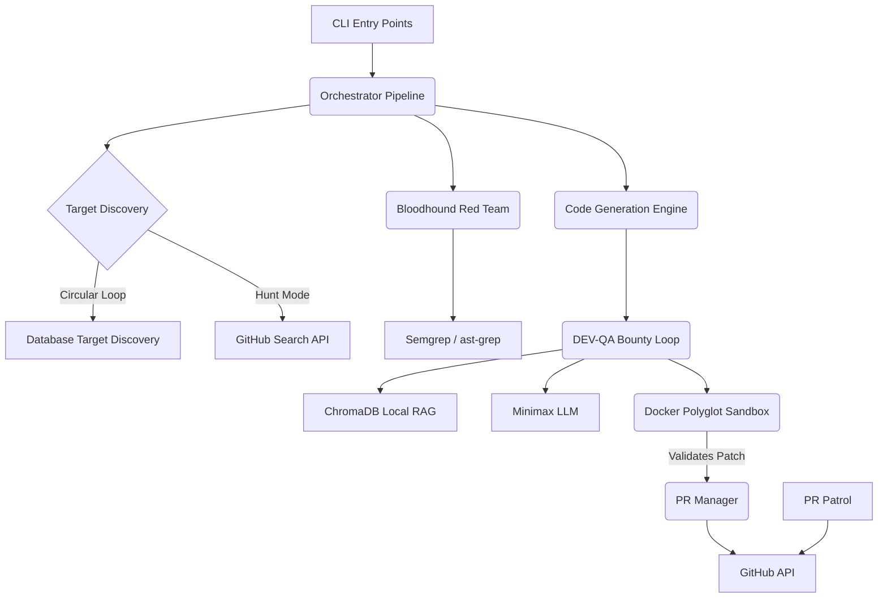

# PROJECT_MAP.md — Architecture Blueprint

This document serves as the canonical architectural blueprint for Farm-Agent v3.0, detailing the active technologies, directory structure, module dependencies, and database schema.

## 1. System Overview & Tech Stack

| Component | Technology | Role |
| :--- | :--- | :--- |
| **Language** | Python 3.11+ | Core runtime environment. |
| **Build Backend** | Hatchling | Modern build system specified in `pyproject.toml`. |
| **CLI Framework** | Click & Rich | Provides command-line interfaces and terminal formatting. |
| **LLM Integration** | Minimax / OpenRouter / Gemini | AI providers for code generation (Minimax) and White-Hat Auditing (OpenRouter). |
| **GitHub Interaction** | HTTPX / GitPython | Async HTTP client for API interaction and git wrapper for repository cloning. |
| **Local RAG** | ChromaDB | Ephemeral (RAM-only) vector store for context retrieval during code generation. |
| **Persistent State** | SQLite (`aiosqlite`) | Asynchronous, WAL-mode local database for tracking history, PRs, and targets. |
| **Patch Validation** | Docker SDK (v7.1+) | Isolated Polyglot Sandbox environment for validating code diffs and running tests. |
| **Security Scanning** | Semgrep & `ast-grep` | Bloodhound Red Team engine for code pattern analysis. |
| **Data Validation** | Pydantic & Pydantic-Settings | Strongly-typed configuration and object modeling. |

## 2. Directory Structure

```text
Farm-Agent/
├── .github/                  # GitHub Actions and repository workflows
├── docs/                     # Additional project documentation
├── farm_agent/               # Main application package
│   ├── agents/               # Registry for sub-agents (DeerFlow pattern)
│   ├── analysis/             # Bloodhound Red Team, Security, and Code Quality analyzers
│   ├── cli/                  # Command Line Interface commands (`main.py`)
│   ├── core/                 # Shared utilities, Configs, Polyglot Sandbox, Logger
│   ├── generator/            # Contribution Engine, Scorer, and Reviewer (DEV-QA Loop)
│   ├── github/               # GitHub API Client, Discovery logic, Security Gate
│   ├── issues/               # Issue-solving pipeline components
│   ├── llm/                  # Providers, Router, and Models interface
│   ├── notifications/        # Webhook notifiers (Telegram, Slack, Discord)
│   ├── orchestrator/         # Execution Pipelines, SuperHumanLoop, and Memory State
│   ├── plugins/              # Extensible plugin architecture
│   ├── pr/                   # PR Manager, PR Patrol, and Janitor
│   ├── templates/            # Contribution templates and registry
│   └── tools/                # Execution tools protocol
├── tests/                    # Unit testing suite
├── docker-compose.yml        # Docker networking (internet_access & sandbox_isolated)
├── Dockerfile                # Production and Builder images
├── pyproject.toml            # Dependencies and hatchling configuration
├── README.md                 # User-facing project documentation
└── PROJECT_MAP.md            # This architectural blueprint
```

## 3. Core Module Dependency Graph



## 4. Core Execution Loops / Entry Points

### Terminator Execution Loop (`superhuman`)
The relentless autonomous engine that operates 24/7. It cycles through target repositories, processes findings up to daily GitHub API caps, and leverages the `PRPatrol` to respond to review comments. It strictly avoids simulated delays.

### Circular Target Loop (`hunt-circular`)
Reads target repositories from `target_repo.json` in a deterministic, round-robin manner. Updates the `scanned_at` timestamp atomically before LLM analysis to guarantee crash-safe rotation.

### DEV-QA Bounty Loop
When an issue is identified, the Generation Engine (`DEV`) writes a patch. The patch is scored by the `QAHardcoreScorer` (`QA`). If rejected, critiques are recorded as QA lessons and passed back into the context for up to 3 cycles.

### PR Patrol
Operates asynchronously to monitor open Pull Requests previously submitted by Farm-Agent. It fetches maintainer comments, uses the LLM to classify feedback, and autonomously pushes commits or signs CLAs to resolve discussions.

## 5. Database/State Schema (`memory.db`)

Farm-Agent utilizes SQLite via `aiosqlite`. Key tables include:

* **`analyzed_repos`**: Tracks repositories that have been scanned to prevent redundant work.
* **`submitted_prs`**: Stores details of Pull Requests created by the agent, driving the PR Patrol logic.
* **`findings_cache`**: Caches static analysis results to prevent repeating identical code evaluations.
* **`run_log`**: Records pipeline execution statistics (repos scanned, issues found, PRs opened).
* **`pr_outcomes`**: Stores post-mortem data for merged or closed PRs to calculate success rates.
* **`repo_preferences`**: Maintains individual repository configurations (e.g., specific style guides).
* **`blacklisted_repos`**: Tracks repositories banned by the Anti-Farming filter or AI-policy constraints.
* **`api_usage_log`**: Monitors LLM token expenditure.
* **`task_schedule`**: Used for queueing internal background tasks.
* **`knowledge_base`**: Stores QA Lessons and audit history for long-term intelligence.
