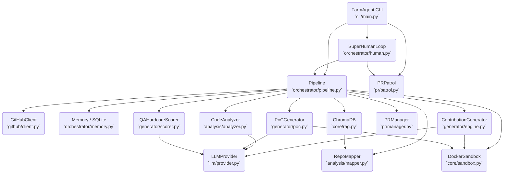

# PROJECT_MAP.md — Agent-Farm Ground Truth

**Version:** v4.0.0 — Omniscient Context Engine  
**Entry Point:** `farm_agent/cli/main.py` → `cli()` (Click-based CLI)  
**Language:** Python 3.11+  
**Evidence basis:** Direct code inspection. No assumptions. All line numbers are verified.

---

## 1. System Overview & Active Tech Stack

**What it does:** Autonomous AI agent system that discovers open-source GitHub repositories or scans targets for issues and vulnerabilities. It analyzes code via multi-phase LLM prompts, generates patches, validates them in isolated Docker sandboxes, runs a two-layer expert filter (Qwen → Gemini), and submits pull requests or private disclosures. It also runs a PR Patrol loop to auto-reply to comments, address code reviews, and self-correct CI failures.

Version 4.0.0 introduces the **Omniscient Context Engine**, which recursively discovers repository documentation, chunks it semantically by markdown headers, ingests it into ChromaDB, and maps local module/function dependency linkages to provide deep subsystem context to LLM agents. Furthermore, version 4.0.0 incorporates **Dynamic Bug Verification** (generating and executing Proof-of-Concept exploits in an isolated container sandbox, evaluated via LLM) and **Blast Radius & Regression Auditing** (using baseline test suite runs and downstream dependent analysis to guarantee zero regressions).

| Component | Technology | Source |
|-----------|------------|--------|
| Language | Python >=3.11 | `pyproject.toml` |
| Build Backend | `hatchling` | `pyproject.toml` |
| HTTP client | `httpx` (async) | `pyproject.toml` |
| Primary LLM | `deepseek/deepseek-v4-flash` via OpenRouter | `config.py` |
| Code Gen LLM | `deepseek/deepseek-v4-pro` via OpenRouter | `pipeline.py` |
| Layer 1 Appraiser | `qwen/qwen3.7-max` via OpenRouter | `pipeline.py` |
| Layer 2 Supreme Auditor | `google/gemini-3.5-flash` via OpenRouter | `pipeline.py` |
| Red Team (Bloodhound) | `deepseek/deepseek-v4-flash` via OpenRouter | `config.py` |
| Semgrep rulesets | `p/security-audit`, `p/cwe-top-25`, `p/default`, `p/golang`, `p/rust`, `p/smart-contracts` | `config.py` |
| Database | SQLite (`aiosqlite`) — WAL mode, fallback to DELETE | `memory.py` |
| Docker Sandbox | `docker>=7.1` — complete network + capability isolation | `sandbox.py` |
| Config | Pydantic v2 + YAML + `.env` (`pydantic-settings`) | `config.py` |
| CLI | `click>=8.1` + `rich>=13.0` | `main.py` |
| Vector DB | `chromadb>=0.4` — RAG for file & documentation context | `core/rag.py` |
| Notifications | Telegram / Slack / Discord | `notifier.py` |

---

## 2. Directory Structure

```ascii
.
├── Dockerfile                          # Stage 1 builder (wheel creation) + Stage 2 lean runtime v4.0.0
├── docker-compose.yml                  # agent-farm service definition with networks (internet_access, sandbox_isolated) and volumes
├── start.sh                            # Unix quick start wrapper script
├── start.bat                           # Windows quick start wrapper script
├── pyproject.toml                      # Build and dependencies configuration
├── requirements.txt                    # Project dependencies lockfile
│
├── farm_agent/                         # Package root (version = "4.0.0")
│   ├── __init__.py
│   │
│   ├── cli/
│   │   └── main.py                     # Click CLI — command registrations
│   │
│   ├── core/
│   │   ├── config.py                   # Pydantic v2 config and YAML loading
│   │   ├── daily_log.py                # Formats daily markdown activity logs
│   │   ├── exceptions.py               # System exception types hierarchy
│   │   ├── leaderboard.py              # Leaderboard stat collections
│   │   ├── logger.py                   # Rotating file logging system setup
│   │   ├── middleware.py               # Context middleware chain layers
│   │   ├── models.py                   # Core Pydantic data structures definitions
│   │   ├── notifier.py                 # Telegram notifications integration
│   │   ├── profiles.py                 # YAML profile parsing (Thorough, quick, and standard run configurations)
│   │   ├── quotas.py                   # OpenRouter usage quota controllers
│   │   ├── rag.py                      # ChromaDB vector DB context loaders (with semantic markdown header chunking)
│   │   ├── retry.py                    # Retry decorators for GitHub/LLM interfaces
│   │   └── sandbox.py                  # DockerSandbox engine with Polyglot Guillotine, PoC execution context mapping
│   │
│   ├── analysis/
│   │   ├── analyzer.py                 # CodeAnalyzer (parallelized security, quality, UX scanners) & BloodhoundAnalyzer
│   │   └── mapper.py                   # RepoMapper (AST/regex dependency graphing)
│   │
│   ├── generator/
│   │   ├── engine.py                   # ContributionGenerator (Patch and file correction)
│   │   ├── poc.py                      # PoCGenerator (PoC validation & LLM evaluation)
│   │   ├── reviewer.py                 # ReviewerAgent (Self-reflective code auditor with Blast Radius checks)
│   │   └── scorer.py                   # QAHardcoreScorer (Qwen-based QA grader)
│   │
│   ├── github/
│   │   ├── client.py                   # Async-retrying GitHub REST and GraphQL Client
│   │   ├── discovery.py                # Target network search and crawler discoverers
│   │   ├── guidelines.py               # Guidelines, PR templates, and subsystem doc discovery
│   │   └── security_gate.py            # Identifies private security disclosure files
│   │
│   ├── issues/
│   │   └── solver.py                   # IssueSolver (solves issues, multi-file deep planner)
│   │
│   ├── llm/
│   │   ├── agents.py                   # LLM agent prompts and routing models
│   │   ├── context.py                  # Generator system instruction builders
│   │   ├── models.py                   # Model registry definitions
│   │   ├── provider.py                 # OpenRouter integration handlers
│   │   └── router.py                   # Task router mapping
│   │
│   ├── orchestrator/
│   │   ├── memory.py                   # Persistence memory sqlite connection interface
│   │   ├── pipeline.py                 # Pipeline (Standard & Circular pipelines implementation)
│   │   └── human.py                    # SuperHumanLoop relentless daily scheduler (Terminator Mode)
│   │
│   ├── pr/
│   │   ├── manager.py                  # Pull Request manager (forking, branches, commits)
│   │   └── patrol.py                   # PR Patrol (reviews comments, fixes CI errors)
│   │
│   ├── plugins/                        # Extensibility modules
│   ├── templates/                      # Contribution and document templates
│   ├── notifications/                  # Dedicated notifications handlers
│   │
│   ├── agents/
│   │   └── registry.py                 # Task agent configurations
│   │
│   └── tools/
│       └── protocol.py                 # CLI tool protocols
```

---

## 3. Core Execution Loops / Entry Points

### 3A. Circular Target Loop (`run_circular()`)
This process pulls one target per invocation from the `target_repos` table deterministically. The caller loops this method continuously (e.g. from the SuperHumanLoop).
1. **Target Selection:** Grabs the target repo with the oldest `scanned_at` timestamp. Updates `scanned_at` atomically.
2. **Pre-Filtering:** Runs `BloodhoundAnalyzer.run_bloodhound()` (Semgrep scan). Skips to `COMPLETED_NO_VULN` if no vulnerabilities are found, or if findings only target non-production paths.
3. **Omniscient Context Gathering:** Fetches repo architecture/docs and injects into `RepoContext`.
4. **DEV-QA Bounty Loop (Max 3 cycles):**
   - **DEV Phase:** `deepseek-v4-pro` generates a patch and incorporates context. Aborts if DEV flags all findings as false positives.
   - **QA Phase:** `qwen3.7-max` scores the patch.
   - **Iteration:** If QA rejects, critique is recorded as a lesson for the next cycle.
5. **Layer 2 Audit:** `gemini-3.5-flash` audits the patch + sandbox logs. If vetoed, marks target `COMPLETED_TOO_COMPLEX`.
6. **Security Disclosure Gate:** Checks for private disclosure requirements.
7. **PR Submission:** Creates PR via `PRManager`.

### 3B. Standard Pipeline (`_process_repo()`)
1. **Repository Setup:** Clones repository early and evaluates native tests to establish a baseline.
2. **Vibe Check & Guidelines:** Reads `CONTRIBUTING.md`, verifies AI policy, and evaluates maintainer vibe (toxic maintainers are blacklisted).
3. **Static Analysis & Graph Injection:** Code scanned, dependencies mapped. Drops non-code, spam, or docs findings (Anti-Farming).
4. **Deduplication:** Evaluates existing DB/GitHub PRs using strict bigram overlaps to skip duplicate fixes.
5. **Devil's Advocate Gate:** Finds are skeptically verified to drop false positives.
6. **Hybrid Routing:** Routes high severity security fixes to Direct PRs and lesser tasks to Issue proposals.
7. **Dynamic Bug Verification (Route A):** PoC generated and run in sandbox to trigger vulnerability. If it fails, the finding is dropped.
8. **Sandbox Guillotine:** Patch evaluated in Docker via two passes: Efficacy (vulnerability mitigated) and Regression (native tests passed). Includes Self-Correction Loop.
9. **Final Audit & Submission:** Layer 2 Auditor and Security Gates are checked before the PR is successfully posted via `PRManager`.

---

## 4. Core Module Dependency Graph



---

## 5. Database/State Schema (`orchestrator/memory.py`)

The persistent memory system is powered by SQLite running in **WAL mode** for concurrent access.

* **`analyzed_repos`**: Tracks repositories that have already been processed (`full_name`, `language`, `stars`, `analyzed_at`, `findings`).
* **`submitted_prs`**: Records all created PRs/issues. Includes counts for `ci_fix_attempts` and `discussion_replies` to manage interaction caps.
* **`findings_cache`**: Temporary cache of issues found during analysis.
* **`run_log`**: Metrics/durations of execution runs (`repos_analyzed`, `prs_created`, `findings`, `errors`).
* **`pr_outcomes`**: Tracks merged/closed/rejected states to establish success rates and compute `repo_preferences`.
* **`repo_preferences`**: Learned preferences computed from outcomes (`preferred_types`, `rejected_types`, `merge_rate`, `avg_review_hours`).
* **`blacklisted_repos`**: Deny-list for toxic maintainers or explicit bans.
* **`api_usage_log`**: Sliding window usage tracker for LLM quotas (`provider`, `timestamp`). Indexed for rapid lookups.
* **`task_schedule`**: Schedule queue timestamp markers for SuperHumanLoop recurring tasks (`next_run`, `updated_at`).
* **`knowledge_base`**: Unique store for past QA critiques, rejection lessons (Layer 1 & 2), and architectural insights. Purged via GC.
* **`target_repos`**: The queue table for the Circular Target Loop (`repo_url`, `status`, `scanned_at`, `language`, `bounty_amount`).
* **`repo_style_guides`**: Cached contributing guidelines, code styles, and PR templates extracted per repository.
