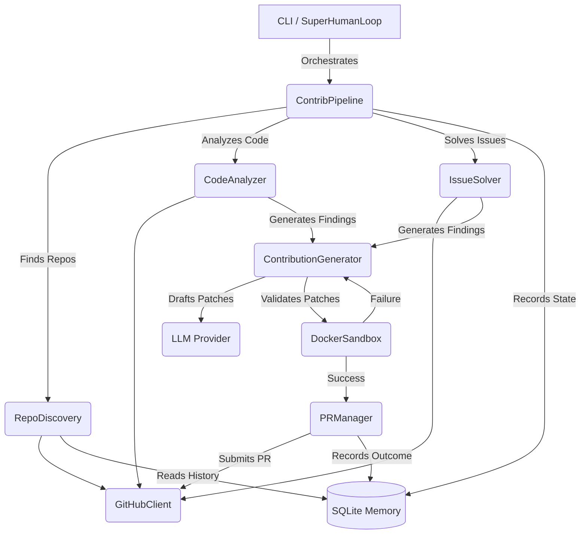

# Project Map: Architecture Blueprint

This document provides a deep-dive architectural guide to the Farm-Agent codebase. It reflects the exact structure, data flow, and technologies currently implemented.

## 1. System Overview & Tech Stack

| Technology | Role |
| :--- | :--- |
| **Python 3.11+** | Core programming language. |
| **Asyncio** | Asynchronous I/O for concurrent repository processing, API calls, and DB operations. |
| **Click & Rich** | CLI framework (`farm_agent` commands) and rich terminal formatting/tables. |
| **httpx** | Async HTTP client for interacting with the GitHub REST API (`GitHubClient`). |
| **Pydantic** | Configuration management (`config.yaml`), data validation, and typed domain models. |
| **aiosqlite (SQLite)** | Persistent, concurrent storage using Write-Ahead Logging (WAL) for memory (`memory.db`). |
| **Docker** | Polyglot sandbox environment for validating code patches and tests before PR creation. |
| **LLM Providers** | Code analysis and generation engine. Primary: Minimax. Fallbacks/Options: Gemini, OpenAI, Anthropic. |

## 2. Directory Structure

```text
farm_agent/
├── __init__.py
├── agents/            # Registry and definitions for specialized agent personas
├── analysis/          # Static code analysis and maintainer vibe checking
│   ├── analyzer.py    # CodeAnalyzer engine
│   ├── strategies.py  # Language/Framework specific analysis strategies
│   └── skills.py      # Targeted detection rules (e.g., security, performance)
├── cli/               # Command-line interface
│   └── main.py        # Entry point for `farm_agent` commands (run, hunt, patrol, etc.)
├── core/              # Shared models, exceptions, configuration, and middleware
│   ├── config.py      # Pydantic configuration schemas (`FarmAgentConfig`)
│   ├── exceptions.py  # Custom exception hierarchy (GitHubAPIError, RateLimitError)
│   ├── middleware.py  # DeerFlow pattern chain for quality gating
│   └── models.py      # Core data models (Repository, Finding, Contribution, PRResult)
├── generator/         # LLM-based code generation
│   └── engine.py      # ContributionGenerator (drafts patches and fixes failing code)
├── github/            # GitHub API interactions
│   ├── client.py      # Async `GitHubClient` with rate limit & backoff handling
│   ├── discovery.py   # Repository hunting based on stars, language, activity
│   └── guidelines.py  # Parses CONTRIBUTING.md and repo conventions
├── issues/            # GitHub Issue resolution engine
│   └── solver.py      # Fetches, filters, and solves open issues
├── llm/               # Abstractions for LLM providers
│   ├── provider.py    # Factory for creating provider instances
│   ├── models.py      # Supported model definitions and configurations
│   └── router.py      # Multi-model routing logic
├── notifications/     # Event notification system (Telegram, Slack, Discord)
├── orchestrator/      # High-level pipeline and operational loops
│   ├── pipeline.py    # `ContribPipeline` (Discover -> Analyze -> Generate -> Validate -> PR)
│   ├── human.py       # `SuperHumanLoop` (24/7 daemon mode, dynamic quotas, delays)
│   └── memory.py      # `Memory` system (SQLite, WAL mode, tracking, quotas)
├── plugins/           # Extensible plugin architecture
├── pr/                # Pull Request management
│   ├── manager.py     # Creates and checks compliance of PRs
│   ├── patrol.py      # PRPatrol (scans open PRs, replies to comments, pushes fixes)
│   └── janitor.py     # PRJanitor (sweeps and closes low-quality PRs)
├── templates/         # PR and issue description templates
└── tools/             # Actionable tools available to the LLM
```

## 3. Core Module Dependency Graph



## 4. Core Execution Loops / Entry Points

### A. Standard Pipeline (`farm_agent run` / `farm_agent target`)
1. **Initialization:** Loads `config.yaml`, initializes `GitHubClient`, `Memory`, `LLMProvider`, and `DockerSandbox`.
2. **Discovery (if not targeted):** Queries GitHub API for repositories matching criteria (language, stars) and skips previously analyzed repos.
3. **Pre-checks:** Evaluates repo interaction limits and `AI_POLICY.md` restrictions. Conducts a "Vibe Check" on recent maintainer comments to filter out hostile environments.
4. **Analysis:** `CodeAnalyzer` scans the file tree for actionable findings, filtering out doc-only or low-impact tweaks (Anti-Farming filter).
5. **Generation:** `ContributionGenerator` fetches relevant files and instructs the LLM to draft a fix (`FileChange` objects).
6. **Validation (Sandbox Guillotine):** The repository is cloned locally. The patch is applied and run inside the `DockerSandbox`. If tests fail, the LLM attempts self-correction up to a configured limit.
7. **Submission:** `PRManager` commits the validated patch to a new branch and opens a Pull Request via `GitHubClient`.

### B. Hunt Mode (`farm_agent hunt`)
Executes the Standard Pipeline iteratively. It shuffles discovery criteria across multiple rounds to maximize coverage, prioritizing "Familiar Grounds" (repos where the agent previously successfully merged a PR).

### C. Issue Solver (`farm_agent solve`)
Bypasses static analysis. Fetches open issues, uses an LLM to determine solvability and complexity, and directly maps the issue description to a multi-file patch generation via the `ContributionGenerator`.

### D. Patrol Mode (`farm_agent patrol`)
Scans open PRs submitted by the agent. Analyzes maintainer review comments using the LLM. It can automatically generate and push follow-up code fixes, answer questions, fix style issues, or sign CLAs.

### E. Super Human Daemon (`farm_agent superhuman`)
A 24/7 background process (`SuperHumanLoop`). It randomly sets daily PR targets, interleaves Hunt mode and Patrol mode, and injects organic, human-like delays (sleeping, typing delays) to avoid rate limits and simulate a real contributor.

## 5. Database / State Schema

Farm-Agent uses `aiosqlite` with **Write-Ahead Logging (WAL)** for concurrent read/write safety. The database (`memory.db`) tracks state to avoid duplicate work, enforce quotas, and learn maintainer preferences.

**Key Tables:**
- `analyzed_repos`: Tracks repositories that have been scanned (Primary Key: `full_name`), preventing redundant analysis.
- `submitted_prs`: Logs all created PRs with their status (`open`, `merged`, `closed`), branch info, and counters for CI fix attempts and discussion replies.
- `run_log`: High-level metrics for CLI `stats` (repos analyzed, PRs created, findings, errors).
- `pr_outcomes`: Records the final state of PRs and maintainer feedback, used for outcome learning.
- `repo_preferences`: Derived table aggregating preferred vs. rejected contribution types per repo (used to guide future PR generation).
- `blacklisted_repos`: Repositories explicitly ignored due to toxic maintainers, strict AI policies, or manual bans.
- `api_usage_log`: Sliding-window log of LLM API requests to enforce quotas and prevent exceeding provider limits.
- `task_schedule`: Coordinates cron-like tasks (e.g., quota cleanup, VIP repo sync) across multiple processes.
