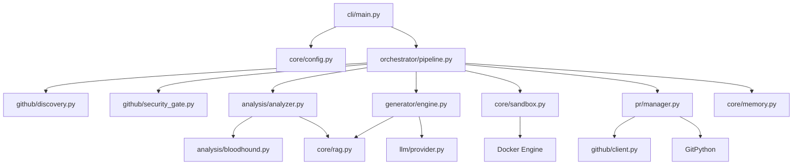

# PROJECT_MAP.md — Farm-Agent Architecture Blueprint

**Version:** v3.0.0
**Entry Point:** `farm_agent/cli/main.py` → `cli()` (Click-based CLI)
**Language:** Python 3.11+

---

## 1. System Overview & Tech Stack

Farm-Agent is an autonomous AI agent that discovers open-source GitHub repositories matching criteria, scans their code for issues, generates patches via LLM, validates patches in Docker sandboxes, and creates PRs or solves open GitHub Issues.

### Active Tech Stack

| Component | Technology | Role |
|-----------|------------|------|
| **Language** | Python 3.11+ | Core programming language (`pyproject.toml`) |
| **HTTP Client** | `httpx` (async) | Async HTTP requests for API communication |
| **LLM Providers** | MiniMax, OpenRouter | Code generation, code analysis, red team audits |
| **Database** | SQLite via `aiosqlite` | Persistent state storage (WAL mode) |
| **Sandbox** | Docker 7.1+ | Polyglot container for isolated patch validation |
| **Vector DB** | `chromadb` | RAG indexing for cross-file code context |
| **CLI Framework**| `click` + `rich` | Command-line interface and terminal styling |
| **Configuration**| Pydantic v2 + PyYAML | Strict, validated type-safe configuration |
| **Git Client** | `GitPython` | Managing local repository clones and branches |

---

## 2. Directory Structure

```text
farm_agent/
├── cli/
│   ├── main.py          # Click CLI, all primary commands (run, target, hunt, superhuman, etc.)
├── core/
│   ├── config.py        # Pydantic configuration (FarmAgentConfig)
│   ├── exceptions.py    # Custom system exceptions
│   ├── memory.py        # SQLite persistent memory models and queries
│   ├── middleware.py    # Middleware chains for quota/quality enforcement
│   ├── models.py        # Core Pydantic data models (Repository, Finding, Contribution, etc.)
│   ├── rag.py           # ChromaDB RAG pipeline for context retrieval
│   └── sandbox.py       # DockerSandbox — Polyglot execution environment
├── generator/
│   ├── engine.py        # ContributionGenerator — AI code generation logic
│   ├── reviewer.py      # ContributionReviewer — LLM-based patch review
│   └── scorer.py        # QAHardcoreScorer — Strict patch quality scoring
├── github/
│   ├── client.py        # GitHubClient — API interactions (REST + GraphQL) with rotation
│   ├── discovery.py     # Repository discovery engine
│   ├── guidelines.py    # Fetches CONTRIBUTING.md and PR templates
│   └── security_gate.py # Detects private disclosure requests (SECURITY.md)
├── analysis/
│   ├── analyzer.py      # CodeAnalyzer — static analysis orchestration
│   ├── bloodhound.py    # BloodhoundAnalyzer — Semgrep pre-scan and vulnerability finding
│   └── mapper.py        # Repository mapping logic
├── llm/
│   ├── provider.py      # Factory for creating LLM providers
│   ├── models.py        # ALL_MODELS catalog and tiering
│   ├── router.py        # TaskRouter — maps task types to specific models
│   └── context.py       # Context management for LLM prompts
├── issues/
│   └── solver.py        # IssueSolver — fetches, estimates, and solves GitHub issues
├── orchestrator/
│   ├── pipeline.py      # ContribPipeline — MAIN orchestrator execution engine
│   └── human.py         # SuperHumanLoop — 24/7 continuous daemon execution
├── pr/
│   ├── manager.py       # PRManager — fork, branch, commit, push, create PR
│   ├── patrol.py        # PRPatrol — monitors and responds to open PR feedback
│   └── janitor.py.DISABLED # Disabled PR cleanup module
├── tools/
│   └── protocol.py      # Tool protocol definitions
├── notifications/
│   └── notifier.py      # Slack/Discord/Telegram webhook notifications
└── templates/
    └── registry.py      # Contribution template registry
```

---

## 3. Core Module Dependency Graph



---

## 4. Core Execution Loops / Entry Points

The primary execution flows through the `ContribPipeline` orchestrator:

1. **Discovery Stage:** `RepoDiscovery.discover()` fetches repositories matching configuration criteria (language, stars, last activity).
2. **Gate & Compliance Stage:** `run_security_gate()` checks for private vulnerability disclosure rules. The Anti-Farming filter blocks trivial findings or docs-only changes.
3. **Analysis Stage:** `CodeAnalyzer.analyze()` and `BloodhoundAnalyzer` scan the repository file tree. A ChromaDB RAG index is generated for precise contextual code retrieval.
4. **Engine Stage:** `ContributionGenerator.generate()` utilizes the LLM to write a targeted patch for the identified finding or issue.
5. **Sandbox Stage:** The patch is executed in `DockerSandbox.run_in_sandbox()` to validate compiling, syntax, and basic tests in an isolated, network-restricted container.
6. **PR Stage:** Upon successful validation, `PRManager.create_pr()` forks the repo, applies the commit, pushes to a branch, and opens a Pull Request using `GitHubClient`.

---

## 5. Database / State Schema

State is maintained via an async SQLite database (`memory.db`) managed by `core/memory.py`.

- `analyzed_repos`: Tracks repositories that have been analyzed, including timestamp and status.
- `submitted_prs`: Logs all Pull Requests created by the agent, including repo, PR number, title, and current status (open, merged, closed).
- `findings_cache`: Caches identified code issues and vulnerabilities to prevent duplicate work.
- `run_log`: Stores historical execution logs for the pipeline.
- `pr_outcomes`: Tracks detailed success/failure metrics of submitted PRs.
- `repo_preferences`: Stores specific instructions, PR templates, and configuration per repository.
- `blacklisted_repos`: Tracks repositories that the agent should avoid (e.g., due to hostile maintainer vibe).
- `api_usage_log`: Monitors LLM token usage and GitHub API call counts.
- `task_schedule`: Coordinates scheduled operations across multiple process instances.
- `knowledge_base`: Stores learned information and past successful patch strategies.
