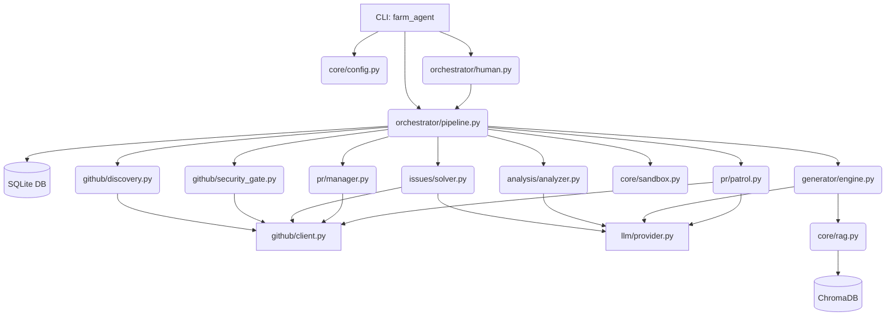

# 🗺️ PROJECT_MAP: Architecture Blueprint

This document serves as the canonical architectural blueprint for Farm-Agent (v3.0.0). It details the actual implemented tech stack, directory structure, module dependencies, execution loops, and database schema.

## 1. System Overview & Tech Stack

Farm-Agent is a high-autonomy agent designed to contribute to open source GitHub repositories. It orchestrates complex tasks utilizing the "DeerFlow" pattern (registry-based middleware chain).

| Component | Technology | Role |
| :--- | :--- | :--- |
| **Language** | Python >=3.11 | Core runtime environment. |
| **CLI Framework** | `click` + `rich` | Provides a robust, styled terminal interface with rich tables and panels (`farm_agent`). |
| **Configuration** | `pydantic`, `pydantic-settings`, `PyYAML` | Type-safe configuration management parsing `config.yaml` and `.env`. |
| **API Client** | `httpx` | Asynchronous HTTP client for interacting with the GitHub REST & GraphQL APIs. |
| **LLM Orchestration** | Minimax, OpenAI, Anthropic, Ollama, Gemini SDKs | Multi-provider LLM routing for generation, review, and issue solving. |
| **Context & Vector DB** | `chromadb` | Local Retrieval-Augmented Generation (RAG) index for accurate, multi-file code patching. |
| **Sandbox Environment** | `docker` | Ephemeral, isolated containers with polyglot support for validating generated code safely. |
| **Persistence** | `sqlite3` (`aiosqlite`) | Local WAL-mode database (`memory.db`) for tracking states, PR outcomes, and rate limits. |
| **Git Operations** | `gitpython` | Programmatic local and remote Git operations (forking, branching, committing, pushing). |
| **Scheduling & Timing** | `apscheduler`, `asyncio` | Manages "Super Human Mode" delays and execution loops. |

## 2. Directory Structure

This ASCII tree represents the core modules and files as they currently exist in the codebase.

```
farm_agent/
├── __init__.py                # Version (3.0.0) and app name definitions
├── cli/
│   └── main.py                # Click CLI: commands for run, hunt, target, solve, patrol, superhuman
├── core/                      # Core infrastructure and cross-cutting concerns
│   ├── config.py              # Configuration loading and Pydantic models
│   ├── logger.py              # Application-wide logging configuration
│   ├── exceptions.py          # Custom exceptions (GitHubAPIError, LLMError, etc.)
│   ├── middleware.py          # DeerFlow middleware chain execution
│   ├── models.py              # Shared Pydantic data models (Repository, Finding, Contribution)
│   ├── sandbox.py             # Docker-based polyglot sandbox logic
│   ├── rag.py                 # ChromaDB indexing and retrieval
│   └── retry.py               # Asynchronous decorators for rate limits and transient errors
├── orchestrator/              # High-level pipeline management
│   ├── pipeline.py            # ContribPipeline: Main execution engine (Discovery -> Analysis -> PR)
│   ├── human.py               # SuperHumanLoop: 24/7 daemon with simulated delays
│   └── memory.py              # SQLite database initialization and data access operations
├── github/                    # GitHub API integrations
│   ├── client.py              # Async HTTP client wrappers for GitHub REST/GraphQL
│   ├── discovery.py           # Logic to find targets based on stars, languages, etc.
│   ├── security_gate.py       # Scans meta files to block private disclosure vulnerabilities
│   └── guidelines.py          # Extracts contributing and PR template guidelines
├── analysis/                  # Repository code and quality analysis
│   ├── analyzer.py            # CodeAnalyzer: coordinates analysis strategies
│   └── mapper.py              # AST and codebase mapping utilities
├── generator/                 # LLM Code modification and evaluation
│   ├── engine.py              # ContributionGenerator: creates diffs/patches
│   ├── reviewer.py            # ContributionReviewer: evaluates proposed patches
│   └── scorer.py              # Quality scoring
├── issues/                    # GitHub Issues functionality
│   └── solver.py              # IssueSolver: fetches, filters, and generates fixes for open issues
├── llm/                       # LLM Provider integrations
│   ├── provider.py            # Provider abstraction layer
│   ├── models.py              # Model definitions, cost, capabilities
│   └── router.py              # Routes tasks to the optimal LLM based on capabilities
├── pr/                        # Pull Request lifecycle management
│   ├── manager.py             # PR creation: fork, branch, commit, push, create
│   └── patrol.py              # PRPatrol: responds to maintainer comments and auto-fixes
├── agents/                    # DeerFlow agent definitions
│   └── registry.py            # Agent registry loading
├── plugins/                   # Extensibility system
├── templates/                 # Pre-defined prompts and PR templates
│   └── registry.py
└── notifications/             # External alerting
    └── notifier.py            # Supports Slack, Discord, Telegram
```

## 3. Core Module Dependency Graph

The execution pipeline (`ContribPipeline` and `SuperHumanLoop`) acts as the central brain, dynamically orchestrating sub-modules.



## 4. Core Execution Loops

The primary workflow follows an "Issue-First" paradigm, embedded inside the Super Human daemon or run directly.

1.  **Discovery (Hunt Loop):**
    *   Query GitHub API for repositories matching config criteria (language, stars, recency).
    *   Filter out repositories restricted to prior contributors, blacklisted repos, and check the "Security Disclosure Gate" to abort if private disclosures are preferred.
2.  **Targeting (Issue-First):**
    *   Initialize `IssueSolver` to fetch open issues. Filter based on complexity heuristics (e.g., body length, label, file references).
    *   If viable issues exist, the generator focuses on creating patches specifically for these issues.
3.  **Analysis (Fallback/Complementary):**
    *   If no solvable issues exist (or in standalone mode), `CodeAnalyzer` scans the repository.
    *   Vectorizes file contexts into `ChromaDB` (`core/rag.py`) to build a contextual map.
    *   Runs the "Anti-Farming Filter" to immediately drop trivial issues (e.g., typos, formatting) and block "docs-only" PRs.
4.  **Generation & Sandbox (Gatekeeper):**
    *   `ContributionGenerator` (`engine.py`) crafts a code patch.
    *   The patch is passed to `DockerSandbox` (`sandbox.py`). The sandbox executes tests/linters in total network isolation.
    *   If it fails, a self-correction loop uses the error output to fix the patch before proceeding.
5.  **PR Lifecycle:**
    *   `PRManager` handles forking the repo, creating a branch, committing the patch, pushing, and opening the PR.
    *   `PRPatrol` runs periodically to check open PRs for maintainer comments, auto-generating fixes or answering questions.

## 5. Database / State Schema

Persistent state is managed via SQLite in `orchestrator/memory.py`. Key tables include:

*   `analyzed_repos`: Tracks scanned repositories to prevent redundant analysis.
*   `submitted_prs`: Logs all created PRs with columns for `repo`, `pr_number`, `title`, and `status` (`open`, `merged`, `closed`). Used by PR Patrol.
*   `findings_cache`: Caches identified code issues.
*   `run_log`: High-level tracking of execution rounds.
*   `repo_preferences` & `repo_style_guides`: Stores extracted maintainer preferences and stylistic guidelines.
*   `blacklisted_repos`: Repos that are explicitly ignored (e.g., due to hostile maintainer sentiment or manual flag).
*   `knowledge_base`: Contextual learnings to improve future agent executions.
