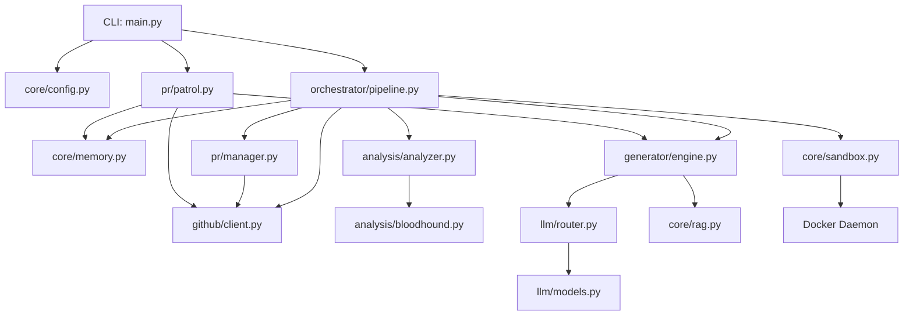

# PROJECT_MAP

This document outlines the architecture and technical state of the Farm-Agent project.

## 1. System Overview & Tech Stack

| Technology | Role |
| :--- | :--- |
| **Python 3.11+** | Core programming language. |
| **Hatchling** | Build backend (as defined in `pyproject.toml`). |
| **Click & Rich** | CLI framework and rich terminal output. |
| **Pydantic & Pydantic-Settings** | Configuration management and strong data modeling. |
| **SQLite (aiosqlite)** | Persistent state and memory database (`memory.db`). |
| **Docker SDK** | Polyglot sandbox environment for safe code execution and validation. |
| **ChromaDB** | Local RAG indexing for retrieving contextual codebase fragments. |
| **httpx** | Async HTTP client used extensively (e.g., GitHub API interactions). |
| **GitPython** | Programmatic git operations (cloning, branching, pushing). |
| **Pytest** | Testing framework. |
| **Ruff** | Strict linting and formatting. |

## 2. Directory Structure

```text
farm_agent/
├── cli/
│   └── main.py          # Click CLI entry points (run, target, patrol, etc.)
├── core/
│   ├── config.py        # Pydantic configuration loader
│   ├── exceptions.py    # Custom system exceptions
│   ├── logger.py        # System logging configuration
│   ├── memory.py        # SQLite database interface
│   ├── middleware.py    # Request/action middleware processing
│   ├── models.py        # Pydantic schemas (Repository, Finding, Contribution)
│   ├── notifier.py      # Notifications (Telegram, etc.)
│   ├── profiles.py      # Contributor profiles mapping
│   ├── rag.py           # ChromaDB Retrieval-Augmented Generation implementation
│   ├── retry.py         # Async backoff/retry decorators
│   └── sandbox.py       # Docker SDK Polyglot isolated execution
├── generator/
│   ├── engine.py        # LLM-driven fix/contribution generator
│   ├── reviewer.py      # Auto-review generated patches
│   └── scorer.py        # QA scorer evaluating code quality and debug residue
├── github/
│   ├── client.py        # Async GitHub API wrapper (REST/GraphQL)
│   ├── discovery.py     # Repository scraping and candidate discovery
│   ├── guidelines.py    # Pulls CONTRIBUTING.md/templates
│   └── security_gate.py # Security scanning and private disclosure prevention
├── analysis/
│   ├── analyzer.py      # Deep static code analysis orchestrator
│   └── bloodhound.py    # Advanced Red Team analyzer (Semgrep/LLM vulnerabilities)
├── llm/
│   ├── provider.py      # LLM Provider factory
│   ├── models.py        # Available models definition
│   └── router.py        # TaskRouter for Multi-Model request routing
├── issues/
│   └── solver.py        # Issue heuristics and automatic resolution solver
├── orchestrator/
│   ├── human.py         # Core 24/7 autonomous execution loop
│   ├── memory.py        # Orchestrator memory context (alias to core/memory.py)
│   └── pipeline.py      # ContribPipeline: Main end-to-end processing pipeline
└── pr/
    ├── janitor.py       # Closes stale/unsuccessful PRs (currently disabled)
    ├── manager.py       # Forks, branches, commits, and pushes PRs
    └── patrol.py        # PR Patrol: monitors comments, auto-applies fixes
```

## 3. Core Module Dependency Graph



## 4. Core Execution Loops

**The Terminator Execution Loop (End-to-End Pipeline):**
1. **Discovery:** The `ContribPipeline` fetches repository candidates via the GitHub API (`github/discovery.py`) or reads local targets.
2. **Gate & Filter:**
   - Evaluates against Anti-Farming Filters (blocks trivial `.md` changes).
   - Runs `security_gate.py` to prevent private disclosure leakage.
3. **Analysis:** Routes through `analysis/analyzer.py` and `Bloodhound` to statically map flaws or structural improvements.
4. **Engine:** The `ContributionGenerator` formulates a patch using the optimally routed LLM (via `llm/router.py`) and RAG context.
5. **Sandbox:** The patch is applied to a local clone and executed inside the strict Docker `Polyglot Sandbox`. Code is built/linted/tested in total network isolation.
6. **PR:** If successful, `pr/manager.py` forks the repository, creates a branch, commits the changes, pushes, and opens the Pull Request.

**PR Patrol Loop:**
1. Scans existing open PRs via GitHub API.
2. Ingests maintainer feedback/comments.
3. Classifies comments using LLM to determine if follow-up fixes are needed.
4. Autonomously writes and pushes follow-up commits. Closes the PR if the maximum response limit is reached.

## 5. Database Schema

The agent stores state across restarts using an SQLite database defined in `core/memory.py` (`memory.db`):

- **analyzed_repos**: Tracks repositories already visited to prevent redundant processing.
- **submitted_prs**: Main registry of all created Pull Requests, tracking their URLs, status, and associated repository.
- **findings_cache**: Caches specific code issues discovered during analysis.
- **run_log**: High-level execution metrics (time ran, PRs created, errors encountered).
- **pr_outcomes**: Tracks final PR fate (merged/closed) and merge rates.
- **repo_preferences**: Historical metadata on accepted vs rejected contribution types per repo.
- **blacklisted_repos**: Repositories flagged to be ignored forever (e.g., due to hostile vibe checks).
- **api_usage_log**: Cost and rate limiting tracking for LLM API integrations.
- **task_schedule**: Task schedule queue for distributed execution alignment.
- **knowledge_base**: Stores key knowledge entries.
- **target_repos**: Manual VIP/Diamond targets fed into the engine.
- **repo_style_guides**: Captured styling/PR expectations for targeted repos.
