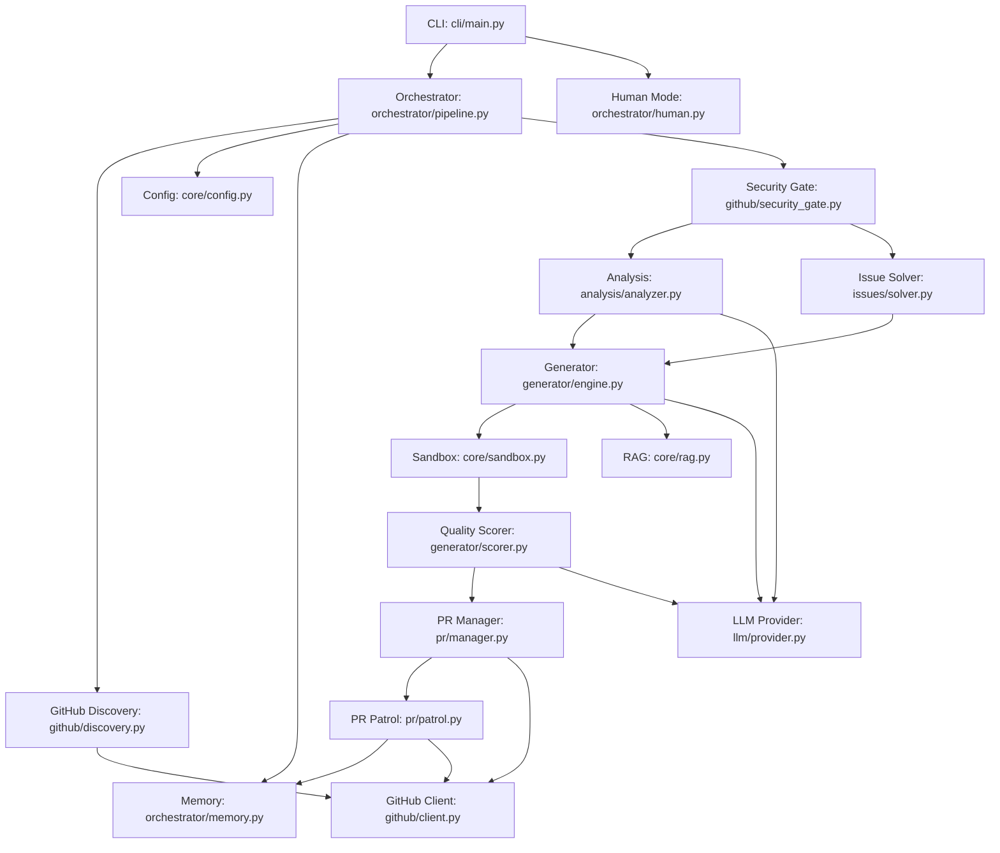

# PROJECT_MAP.md — Farm-Agent Architectural Blueprint

## 1. System Overview & Tech Stack

**What the system actually does:**

Farm-Agent is an autonomous AI agent that discovers open-source GitHub repositories matching criteria (language, star range, activity), scans their code for issues (security vulnerabilities, code quality bugs, performance problems, etc.), generates patches via LLM, validates patches in Docker sandboxes, and creates PRs or GitHub Issues to contribute back.

**Active Tech Stack:**

| Component | Technology | Role |
|-----------|------------|------|
| Language | Python 3.11+ | Core engine language |
| HTTP client | `httpx` | Async HTTP requests, including GitHub API |
| LLM Providers | MiniMax (primary), OpenRouter, Gemini, OpenAI, Anthropic | Code generation and analysis |
| Database | SQLite via `aiosqlite` | Persistent state storage (WAL mode) |
| Docker | `docker` (Python SDK) | Polyglot Sandbox isolation and validation |
| Scheduling | `apscheduler` | Job scheduling |
| Config | Pydantic v2 + YAML | Typed application configuration |
| CLI | `click` + `rich` | Command Line Interface orchestration |
| Vector DB | `chromadb` | Ephemeral RAM-only Local RAG |
| Build System | `hatchling` | Package build backend |
| Linters | `ruff` | Code style enforcement |

## 2. Directory Structure

```text
farm_agent/
├── cli/                 # Command Line Interface (main entry point)
│   ├── main.py          # Click-based CLI commands (run, hunt, patrol, etc.)
│   └── __init__.py
├── core/                # Core system utilities and models
│   ├── config.py        # Pydantic configuration loader
│   ├── exceptions.py    # Custom exception definitions
│   ├── leaderboard.py   # PR and ranking statistics
│   ├── logger.py        # System logging configuration
│   ├── middleware.py    # Request/action middleware
│   ├── models.py        # Core Pydantic data models
│   ├── notifier.py      # Base notification interfaces
│   ├── profiles.py      # Contribution profiles
│   ├── quotas.py        # API quota limits
│   ├── rag.py           # Retrieval-Augmented Generation implementation
│   ├── retry.py         # Retry decorators
│   ├── sandbox.py       # Polyglot Docker sandbox execution
│   └── __init__.py
├── github/              # GitHub API integrations
│   ├── client.py        # GitHubClient REST/GraphQL wrappers
│   ├── discovery.py     # Repository discovery logic
│   ├── guidelines.py    # Contributing guideline parsers
│   ├── security_gate.py # Security disclosure policies
│   └── __init__.py
├── orchestrator/        # System orchestrators
│   ├── human.py         # SuperHumanLoop 24/7 daemon
│   ├── memory.py        # Persistent SQLite state
│   ├── pipeline.py      # Core ContribPipeline (Main Execution)
│   └── __init__.py
├── generator/           # LLM Code Generation Engine
│   ├── engine.py        # Contribution generator
│   ├── reviewer.py      # Code reviewer
│   ├── scorer.py        # Quality scoring (DEV-QA)
│   └── __init__.py
├── pr/                  # Pull Request Management
│   ├── manager.py       # PR Creation (branching, commits, etc.)
│   ├── patrol.py        # PR Patrol (monitoring/fixes)
│   ├── janitor.py.DISABLED # Disabled PR cleanup
│   └── __init__.py
├── analysis/            # Code Analysis Engines
│   ├── analyzer.py      # Static and dynamic code analysis
│   ├── mapper.py        # Project structure mapping
│   └── __init__.py
├── issues/              # Issue solving logic
│   ├── solver.py        # IssueSolver complexity analysis and fixes
│   └── __init__.py
├── llm/                 # LLM Provider abstraction
│   ├── agents.py        # Specialized LLM agents
│   ├── context.py       # Context management
│   ├── models.py        # Model definitions and limits
│   ├── provider.py      # Provider interfaces
│   ├── router.py        # Task routing across models
│   └── __init__.py
├── templates/           # Contribution templates
│   ├── registry.py      # Template registry mapping
│   └── __init__.py
├── tools/               # Agent tool implementations
│   ├── protocol.py      # Tool execution protocols
│   └── __init__.py
├── plugins/             # Extensibility layer
│   └── __init__.py
├── notifications/       # External notifications
│   ├── notifier.py      # Telegram/Slack/Discord webhook push
│   └── __init__.py
└── __init__.py
```

## 3. Core Module Dependency Graph



## 4. Core Execution Loops

### The ContribPipeline (`farm_agent/orchestrator/pipeline.py`)

1. **Discovery**: The `RepoDiscovery` module identifies target repositories based on criteria (language, stars) using the GitHub API, or reads from `target_repo.json` in circular mode.
2. **Gate**:
   - `_check_ai_policy`: Scans for `AI_POLICY.md` or `CONTRIBUTING.md` indicating AI bans.
   - `check_interaction_limits`: Ensures the bot can contribute.
   - `run_security_gate`: Blocks PRs if private disclosure is requested in `SECURITY.md`.
3. **Analysis**:
   - Analyzers (Security, Code Quality, Docs, UI/UX) scan the repository.
   - Anti-Farming rules apply, dropping low-impact and docs-only changes.
   - Duplicate detection prevents redundant PRs.
4. **Engine**: `ContributionGenerator` drafts fixes utilizing the ephemeral ChromaDB RAG for context. Forbidden "AI Gag Order" phrases trigger regenerations.
5. **Sandbox (DEV-QA Loop)**: The proposed patch is executed inside an isolated `DockerSandbox`. Linters and tests are run. If it fails, the error is fed back to the LLM up to a retry limit for self-correction. Quality scoring ensures no explicit debug patterns (`print`, `debugger`) exist.
6. **PR**: `PRManager` forks, commits to a new branch, and creates the PR. Outcomes are written to memory.

### Super Human Mode (`farm_agent/orchestrator/human.py`)
A 24/7 autonomous daemon utilizing the ContribPipeline. It runs a Relentless Terminator loop maximizing throughput up to daily rate caps, abandoning simulated human delays. It coordinates concurrent discovery and PR Patrol tasks.

## 5. Database Schema (`farm_agent/orchestrator/memory.py`)

Farm-Agent utilizes SQLite (via `aiosqlite`) in WAL mode for persistent state tracking.

### Core Tables

*   **`analyzed_repos`**: Tracks repositories that have been evaluated.
    *   *Columns:* `full_name` (PK), `language`, `stars`, `analyzed_at`, `findings`, `metadata`.
*   **`submitted_prs`**: Logs all PRs created by Farm-Agent.
    *   *Columns:* `id`, `repo`, `pr_number` (UNIQUE), `pr_url`, `title`, `type`, `status`, `branch`, `fork`, `created_at`, `updated_at`, `ci_fix_attempts`, `discussion_replies`.
*   **`findings_cache`**: Caches results from analysis to prevent duplicate work.
    *   *Columns:* `id`, `repo`, `type`, `severity`, `title`, `file_path`, `status`, `created_at`.
*   **`run_log`**: Historical metrics for pipeline runs.
    *   *Columns:* `id`, `started_at`, `finished_at`, `repos_analyzed`, `prs_created`, `findings`, `errors`, `metadata`.
*   **`pr_outcomes`**: ML training/learning data from PR feedback.
    *   *Columns:* `id`, `repo`, `pr_number` (UNIQUE), `pr_url`, `pr_type`, `outcome`, `feedback`, `time_to_close_hours`, `recorded_at`.
*   **`repo_preferences`**: Learned constraints for repositories based on historical interactions.
    *   *Columns:* `repo` (PK), `preferred_types`, `rejected_types`, `merge_rate`, `avg_review_hours`, `notes`, `updated_at`.
*   **`blacklisted_repos`**: Repos that have blocked the agent or have hostile maintainers.
    *   *Columns:* `repo` (PK), `reason`, `pr_number`, `blacklisted_at`.
*   **`api_usage_log`**: Tracks LLM quota limits.
    *   *Columns:* `id`, `timestamp` (Unix epoch), `provider`.
*   **`task_schedule`**: Persistent task coordination.
    *   *Columns:* `task_key` (PK), `next_run`, `updated_at`.
*   **`knowledge_base`**: RAG facts, QA lessons, and persistent instructions.
    *   *Columns:* `repo_name`, `entry_type`, `content`, `created_at`.