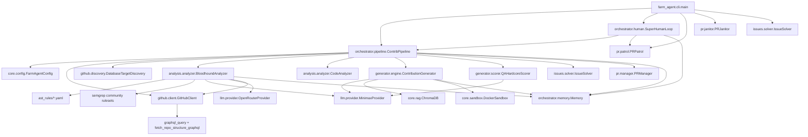

# PROJECT_MAP.md

> **Architecture Blueprint for Farm-Agent (v3.0.0)**
> This document reflects the raw reality of the active codebase.

## 1. System Overview & Tech Stack

Farm-Agent is a highly autonomous, multi-layered AI system capable of full-lifecycle open source contribution, from initial discovery to post-PR code revisions. The v3.0 architecture introduces the **Bloodhound Red Team** (ast-grep + Semgrep dual radar, OpenRouter validation), **Circular Target Loop** (deterministic round-robin targeting), **DEV-QA Bounty Loop** (3-cycle adversarial quality gate with Chain-of-Thought planning), **Contextual Intelligence** (path-based filtering of non-production code), **Token Pool Rotation** (multi-token GitHub API load distribution), **GraphQL Integration** (repo structure queries via token pool), **Terminator Execution Loop** (relentless continuous operation), and **Knowledge Base GC** (stale lesson purging).

| Technology | Role |
| :--- | :--- |
| **Python 3.11+** | Core language, heavily utilizing `asyncio` for concurrent operations. |
| **Click & Rich** | Powers the robust Command-Line Interface (CLI) and terminal formatting. |
| **HTTPX** | Asynchronous HTTP client for communicating with GitHub and LLM APIs. |
| **SQLite (aiosqlite)** | Persistent, thread-safe (WAL mode) database for memory, quotas, PR tracking, and knowledge base. |
| **Minimax LLM** | Primary Large Language Model engine used for generation, analysis, and reasoning. Native integration with quota tracking. |
| **OpenRouter** | Secondary LLM provider for Bloodhound Red Team vulnerability validation. Routes White-Hat audits through free/cheap models (e.g., dolphin-mistral-24b) to conserve Minimax quota. Configured via `OPENROUTER_API_KEY`. |
| **Pydantic & PyYAML**| Robust configuration parsing, validation, and settings management (`config.yaml`). |
| **Docker (SDK)** | Ephemeral "Polyglot Sandbox" containers to execute tests and validate code patches safely. Runs in Docker-outside-of-Docker (DooD) mode. |
| **ChromaDB** | Ephemeral, in-memory vector database for Retrieval-Augmented Generation (RAG) context to identify cross-file dependencies. |
| **ast-grep (`sg`)** | CLI-based AST pattern matching tool used as a pre-filter in the Bloodhound Red Team pipeline to find exact buggy snippets before LLM analysis. Installed via direct binary download in the Docker image. |
| **Semgrep** | Community-ruleset-based static analysis scanner that runs concurrently with ast-grep in the Bloodhound pipeline. Uses remote rulesets (`p/security-audit`, `p/cwe-top-25`, `p/default`). Installed via `pip install semgrep` in the Docker image. |
| **Pytest & Ruff** | Standardized testing framework and aggressive code formatting/linting. |

---

## 2. Directory Structure

```text
farm_agent/
├── cli/                 # Command-Line Interface entry points
│   ├── main.py          # Primary Click CLI (24 commands including hunt-circular, superhuman, gc)
│   └── tui.py           # Text User Interface module
├── core/                # Core domain models, configuration, and infrastructure
│   ├── config.py        # Pydantic config (LLMConfig, AnalysisConfig with forbidden_paths/red_team_*/semgrep_*, GitHubConfig with secondary_tokens, FarmAgentConfig). Auto-loads .env via dotenv.
│   ├── exceptions.py    # Custom exceptions (FarmAgentError, GitHubAPIError, LLMRateLimitError, etc.)
│   ├── middleware.py     # Pipeline execution middlewares (Rate limits, DCO, Quality Gates)
│   ├── models.py        # Shared data structures (Contribution, Repository, Finding, Vulnerability with context_type, VulnerabilityDossier, QAResult, TargetRepoEntry)
│   ├── rag.py           # ChromaDB integration for contextual code search
│   ├── sandbox.py       # Docker-based Polyglot Sandbox (network_mode=none, 60s guillotine timeout, no-new-privileges)
│   ├── profiles.py      # Named contribution profiles (security-focused, docs-focused, etc.)
│   ├── quotas.py         # API usage tracking and quota enforcement
│   ├── notifier.py      # Telegram notifier with C2 long-polling bot
│   ├── leaderboard.py   # Contribution leaderboard and success rate tracking
│   ├── daily_log.py     # Daily markdown log writer for SuperHuman mode
│   ├── retry.py         # Retry utilities with exponential backoff + LRU cache
│   └── logger.py        # Daily rotating file logger with API key sanitization
├── github/              # Interfacing with the GitHub REST API and GraphQL API
│   ├── client.py        # Multi-token async HTTPX client with pool rotation (GET=pool, POST/PATCH/primary) + GraphQL + rate-limit handling
│   ├── discovery.py     # RepoDiscovery (API search) + JsonTargetDiscovery + DatabaseTargetDiscovery (atomic UPDATE...RETURNING)
│   └── guidelines.py    # Parsers for CONTRIBUTING.md and PR templates
├── orchestrator/        # The brains of the operation connecting subsystems
│   ├── human.py         # TerminatorLoop: relentless continuous execution (10s sleep) + KB GC
│   ├── memory.py        # SQLite persistence layer (aiosqlite, WAL) + knowledge_base + target_repos + OpenRouter tracking
│   └── pipeline.py      # ContribPipeline: discovery → bloodhound → contextual intel → DEV-QA loop → PR
├── analysis/            # Code scanning and issue identification
│   ├── analyzer.py      # CodeAnalyzer (legacy) + BloodhoundAnalyzer (ast-grep + Semgrep → context classification → OpenRouter/LLM)
│   ├── mapper.py        # Repository structural mapper
│   ├── skills.py        # Progressive analysis skill definitions
│   ├── strategies.py    # Framework-specific analysis strategies (Django, Flask, FastAPI, React, Express)
│   └── language_rules.py # Multi-language analysis rules (JS/TS, Go, Rust)
├── generator/           # Patch generation and validation
│   ├── engine.py        # ContributionGenerator + TemplateViolationError + anti-template retry + CoT planning + failure_context injection
│   ├── scorer.py        # QualityScorer (heuristic) + QAHardcoreScorer (contextual sanity check + grumpy maintainer persona)
│   └── reviewer.py      # Adversarial ReviewerAgent for self-review
├── issues/              # Issue-driven contribution logic
│   └── solver.py        # Analyzes and solves open GitHub issues
├── pr/                  # Pull Request lifecycle management
│   ├── manager.py       # Forks, branches, commits, and creates PRs (create_pr)
│   ├── patrol.py        # Monitors open PRs for feedback and auto-pushes fixes
│   └── janitor.py       # Sweeps and destroys garbage/low-quality PRs
├── llm/                 # Abstractions for Language Models
│   ├── provider.py      # Factory and interface for LLM clients (MinimaxProvider, OpenRouterProvider, _PROVIDERS registry)
│   ├── models.py        # Model registry with capabilities, costs, context windows
│   ├── context.py       # System prompt construction and style guide injection
│   ├── router.py        # Task-based routing to different LLM models
│   └── agents.py        # Multi-agent coordinator (Analysis, CodeGen, Review, Docs, Planner)
├── notifications/       # Alerting system
│   └── notifier.py      # Multi-channel notifications (Slack, Discord, Telegram)
├── agents/              # Sub-agents for specialized tasks
│   └── registry.py      # Agent registry (5 agents: analyzer, generator, patrol, compliance, issue_solver)
└── tools/               # LLM Function Calling Tools
    └── protocol.py     # Tool registry for the LLM to interact with the environment

ast_rules/               # AST-grep rule files (YAML) for Bloodhound pre-filtering
├── python-*.yaml        # Python vulnerability rules (6: unsafe-eval, sqli, deserialization, path-traversal, production-assert)
├── js-*.yaml            # JavaScript vulnerability rules (4)
├── ts-*.yaml            # TypeScript vulnerability rules (4)
├── go-*.yaml            # Go vulnerability rules (5)
├── rust-*.yaml           # Rust vulnerability rules (7)
└── solidity-*.yaml      # Solidity vulnerability rules (6)

target_repo.json         # Circular Target Loop data: list of target repos with scan timestamps
```

### Docker Deployment Files

```text
Dockerfile               # Multi-stage build (python:3.11-slim), ast-grep binary, semgrep pip, wheel install
docker-compose.yml        # DooD architecture; single `farm_agent` service with Docker socket mount
.dockerignore             # Excludes venv/, tests/, .git/, .env, data/, logs/ from build context
entrypoint.sh             # Minimal `exec "$@"` — no DB seeding (v3.0 Memory.init() handles schema)
```

---

## 3. Core Module Dependency Graph



---

## 4. Core Execution Loops / Entry Points

### A. Main Pipeline (`hunt`, `target`, `run`)
1. **Discovery**: `RepoDiscovery` uses the GitHub Search API to find repositories matching criteria (stars, language). Prioritizes "Familiar Grounds" (repos we previously successfully merged PRs to).
2. **Vibe Check**: Analyzes maintainer's recent comments to avoid toxic/hostile repositories.
3. **Analysis / Issue Solving**:
    - The pipeline attempts to find solvable issues using `IssueSolver`.
    - If no issues are solvable, it falls back to static code scanning via `CodeAnalyzer` to identify bugs, security flaws, or optimizations.
4. **Anti-Farming Filters**: Strict LLM and keyword-based gating to drop trivial (typos), documentation-only, or spammy formatting PRs.
5. **Generation**: `ContributionGenerator` uses `ChromaDB` for cross-file context (RAG) and the LLM to generate a `FileChange` patch.
6. **Adversarial Self-Review**: The `ReviewerAgent` independently audits each patch before submission. If rejected, the generator rewrites with the critique appended.
7. **Hybrid Contribution Protocol**:
    - *Route A (Direct PR)*: For Security fixes and Critical/High severity bugs.
    - *Route B (Issue-First)*: For Refactors/Optimizations, it creates a polite GitHub Issue to discuss before writing code.
8. **Sandbox Guillotine**: Generated patches are verified inside ephemeral Docker containers (network_mode=none, 60s timeout, no-new-privileges). If tests/linters fail, the LLM attempts iterative self-correction.
9. **PR Creation**: `PRManager.create_pr()` (not `submit_pr`) forks the repo, pushes the branch, applies DCO sign-offs, and opens the Pull Request.

### B. Circular Target Loop (`hunt-circular`)
A deterministic round-robin bounty loop backed by SQLite:

1. **Target Selection**: `DatabaseTargetDiscovery.get_next_target()` uses `UPDATE ... RETURNING` to atomically select the oldest-scanned repo (excluding `EXCLUDED_LANGUAGES` like JavaScript/TypeScript). The `scanned_at` timestamp is set within the same atomic transaction — no separate `mark_scanned()` needed.
2. **Seed**: `seed_targets_from_json()` inserts entries from `target_repo.json` into the `target_repos` table. The `bounty_amount` column is `TEXT` (accommodating values like "GitHub Sponsors", "OpenCollective", etc.).
3. **Bloodhound Dual Radar** (`BloodhoundAnalyzer`):
    - Maps repo language to `ast_rules/` prefix (e.g., `Python → python-*.yaml`).
    - Shallow-clones the repo (`git clone --depth 1`).
    - Runs ast-grep scans (`_run_ast_grep`) and/or Semgrep scans (`_run_semgrep`) concurrently via `asyncio.gather`. ast-grep exit code 1 means matches found (not failure); exit code ≥ 2 is a real error.
    - Merges results and deduplicates by `(file, line)`.
    - If no matches → returns empty dossier → marks `COMPLETED_NO_VULN` → skips LLM entirely.
    - If matches → calls `_white_hat_audit()`.
4. **Context Classification** (`_classify_context`): Each match's file path is checked against `forbidden_paths` (tests, examples, docs, fixtures, benchmarks, demos, etc.). Findings in non-production directories are tagged `LOW_PRIORITY_CONTEXT`.
5. **Contextual Intelligence Gate** (in `run_circular`): After Bloodhound returns, all `LOW_PRIORITY_CONTEXT` vulnerabilities are logged with `[CONTEXT SKIP]` and filtered out. If all vulns are non-production, the target is marked `COMPLETED_NO_VULN` — no DEV-QA loop, no PR.
6. **White-Hat Audit with OpenRouter Routing** (`_white_hat_audit`):
    - `_get_red_team_provider()` lazily initializes an `OpenRouterProvider` if `openrouter_api_key` is configured.
    - Checks daily usage limit via `Memory.get_openrouter_usage_today()`. If limit reached → falls back to Minimax.
    - If OpenRouter is rate-limited (HTTP 429) → catches `LLMRateLimitError` and falls back to Minimax (never discards matches).
    - If no OpenRouter key → uses Minimax directly.
7. **DEV-QA Bounty Loop** (3-cycle FinOps Circuit Breaker):
    - Up to 3 cycles of: DEV generates patch → QA scores patch → if score ≥ 9.0, approved; else record critiques as QA lessons and retry.
    - `generate_from_dossier()` uses **Chain-of-Thought (CoT) planning**: the LLM MUST output a `coding_plan` (root cause analysis + step-by-step strategy) BEFORE writing code.
    - `failure_context` accumulates across cycles (generation errors, QA critiques) and is injected as `## Previous Failure Trace` in the next attempt.
    - The 3-cycle anti-template interceptor catches `...`, `TODO`, `[Insert Code]`, etc. with escalating `SYSTEM WARNING` on retry.
    - `QAHardcoreScorer` now acts as a **Grumpy Senior Maintainer**: mandatory Contextual Sanity Check (path relevance, impact assessment, production-only gate), with non-production patches capped at score 4.0 max.
    - If all 3 cycles fail → marks status `COMPLETED_TOO_COMPLEX`.
8. **GraphQL + REST Tree Fetching**: `fetch_repo_structure_graphql()` attempts to fetch the repo tree via GitHub's GraphQL endpoint (using the rotating token pool, bypassing the 2-second mutation sleep). Falls back to REST `get_file_tree()` on any exception.
9. **Status Tracking**: `mark_status()` updates SQLite status to `COMPLETED_NO_VULN`, `PR_SUBMITTED`, `COMPLETED_TOO_COMPLEX`, or `COMPLETED_QA_REJECTED`.

### C. Issue Solver (`solve`)
A specialized loop that targets a specific repository, discovers open issues, filters for solvable ones (e.g., specific bugs, feature requests), and routes them through the Generator and Sandbox to create a PR closing the issue.

### D. Terminator Mode (`superhuman`)
A relentless continuous execution loop with no simulated human delays:
- **No stochastic delays**: 10-second safety sleep between iterations prevents CPU pegging.
- **Daily KB Garbage Collection**: `_new_day_check()` runs `run_kb_garbage_collection(days=90)` once per calendar day boundary.
- **Continuous action**: Each iteration selects hunt (60%) or patrol (40%) via dice roll.
- **Safety cap**: `max_prs_per_day` from config still enforced — when reached, switches to patrol-only mode with 60-second sleep.
- **Pending notification priority**: If open PRs have pending maintainer feedback, patrol runs first.
- **LLM quota cooldown**: 5-minute sleep on `LLMRateLimitError`, then continues.
- **Token Pool**: `GitHubClient` rotates through `secondary_tokens` for GET requests, keeping the primary token for all mutations (POST/PATCH/PUT/DELETE). GraphQL queries also use the pool.

### E. PR Patrol (`patrol`)
A post-submission operational loop:
- Scans memory for all open PRs previously created by Farm-Agent.
- Checks GitHub for new review comments.
- Uses the LLM to classify feedback (`CODE_CHANGE`, `QUESTION`, `STYLE_FIX`).
- Automatically generates and pushes new commits to the branch to satisfy the maintainer's requests.

### F. PR Janitor (`janitor`)
A self-cleanup utility:
- Scans live open PRs under the agent's GitHub account.
- Uses the LLM to evaluate the PR. If deemed "garbage" (low impact, formatting-only, exploratory), it forcibly closes the PR and deletes the branch.

### G. Garbage Collection (`gc`)
CLI command for manual knowledge base cleanup:
- `farm_agent gc --days 90` purges `knowledge_base` entries older than N days.
- Also runs automatically once per day inside the Terminator loop at day boundary.

---

## 5. Database/State Schema

Farm-Agent uses an asynchronous SQLite database (`memory.db` with WAL mode) for state persistence, quota tracking, and knowledge management.

| Table Name | Description | Key Columns |
| :--- | :--- | :--- |
| `run_log` | High-level audit log of execution runs. | `id`, `started_at`, `ended_at`, `repos_analyzed`, `prs_created` |
| `analyzed_repos` | Tracks repos that have been processed to avoid redundant scanning. | `full_name`, `language`, `analyzed_at`, `findings` |
| `submitted_prs` | Core table tracking active and historical Pull Requests and Issues. | `repo`, `pr_number`, `status` (open/merged/closed), `type`, `updated_at`, `ci_fix_attempts`, `discussion_replies` |
| `findings_cache` | Caches identified issues to save LLM tokens across restarts. | `id`, `repo`, `type`, `severity`, `status` |
| `pr_outcomes` | Records the outcome of PRs (merged, closed, rejected) for learning. | `repo`, `pr_number`, `pr_type`, `outcome`, `feedback` |
| `repo_preferences`| Stores behavioral traits of repositories (preferred contribution types). | `repo`, `preferred_types`, `merge_rate` |
| `blacklisted_repos`| Repositories where PRs are banned (e.g., due to toxic maintainers or AI policies). | `repo`, `reason`, `blacklisted_at` |
| `api_usage_log` | Tracks LLM and GitHub API requests for sliding-window rate limiting. Includes `provider='openrouter'` rows for Red Team daily limit enforcement. | `id`, `timestamp` (Unix epoch REAL), `provider` |
| `task_schedule` | General purpose key-value store for scheduling background tasks. | `task_key`, `next_run` |
| `knowledge_base` | Stores QA lessons and audit history for the DEV-QA Bounty Loop. | `repo_name`, `entry_type` (qa_lesson, audit_history), `content`, `created_at` |
| `target_repos` | Circular Target Loop persistent state. Drives deterministic round-robin targeting. | `repo_url` (PK), `status`, `scanned_at` (REAL), `language`, `bounty_amount` (TEXT), `diamond_target` |

### External State Files

| File | Description |
| :--- | :--- |
| `target_repo.json` | Array of `TargetRepoEntry` objects driving the Circular Target Loop. Each entry has `repo_url`, `status`, `scanned_at`, `language`, and bounty metadata. Seeded into SQLite via `Memory.seed_targets_from_json()`. |
| `ast_rules/*.yaml` | AST-grep rule YAML files organized by language prefix (32 rules across 6 languages). Used by `BloodhoundAnalyzer` as a pre-filter before LLM analysis. |
| `config.yaml` | Pydantic-validated YAML configuration. Contains `github.secondary_tokens`, `llm.openrouter_api_key`, `analysis.forbidden_paths`, `analysis.red_team_model`, `analysis.red_team_daily_limit`, `analysis.use_semgrep`, `analysis.semgrep_rulesets`, and all other settings. |
| `.env` | Environment variables for secrets (`GITHUB_TOKEN`, `GITHUB_SECONDARY_TOKENS`, `MINIMAX_API_KEY`, `MINIMAX_GROUP_ID`, `OPENROUTER_API_KEY`, `TELEGRAM_BOT_TOKEN`, `TELEGRAM_CHAT_ID`, `EXCLUDED_LANGUAGES`). Auto-loaded via `python-dotenv` in `load_config()`. |

---

## 6. Key Data Models (Pydantic)

| Model | Location | Purpose |
| :--- | :--- | :--- |
| `TargetRepoEntry` | `core/models.py` | Single target from `target_repo.json`. Contains `repo_url`, `status`, `scanned_at`, `language`, `bounty_amount` (str), `diamond_target`, etc. |
| `Vulnerability` | `core/models.py` | A single validated vulnerability from Bloodhound. Fields: `file`, `line`, `snippet`, `poc`, `fix`, `impact`, `context_type` (`PRODUCTION` or `LOW_PRIORITY_CONTEXT`). |
| `VulnerabilityDossier` | `core/models.py` | Dossier of vulnerabilities for a repo. Has `has_bugs()` method that returns `False` if all matches were false positives (file="NONE"). |
| `QAResult` | `core/models.py` | Result of `QAHardcoreScorer` evaluation. Fields: `score` (0.0-10.0), `critiques` (list of strings), `approved` (True only if score ≥ 9.0). |
| `Contribution` | `core/models.py` | Generated patch with finding, changes, commit message, branch name. |
| `Finding` | `core/models.py` | Identified issue with severity, file path, description, suggestion. |
| `RepoContext` | `core/models.py` | Full repository context for LLM prompting (file tree, content, guidelines). |

### Configuration Models

| Model | Location | Key Fields |
| :--- | :--- | :--- |
| `GitHubConfig` | `core/config.py` | `token`, `max_repos_per_run`, `max_prs_per_day`, `rate_limit_buffer`, `dco_signoff`, `secondary_tokens` (env: `GITHUB_SECONDARY_TOKENS`, comma-separated) |
| `LLMConfig` | `core/config.py` | `provider` (Literal["minimax", "openrouter"]), `model`, `api_key`, `minimax_group_id`, `openrouter_api_key` (env: `OPENROUTER_API_KEY`) |
| `AnalysisConfig` | `core/config.py` | `enabled_analyzers`, `severity_threshold`, `forbidden_paths` (14 default dirs: tests, examples, docs, etc.), `red_team_model`, `red_team_daily_limit`, `use_semgrep`, `semgrep_rulesets` |
| `FarmAgentConfig` | `core/config.py` | `github`, `llm`, `analysis`, `contribution`, `discovery`, `storage`, `pipeline`, `notifications`, `logging`, `multi_model` |

---

## 7. Key Algorithms & Protocols

### 7.1 Crash-Safe Circular Target Rotation
`DatabaseTargetDiscovery` uses SQLite for persistent state. `get_next_target(excluded_languages)` executes:
```sql
UPDATE target_repos
SET scanned_at = ?
WHERE repo_url = (SELECT repo_url FROM target_repos
  WHERE LOWER(language) NOT IN (?, ?)
  ORDER BY COALESCE(scanned_at, 0) ASC, rowid ASC LIMIT 1)
RETURNING *
```
The atomic `UPDATE...RETURNING` guarantees crash safety: if the agent crashes after selecting a target, the next restart picks a different target because `scanned_at` is already set. No separate `mark_scanned()` call is needed.

### 7.2 Bloodhound Red Team Protocol (Dual Radar)
1. `BloodhoundAnalyzer.run_bloodhound(repo)` clones the repo shallowly.
2. Builds a concurrent task list from available radars:
    - ast-grep (`_run_ast_grep`): if `sg` binary is available, resolves language-specific rule files and runs them concurrently.
    - Semgrep (`_run_semgrep`): if `use_semgrep=True` in config and `semgrep` binary is available, runs community rulesets.
3. Runs all tasks via `asyncio.gather()` and merges results.
4. Cross-tool deduplication by `(file, line)` — ast-grep and semgrep reporting the same location is collapsed to a single entry.
5. ast-grep `_run_sg_scan` handles multiple JSON output formats: bare `[]` array, `{"matches": [...]}` dict, and `{"results": [...]}` dict. Exit code 1 means matches found (not error); only exit code ≥ 2 is treated as a scan failure.
6. If neither tool is available or no matches found → returns empty `VulnerabilityDossier` → **skips LLM entirely**.
7. If matches → calls `_white_hat_audit()`.

**White-Hat Audit Routing (v3.0):**
8. `_white_hat_audit()` first attempts to get an OpenRouter provider via `_get_red_team_provider()`.
9. If OpenRouter is available and under daily limit: routes through `OpenRouterProvider.complete()`, records usage via `Memory.record_openrouter_usage()`.
10. If OpenRouter returns HTTP 429 (rate limit): catches `LLMRateLimitError`, logs a warning, and **falls back to Minimax** — never discards matches.
11. If no OpenRouter key: falls back to `self._llm.complete()` (Minimax).
12. LLM returns JSON array of validated vulnerabilities (or `[{"file": "NONE", ...}]` for false positives).
13. Each vulnerability is classified by `_classify_context()`: if any path segment matches `forbidden_paths`, tagged `LOW_PRIORITY_CONTEXT`; otherwise `PRODUCTION`.
14. Cleans up temp clone directory in `finally` block.

### 7.3 Contextual Intelligence (Path-Based Scoping)
After Bloodhound returns, the Orchestrator filters vulnerabilities:
1. All `LOW_PRIORITY_CONTEXT` vulnerabilities are logged: `[CONTEXT SKIP] Skipping vulnerability in non-production file: {path}`.
2. If all vulns are non-production → marks `COMPLETED_NO_VULN` and returns (no DEV-QA loop, no PR).
3. Only `PRODUCTION` vulnerabilities proceed to the DEV-QA Bounty Loop.

The `forbidden_paths` list in `AnalysisConfig` defaults to: `tests`, `test`, `testing`, `examples`, `example`, `example_projects`, `security_examples`, `fixtures`, `fixture`, `mocks`, `mock`, `docs`, `documentation`, `doc`, `benchmarks`, `benchmark`, `perf`, `test_data`, `testdata`, `sample_data`, `samples`, `demo`, `demos`, `playground`.

### 7.4 Chain-of-Thought (CoT) Planning + Anti-Template Generation
`generate_from_dossier()` iterates over `VulnerabilityDossier.vulnerabilities` and calls `_generate_single_vuln()` for each. The inner method:
1. Fetches QA lessons from `Memory.get_qa_lessons(repo_url)` and injects them as warnings.
2. Uses a CoT-mandating system prompt that forces the LLM to formulate a step-by-step architectural plan **before** writing any code.
3. The required JSON output format includes `"coding_plan"` as the **first** mandatory field, followed by `"changes"`.
4. `_parse_changes()` extracts `coding_plan` and logs it via `logger.info("[CoT] DEV Agent Plan: %s", ...)`.
5. Runs a **3-cycle retry loop**: if `_FORBIDDEN_PATTERNS` regex detects lazy code, appends an escalating `SYSTEM WARNING` to the prompt and retries.
6. `failure_context` parameter accumulates generation errors and QA critiques across DEV-QA cycles, injected as `## Previous Failure Trace` in subsequent attempts.

### 7.5 QA Hardcore Scoring (Grumpy Senior Maintainer)
`QAHardcoreScorer.evaluate(dossier, contribution)` grades a patch against the originating vulnerability dossier. The LLM is prompted as a **Grumpy Senior Open-Source Maintainer** whose job is to find reasons to REJECT the PR.

**Mandatory Contextual Sanity Check** (before grading):
1. **Path Relevance Check**: Is this file part of the project's core production logic? If in a test/example/demo/docs directory → score capped at 4.0 max.
2. **Impact Assessment**: Does fixing this vulnerability break the intended purpose of the file (e.g., "broken by design" test fixtures)?
3. **Production-Only Gate**: Only patches to genuine production source code should score >= 9.0.

**Weighted grading criteria:**
- Path Relevance (20%): Is this in production code?
- Logic (25%): Does the fix correctly address the vulnerability?
- Architecture (20%): Does the fix fit the codebase architecture?
- Idioms (15%): Does the fix follow language/framework conventions?
- Security (10%): Does the fix not introduce new security issues?
- Scope (10%): Is the change minimal and focused?

The `approved` boolean is **always** computed from `score >= 9.0` — never trusting the LLM's boolean. If JSON parsing fails, defaults to `QAResult(score=0.0, critiques=["System Error: QA Agent failed to return valid JSON."], approved=False)`.

### 7.6 3-Cycle DEV-QA Bounty Loop (FinOps Circuit Breaker)
Inside `run_circular()`, after Bloodhound finds bugs (and contextual filtering):
1. Build `RepoContext` with vulnerable file contents fetched via GitHub API (GraphQL with REST fallback).
2. For up to 3 cycles:
   - DEV generates patches via `generate_from_dossier()` (auto-injects QA lessons + CoT planning + failure_context).
   - QA evaluates via `QAHardcoreScorer.evaluate()`.
   - If `approved` (score ≥ 9.0): break, proceed to PR submission.
   - If rejected: record each critique as a QA lesson via `Memory.record_qa_lesson()`. Accumulate `failure_context`.
   - On generation exception: append failure trace to `failure_context` and `continue` (retry within 3-cycle budget).
3. If passed: submit PR via `PRManager.create_pr()`, mark status `PR_SUBMITTED`.
4. If all 3 cycles fail: mark status `COMPLETED_TOO_COMPLEX`.

### 7.7 Knowledge Base Garbage Collection
`Memory.run_kb_garbage_collection(days=90)` executes `DELETE FROM knowledge_base WHERE created_at < datetime('now', '-90 days')`. Runs automatically once per day in the `SuperHumanLoop._new_day_check()` method (triggered at each calendar day boundary). Also available as a manual CLI command: `farm_agent gc --days 90`.

### 7.8 OpenRouter Red Team Daily Enforcement
`BloodhoundAnalyzer._white_hat_audit()` consults `Memory.get_openrouter_usage_today()` before each LLM call routed through OpenRouter. Example: with `red_team_daily_limit=1000`, the 1001st audit call in a UTC day automatically falls back to Minimax. On HTTP 429 (rate limit), catches `LLMRateLimitError` and falls back to Minimax — never discards matches.

### 7.9 Multi-Token Rotation (GitHub API)
`GitHubClient` maintains a token pool: `[primary_token] + secondary_tokens`. All mutation requests (`POST`, `PATCH`, `PUT`, `DELETE` to write endpoints) always use `primary_token`. All `GET` requests rotate through the pool using `current_token_index`. When `X-RateLimit-Remaining` drops below 50, or a 403 secondary rate limit is hit, the client rotates to the next token. Secondary tokens are configured via `GITHUB_SECONDARY_TOKENS` env var (comma-separated) or `github.secondary_tokens` in `config.yaml`.

### 7.10 GraphQL Integration
`GitHubClient._request()` supports an `is_graphql=True` flag that:
1. Overrides the URL to `/graphql` (GitHub's GraphQL endpoint).
2. Routes the request through the **rotating token pool** (NOT the primary token) — GraphQL queries are read-only even though they use POST.
3. Bypasses the 2-second "mutation sleep" that applies to real mutation methods.

All GraphQL calls inherit the existing Dynamic Header Backoff, retry, and rate-limit logic from `_request()` — no duplicate code.

- **`_graphql_query(query, variables)`**: Private convenience method that POSTs a GraphQL query through `_request(is_graphql=True)`. Raises `GitHubAPIError` on GraphQL errors (even though HTTP status is 200). Returns the `data` field from the response.
- **`fetch_repo_structure_graphql(owner, repo, branch)`**: Public method that fetches a repo's file tree via GraphQL. Falls back to REST `get_file_tree()` on any exception (GraphQL errors, network failures, missing data). Currently fetches top-level entries to resolve the branch name, then delegates to REST for the full recursive tree.

### 7.11 Terminator Execution Loop
`SuperHumanLoop.run_daily_routine()` runs a relentless `while True` loop with a 10-second safety sleep between iterations. Each iteration:
1. Checks for day boundary → resets PR counter + runs KB GC.
2. Checks `max_prs_per_day` safety cap → switches to patrol-only (60s sleep) if reached.
3. Checks pending_notifications → prioritizes patrol if maintainers are waiting.
4. Rolls dice: 60% hunt, 40% patrol.
5. On `LLMRateLimitError`: 5-minute cooldown, then continues.
6. All other errors: logged and swallowed (loop continues).
7. `--time-warp` mode: 1-second delays, exits after 10 iterations.

---

## 8. Docker Deployment

Farm-Agent runs 24/7 in a Docker container using **Docker-outside-of-Docker (DooD)** architecture. The container mounts the host's Docker socket so the Sandbox Guillotine can spawn sibling containers for patch validation.

### 8.1 Image Architecture

```
┌─────────────────────────────────────────────────────┐
│  farm-agent:3.0.0                                    │
│  ─────────────────── Runtime Stage ─────────────────  │
│  • python:3.11-slim                                 │
│  • git, curl, ca-certificates (system)              │
│  • ast-grep (sg) binary (direct download)           │
│  • semgrep (pip install)                            │
│  • farm_agent pip wheel (from builder stage)         │
│  • WORKDIR /app, ENTRYPOINT /app/entrypoint.sh      │
│  • CMD ["farm_agent", "superhuman"]                 │
├─────────────────────────────────────────────────────┤
│  Builder Stage (discarded)                           │
│  • python:3.11-slim + build-essential               │
│  • python -m build → dist/*.whl                     │
└─────────────────────────────────────────────────────┘
```

### 8.2 Key Docker Features

| Feature | Detail |
| :--- | :--- |
| **Base image** | `python:3.11-slim` (better ChromaDB/numpy compat than Alpine) |
| **Multi-stage build** | Builder compiles wheel → runtime installs wheel (no build-essential in prod) |
| **ast-grep install** | Direct binary download from GitHub releases via `curl` (avoids ~200MB Node.js dep). `SG_VERSION` build arg for easy upgrades. |
| **Semgrep install** | `pip install --no-cache-dir semgrep` in runtime stage (~200MB). Gracefully skipped if binary missing (`use_semgrep=False`). |
| **DooD** | `/var/run/docker.sock` mounted for Sandbox Guillotine to spawn sibling containers |
| **Data persistence** | `./data:/app/data` (SQLite + ChromaDB), `./target_repo.json:/app/target_repo.json` |
| **Secrets** | `./config.yaml:ro` and `./.env:ro` mounted read-only |
| **Logs** | `./logs:/app/logs` for daily rolling log persistence |
| **Timezone** | `TZ=Asia/Ho_Chi_Minh` for correct daily-boundary detection |
| **Restart policy** | `unless-stopped` — auto-restarts on crash or host reboot |

### 8.3 Sandbox Guillotine Hardening

| Parameter | Value | Purpose |
| :--- | :--- | :--- |
| `network_mode` | `"none"` | No network access inside sandbox |
| `nano_cpus` | `500_000_000` | Limit to 0.5 CPU cores |
| `security_opt` | `["no-new-privileges"]` | Prevent privilege escalation |
| `mem_limit` | `512m` | Memory limit |
| Default timeout | `60s` | `asyncio.wait_for()` kills container on timeout |

---

## 9. Live-Fire E2E Verification Results

The following bugs were discovered and fixed during Live-Fire testing against the real GitHub API, Minimax LLM, and OpenRouter:

| # | Bug | Root Cause | Fix |
|---|-----|-----------|-----|
| 1 | `bounty_amount INTEGER` silently dropped most seed rows | `int("GitHub Sponsors")` → ValueError, caught silently | Schema `TEXT`, logic `str(bounty)` |
| 2 | GraphQL methods never called in pipeline | `fetch_repo_structure_graphql` not wired | Added try/except with REST fallback |
| 3 | Installed pkg was 2.5.0, not 3.0.0 | `__version__` in `__init__.py` never updated | `pip install -e .` + bump to 3.0.0 |
| 4 | `_run_semgrep(clone_path, language=...)` | No `language` param on `_run_semgrep` | Removed `language=repo.language` |
| 5 | `.env` not loaded → LLM key missing | No `load_dotenv()` in `load_config()` | Added `from dotenv import load_dotenv` |
| 6 | `show_config` NameError at module level | `console.print(Panel(...))` not indented inside function | Fixed indentation |
| 7 | ast-grep exit code 1 = matches, not failure | `proc.returncode != 0` discarded results | Changed to `not in (0, 1)` |
| 8 | `LLMConfig.provider: Literal["minimax"]` rejected `"openrouter"` | Too restrictive Pydantic type | Changed to `Literal["minimax", "openrouter"]` |
| 9 | `PRManager.submit_pr` doesn't exist | Method is `create_pr(contribution, target_repo)` | Fixed method name + arg names |
| 10 | OpenRouter 429 crashed entire White-Hat audit | `except Exception` returned empty dossier | Added `LLMRateLimitError` catch with Minimax fallback |
| 11 | Redundant `mark_scanned()` after atomic `get_next_target()` | No-op call confusing | Removed, added comment |
| 12 | ast-grep JSON parser crashed on list output | `_run_sg_scan` only handled line-delimited | Rewrote to handle `list`, `dict` with `matches`/`results` keys, safe per-item extraction |

---

## 10. Deleted / Removed (Operation Deep Clean)

The following were removed during the v3.0 upgrade and no longer exist in the codebase:

- **`WebConfig`**, **`SchedulerConfig`**, **`QuotaConfig`** — orphaned Pydantic config classes (deleted from `config.py`)
- **`web/`**, **`scheduler/`**, **`quotas.py`** — modules that depended on deleted configs
- **`serve` CLI command** — Web Dashboard server (deleted from `main.py`)
- **`NotificationConfig.on_merge`**, **`.on_close`**, **`.on_run_complete`** — unused notification hooks (deleted from `config.py`)
- **`config.llm.use_vertex`** — bug that referenced a nonexistent field; fixed to use `config.llm.api_key` in 8 locations
- **Simulated human delays** — `_simulate_typing_delay()`, `_take_break()`, `_calculate_daily_target()`, `HUMAN_THOUGHTS` dict, Vietnamese persona messages, stochastic delay constants (`HUNT_DELAY_*`, `PATROL_DELAY_*`, `STRESS_BREAK_SEC`, etc.), mandatory lunch break, and `_daily_pr_target` randomized quota — all removed from `human.py` and replaced with the relentless Terminator loop